# **408 大题专项**

## 数据结构

// TODO

## 计组

### 2.2 补码

>2 道

**原码转补码：** 符号位不变，从右往左最右边的 1 及其右边的 0 不变，中间全部取反

**特殊补码：** 10000 -> $-2^4$，1000 0000 -> $-2^7$，1111 -> $-1$，1111 1111 -> $-1$

**补码加法判断溢出**

1. 根据真值表示范围

2. 根据符号位

   * 正 + 正 = 负（溢出）
   * 负 + 负 = 正（溢出）

   > **注：正 + 负 不溢出**

3. 根据符号位进位和最高数据位进位

**求相反数补码：** 符号位取反，从右往左最右边的 1 及其右边的 0 不变，中间全部取反

**补码减法：**

1. 直接相减
2. 转成加法

**补码减法判断溢出**

1. 根据真值表示范围
2. 根据符号位
   * 正 - 负 = 负（溢出）
   * 负 - 正 = 正（溢出）
3. 转成加法去判断

**补码比大小**

1. **正数之间和负数之间都可以直接看作无符号数来比大小，正数和负数之间看符号位来比大小**

2. 补码之间的偏移量等于真值之间的偏移量

   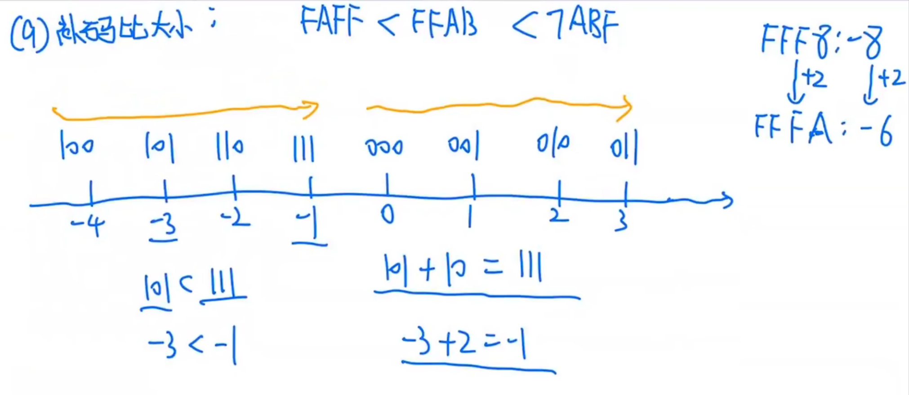

**快速求真值**：适用前面有很多 F，后面只有一两位是其他数的情况，即形如 `FFD3`

```text
 FFF8
    8
-----
10000  // 通过合理选择数字，凑出10000，8即为FFF8的绝对值

 FFD3
   2D  // D + 2 = 15; 3 + D = 16
-----
10000  // 2D -> 45，于是FFD3的真值为-2D也即-45

同理：FFFA -> -6
```

不适用的情况：只能先求原码，在求真值

**快速求补码**

1. 直接写：根据快速求真值的方法倒推
2. 符号扩展：短 $\rightarrow$ 长，适用于有符号数，在前面填充符号位

**补码加减运算电路**

1. 当 sub 为 1 时，做减法；当 sub 为 0 时，做加法

2. **无符号加法，CF 有意义，OF 无意义**

   **有符号加法，CF 无意义，OF 有意义**

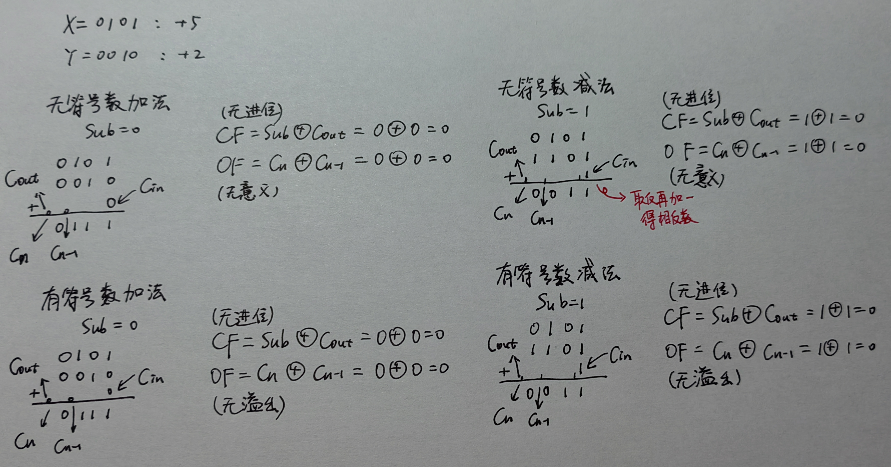

**补码乘法**：通过加法和左移可以实现乘法

```cpp
35 * 84 = 35 * (64 + 16 + 4) = (35 << 6) + (35 << 4) + (35 << 2)
```

**大位宽类型强转成小位宽类型如何判断溢出**

>假设 2n 位机器数转为 n 位机器数

1. 无符号整数：若高 $n$ 位全 $0$，则未溢出，否则溢出
2. 有符号整数：（因为需要考虑符号位在转换前后不能改变）
   * 机器数为正：高 $n + 1$ 位全 $0$，则未溢出，否则溢出
   * 机器数为负：高 $n + 1$ 位全 $1$，则未溢出，否则溢出

### 2.3 IEEE754 数据表示

>1 道

**浮点数格式大观**

符号位为 $S$，阶码为 $E$，尾数为 $M$

1. $E = 0$ 且 $M = 0$ 时，则真值为 $0$
2. $E = 0$ 且 $M \ne 0$ 时，为非规格化数，真值 = $(-1)^S \times 0.M \times 2^{-126}$
3. $1 \le E \le 254$ 时，真值 = $(-1)^3 \times 1.M \times 2^{E - 127}$（正常的浮点数，规格化数？）
4. $E = 255$ 且 $M \ne 0$ 时，真值为 `NaN`（非数值）
5. $E = 255$ 且 $M = 0$ 时，真值为正无穷或负无穷（看符号位）

### 3.5 Cache 和 TLB

>3 道 + 5 道 + 2

| 项目           | Cache（高速缓存）           | TLB（快表 / 页表缓存）          |
| -------------- | --------------------------- | ------------------------------- |
| **作用对象**   | 主存块（Memory Block）      | 页表项（Page Table Entry）      |
| **输入地址**   | 物理地址 (PA)               | 虚拟页号 (VPN)                  |
| **输出内容**   | 主存块数据 (Data Block)     | 物理页号 (PPN) + 控制位         |
| **命中条件**   | 比较 Tag 字段相等且有效位 = 1 | 比较 Tag 字段相等且有效位 = 1     |
| **未命中处理** | 从主存调入 Cache            | 从页表中调入 TLB                |
| **替换策略**   | LRU、FIFO、随机等           | LRU、FIFO、随机等               |
| **控制位**     | 有效位 V、脏位 D 等         | 有效位 V、修改位 D、访问位 A 等 |
| **映射方式**   | 直接映射、全相联、组相联    | 直接映射、全相联、组相联        |

**直接映射**

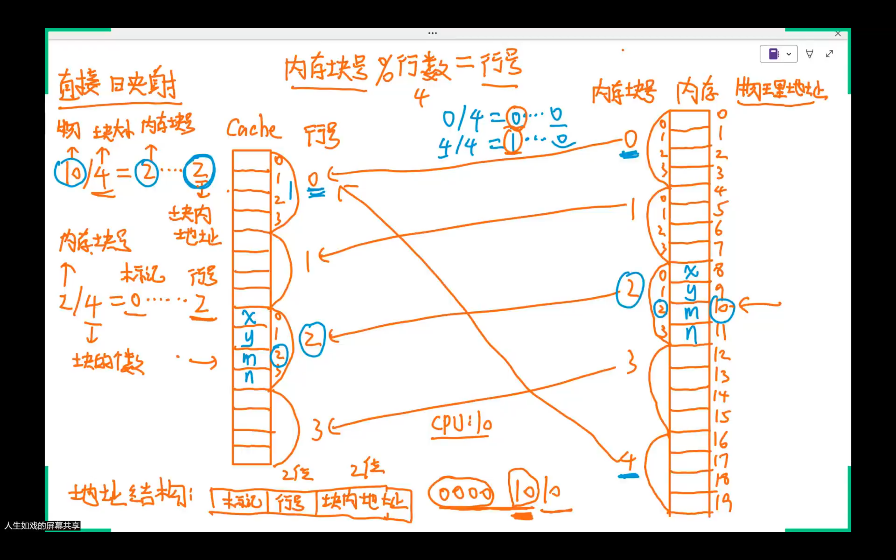

**组相联映射**

* 组号用于选择 Cache 中的组 // TODO
  * $Cache块数量 = Cache数据区容量 / 主存块大小$
  * $2^{组号位数} = \cfrac{Cache数据区容量}{主存块大小 \times 路数}$

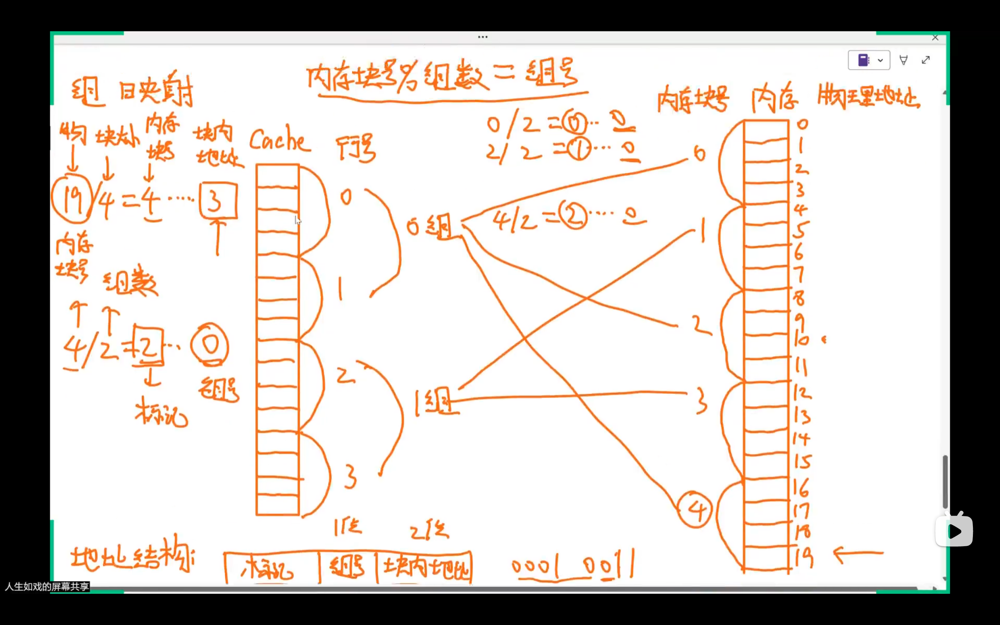

**Cache 总结**

* 另一种取数据方式：将数据拷贝到 Cache 后 CPU 使用块内地址按字访问 Cache
  * 图中写的是为了降低延迟而广泛采用的优化技术，即访问主存取数据后直接送往 CPU

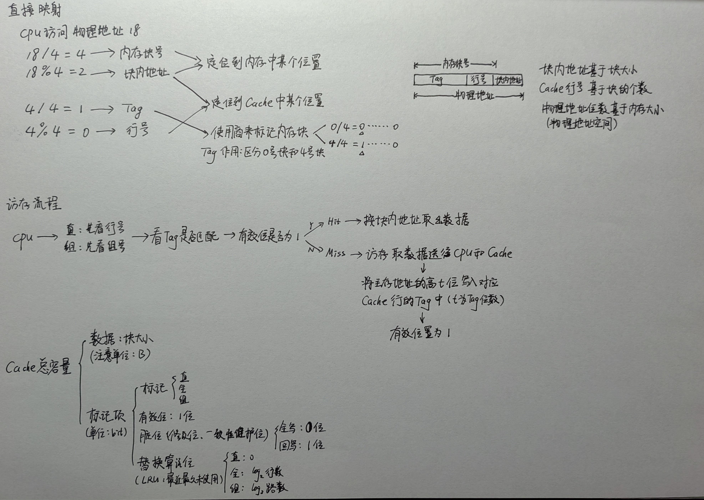

**比较器的个数与位数**

1. 比较器的作用：比较物理地址的 Tag 和 Cache 中存储的 Tag 是否相同

2. 比较器的个数与位数

   | 映射方式   | 比较器的个数 | 比较器的位数 |
   | ---------- | ------------ | ------------ |
   | 直接映射   | 1 个          | Tag 的位数    |
   | 全相联映射 | 行数         | Tag 的位数    |
   | 组相联映射 | 路数         | Tag 的位数    |

**编指方式带来的影响**

1. 按字节编址：没什么坑直接算
2. 按字编址：有坑，需要注意每个字占多少字节

**字段划分总结**

```text
页表项（虚拟地址）
+-----------+-----------+-----------+-----------+
| 页框号PFN | 有效位V    | 保护位R/W  | 脏位D等   |
+-----------+-----------+-----------+-----------+

多级页表项（虚拟地址）
+------------------+-----------+-----------+
| 下级页表基址      | 有效位V    | 保护位等  |
+------------------+-----------+-----------+

段表项（虚拟地址）
+------------------+-----------+-----------+-----------+
| 段基址           | 段长       | 有效位V   | 保护位R/W  |
+------------------+-----------+-----------+-----------+

TLB 项（虚拟地址）
+-----------+-----------+-----------+-----------+-----------+
| 页号VPN   | 页框号PFN  | 有效位V   | 保护位R/W  | 替换信息   |
+-----------+-----------+-----------+-----------+-----------+

Cache-直接映射（主存物理地址）
1. 主存块地址
+-----------+-----------+-----------+
|   标记Tag | 组索引Idx  | 块内偏移   |
+-----------+-----------+-----------+
2. Cache表项
+-----------+-----------+-----------+-----------------+
|   标记Tag | 有效位V    | 脏位D     | 数据块 (Cache行) |
+-----------+-----------+-----------+-----------------+

Cache-全相联（主存物理地址）
1. 主存块地址
+-----------+-----------+
|   标记Tag | 块内偏移   |
+-----------+-----------+
2. Cache表项
+-----------+-----------+-----------+-----------------+
|   标记Tag | 有效位V    | 脏位D     | 数据块 (Cache行) |
+-----------+-----------+-----------+-----------------+

Cache-组相联（主存物理地址）
1. 主存块地址
+-----------+-----------+-----------+
|   标记Tag | 组索引Idx  | 块内偏移   |
+-----------+-----------+-----------+
2. Cache表项（每组有多条）
+-----------+-----------+-----------+-----------------+
|   标记Tag | 有效位V    | 脏位D     | 数据块 (Cache行) |
+-----------+-----------+-----------+-----------------+
|   标记Tag | 有效位V    | 脏位D     | 数据块 (Cache行) |
|   ...     |    ...    |   ...     |       ...       |
+-----------+-----------+-----------+-----------------+
```

### 4.2 指令的数据寻址

>4 道

**MAR-MDR 内存布局**

MAR 位数 = 地址线位数，与内存空间大小有关

MDR 位数 = 数据线位数 = 存储字长

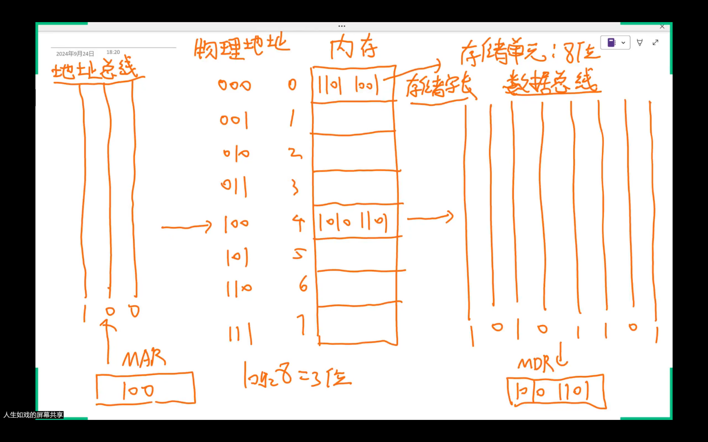

**按字节编址-按字编址**

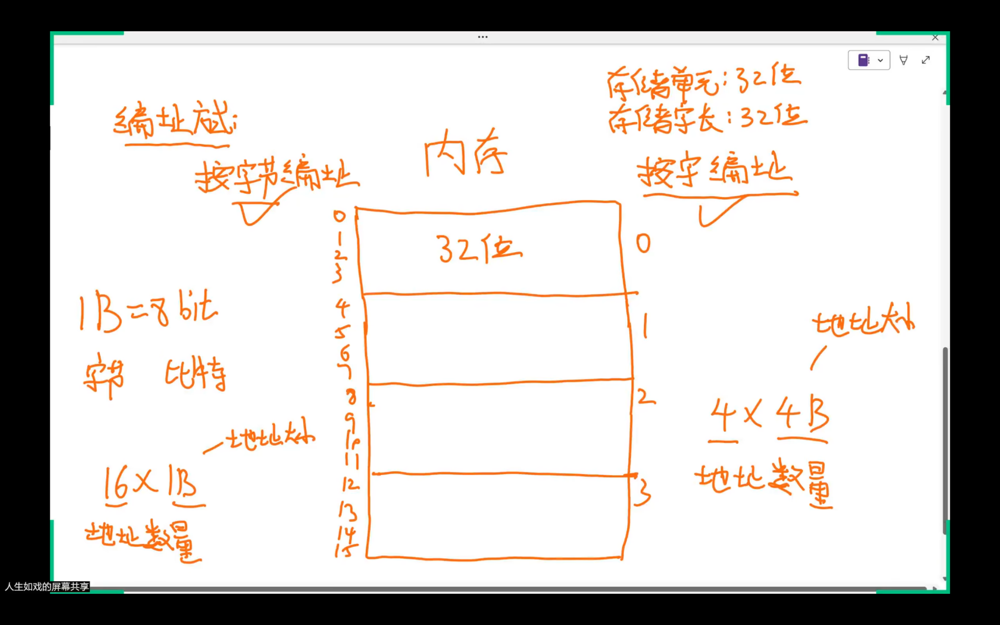

**机器字长**

1. 机器字长（简称字长）：指计算机进行一次整数运算（即定点整数运算）所能处理的二进制数据的位数
   * 字长一般等于通用寄存器位数或 ALU 的宽度
   * 字长越长，数的表示范围越大，计算精度越高
   * 字长为字节（8 位）的整数倍
2. 指令字长：一条指令的位数
3. 存储字长：一个存储单元存储的位数

**基址寻址与变址寻址**

1. 基址寻址：便于程序浮动，只需修改指向程序指令首地址的基址寄存器的值，即可修改程序在内存中的位置
2. 变址寻址：一般用于处理数组问题

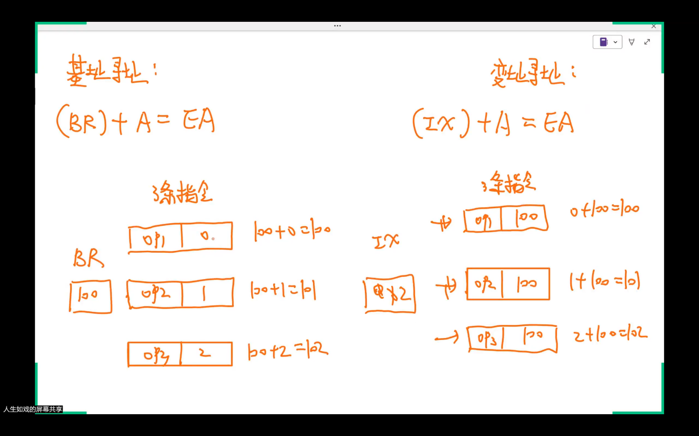

**PC**

尤其要注意 PC，PC 在取指后会增加，具体增加多少与编址方式和指令长度都有关

### 4.3 汇编相关

>4 道 - 1

// TODO

### 5.3 数据通路

>3 道 - 1

**组合逻辑元件**

1. 多对多：译码器（地址译码器、三八译码器）
2. 多对一：多路选择器（MUX）
3. 一对一：三态门

**暂存器**

如果没有暂存器，ALU 的两个输入端都会接收到来自片内总线的数据，那两个输入段数据就相同了

如果有暂存器，两个输入谁先放入暂存器无所谓

**ALU**

ALU 无存储功能，只能写出类似 `ACC <- (A) + (MDR)`

### 5.6 流水线

>3 道 - 1

**数据冒险**

1. IF ID EX M WB （取指 取数 执行 访存 写回）
1. 写后读的两条指令间隔大于等于 3 则不会发生数据冒险，因为后者的 ID 已经在前者的 WB 之后
1. 如果发生写后读，后一条指令的 IF 应该与前一条指令 ID 对齐
1. 注意写后读和 use-load 的区别，use-load 往往出现在 LOAD 指令后

### 7. 3 I/O 方式

>5 道

**中断向量与中断向量表**

1. 中断向量：中断服务程序的入口地址
2. 中断向量表：存放中断向量的存储区（类比指针数组，每个指针指向不同的中断服务程序首地址）

**中断响应流程**

1. 关中断
2. 保存断点
3. 引出中断服务程序

**中断处理流程**

1. **关中断**
2. 保存断点
3. 中断服务程序寻址
4. 保存现场和屏蔽字
5. **开中断**
6. 执行中断服务程序
7. **关中断**
8. 回复现场和屏蔽字
9. **开中断**、中断返回

>1 $\sim$ 3 由中断隐指令（硬件自动）完成，4 $\sim$ 9 由中断服务程序完成
>
>若是单重中断（或称单级中断），则在上述流程中去掉 5 和 7 即可（即整个中断处理流程不允许再被中断）

**DMA**

1. 适用于磁盘、显卡、声卡、网卡等高速设备大批量数据的传送
2. CPU 和 DMA 会竞争总线
3. DMA 的传送方式
   * 停止 CPU 访存
     * DMA 数据传送的单位为 **一块数据**
   * 周期挪用
     * DMA 数据传送采用 **单字传送方式**
     * DMA 优先占有总线：否则后面的数据会在 DMA 没有写入内存前将 DMA 中的数据覆盖
   * DMA 和 CPU 交替访存
4. 中断处理时间应小于外设准备数据的时间，否则会来不及读取数据就被外设准备的新数据覆盖
5. 若流水线（或低位交叉存储模式的主存）执行次数很大时，第一次执行的时间可忽略不计，**可认为每个周期执行一次**

### 例题

1. 补码：P48T21 P48T22 **P50T4 P51T5** P195T2Q5
1. IEEE754：P67T34（新大纲已删）
1. Cache：P127T31 P121L3.3 P129T5
1. 数据通路：P263T24 P263T25 P264T28 P264T29 P264T31
1. IO 方式：P304T15 P304T16 P305T17 P305T18 P321T40 P321T42 P322T47 P322T48 P322T51 P323T53 P323T55 P324T9 P325T10 P325T11

## 操作系统

### 2.2 进程调度

>1 道

### 2.3 PV 操作

>11 道

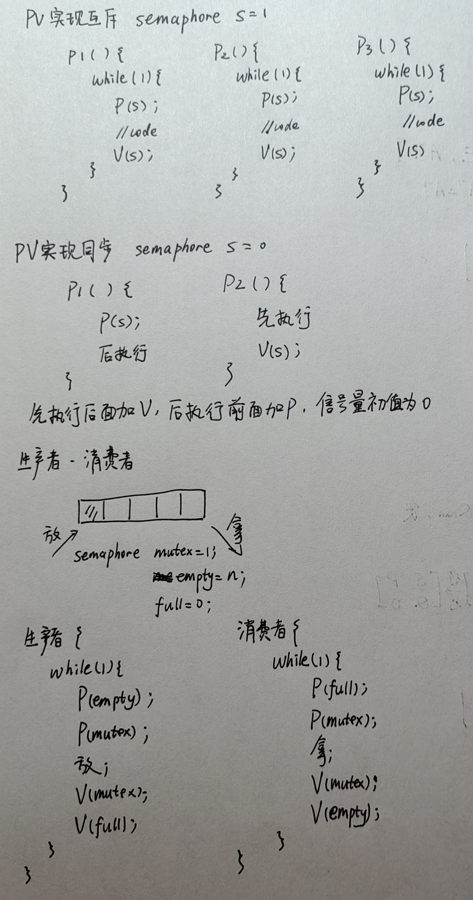

**哲学家进餐问题**

法一：每次只允许一个哲学家拿筷子，若有哲学家被阻塞，之后所有的哲学家都不能拿筷子，必须等拿全筷子的哲学家释放

```cpp
semaphore chopstick[5] = {1, 1, 1, 1, 1};
semaphore mutex = 1;

Pi() {
    do {
        P(mutex);
        P(chopstick[i]);
        P(chopstick[(i + 1) % 5]);
        V(mutex);
        eat;
        V(chopstick[(i + 1) % 5]);
        V(chopstick[i]);
        think;
    } while(1);
}
```

法二：更好的答案，所有哲学家都不会因为其他哲学家被阻塞而被阻塞，并发度更高

```cpp
semaphore chopstick[5] = {1, 1, 1, 1, 1};
semaphore s = 4;  // 最多允许4个人拿筷子

Pi() {
    do {
        P(s);
        P(chopstick[i]);
        P(chopstick[(i + 1) % 5]);
        eat;
        V(chopstick[(i + 1) % 5]);
        V(chopstick[i]);
        V(s);
        think;
    } while(1);
}
```

**大题方法论**

1. 先看是否为生产者-消费者模型、读者-写者模型等
2. 分析哪端代码是互斥的，哪段代码是同步的
3. 关注题干中的每一个 **需求**，尤其是一些限制条件和分支判断
4. PV 操作一般是对称的
5. 互斥量 mutex 初值一般为 1，同步量 s 初值一般为 0

**软硬件互斥**

1. 能实现让权等待的只有信号量方法，即 PV 操作

### 3.1 分页存储

>1 道

**进程、线程与页表**

1. 每个进程都有自己的页表，同一进程下的线程共享进程地址空间，即共享页表

**物理地址与页框之间的关系**

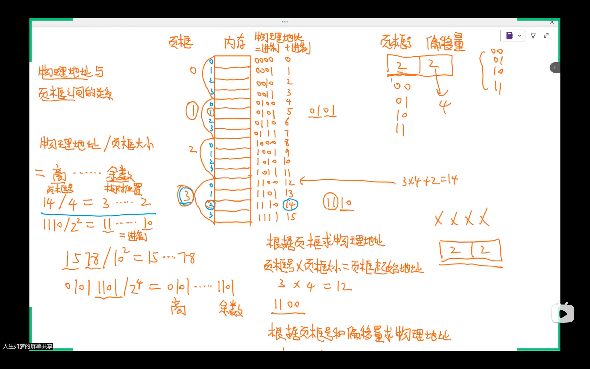

1. 根据页框求物理地址：$页框号 \times 页框大小 = 页框起始地址$

   根据页框号和偏移量求物理地址：拼接二进制 $页框号 \times 页框大小 + 偏移量 = 物理地址$

2. 根据物理地址求页框号和偏移量：拆分二进制 $物理地址 / 页框大小 = 页框号 \cdots\cdots 偏移量$

**物理地址与逻辑地址**

1. 逻辑地址结构：[页号 | 偏移量]
2. 物理地址结构：[页框号 | 偏移量]
3. 页大小与页框大小相同

**逻辑地址转物理地址**

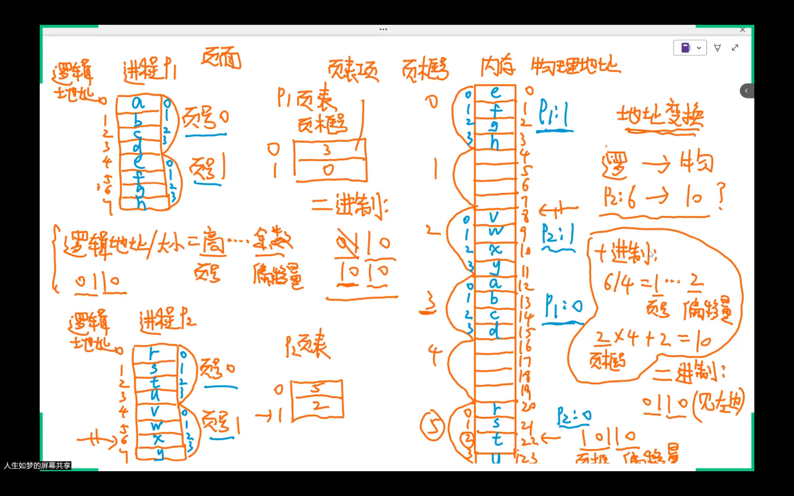

**逻辑地址转物理地址流程**

1. CPU 给出逻辑地址 $(6)_{10} = (0110)_{2}$
2. 逻辑地址拆分为页号 $P = 01$ 和偏移量 $W = 10$
3. 已知页表起始地址 $F$，可计算出页表项物理地址为 $F + P \times 页表项长度$，根据页表项物理地址查出页框号 $10$
4. 将页框号与偏移量拼接，得物理地址为 $1010$

>页表存在内存中，只要是在内存中的数据必然有物理地址，一般页表起始地址是给定的
>地址变换是操作系统提供的，对程序员透明，不是硬件提供的

**二级页表**

| 步骤         | 决定因素                             | 公式（中文变量）                                      |
| ------------ | ------------------------------------ | ----------------------------------------------------- |
| 页内偏移位数 | 页大小                               | 页内偏移位数 = log₂(页大小)                           |
| 页框号位数   | 内存大小、页大小                     | 页框号位数 = log₂(内存大小 ÷ 页大小)                  |
| 页表项大小   | 页框号位数                           | 页表项大小 ≥ 页框号位数 + 控制位                      |
| 每页页表项数 | 页大小、页表项大小                   | 每页页表项数 = 页大小 ÷ 页表项大小                    |
| 二级页号位数 | 每页页表项数                         | 二级页号位数 = log₂(每页页表项数)                     |
| 一级页号位数 | 地址位数、页内偏移位数、二级页号位数 | 一级页号位数 = 地址位数 − 页内偏移位数 − 二级页号位数 |

**页目录项与页表项的物理地址**

| 变量名 | 解释           |
| ------ | -------------- |
| $A_1$  | 一级页表首地址 |
| $A_2$  | 二级页表首地址 |
| $P_1$  | 页目录号       |
| $P_2$  | 页号           |

1. 页目录项的物理地址：$A_1 + P_1 \times \text{页目录项大小}$
2. 页表项的物理地址：$A_2 + P_2 \times \text{页表项大小}$
3. 页表（无论一级二级）首地址：$页框号 \times 页框大小$ // TODO 这个公式很重要，但是我忘了重要在哪

**TLB**

1. 快表存的是虚拟页号到物理页框号的映射
2. 与 Cache 一样，有全相联映射、直接映射和组相连映射
3. 全相联映射下，快表的 Tag 字段是 **整个虚拟页号（即去掉页内偏移）**
4. 直接映射下，需要先比行号，组相联映射下需要先比组号
5. 与 Cache 一样，做题时务必关注有效位是否为 1

### 3.2 虚拟内存

>7 道

**页面置换算法**

1. OPT 最佳置换算法
2. FIFO 先进先出页面置换算法：维护一个 **队列**，置换即入队，淘汰即出队。可以避免与 LRU 混淆
3. LRU 最近最久未使用置换算法：替换 **最近** 最久未使用的，注意与 FIFO 区分，后者不一定最近
4. CLOCK 时钟置换算法
   * 页表项维护 **访问位**，指针旋转遍历循环队列，若当前访问位为 1，则将其改成 0，否则淘汰当前页，新增进来的页面访问位为 1，访问页面时也会将访问位置 1
5. 改进型 CLOCK 时钟置换算法
   * 对于修改过的页面，替换代价更大，改进型 CLOCK 就是为了解决这个问题
   * 页表项维护 **访问位** 和 **修改位**，指针旋转遍历循环队列
     * 第一圈：先找(0, 0)，不修改任何位
     * 第二圈：先找(0, 1)，遍历过程中将访问位置 0
     * 第三圈：先找(0, 0)，不修改任何位
     * 第四圈：重复第二圈
   * 实际替换顺序：(0, 0)，(0, 1)，(1, 0)，(1, 1)
6. RANDOM 随机置换算法：在某些情况下反而是最优或接近最优，平均性能接近 LRU，最坏情况优于 FIFO

### 4.1 文件物理结构

>6 道

**簇与磁盘块**

1. 簇一对多磁盘块
2. 磁盘块一对多磁盘扇区
3. 题目如果有簇，文件就按簇分配，否则按磁盘块分配

**连续分配**

类比顺序表，插入新块时，需要判断记录号是靠近起始块还是结尾块，向前移向后移都是允许的

* 对 FCB：向前移需要修改起始块号，向后移需要修改末块号，文件长度改编

**链接分配——隐式链接**

类比带首尾指针的链表，若为链接分配，插入新块时

**链接分配——显式链接：FAT，文件分配表**

1. 类比数组实现的链表
2. 所有文件公用一个 FAT 表
3. 假设外存有 $n$ 个块，则 FAT 表每一行的位数为 $\log_2{n}$ 位，FAT 大小为 $n\cdot \log_2{n}$
4. 单个文件最大长度（将所有磁盘块分给这个文件）：$n\cdot 磁盘块大小$

**索引分配**

1. 直接地址，一级索引，二级索引 ...
2. 一般考文件最大长度和给地址求磁盘块号

**对磁盘块的操作**

1. 写入磁盘：访问盘块 1 次
2. 读入内存：访问盘块 1 次
3. 修改/移动：先读入内存，在写入磁盘，访问盘块 2 次

**磁盘空闲块的管理**

1. 空闲表法：表头为序号、第一个空闲盘块号、空闲盘块数
2. 空闲链表法
   * 空闲盘块链：类比链表
   * 空闲盘区链：每个盘区包含若干相邻的盘块，通常采用首次适应算法
3. 位示图法
   * 用二进制位表示磁盘块是否被占用，1 表示被占用，0 表示空闲，类比布隆过滤器
4. 成组链接法：TODO

### 5.1 IO 层次结构

>1 道

### 5.3 磁盘

>3 道

**磁盘初始化**

1. 低级格式化（物理格式化）：将磁盘分为扇区
2. 分区
   1. 将磁盘分区
   2. 逻辑格式化（高级格式化）

**磁盘的存取时间**

1. 寻道时间 $T_s$：磁头跨越 $n$ 条磁道的时间 + 启动磁头臂的时间
2. 旋转延迟时间 $T_r$：转半圈的时间，注意单位，旋转速度 $r$ 为转/秒
3. 传输时间 $T_t$：读/写的字节数占一个磁道上的字节数的比例 * 转一圈的时间

**磁盘调度算法**

1. 先来先服务（First Come First Served, FCFS）
2. 最短寻道时间优先（Shortest Seek Time First, SSTF）：每次选择离当前磁头最近的磁道，可能产生饥饿
3. 扫描算法（SCAN）：只有磁头移动到 **最外侧** 磁道时才能向内移动，移动到 **最内侧** 磁道时才能向外移动
4. 循环扫描算法（C-SCAN）：磁头单向移动来提供服务，返回时直接快速移动至 **起始端** 而不服务任何请求
5. LOOK 算法：SCAN 算法的改进，磁头只需移动到最远端的一个请求即可返回，不需要到达磁盘端点
6. C-LOOK 算法：C-SCAN 算法的改进，磁头只需移动到最远端的一个请求即可返回，不需要到达磁盘端点

>==注意：若题目中无特别说明，C-SCAN 就是 C-LOOK==

### 例题

1. PV 操作：P124T19 P124T21 P125T24 P126T26
1. 软硬件互斥：P118T51 P120T58 P125T25 P126T27
1. 分页存储：P194T17 P198T65 P199T71 P237T20 P236T17 P201T11 P235T14 P236T18 P237T19 计组-P145T21 计组-P144T16
1. 页面置换算法：P235T15 P232T50 P232T54
1. 文件物理结构：P271T9 P271T8 P268T43 P269T46 P269T51 P269T49 P272T11
1. 位示图：P302T13 P302T14 P302T16 P302T17
1. 磁盘：P351T6 P352T7 P353T8

## 计网

### 3.4 滑动窗口

>1 道

**所有协议通用**

1. 变量说明
   * $n$：帧序号比特数
   * $W_T$：发送窗口长度（包含多少帧）
   * $W_R$：接收窗口长度（包含多少帧）
2. $W_T + W_r \le 2^n$

**S-W 停止等待协议**

发一帧确认一帧

**GBN  后退 N 帧协议**

一帧出现问题，等这帧超时后面的全部重发

**SR 选择重传协议**

一帧出现问题，接收方先缓存后面的帧，等这帧超时只重发这帧

**信道利用率**

1. 变量说明

   * $n$：帧序号比特数

   * $k$：发送窗口
   * $t_1$：分组发送时延（传输时延）
   * $t_2$：确认帧发送时延（传输时延）
   * $\tau$：单向传播时延

2. 信道利用率 $U = \cfrac{kt_1}{t_1 + 2\tau + t_2}$

3. S-W 协议 $k = 1$

   GBN 协议 $k \le 2^n - 1$

### 3.5 CSMA/CD 

>1 道

**CSMA/CD**

1. 最短帧长：发送方发送帧不能在 $2\tau$ 内发完，否则可能发完了才发现冲突，即 $\cfrac{L}{v} \le 2\tau$
2. 先听后发，边听边发，冲突停发，随机重发
3. 以太网规定最短真长为 $64B$（要记，题目可能不提示）
4. 二进制指数退避算法
   * 争用期 = $2\tau$
   * 随机数 $r\in [0, 2^{min{(重传次数, 10)}} - 1]$
   * 推迟时间为 $2r\tau$
   * ==当重传达 $16$ 次仍不成功时，认为该帧永远无法正确发出，抛弃该帧并向高层报告出错==

**以太网**

1. 以太网传输介质标准名称格式 **`<带宽> BASE - <后缀>`**
   * 后缀 <5/2>：早期以太网，5 或 2 值单端最大传输距离不超过 500m 或 185m
   * 后缀 <传输介质>：T（双绞线），F（光纤）

2. 以太网帧数据部分长度范围：闭区间 $[46, 1500]$

   以太网帧长度范围：闭区间 $[64, 1518]$

   以太网帧首部长度 14B，尾部长度 4B，共 18B（要记，题目可能不提示）

**以太网交换机**

1. 直通交换方式：只检查 MAC 地址，即只处理 $6B$ 的数据

   存储转发交换方式：检查完整的帧，至少处理 $64B$ 的数据

**802.11 无线局域网**

1. 去往 AP 中起止，来自 AP 止中起

**隔离冲突域和广播域**

| 设备名称      | 能否隔离冲突域 | 能否隔离广播域 | 设备层次   |
| ------------- | -------------- | -------------- | ---------- |
| 集线器 Hub    | 不能           | 不能           | 物理层     |
| 中继器        | 不能           | 不能           | 物理层     |
| 交换机 Switch | 能             | 不能           | 数据链路层 |
| 网桥          | 能             | 不能           | 数据链路层 |
| 路由器 Router | 能             | 能             | 网络层     |

### 4.2 IPv4 

> 5 道

**分片**

1. 常用首部长度，题目可能不会提示

   | 协议/层次               | 默认首部长度             |
   | :---------------------- | :----------------------- |
   | **应用层-HTTP**         | 无固定首部               |
   | **应用层-DNS**          | 12B                      |
   | **传输层-TCP**          | 20B                      |
   | **传输层-UDP**          | 8B                       |
   | **网络层-IPv4**         | 20B                      |
   | **网络层-IPv6**         | 40B                      |
   | **网络层-ICMP**         | 8B                       |
   | **数据链路层-ARP**      | 28B                      |
   | **数据链路层-以太网帧** | 18B (14B 首部 + 4B 尾部) |

2. IPv4 首部字段
   1. 标志：3 位，低位为 MF，中间一位为 DF
      * MF = 1 表示后面还有分片
      * 只有当 DF = 0 时才允许分片
      * 片偏移：13 位，片偏移以 $8B$ 为偏移单位（起始编号除以 8）

3. MTU：以太网最大传输单元，IP 数据报超过 MTU 且 DF = 0 则分片，每个分片都要加 20B 的 IP 首部，首部要算在 MTU 内
   * 分片数据长度必须为 8 的整数倍

**子网划分**

// TODO

**路由选择**

1. 特定主机路由：路由器路由表中的 $a.b.c.d/32$ 的 IP，该 IP 不是子网，指向一个特定的主机
1. 到互联网：$0.0.0.0/32$，子网掩码 $0.0.0.0$

**默认网关**

1. 默认网关的作用：跨网络通信
2. 主机的默认网关：离主机最近的路由器的 IP 地址，这个 IP 地址具体指的是该路由器上与主机在同一本地网络的那个接口的 IP 地址
   * 若该主机的默认网关不是离主机最近的路由器的 IP 地址，那一定是配错了
3. 该主机的子网掩码就是默认网关的子网掩码

**NAT**

1. 普通路由器在路由转发时会改变 MAC 地址但不改变 IP 地址；而 NAT 路由器在转发时一定会改变 IP 地址（转换源 IP **或** 目的 IP）
1. 普通路由器仅工作在 **网络层**，而 NAT 路由器转发数据报时需要查看和转换 **传输层** 的端口号

**ARP**

1. 是数据链路层协议
2. 将 IP 地址转换为 MAP 地址
3. 请求广播，响应单播

**DHCP**

1. 是应用层协议，基于 UDP

2. 给主机动态分配 IP 地址

3. 源 IP 地址：如果是客户端发的，就是 $0.0.0.0$；如果是 DHCP 服务器发的，就是 DHCP 服务器地址

   目的 IP 地址：全是广播

### 4.4 路由算法与路由协议 

> 2 道

// TODO

### 4.7 网络层设备 

> 1 道

// TODO

### 5.3 TCP 

> 2 道

**seq 与 ack**

1. 不考虑拥塞窗口的前提下，$发送方可用窗口=rcvwnd−(已发送但未确认的数据长度)$

**拥塞窗口与发送窗口**

$发送窗口 = \min{(拥塞窗口, 接收窗口)}$

```text
  1	  2	  4	   8   16  17  # 发送多少MSS
1	2	4	8	16	17	18  # A拥塞窗口
64	63	61	57	49	33	16  # B接收窗口
1	2	4	8	16	17	16  # 发送窗口

慢开始阶段：
1. B一共收到15个MSS的时刻
拥 = 16 = 1 + 15
接 = 49 = 64 - 15

2. B一共收到9个MSS的时刻
拥 = 10 = 1 + 9
接 = 55 = 64 - 9

拥塞避免阶段：
1. B一共收到31个MSS的时刻
拥 = 17 != 1 + 31
接 = 33 = 64 - 31
```

### 6.2 DNS

1. 权限域名服务器总能将其管辖的主机名转换为该主机的 IP 地址

### 6.3 文件传输协议 FTP 

> 1 道

### 6.5 HTTP

> 2 道

### 例题

1. 计算机网络的性能指标：P9T14 P9T15 P9T16 P8T12
2. 数据链路层可靠传输机制：P69T22 P69T23 P71T7 P69T24
3. CSMA/CD：P93T5
4. 802.11 无线局域网：P110T27
5. 以太网交换机：P122T18 P122T19
6. IPv4：P157T67 P161T15 P155T51 P155T53 P156T61 P157T65 P157T66 P153T40 P156T63 P155T53 P155T58 P160T13 P157T69 P156T59 P160T14 P161T16 P157T70
7. UDP：P229T15 P229T16
8. TCP
   * seq 与 ack：P246T42 P247T44 P247T45 P247T46 P247T47 P248T5 P248T57
   * TCP 状态：P248T55 P249T50 P249T60
   * 快重传：P247T51
   * 拥塞窗口与发送窗口：P246T43 P247T48 P247T49 P247T50 P248T53 P249T58
   * 大题：P251T14 P276T4 P250T13
9. FTP：P276T13 **P276T14**
10. DNS：P270T11 P270T12 P271T14
11. HTTP：P292T17 P292T18 P292T19

## 附录：杂项

1. 从编号 $a$ 开始（包含），往后数 $b$ 个，编号为 $a + b - 1$

   闭区间 $[a, b]$ 中元素个数为 $b - a + 1$

   左闭右开区间 $[a, b)$ 中元素个数为 $b - a$

## 附录：大题预测

1. 数据结构
2. 计组
   * IO 方式/磁盘 22：2009-2012-2016-2018-2022-2026?
3. 操作系统
4. 计网
