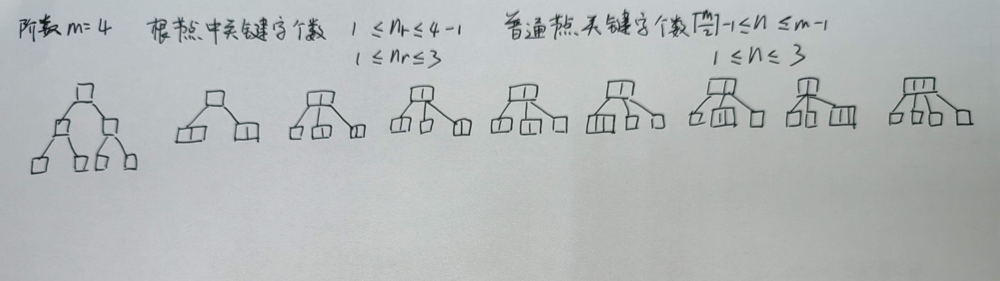

# **408 真题错题本**

## 2021 年

## 2022 年

## 2023 年

### 选择题

#### 9 A

线性探测再散列法中删除一个关键字会导致后面的关键字无法通过线性探测找到正确的位置。当删除一个关键字时，为了保持散列表的连续性，通常会将后续的关键字向前移动填充空缺，这样后续的查找操作才能继续正确地找到它们然而，如果删除的是一个位于中间位置的关键字，后面的关键字需要依次向前移动，这会导致删除操作的时间复杂度较高，因为需要移动大量的关键字。为了解决删除操作中的位置依赖性问题，可以使用 **删除标记** 来表示一个位置上的关键字已被删除。

散列表长度为 $n$，散列函数 $H(k) = k \% m$，插入 $t$ 个元素

* $ASL_{success}$：在构建散列表时表明每个元素的查找长度 $a_i$，$ASL_{success} = \frac{1}{t} \sum_{i = 1}^t a_i$
* $ASL_{fail}$：需要分析散列表的每个位置，注意取模
  * 若没有元素，查找长度为 $1$
  * 若有元素，需要判断该元素到最近的空节点的距离（从空节点 $1$ 开始数，包含自身和空节点）
  * 若该元素已被删除（`del`），也需要判断该元素到最近的空节点的距离（可能循环访问，同上）

#### 12 A

主频 = 1.5GHz 表示 CPU 时钟周期为 $\cfrac{1}{1.5\times 10^9}s$

CPI = 1.2 表示 每条指令执行平均需要 1.2 个时钟周期

指令执行速度（每秒执行多少条指令） = $1.5G / 1.2 = 1.25G$ 条

用户 CPU 时间（执行程序 P 所用时间） = $\cfrac{1}{1.5\times 10^9} \times 1.2 \times 5 \times 10^5 = 0.4ms$

#### 7 W

记忆题

B 树删除非叶节点元素最终都转换成删除叶结点元素

#### 14 W

80200000H 阶码全零，符号位为 1，位数为 0100...，为非规格化负数

于是指数为 $-126$，尾数形式为 $0.M$ 而不是 $1.M$

故结果为 $-0.01\times 2^{-126} = 2^{-128}$


#### 15 W A

地址空间 $2^{30}$，可以将高 2 位的 $00$，$01$，$10$ 状态分给 RAM，于是 ROM 地址范围为 $1100..0\sim 1111..1$，即 $30000000H \sim 3FFFFFFFH$

**另解：**

本题说存储芯片要占满所有可能的存储地址空间，并且 ROM 在高地址区，故 ROM 最大地址为 $2^{30} - 1$，即 $3FFFFFFFH$，据此也能判断选 C

#### 16 W

计算 OF 时要当成有符号数计算，而 CF 表示无符号整数运算时的进位/借位，因此计算 CF 时要当成无符号数计算

x = 10，y = -20，当成无符号数时 x 不够减 y，故 CF = 1

OF 显然为 0

#### 18 W A

记忆题

1. **组合逻辑元件** 是那些仅由组合逻辑电路组成的元件，其输出仅取决于当前的输入，而不受存储器或时钟信号的影响。算术逻辑部件 ALU 和多路选择器 MUX 都属于组合逻辑元件，它们的输出仅由当前输入决定。
2. 程序计数器 PC 和通用寄存器是 **时序逻辑元件**，也称为状态元件。它们的输出不仅取决于当前输入，还受存储器或时钟信号的影响，并且具有状态或存储功能

#### 19 W A

**取指 IF、译码/取数 ID、执行 EX、访存 MEM、写回 WB**

旁路技术将结果从执行阶段的功能单元（如 ALU）直接转发给需要使用该结果的指令，绕过了中间的写回阶段

1. 旁路技术允许将结果从 EX 或 MEM 阶段直接转发给需要数据的指令的 EX 或 ID 阶段
2. 但对于 **load 指令** 后立即使用数据的情况（如 load 后接分支或算术指令），如果后续指令在 ID 阶段就需要数据，则必须阻塞直到 MEM 阶段结束
3. 控制冒险需要通过阻塞或预测处理，本题采用硬件阻塞，分支指令后的指令会被阻塞直到分支决策完成

>只有 load 指令在 MEM 阶段才产生数据，所以仅考虑 load 指令只能在访存阶段旁路取数这一特例

#### 20 W A

总线数据传输过程中，需要同时考虑数据传输和地址传输，后者常常隐含在题目中或题目说明忽略不计。本题需要考虑以下三个时间

* **地址传输**
* **数据准备**
* **数据传输**

每个时钟周期 $10^{-9}s$，准备数据 $6ns$，CPU 通过地址线传输地址 $1ns$，主存传输数据到 CPU $1ns$，一共 $6 + 1 + 1 = 8ns$

$32B$ 的数据在 $64b$ 的总线上需要传输 $\cfrac{32\times 8}{64} = 4$ 次，于是总时间 $4\times 8 = 32ns$

#### 21 W

记忆题

1. 异常在指令执行过程中检测
2. 中断请求信号在指令执行完毕后检测
3. 外设向 CPU 发送中断请求信号而不是中断结束信号：**中断请求信号总是从外设发向 CPU，中断结束信号总是从 CPU 发向外设**

#### 26 W A

注意审题，题目说的是下列操作 **完成** 时，执行系统调用完成时 CPU 从内核态转为用户态

#### 30 A

页表完成虚拟地址到物理地址的转换，两进程共享数据 data 的情况，二者虚拟地址可能不相等，但 data 被映射到物理内存的同一页框中

这是因为共享的数据页被映射到相同的物理页框中，不同进程的虚拟地址映射到相同的物理地址

#### 31 W A

记忆题

索引节点是指文件系统中的一种数据结构，每个索引节点保存了文件系统中的一个文件系统对象的元信息数据，但不包括数据内容或者文件名。内存索引节点是存放在内存中的索引节点，文件被打开时，需要将磁盘索引节点复制到内存索引节点中。因此本题进程 P 关闭 F 时，需释放 F 的索引节点所占的内存空间

#### 32 W A

设备分配需要考虑的是

1. **设备的类型**：不同类型的设备有不同的特性和接口，需要根据设备类型进行适当的分配和管理
2. **设备的访问权限**：不同的进程可能对设备的访问有不同的权限要求。设备分配时需要考虑进程的访问权限，确保只有具有适当权限的进程能够访问和使用设备
3. **设备的占用状态**：需要考虑设备的当前使用状态，即设备是否已经被其他进程占用或者正在执行某个操作，设备分配时需要避免资源冲突
4. **逻辑设备与物理设备的映射关系**：在系统中，逻辑设备和物理设备之间存在映射关系。逻辑设备是用户程序或操作系统中对设备的抽象表示，而物理设备是实际的硬件设备。设备分配需要确保逻辑设备与物理设备之间的正确映射

#### 33 W

传输时延 = $\cfrac{1000\times 8b}{100\times 10^6 bps} = 0.08ms$

传播时延 = $\cfrac{1000b}{100\times 10^6bps} = 0.01ms$

一共 $\cfrac{1MB}{1000B} = 10^3$ 个分组

画分组时空图可知总时间为 $0.08 \times 10^3 + 0.02 + 0.08ms = 80.10ms$

>本题错就错在没有计算路由器转发的传输时延 $0.08ms$

#### 34 W A

某 **无噪声理想信道** 带宽为 4MHz，采用 QAM 调制，若该信道的最大数据传输速率是 48Mb/s，
则该信道采用的 QAM 调制方案是（）。
A. QAM-16
B. QAM-32
C. QAM- 64
D. QAM-128

奈奎斯特定理和香农公式完全忘了

对于无噪声理想信道，信道的最大数据传输速率可以通过奈奎斯特定理计算

根据奈奎斯特定理，最大数据传输次数 = $2W = 2\times 4MHz = 8MHz$，即每秒传输 $8M$ 次

又最大数据传输率为 $48Mbps$，则每次需要传输的比特数量为 $\cfrac{48Mbps}{8MHz} = 6b$

采用的 QAM 调制方案为 $2^6 = 64$，即 QAM-64

>QAM：调幅（AM）与调相（PM）结合，形成叠加信号，若有 $m$ 种振幅，$n$ 种相位，则 $1码元 = log_2{(mn)}bit$
>
>QAM-64：采用 QAM 调制技术，有 64 种码元
>
>关于奈奎斯特定理和香农公式，前者适合无噪声、带宽有限的信道，后者适合有噪声、带宽有限的信道
>
>* 奈奎斯特定理 $2W$ 计算得出的 **极限波特率** 指每秒最大符号传输次数
>* 香农公式 $W\log_2{(1 + S/N)}$ 计算得出的 **极限比特率** 指每秒传输的最大比特数

#### 35 A

停止-等待协议的信道利用率公式为 $\cfrac{T_D}{T_D + RTT + T_A}$

GBN 协议和 SR 协议的信道利用率公式均为 $\cfrac{WT_D}{T_D + RTT + T_A}$

于是 $U_1$ 最小

GBN 协议和 SR 协议二者的比较：主要看窗口大小谁比较大，令 $n$ 为帧序号位数

* GBN 协议的发送窗口尺寸 W 范围：$[1, 2^n - 1]$
* SR 协议的发送窗口尺寸 W 范围：$[1, 2^{n - 1}]$

题目给定 $n = 3$，显然信道利用率 GBN > SR

#### 36 A

CSMA/CD 协议发送方发送过程中检测到冲突后会随机等待一段时间，时间间隔使用二进制指数退避算法计算，设争用期时长为 $m$，这是第 $k$ 次冲突
$$
随机数 r \in [0, 2^{\min(k, 10)} - 1] \\
等待时间 t = rm
$$

#### 38 W

在 NAT（网络地址转换）中，路由器选择转换后的 IP 地址时，通常从配置的公共 IP 池中动态选取或静态映射，地址池可能包含路由器接口 IP 或专用公共 IP 地址

本题中，路由器可用公共 IP 地址只有两个（一头一尾分别被网络号和广播号占用），并且 195.123.0.34 已被接口占用，因此 NAT 必须使用剩余可用地址 195.123.0.33 作为转换地址，以确保 IP 分组在 Internet 上可路由

#### 39 A

$168.16.84.24/20$ 展开后为 $168.16.0101 0100.24$

于是最小为 $168.16.0101 0000.0000 0001 = 168.16.80.1$

最大为 $168.16.0101 1111.11111110 = 168.16.95.254$

### 大题

#### 42

// TODO

#### 43

// TODO

#### 44

// TODO

#### 46

// TODO

#### 47

// TODO

## 2024 年

## 2025 年

### 选择题

#### 5 W

唉真题少印个 8，cnmd，这两分不算

#### 7 A

记忆题

分块大小设置为 $\sqrt{n}$ 时，分块查找的平均查找长度最小

#### 8 W A

B 树阶数为 $m$，总关键字个数为 $N$，根节点中关键字个数为 $n_r$，普通节点中关键字个数 $n$，树高为 $h$（从 1 开始）

1. 对每个节点：分支数（孩子数） = 关键字个数 + 1
2. 令 $t = \lceil \frac{m}{2} \rceil$
3. $1 \le n_r \le m - 1$
4. $t - 1 \le n \le m - 1$
5. $2t^{h - 1} - 1 \le N \le m^h - 1$
6. $\lceil \log_m (n + 1) \rceil \le h \le \lfloor \log_t (\frac{n + 1}{2}) \rfloor + 1$



#### 10 W

| 排序算法 | 最好情况比较 | 最坏情况比较 | 平均比较   | 最好移动   | 最坏移动  | 平均移动   |
| -------- | ------------ | ------------ | ---------- | ---------- | --------- | ---------- |
| 冒泡排序 | O(n)         | O(n²)        | O(n²)      | O(0)       | **O(n²)** | O(n²)      |
| 插入排序 | O(n)         | O(n²)        | O(n²)      | O(n)       | **O(n²)** | O(n²)      |
| 快速排序 | O(n log n)   | O(n²)        | O(n log n) | O(n log n) | **O(n²)** | O(n log n) |
| 选择排序 | O(n²)        | O(n²)        | O(n²)      | O(n)       | **O(n)**  | O(n)       |

#### 12 W

没有注意到赋值后符号位会扩展

1. SI =  -32767，其二进制补码(16 位)是 1000000000000001
2. 当把 SI 赋值给时，进行符号位扩展到 32 位得到 111111111111111110000000000001
3. 这个值在无符号整数表示下是 $2^{32} - 2^{15} + 1$

**通用计算模型**

位宽 = N，有符号数值 = x
$$
U = 2^N + x
$$

| 题型                        | 已知条件                 | 要求                      | 解法公式/方法                                                | 示例                                                         |
| --------------------------- | ------------------------ | ------------------------- | ------------------------------------------------------------ | ------------------------------------------------------------ |
| **十进制有符号数 → 补码**   | 一个整数 $x$，位宽 $N$   | 写出 $N$ 位补码           | $x \ge 0 \Rightarrow \text{补码} = x$ <br> $x < 0 \Rightarrow \text{补码} = 2^N + x$ | $-5$ 的 8 位补码：$2^8 - 5 = 251 = 11111011$                 |
| **补码 → 真值（有符号数）** | $N$ 位补码（二进制串）   | 对应的十进制整数          | 若最高位 = 0：正数，直接转十进制 <br> 若最高位 = 1：负数，结果 $= X - 2^N$ | `11111011` (8 位) → $251 - 256 = -5$                         |
| **补码负数 → 无符号数**     | 有符号值 $x<0$，位宽 $N$ | 对应无符号数值            | $U = 2^N + x = 2^N - |x|$                                    | $-32767$ 的 32 位无符号：$2^{32} - 32767$                    |
| **无符号数 → 有符号数**     | $N$ 位二进制串           | 对应的十进制有符号数      | 若 $U < 2^{N-1}$，真值 $= U$ <br> 若 $U \ge 2^{N-1}$，真值 $= U - 2^N$ | 32 位无符号 $4294967295$ → 真值 $= -1$                       |
| **符号扩展（有符号数）**    | $N$ 位补码               | 扩展为 $M$ 位补码 ($M>N$) | 复制符号位到高位                                             | 8 位 `11111011` (-5) → 16 位：`11111111 11111011`            |
| **移位运算**                | 补码或无符号数           | 移位结果                  | **逻辑移位**：左/右补 0 <br> **算术右移**：补符号位          | $-8$ 的 8 位补码：`11111000` 算术右移 1 → `11111100` ($-4$)  |
| **数值范围**                | 位宽 $N$                 | 有符号/无符号范围         | 有符号：$[-2^{N-1}, 2^{N-1}-1]$ <br> 无符号：$[0, 2^N-1]$    | 16 位：有符号范围 $[-32768, 32767]$，无符号范围 $[0, 65535]$ |

#### 14 A

本题用双符号位可以判断溢出

#### 16 A

记忆题

* 选项 A：是否采用阵列乘法器，这属于 **处理器内部** 的实现细节，不属于 ISA 规定的内容。阵列乘法器是一种硬件实现乘法运算的电路，它与 ISA 没有直接关系。
* 选项 B：是否采用定长指令字格式，这是由 **ISA** 规定的。ISA 会规定指令的格式，包括指令长度是固定的还是可变的等情况。
* 选项 C：是否采用微程序控制器，这是 **处理器内部** 的控制机制，属于硬件实现层面，不属于 ISA 规定的内容。微程序控制器是用于产生控制信号的一种硬件结构。
* 选项 D：是否采用单总线数据通路，这也是 **处理器内部** 的数据传输机制，属于硬件设计细节，不属于 ISA 规定的内容。单总线数据通路是一种硬件架构。

#### 18 A

记忆题

Cache 缺失率增加时，CPI 也会增大

有关单周期 CPU 和流水线 CPU

| **对比维度**         | **单周期 CPU**                                        | **多周期 CPU**                                               | **流水线 CPU**                                             |
| -------------------- | ----------------------------------------------------- | ------------------------------------------------------------ | ---------------------------------------------------------- |
| **本质区别**         | 所有指令在 **一个时钟周期** 内完成执行                | 每条指令拆分为多个步骤，在 **多个时钟周期** 内完成           | 指令分段并行执行，每条指令仍需多周期，但多条指令可重叠执行 |
| **部件冗余**         | **高冗余**：数据通路按最慢指令设计，部件利用率低      | **低冗余**：部件分时复用（如 ALU），硬件利用率高             | 部件复用 + 并行执行，提高利用率                            |
| **时间利用率**       | **低效**：时钟周期 = 最慢指令时间，简单指令等待时间长 | **高效**：时钟周期按最短步骤设计，空闲部件可执行其他指令     | 时钟周期 = 最慢流水段时间，短阶段时间浪费小                |
| **CPI**              | **固定 CPI = 1**（每条指令 1 周期）                   | **可变 CPI > 1**（不同指令周期数不同，如加法 = 4 周期，LOAD = 5 周期） | 理想情况下 CPI ≈ 1（考虑冒险后略大于 1）                   |
| **时钟频率**         | **低频率**：由最慢指令（如 LOAD）决定                 | **高频率**：由最长执行阶段（如访存）决定                     | **高频率**：由最慢流水段决定                               |
| **控制逻辑**         | 简单组合逻辑，直接生成控制信号                        | 复杂状态机控制，需多周期时序协调                             | 控制逻辑需处理流水线阶段、冒险与冲突                       |
| **硬件复杂度**       | 数据通路复杂（宽而深），控制简单                      | 数据通路精简（窄而浅），控制逻辑复杂                         | 数据通路介于两者，控制逻辑复杂（冒险处理）                 |
| **性能瓶颈**         | 受限于最慢指令，无法优化局部操作                      | 可通过优化关键阶段（如 ALU）提升整体性能                     | 受最长流水段影响，阶段不平衡会限制时钟频率                 |
| **典型应用场景**     | 教学模型（简单直观）                                  | 实际处理器基础（如 MIPS 多周期实现）                         | 高性能 CPU、现代处理器                                     |
| **功耗**             | 较高（每个周期激活全部部件）                          | 较低（仅激活当前阶段所需部件）                               | 介于单周期与多周期之间，根据流水线深度不同                 |
| **时钟周期确定原则** | **最慢指令时间**                                      | **最长步骤时间**                                             | **最长流水段时间**                                         |

* **单周期 CPU** → “最慢指令说了算”

  **多周期 CPU** → “最长步骤说了算”

  **流水线 CPU** → “最长流水段说了算”

#### 22 A

外部中断：外部中断是由 **外部设备向 CPU** 发出的中断请求信号引起的中断

* A：DMA（直接内存访问）控制器在完成数据传送后，会向 CPU 发出一个中断请求，告知 CPU 数据传送已经完成。这个中断请求是由外部设备（DMA 控制器）发出的，属于外部中断
* B：总线事务结束通常是由 CPU 内部的总线控制逻辑处理的，它不会产生外部中断请求
* C：页故障处理是由内存管理单元（MMU）和操作系统共同处理的，属于内部中断的范畴，不会产生外部中断请求
* D：执行断点指令会引发调试中断，这是由 CPU 内部的调试机制产生的中断，不属于外部中断

#### 24 A

VMM（虚拟机监控器）的特权级高于操作系统，负责管理和分配硬件资源给虚拟机和其中的操作系统，需要对硬件有完全的控制能力

#### 26 A

**LRU** 是 Least Recently Used 的缩写，即最近最少使用

#### 27 W A

注意题目中是 **进程运行** 所需的最小页框数

指令系统支持的寻址方式：指令系统的寻址方式对确定进程运行所需的最少页框数有重要作用。不同的寻址方式决定了进程能够访问的内存范围和方式。例如，如果指令系统支持间接寻址，并且可以通过多级间接寻址访问大量的虚拟地址，那么为了保证进程能够正确运行，就需要提供足够的页框来满足这种寻址需求。如果没有足够的页框，可能会导致无法正确寻址，进而影响进程的运行。所以在确定进程运行所需的最少页框数时，需要考虑指令系统支持的寻址方式

#### 28 A

记忆题

虚拟文件系统（VFS）：虚拟文件系统是一种 **抽象层**，它位于操作系统内核和具体的文件系统（如 ext4、NTFS 等）之间。它的主要目的是为不同的文件系统提供一个 **统一的接口**，使得操作系统能够以一种统一的方式处理各种不同类型的文件系统

#### 29 W A

记忆题

索引节点（inode）方式的文件系统：在这种文件系统中，**索引节点** 用于存储文件的元数据，如文件大小、文件的物理块位置、访问权限等信息。**目录文件** 主要包含文件名和对应的索引节点号，用于通过文件名查找文件的索引节点

#### 30 A

**内存映射文件**：将文件的全部或部分内容映射到进程的 **虚拟地址空间**，进程可以像访问普通内存一样操作文件内容

访问操作系统会自动处理：

- 虚拟地址 → 物理地址的转换（页表）
- 文件映射 **虚拟地址**，物理内存按需加载，缺页时将磁盘块内容加载到物理内存
- 文件内容更新同步到磁盘（取决于映射类型，如 MAP_SHARED）

主要特性与作用：

| 特性                  | 作用与说明                                                   | 示例 / 应用场景                                              |
| --------------------- | ------------------------------------------------------------ | ------------------------------------------------------------ |
| **进程间通信（IPC）** | 多个进程可以映射同一个文件，实现数据共享与通信               | 数据库系统多个进程共享访问数据库文件，修改即时可见           |
| **虚拟地址映射**      | 文件映射到进程虚拟地址空间，而不是直接映射到物理内存         | 通过 `mmap` 系统调用将文件内容映射到指定虚拟地址，访问方式如操作内存 |
| **页面到磁盘块映射**  | 当访问映射区域页面缺失时，操作系统根据文件的磁盘块分配，将内容加载到内存 | 虚拟页面缺页时，OS 根据 inode 的磁盘块指针加载对应数据到物理内存 |

#### 32 W A

记忆题

温彻斯特硬盘：传统机械硬盘

无论是机械硬盘还是固态硬盘，文件系统都需要确定盘块大小

#### 33 W A

[(9 封私信) 哈工大计算机|必考知识点解读——第一章计算题（上） - 知乎](https://zhuanlan.zhihu.com/p/597108110)

[(10 封私信) 哈工大计算机|必考知识点解读——第一章计算题（下） - 知乎](https://zhuanlan.zhihu.com/p/598177618)

#### 34 W A N

**基于最小汉明距离的差错控制理论**

**汉明距离（Hamming Distance）**：指两个等长码字之间对应位不同的数量。编码集的 **最小汉明距离（$d_{min}$）** 是所有码字对之间汉明距离的最小值，它决定了编码的检错和纠错能力

检错能力：可以检测出最多 $e$ 位错误，其中 $e \le d_{min} - 1$

纠错能力：可以纠正最多 $t$ 位错误，其中 $t \le \lfloor (d_{min} - 1) / 2 \rfloor$

>标准汉明码的 $d_{min} = 3$，可以纠正单比特错误或检测双比特错误

#### 35 W N

记忆题

二进制指数退避算法
$$
退避时间 = 随机数 \times 时隙时间 \\
随机数 \in [0, 2^{min(k, 10)} - 1]
$$
**（隐含条件）** IEEE 802.3 规定：$时隙时间 = 512 \times 比特时间 = 512 / 数据速率(Mbps)$

#### 38 A

**注意：`cwnd` 增加都发生在确认报文后**

MSS 决定了每个 TCP 段能够携带的最大数据量，建议将题目中的拥塞窗口、发送窗口和拥塞控制阈值转换为 MSS 的倍数

题目中甲之前发送的数据量是 $1MSS$，接受到一个 ACK 显示乙的接收窗口为 $4MSS$，在甲未收到新的确认段前，根据慢开始，下一轮甲的拥塞窗口倍增为 $2MSS$，即可以发送两个 TCP 段

#### 40 A

答案错了，我的选项没错

POP3 主要用于用户从邮件服务器上把邮件下载到本地计算机，不能发送

| 协议名称 | 主要功能     | 能否发送邮件？ | 能否接收邮件？           | 工作方式/特点                                                |
| :------- | :----------- | :------------- | :----------------------- | :----------------------------------------------------------- |
| **SMTP** | **发送** 邮件 | **能**         | **不能**                 | 用于将邮件从客户端 **推送** 到邮件服务器，或在不同邮件服务器之间 **中继** 邮件。是“只发不收”的协议 |
| **POP3** | **下载** 邮件 | **不能**       | **能**（下载并通常删除） | 用于将邮件从服务器 **下载** 到本地计算机。通常是“下载后删除”模式，邮件在本地管理 |
| **IMAP** | **管理** 邮件 | **能**（间接） | **能**（在线管理）       | 用于在服务器上 **直接管理和同步** 邮件。所有操作（读、删、移动）都会在服务器同步，允许从多个设备访问同一邮箱状态。**发送邮件本身仍由 SMTP 处理**，但客户端通过 IMAP 管理“已发送”文件夹 |

### 大题

#### 41

```cpp
/**
 * @see 2025年 41题
 * 时间复杂度 O(n)
 * 空间复杂度 O(n)
 */
void calc_mul_max(int a[], int res[], int n) {
    // max_p[i] 表示 a[i..n-1] 区间内的最大正数
    // min_n[i] 表示 a[i..n-1] 区间内的最小负数
    int* max_p = (int*)malloc(sizeof(int) * n);
    int* min_n = (int*)malloc(sizeof(int) * n);
    memset(max_p, 0, sizeof(int) * n);
    memset(min_n, INT_MAX, sizeof(int) * n);

    max_p[n - 1] = min_n[n - 1] = a[n - 1];
    for (int i = n - 2; i >= 0; --i) {
        max_p[i] = std::max(max_p[i + 1], a[i]);
        min_n[i] = std::min(min_n[i + 1], a[i]);
    }

    for (int i = 0; i < n; ++i) {
        if (a[i] > 0) {
            res[i] = a[i] * max_p[i]; // 正数与最大正数相乘
        } else {
            res[i] = a[i] * min_n[i]; // 负数与最大负数相乘
        }
    }

    free(min_n);
    free(max_p);
}
```

#### 42

b 的持续时间为 5，最晚开始时间为 5，若 b 延期到 6 开始，则 b 的持续时间只能被压缩为 4

若不压缩 b，需要重新构建 AOE 网络的最早开始时间和最晚开始时间，找到新的关键路径，然后再压缩关键路径上的活动保证总用时与计划一致

#### 43

// TODO

#### 44

// TODO

#### 45

PV 函数首先要用 while(true) 包裹

// TODO

#### 46

// TODO

#### 47

// TODO

## 解释

W 代表错误，A 代表模棱两可，N 代表课本上没有或新考法