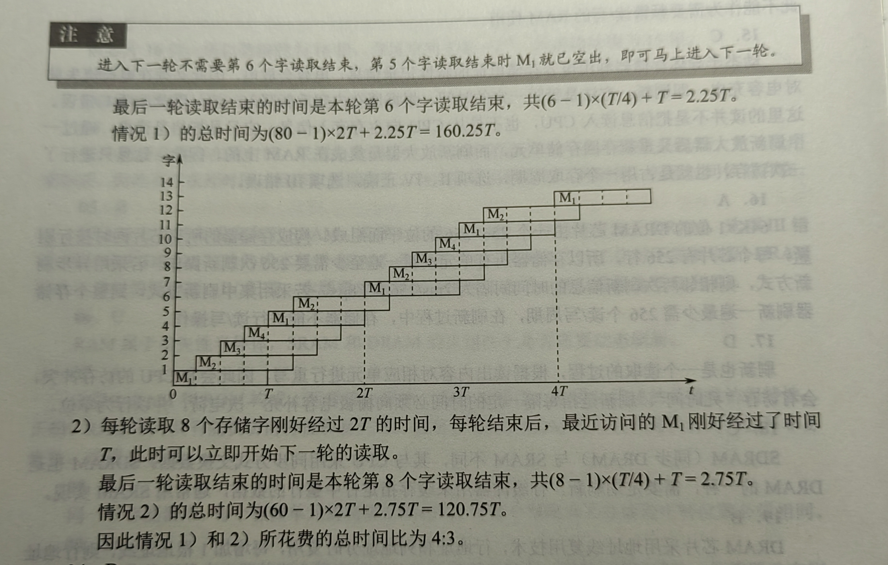

# **408 错题本**

## 数据结构

### 1.1 数据结构的基本概念

#### P3T4

数据的逻辑结构独立于其存储结构

>逻辑结构 $\rightarrow$ 抽象
>$\downarrow$ 一对多
>存储结构 $\rightarrow$ 具体

### 1.2 算法和算法评价

#### P8T15

设循环迭代次数为 $k$，显然 $k \le n$，则循环结束时有 $1 + 2 + \dots + k = \cfrac{k(k + 1)}{2} \ge n$，于是 $k^2 \ge 2n - k \ge 2n - n = n$，即 $k = \Omega(\sqrt{n})$

上界同理

#### P8T17

设循环迭代次数为 $k$，显然 $2^k \lt n \le 2^{k + 1}$。注意 $i$ 是倍增的，总执行次数 $T = \sum_{i = 0}^{k} 2^i = \cfrac{1 \times (1 - 2^{k + 1})}{1 - 2} = 2^{k + 1} - 1$，放缩得 $n - 1 \le T \le 2n - 1$，于是时间复杂度为 $O(n)$

### 2.1 线性表的定义和基本操作

#### P13T1

线性表 一对多 数据元素 一对多 数据项

### 2.2 线性表的顺序表示

#### P19T11

```cpp
/**
 * @brief 需要有序集，最优解
 * @see P19 T11
 * 
 * 分别找出两个有序集A, B的中位数a, b，比较二者的大小
 * 1. 若a < b，则舍弃A较大的一半和B较小的一半
 * 2. 若a > b，则舍弃A较小的一半和B较大的一半
 * 3. 若a == b，则找到了中位数
 * 
 * 时间复杂度 O(log n)
 * 空间复杂复 O(1)
 */
value_t median(const Array& other) const {
    int l1 = 0, r1 = length - 1, l2 = 0, r2 = other.length - 1;
    while (l1 != r1 || l2 != r2) {
        int m1 = l1 + ((r1 - l1) >> 1);
        int m2 = l2 + ((r2 - l2) >> 1);
        if (data[m1] > other.data[m2]) {
            if ((l1 + r1) % 2 == 0) {
                r1 = m1;
                l2 = m2;
            } else {
                r1 = m1;
                l2 = m2 + 1;
            }
        } else if (data[m1] < other.data[m2]) {
            if ((l1 + r1) % 2 == 0) {
                l1 = m1;
                r2 = m2;
            } else {
                l1 = m1 + 1;
                r2 = m2;
            }
        } else {
            return data[m1];
        }
    }
    return std::min(data[l1], other.data[l2]);
}
```

### 2.3 线性表的链式表示

#### P39T8

看错，m 后接 n，题目默认没有尾指针，需要遍历 m，自然 $O(m)$

#### P40T21

L 是指向头结点的指针，其地址在栈上

#### P41T25

题目只说链表头尾相接，但没说谁接谁，故需要两个指针指向各自的尾节点

#### P41T30

题目表述不够严谨，应该说随机插入删除，选静态链表

#### P42T5

两链表长度之差为 $k$ 时，先遍历长的那个到第 $k$ 个节点，然后两链表同时遍历，直到指针相同或一个链表遍历完成，前者返回公共节点地址，后者返回空指针

### 3.1 栈

#### P66T9

只有表头结点指针，没有表尾结点指针的单向循环链表：头插头删时维护尾节点的 next 指针需要 $O(n)$

#### P67T23

**C 标识符规则**

| 特性               | 规则                                 |
| :----------------- | :----------------------------------- |
| **首字符**         | 字母（a-z, A-Z）或下划线（_）        |
| **后续字符**       | 字母、数字或下划线                   |
| **可用字符集**     | ASCII 字符                           |
| **是否区分大小写** | **是**                               |
| **能否使用关键字** | **不能**                             |
| **长度**           | 至少前 31 个字符有效（现代编译器更长） |
| **特殊符号**       | **不能** 包含（如 @, $, #, 空格等）   |

#### P67T24

采用共享栈的好处（例如 OS 栈与堆的结构）：节省存储空间（两个栈共享一块存储空间），降低发生上溢的可能（大栈可以使用小栈的空闲空间）

#### P68T25

本题的共享栈 Share [0: n - 1]，top1 初值为-1，top2 初值为 n，共享栈满的条件为 top2 - top1 = 1（top 指针指向栈顶）

若 top1 初值为 0，top2 初值为 n - 1，共享栈满的条件为 top1 == top2，此时会浪费一个元素空间（top 指向栈顶的下一个元素）

#### P68T29

P1 可能取 1、2、4，无论其他取值如何，P3 均可取 $4\sim n$，当 P1 = 1 时，P3 可取 2，当 P1 = 2 时，P3 可取 1，当 P1 = 4 时，P3 可取 2。故 P3 可取除了 3 以外的任何正整数，即可能取值的个数为 $n - 1$

### 3.2 队列

#### P82T9

循环队列判满的条件：$(rear + 1) \% MaxSize == front$

#### P82T12

A. 带队首指针和队尾指针的循环单链表：虽然满足题意，但是有首尾指针的话，没必要循环（虽说加上循环指针也是常数时间）

B. 带队首指针和队尾指针的非循环单链表：与 A 相同，非循环，最适合（虽然有些牵强）

C. 只带队首指针的非循环单链表：尾部操作 O(n)

D. 只带队首指针的循环单链表：首部操作 O(n)，因为维护尾指针需要遍历链表

#### P83T15

假设链式队列有头尾指针，头插尾删，若队列中只有一个元素，此时需要修改尾指针

#### P83T16

题目表述不严谨，x 节点可能经过构造函数已经把 next 指针设为 `nullptr`

#### P83T19

A. 右入受限，所有元素均左入右出

B. 右入受限，1234 左入，4 左出，1 右出，3 左出，2 左出

D. 右出受限，1 左入，2 左入，3 右入，4 左入，所有元素依次左出

#### P83T21

第一个进入的元素在 A [0]，则 rear 此时指向 0，则初始 rear 指向 n - 1，front 初始指向 0

#### P84T4

关键是要识别出整个队列所占用的空间只增不减，且入队出队操作时间复杂度始终保持为 O(1)，若使用顺序存储结构，只能保证摊还 O(1)，因为数组扩容是 O(n)

### 3.3 栈和队列的应用

#### P95T13-14

```cpp
std::map<char, int> mp = {
    {'+', 1},
    {'-', 1},
    {'*', 2},
    {'/', 2},
    {'(', 3},
};

std::string in2post(const std::string& expr) {
    std::string res;
    std::stack<char> st;
    for (char ch : expr) {
        if (ch == '(') {
            st.push(ch);
        } else if (ch == ')') {
            while (!st.empty() && st.top() != '(') {
                res += st.top();
                st.pop();
            }
            if (!st.empty() && st.top() == '(') {
                st.pop();
            }
        } else if (mp.count(ch)) {
            while (!st.empty() && st.top() != '(' && mp[ch] <= mp[st.top()]) {
                res += st.top();
                st.pop();
            }
            st.push(ch);
        } else {
            res += ch;
        }
    }
    while (!st.empty()) {
        res += st.top();
        st.pop();
    }
    return res;
}
```

#### P96T16

```
8 4 2 5 3 9 1 6 7
    9 8
7 6 5 4
    3 2
      1
```

n 至少为 4

### 3.4 数组和特殊矩阵

#### P105T13

注意：无论矩阵的压缩存储是 0-based 还是 1-based，压缩后的一维数组均为 0-based

### 4.2 串的模式匹配

#### P119T12

主串 T = 'abaabaabcabaabc'，模式串 S = 'abaabc'

模式串 next 数组为（0-based）：[-1, 0, 0, 1, 1, 2]

```
abaabaabcabaabc
abaabc  // 比较6次，第6次失配
   abaabc  // 跳到2，继续比较4次
```

一共比较 10 次

### 5.1 树的基本概念

#### P127T3

树的路径长度是从树根到每个节点的路径长度的 **总和**

#### P127T5

树中节点的 **最大** 度数称为树的度

要使节点数最少，仅有一个节点度为 4，其余节点度均为 1，至少有 $h - 1 + 4 = h - 3$ 个节点

要使节点数最多，所有节点的度均为 4，至多有 $1 + 4 + 4^2 + \cdots + 4^{h - 1} = \cfrac{4^h - 1}{3}$ 个节点

#### P127T7

树的节点总数 $n = n_0 + n_1 + n_2 + n_3 = 6 + n_1 + 1 + 2 = n_1 + 9 \ge 9$

#### P127T9

树的节点总数 $N = 分支数 + 1$，分支数等于树中个节点的度之和
$$
N = \sum_{i = 1}^m iN_i + 1 = \sum_{i = 0}^m N_i = N_0 + \sum_{i = 1}^m N_i
$$
故
$$
N_0 = \sum_{i = 2}^m (i - 1)N_i + 1
$$

### 5.2 二叉树的概念

#### P134T16

完全二叉树中 $n_1$ 只能取 $0$ 或 $1$

$n = n_0 + n_1 + n_2 = n_0 + n_1 + n_0 - 1 = 247 + n_1$

显然 $n_{max} = 247 + 1 = 248$

#### P135T25

此题有一个陷阱，即完全二叉树有 6 层或 7 层均满足题意，显然 7 层节点数更多

于是第 6 层共 $2^{6 - 1} = 32$ 个节点，除去 $8$ 个叶结点还剩 $32 - 8 = 24$ 个节点，于是第 7 层有 $24 * 2 = 48$ 个节点

故最多有 $2^6 - 1 + 48 = 111$ 个节点

#### P135T29

要使三叉树高度最小，即为满三叉树

于是满足 $1 + 3 + 3^2 + \cdots + 3^h \ge 244$，解得 $h_{min} = 6$

#### P135T6

（1）
$$
n = n_k + n_0 = m + n_0 = mk + 1
$$
于是 $n_0 = m(k - 1) + 1$

（2）

最多为满 $k$ 叉树，共有 $1 + k + k^2 + \cdots + k^h = \cfrac{1 - k^h}{1 - k}$

最少情况为每个分支节点只有第一个儿子有后代，于是除了第一层，每层都有 $k$ 个节点共有 $(h - 1)k + 1$

### 5.3 二叉树的遍历和线索二叉树

#### P148T8

节点 v 的编号比其左子树上的最小编号还小，而 v 的右子树中的最小编号大于 v 的左子树中的最大编号，因此 v 的编号比左右子树上的所有编号都小，显然为先序遍历次序

#### P150T29

中序遍历次序的前序为节点 x 左子树中最右的节点，不一定是叶节点

#### P152T10

```cpp
// 递归版
Node<T>* lca_r(Node<T>* p, Node<T>* q) {
    return lca_r(root, p, q);
}

static Node<T>* lca_r(Node<T>* r, Node<T>* p, Node<T>* q) {
    if (!r || r == p || r == q) return r;
    Node<T>* left = lca_r(r->lchild, p, q);
    Node<T>* right = lca_r(r->rchild, p, q);
    if (left && right) return r; // p q 分属左右子树
    return left ? left : right;  // p q 在同一边
}
```

#### P153T17

```cpp
/**
 * 每个节点的取值必须在指定范围内
 */
static bool is_bst_r(const std::vector<int>& t, int idx, int min_val, int max_val) {
    if (idx >= t.size() || t[idx] == -1) {
        return true;
    }

    if (t[idx] <= min_val || t[idx] >= max_val) {
        return false;
    }

    return is_bst_r(t, idx * 2 + 1, min_val, t[idx]) && is_bst_r(t, idx * 2 + 2, t[idx], max_val);
}

/**
 * 153-17 递归版
 */
bool is_bst_r(const std::vector<int>& t) {
    return is_bst_r(t, 0, INT_MIN, INT_MAX);
}
```

### 5.4 树、森林

#### P176T15

父子关系

```
   u
  /
 N
  \
   v
    \
     N
```

兄弟关系

```
   N
  /
 u
  \
   N
    \
     v
```

#### P177T19

```
  a      c          a
 /      / \        / \
b      d   e  =>  b   c  =>  b f e d c a
           |         /  
           f        d
                     \
                      e
                     /
                    f
```

#### P189T10

并查集有 fa 数组，存储父亲的下标，故为双亲表示法

## 计算机组成原理

### 2.2 运算方法和运算电路

#### P47T12

**模 4 补码就是“双符号位补码”**

模 2 补码用模 $2^n$，范围 $[-2^{n-1},,2^{n-1}-1]$，负数比正数多一个；模 4 补码用模 $2^{n-1}$，范围 $[-(2^{n-1}-1),,2^{n-1}-1]$，正负对称但少表示一个数

模 4 补码具有模 2 补码的全部优点且更易检查加减运算中的溢出问题

存储模 4 补码仅需一个符号位，因为任何一个正确的数值，模 4 补码的两个符号位总是相同的

只在把两个模 4 补码的数送往 ALU 完成加减运算时，才把每个数的符号位的值同时送到 ALU 的双符号位中，即只在 ALU 中采用双符号位

#### P48T18

在原码乘法中，符号位不参加运算，符号位单独处理，同号为正，异号为负

#### P48T21

注意加法器的输入 $Sub$

```cpp
 01000101
 11011001  // 38 取反
+       1  // Sub
---------
 00011111
```

#### P48T22

```cpp
 11110101
 10000000  // 7EH 取反
+       1  // Sub
---------
101110110

Sub = 1
OF = 1 ^ 0 = 1
```

#### P48T23

**注意这里的移位均是算数移位，算数右移需要补足符号位**

```cpp
(01000100 >> 1) + (11011100 << 1) = 00100010 + 11011100 = DAH
列竖式可得 OF = 0 ^ 0 = 0
```

#### P48T24

```cpp
01000100 - (11011100 << 1) = 01000100 + 01000111 + 1 = 8CH
列竖式可得 OF = 0 ^ 1 = 1
```

#### P49T28


#### P49T32

跟上面相同的做法

#### P49T33

由题意，位宽为 9 位满足题意，故按 9 位计算 $10 - (-20)$，使用上面相同的做法得 OF = 0，CF = 1

### 3.1 存储器概述

#### P84T14

EPROM（Erasable Programmable Read-Only Memory）：可擦除可编程只读存储器，非易失性存储器，采用随机存取方式

CD-ROM（Compact Disc Read-Only Memory）：光盘只读存储器，采用串行存取方式（直接存取）

### 3.2 主存储器

#### P91T1

芯片容量为 $1024\times 8$ 位，$8$ 位说明数据线要 $8$ 跟，地址线数要 $10$ 根（$2^{10} = 1024$）

#### P92T4

| 刷新方式                           | 特点                                 | 优点                        | 缺点                             | 是否存在死时间                   |
| ---------------------------------- | ------------------------------------ | --------------------------- | -------------------------------- | -------------------------------- |
| **集中刷新** (Burst Refresh)       | 在一段集中时间内连续完成所有行刷新   | 控制简单                    | CPU/总线需长时间暂停，系统效率低 | **有**（刷新期间全死时间）       |
| **分散刷新** (Distributed Refresh) | 每个周期刷新一行，均匀分布到多个周期 | CPU 与刷新交替，整体效率较高 | 控制电路较复杂                   | **有**（每次刷新占一个小死时间） |
| **交错刷新** (Interleaved Refresh) | 刷新与存取交错进行，利用存取间隙刷新 | 不影响 CPU 正常访问，效率最高 | 实现复杂，成本高                 | **无**（基本无死时间）           |

#### P92T5

| 对比角度     | DRAM（动态随机存取存储器）          | SRAM（静态随机存取存储器）                       |
| ------------ | ----------------------------------- | ------------------------------------------------ |
| 存储单元结构 | 1 个晶体管 + 1 个电容               | 6 个晶体管（触发器）                             |
| 集成度       | 高，单位面积可存更多位              | 低，存储密度小                                   |
| 容量与成本   | 容量大，成本低                      | 容量小，成本高                                   |
| 速度         | 较慢（访问需充放电，读写有延迟）    | 快（触发器直接输出，延迟小）                     |
| 刷新需求     | 需要周期性刷新（电容会漏电）        | 不需要刷新（触发器稳定保持数据）                 |
| 功耗         | 静态功耗低，但刷新增加额外功耗      | 待机功耗高（触发器持续供电）                     |
| 控制复杂度   | 控制电路复杂（行列寻址 + 刷新机制） | 控制简单（无刷新逻辑）                           |
| 典型应用     | 主存（内存条）、显存、大容量存储    | CPU 缓存（L1/L2/L3）、寄存器文件、小容量高速缓存 |
| 成本/位      | 低                                  | 高                                               |

#### P93T16

64K×1 DRAM 芯片内部用 256×256 的存储阵列实现，即 256×256 位平面，即芯片有 256 行 256 列

构成存储器的所有芯片同时按行刷新

刷新一次至少需要 256 次刷新操作（行数决定刷新次数）

若采用异步刷新方式，相邻两次刷新信息的时间间隔为 $2ms / 256 \approx 7.8 \mu s$。只要保证每隔约 $7.8 \mu s$ 刷新一行，$2 ms$ 内就能刷新 256 行

若采用集中刷新方式，则整个存储器刷新一遍最少需 $256$ 个读写周期。在刷新过程中，存储器不能进行读写操作

#### P93T20

$\cfrac{2^{12} \times 2^{12} \times 4 \times 16 b}{8} = 2^{27}B = 128MB$

#### P93T23

DRAM 是破坏性读出，访问后存储单元的电荷被放掉，需要马上 **重写（恢复）**，存储单元的电容充放电也需要时间，位线要重新恢复到稳定电平




#### P94T25

单体多字存储器：每个存储单元存储多个字，当指令和数据连续存放，且没有过多的跳转指令时，单体多字存储器能有效地提高主存的读写速度

单体多字存储器并没有解决主存容量太小的问题

#### P94-95T28-35 真题

// TODO

### 3.3 主存储器与 CPU 的连接

#### P104T2

// TODO

### 4.2 指令的寻址方式

#### P172T27

记忆题

`CF`：Carry $\rightarrow$ 无符号数大小比较

* CF = 1 $\rightarrow$ A < B（因为无符号数借位了）
* **CF = 0 且 ZF = 0** $\rightarrow$ A > B

#### P172T29

32 为定长指令字，op 占 8 位，于是源操作数和目的操作数占 $32 - 8 = 24$ 位，又源操作数和目的操作数采用寄存器直接寻址和基址寻址方式，均需要 $\log_2{16} = 4$ 位表示寄存器，剩下 $24 - 4 - 4 = 16$ 位，偏移量用补码表示，范围为 $[-2^{16}, 2^{16} - 1]$ 即 $[-32768, 32767]$

#### P172T32

由题意列方程，设变址寄存器为 $Ix$，则有
$$
2000H + Ix \times 8 = 2100H
$$
解得 $Ix = 32$

#### P173T33

基址寻址 $EA = (BR) + A = F0000000H + FFFFFF12H = EFFFFFF12H$，这里计算得出的是操作数的首字节地址，机器数一共占 $4$ 字节，计算机采用大端方式编指，所以低位字节存在字的高地址处，则 LSB 所在地址为 $EFFFFFF12H + 3 = EFFFFF15H$

参考 P171T22

#### P175T6

1. 指令系统有多少条指令看指令格式中的OP有多少位，这里是4位，即$2^4 = 16$条

   通用寄存器数量看Rs和Rd的位数，这里是3位，即$2^3 = 8$个

   由于按字编址，MAR位数看主存地址空间能装下多少个字，即$\cfrac{128KB \times 8}{16} = 2^{16}$，即$16$位

   本题的计算机字长为存储字长，MDR位数看存储字长位数，即$16$位

2. 由于转移指令是相对寻址，目标地址理论上可覆盖整个地址空间，即$0000H \sim FFFFH$

3. 第三问比较简单，所有参数都直接给了，查表得出Ms/Md（用于区分寻址方式）的值，进而得出汇编对应的机器码

   查表得，指令执行后，R5会自增，5678H主存单元会存放和

   R5从5678H自增为5679H，5678H主存单元存放$5678H + 1234H = 68ACH$

#### P175T7

1. PC + 2，又采用16位定长指令字格式，显然是按字节编址

   转移时$PC + 2 + 2\times OFFSET$，显然当$OFFSET = -1$时，PC不变，则OFFSET最大为-2，OFFSET采用补码，最小为$-128$，于是问题转化为闭区间$[-128, -2]$中有多少个数，即$127$（注意本题问的是多少条指令，而不是PC减多少，不能乘2）

2. 跳转，$PC + 2 + 2 \times (11100011)_2 = 200CH - (56)_{10} = 200CH - 38H = 1FD4H$

   不跳转，$PC + 2 = 200CH + 2H = 200EH$

3. 这道题出题人其实简化了，题目要判断无符号数的小于等于，显然跟符号位$NF$无关，剩下$CF$和$ZF$显然需要检查，于是检查位为$110$。

   另解：

   * ZF = 1时：a = b
   * ZF = 0时
     * CF = 1时：a - b < 0
     * CF = 0时：a - b > 0

4. 1为IR

   从右侧加法器出来的是PC + 2，从IR出来的OFFSET符号扩展后应该乘2，于是2为移位器，2OFFSET与PC + 2需要相加，于是3为加法器

### 4.3 程序的机器级代码表示


## 操作系统

## 计算机网络

