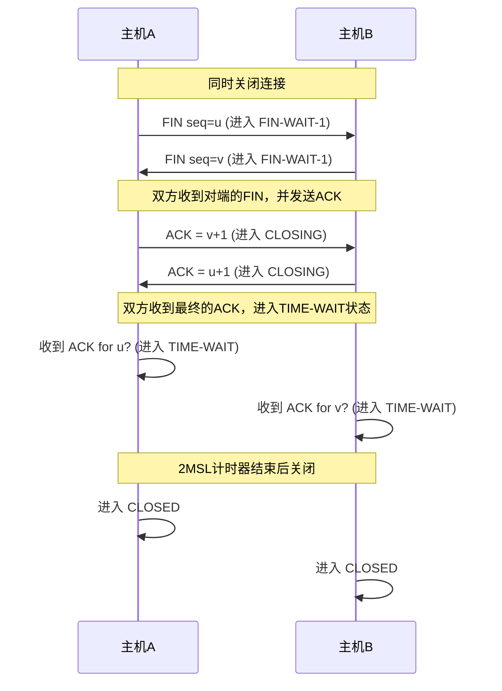

# **Computer Networks**

## 第 1 章 计算机网络体系结构

### 计算机网络概述

1. 计算机网络的功能：数据通信、资源共享、分布式处理、信息综合处理、负载均衡、提高可靠性等

#### 性能指标

| 性能指标           | 英文名                  | 量纲             | 形式化公式                                                   | 要点                                                         |
| ------------------ | ----------------------- | ---------------- | ------------------------------------------------------------ | ------------------------------------------------------------ |
| **速率**           | Data Rate (Bit Rate)    | bps (比特/秒)    | 无特定公式（通常为实际测量值）                               | 实际数据传输速率，表示每秒传输的比特数。受信道质量和设备影响 |
| **带宽**           | Bandwidth               | Hz (赫兹) 或 bps | 无特定公式（通常为理论最大值）                               | 信道的最大数据传输能力；在数字通信中常用 bps 表示。决定链路容量上限 |
| **吞吐量**         | Throughput              | bps (比特/秒)    | $ \text{Throughput} = \frac{\text{成功传输数据量 (比特)}}{\text{时间 (秒)}} $ | 实际成功传输的有效数据率。通常小于带宽，反映网络实际性能     |
| **发送时延**       | Transmission Delay      | s (秒)           | $ T_{\text{tx}} = \frac{L}{R} $                              | 发送整个数据包所需时间；取决于包大小 $ L $ 和传输速率 $ R $  |
| **传播时延**       | Propagation Delay       | s (秒)           | $ T_{\text{prop}} = \frac{D}{V} $                            | 信号在物理介质中传播的时间；取决于距离 $ D $ 和传播速度 $ V $（光速） |
| **处理时延**       | Processing Delay        | s (秒)           | 无标准公式（通常为常数或经验值）                             | 网络设备（如路由器）处理数据包的时间；包括检错、路由决策等   |
| **排队时延**       | Queuing Delay           | s (秒)           | 无固定公式（基于排队论模型）                                 | 数据包在队列中等待传输的时间；可变性强，取决于网络拥塞程度   |
| **时延带宽积**     | Delay-Bandwidth Product | bit (比特)       | $ \text{DP} = T_{\text{prop}} \times B $                     | 链路中可容纳的比特数（"管道大小"）；反映链路利用率。值大表示高延迟或高带宽 |
| **往返时延 (RTT)** | Round-Trip Time (RTT)   | s (秒)           | $ \text{RTT} \approx 2 \times T_{\text{prop}} $（简化版，忽略其他时延） | 数据包从发送到接收并返回的总时间；用于 TCP 超时设置。实际 RTT 包括所有时延类型 |
| **信道利用率**     | Channel Utilization     | 无（或%）        | $ U = \frac{\text{Throughput}}{\text{Bandwidth}} $           | 信道被有效使用的比例；理想值在 0-1 之间（或 0%-100%）。过高易导致拥塞 |

### 计算机网络体系结构与参考模型

1. 上层实体调用下层 **接口**，下层实体为上层提供 **服务**

2. 协议数据单元 PDU：对等层次之间传送的数据单位，第 n 层的 PDU 记为 $PDU_n$

   服务数据单元 SDU：为完成上一层实体所要求的功能而传送的数据，第 n 层的 SDU 记为 $SDU_n$

   协议控制单元 PCI：控制协议操作的信息，第 n 层的 PCI 记为 $PCI_n$

   * $SDU_n + PCI_n = PDU_n = SDU_{n - 1}$

#### OSI 参考模型

#### TCP/IP 模型

1. ISO/OSI 模型在网络层支持无连接和面向连接的通信，传输层仅支持面向连接的通信

   TCP/IP 模型在网络层仅支持无连接的通信，在传输层支持无连接和面向连接的通信

2. 考研中端到端指的是进程到进程，这与《自顶向下》不同

## 第 2 章 物理层

### 通信基础

1. 码元速率也称调制速率

2. 带宽 $W$ 等于频率范围长度 $W = 最大频率 - 最小频率$

3. 信息传输速率：每秒传输的二进制符号数

4. 码元与比特的关系：一码元可携带多少 bit 数据？若一个周期内可能出现 $k$ 种信号，则 $1码元 = \log_2 k (bit)$

5. 速率

   * 波特率：每秒传输多少个码元，码元/秒 或 波特（Baud）
   * 比特率：每秒传输多少个比特，bit/s 或 b/s 或 bps

   >波特率 = 比特率 / 每符号含的比特数

6. 信道的极限容量

   | 变量 | 名称           | 量纲 |
   | ---- | -------------- | ---- |
   | W    | 信道的频率带宽 | Hz   |
   | S    | 信号的功率     | 瓦特 |
   | N    | 噪声的功率     | 瓦特 |
   | V    | 可能的信号数   | -    |

   * 无噪声、带宽有限的信道，奈奎斯特定理：$极限波特率 = 2W(Baud) = 2W\log_2{V}(b/s)$

     >1. 如果波特率太高，会导致“码间串扰”，即接收方无法识别码元
     >2. 带宽越大，信道传输码元的能力越强
     >3. 奈奎斯特定理并未对一个码元最多可以携带多少比特做出解释

     * 有噪声、带宽有限的信道，香农定理：$极限比特率 = W\log_2{(1 + S/N)}(b/s) = W(1 + S/N)(Baud)$
  * $信噪比 = 10\log_{10} S/N$（信噪比单位为 dB 分贝，要使用香农公式，必须转化为无单位的信噪比）
   
  >1. 提升信道带宽、加强信号功率、降低噪声功率，都可以提高信道的极限比特率
     >2. 结合奈奎斯特定理，可知，在带宽、信噪比确定的信道上，一个码元可以携带的比特数是有上限的
   
* **注意**：若给出了码元与比特数之间的关系，则需受两个公式的共同限制，分别通过两公式算出结果，取较小者

### 编码与调制

1. 以太网默认采用曼彻斯特编码

| 编码方案                  | 自同步能力               | 浪费带宽 | 抗干扰能力 |
| ------------------------- | ------------------------ | -------- | ---------- |
| **不归零编码 (NRZ)**      | 无                       | 无       | 弱         |
| **归零编码 (RZ)**         | 有                       | 浪费     | 弱         |
| **反向非归零编码 (NRZI)** | 若增加冗余位可实现自同步 | 不太浪费 | 弱         |
| **曼彻斯特编码**          | 有                       | 浪费     | 强         |
| **差分曼彻斯特编码**      | 有                       | 浪费     | 强         |

### 传输介质

### 物理层设备

1. 多台计算机连接在一个集线器下，共享带宽，逻辑上是总线型网络
2. 当集线器的一个端口收到数据后，将其从出输入端口外的所有端口广播出去

## 第 3 章 数据链路层

### 功能

### 组帧

### 差错控制

#### 奇偶校验

### 循环冗余校验码 （CRC 码）

### 海明码

[海明码一篇文章彻底搞懂 - 秃桔子 - 博客园](https://www.cnblogs.com/godoforange/p/12003676.html)

1. 海明码可以纠一位错，检两位错

### 流量控制与可靠传输机制（需巩固）

1. 发送窗口：$W_T$

   接收窗口：$W_R$

   * 使用 $n$ 比特给帧编号，满足 $W_T + W_R \le 2^n$
   * 必须满足 $W_R \le W_T$（尤其对于 SR 协议）

2. 非法帧包括：落在接收窗口之外的帧、检测出差错的帧

3. 使用 $n$ 比特给帧编号

   | 协议名称              | 发送窗口大小 ($W_t$)   | 接收窗口大小 ($W_r$)  |
   | --------------------- | ---------------------- | --------------------- |
   | Stop-and-Wait (S-R)   | $W_t = 1$              | $W_r = 1$             |
   | Go-Back-N (GBN)       | $1 < W_t \leq 2^k - 1$ | $W_r = 1$             |
   | Selective Repeat (SR) | $1 < W_t \leq 2^{k-1}$ | $1 < W_r \le 2^{k-1}$ |

| 协议名称               | 滑动窗口机制                         | 确认机制                                                     | 重传机制                                           | 帧编号             | 注                                                           | 缺点 |
| -------------------- | ------------------------------------ | ------------------------------------------------------------ | -------------------------------------------------- | ------------------ | ------------------------------------------------------------ | -------------------- |
| **停止-等待协议（S-W）** | $W_T = 1$ $W_R = 1$ | **确认帧 $ACK_i$：** 若接收方收到 $i$ 号帧，且没有检测到差错，需要给发送方返回确认帧 $ACK_i$ | **超时重传：** 若发送方超时未收到 $ACK_i$，则重传 $i$ 号帧 | 仅需 $1bit$ 给帧编号 | 1. 接收方控制发送方窗口滑动 2. 窗口长度为 $1$，不存在数据帧失序问题 | 信道利用率极低，浪费带宽资源 |
| **后退 N 帧协议（GBN）** | $W_T \gt 1$ $W_R = 1$ | **确认帧 $ACK_i$：** 接收方可以累积确认，即连续收到多个数据帧时，可以仅返回最后一个帧的 $ACK$（$ACK_i$ 表示接收方已收到 $i$ 号帧及其之前的所有帧） | **超时重传：** 若发送方超时未收到 $ACK_i$，则重传 $i$ 号帧，及其之后的所有帧 | 至少需要 $nbit$ 给帧编号 | 收到非法帧时，接收方丢弃此帧，并返回目前已接收的最后一个正确帧的 $ACK_i$，以提醒发送方后退回 $i+1$ 号帧重新发送 | 若接收方接收帧的速度很慢，或信道误码率很高，可能导致发送方频繁后退 |
| **选择重传协议（SR）** | $W_T \gt 1$ $W_R \gt 1$ | **确认帧 $ACK_i$：** 若接收方收到 $i$ 号帧，且没有检测到差错，需要给发送方返回确认帧 $ACK_i$ **否认帧 $NAK_i$：** 若接收方收到 $i$ 号帧，但检测出 $i$ 号帧有差错，需要丢弃该帧，并给发送方返回否认帧 $NAK_i$ | **超时重传：** 若发送方超时未收到 $ACK_i$，则重传 $i$ 号帧 请求重传：若发送方收到 $NAK_i$，则重传 $i$ 号帧 | 至少需要 $nbit$ 给帧编号 | 1. 若接收方检测出帧差错，则丢弃帧，并返回 $NAK_i$，主动请求重传 2. 接收方是一帧一确认 | 实现复杂 |

#### 三种协议的信道利用率

### 介质访问控制

#### 信道划分介质访问控制

#### 随机访问介质访问控制

##### CSMA/CD 协议

1. $发送帧的时间 \ge 争用期时间$

   $最短帧长 = 数据传输速率 \times 争用期时间$

2. 题目没给最短帧长，默认 $64B$

##### CSMA/CA 协议

$A$ 站广播一个 $RTS$ 帧时，将占用信道的持续时间 $SIFS + CTS + SIFS + DATA + SIFS + ACK$ 写入 $RTS$ 的首部

当 $AP$ 收到 $RTS$ 后，将广播一个 $CTS$ 帧，将占用信道的持续时间 $SIFS + DATA + SIFS + ACK$ 写入 $CTS$ 的首部

>$NAV$ 网络分配向量：站 $B$ 根据 $CTS$ 帧中的持续时间设置自己的 $NAV$

#### 轮询访问：令牌传递协议

### 局域网

#### 以太网

1. 以太网 MAC 帧格式（要记）

   * V2 标准（默认）：6 6 2 N 4，收发协数验
   * 802.3 标准：6 6 2 N 4，收发长数验

2. 集线器收到数据帧后，会无脑转发给所有连接的对象

   交换机收到数据帧后，会解析发送者和接收者的 MAC 地址，只转发给接收者

   路由器收到广播帧后，不会将其转发到其他广播域

   | 设备名称 | 能否隔离冲突域 | 能否隔离广播域 |
   | -------- | -------------- | -------------- |
   | 集线器   | 不能           | 不能           |
   | 中继器   | 不能           | 不能           |
   | 交换机   | 能             | 不能           |
   | 网桥     | 能             | 不能           |
   | 路由器   | 能             | 能             |
   
   * VLAN 既隔离冲突域，也隔离广播域，但其工作在数据链路层
   
     >实际上 VLAN 本身并不负责隔离冲突域，无论是否划分 VLAN，交换机的每个端口本身就已隔离了冲突域
     >
     >VLAN 的重要设计目的是隔离广播域：**VLAN 的主要功能就是在数据链路层（第二层）虚拟地划分出多个广播域**

#### VLAN

[IEEE 802.1Q 封装的 VLAN 数据帧格式 - 华为](https://support.huawei.com/enterprise/zh/doc/EDOC1100088136)

#### IEEE 802.11 无线局域网

### 广域网

// TODO 3.7 考频很低，暂时跳过

### 数据链路层设备

以太网交换机交换方式：

| 特性             | 直通交换 (Cut-Through Switching)                             | 存储转发 (Store-and-Forward Switching)                       |
| ---------------- | ------------------------------------------------------------ | ------------------------------------------------------------ |
| **工作原理**     | 交换机接收到帧的目的 MAC 地址后立即开始转发，不等待完整帧接收 | 交换机接收整个帧并存储到缓冲区，进行 CRC 校验和错误检查后再转发 |
| **所需解析部分** | 目的 MAC 地址(前 6 字节) + 可能的部分前导字段                | 完整帧(包括帧头、数据和帧尾)                                 |
| **最小解析长度** | **6 字节** (仅目的 MAC 地址)                                 | **64 字节** (最小以太网帧长度)或整个帧长度                   |
| **典型解析长度** | 14-16 字节 (目的 MAC+源 MAC+部分类型字段)                    | 整个帧(64-1518/1522 字节)                                    |
| **错误检测能力** | 无或有限(仅能检测部分早期错误)                               | 完整(可检测 CRC 错误和帧完整性)                              |
| **延迟特性**     | 低且固定(延迟基本不变)                                       | 较高且可变(延迟随帧长度增加)                                 |
| **带宽利用率**   | 可能转发错误帧，浪费带宽                                     | 不转发错误帧，节省带宽                                       |
| **内存需求**     | 较低(只需缓冲少量字节)                                       | 较高(需要缓冲整个帧)                                         |
| **适用场景**     | 高速度、低延迟环境，错误率低的网络                           | 需要高可靠性的环境，错误率较高的网络                         |

### 杂项

1. MAC 子层的主要功能：控制和协调所有站点对共享介质的访问

2. IEEE 803.3 标准规定，若采用同轴电缆作为传输介质，在无中继的情况下，传输介质最大长度不能超过 500m
   * **10Base5**，数据率 10Mb/s，每段电缆最大长度 500m
   * **10Base2**，数据率 10Mb/s，每段电缆最大长度 185m

3. 链路聚合是解决交换机之间的宽带瓶颈问题的技术，而不是虚拟局域网的技术

4. 用 $n$ 比特进行编号时，若接收窗口的大小为 1，则仅在发送窗口的大小满足 $W_T \le 2^n - 1$ 时，连续 ARQ 协议才能正确运行

5. 96 比特时间

   * **比特时间**：发送 1 比特数据所需的时间。它是一个与速率相关的相对单位
   * 帧间间隔是一个 **固定时间**（9.6 μs），但用比特数来表示时，它会因网络速率的不同而 **对应不同的实际比特数**

   | 以太网标准     | 速率     | 比特时间      | **帧间间隔 (96 比特时间)** |
   | :------------- | :------- | :------------ | :------------------------ |
   | **10BASE-T**   | 10 Mbps  | 0.1 μs/bit    | 9.6 μs **(96 bits)**      |
   | **100BASE-TX** | 100 Mbps | 0.01 μs/bit   | 0.96 μs **(96 bits)**     |
   | **1000BASE-T** | 1 Gbps   | 0.001 μs/bit  | 0.096 μs **(96 bits)**    |
   | **10GBASE-T**  | 10 Gbps  | 0.0001 μs/bit | 0.0096 μs **(96 bits)**   |

## 第 4 章 网络层

### 功能

1. 网络的异构性是指传输介质、数据编码方式。链路控制协议及不同的数据单元格式和转发机制，这些特点分别在物理层协议和数据链路层协议中定义
2. 在路由器互连的多个局域网的结构中，要求每个局域网物理层、数据链路层、网络层协议可以不同，而网络层以上的高层协议必须相同

### IPv4

1. 418，首总偏
   * **首** 部长度以 4B 为单位
   * **总** 长度以 1B 为单位
   * 片 **偏** 移以 8B 为单位
2. IP 分组头中与分片和组装相关的字段是：标识、标志、片偏移
3. 127.0.0.1 既可以作为目的 IP 地址，也可以作为源 IP 地址
4. 在网络中，允许一台主机有两个或两个以上的 IP 地址。若一台主机有两个或两个以上的 IP 地址，则说明这台主机属于两个或两个以上的网络

| 字段名 (Field Name) | 英文名 (English Name)        | 用途 (Purpose)                                               | 注意事项 (Notes)                                             |
| :------------------ | :--------------------------- | :----------------------------------------------------------- | :----------------------------------------------------------- |
| **版本**            | Version                      | 标识 IP 协议的版本（对于 IPv4，此值为 4）                    | 长度为 4 比特。确保发送和接收双方使用相同版本                |
| **首部长度**        | IHL (Internet Header Length) | 指示 IP 数据报首部的长度（以 32 位字为单位）                 | 长度为 4 比特。最小值为 5（即 20 字节），最大值为 15（即 60 字节）。选项字段使其长度可变 |
| **区分服务**        | DS (Differentiated Services) | 用于表示数据报的服务类型或优先级，支持 QoS（服务质量）       | 原称“服务类型(ToS)”。现通常用于 DSCP（差分服务代码点）和 ECN（显式拥塞通知） |
| **总长度**          | Total Length                 | 定义整个 IP 数据报（首部+数据）的总长度（以字节为单位）      | 长度为 16 比特。最大长度为 65535 字节。数据报长度不能超过链路的 MTU（最大传输单元），否则需要分片 |
| **标识**            | Identification               | 唯一标识一个数据报或其分片。相同数据报的所有分片有相同的标识值 | 用于接收方重组分片。通常每发送一个数据报，该值加 1           |
| **标志**            | Flags                        | 3 比特字段，控制数据报的分片行为                             | 第 1 位：保留（必须为 0）；第 2 位（DF）：禁止分片；第 3 位（MF）：更多分片（除最后一个分片外，所有分片该位均置 1） |
| **片偏移**          | Fragment Offset              | 指示当前分片在原数据报中的偏移位置（以 8 字节为单位）        | 长度为 13 比特。第一个分片的偏移为 0。用于按正确顺序重组分片 |
| **生存时间**        | TTL (Time to Live)           | 设置数据报在网络中可经过的最大路由器跳数，防止无限循环       | 每经过一个路由器，该值减 1。当减至 0 时，数据报被丢弃并发送 ICMP 超时消息。它是一个跳数限制，而非时间值 |
| **协议**            | Protocol                     | 标识数据部分所承载的上层协议（如：TCP = 6, UDP = 17, ICMP = 1） | 接收方网络层根据此值将数据交付给相应的上层协议               |
| **首部校验和**      | Header Checksum              | 用于检测 IP 首部在传输过程中是否发生错误                     | 每经过一个路由器都需要重新计算，因为 TTL 等字段发生了变化。不检验数据部分，数据的完整性由上层协议（如 TCP）保证 |
| **源地址**          | Source Address               | 发送数据报的设备的 IPv4 地址（32 位）                        |                                                              |
| **目的地址**        | Destination Address          | 接收数据报的设备的 IPv4 地址（32 位）                        |                                                              |
| **选项**            | Options                      | 可选的附加功能（如时间戳、记录路由等），很少使用             | 长度可变（0-40 字节），必须以 4 字节对齐。如果首部长度大于 5，则表示存在选项字段 |
| **填充**            | Padding                      | 在选项字段后填充 0，确保 IP 首部长度是 4 字节（32 位）的整数倍 |                                                              |
| **数据**            | Data                         | 承载的上层协议数据（如 TCP 段、UDP 报文等）                  | 其长度等于“总长度”减去“首部长度”                             |

| 类别     | 地址范围                        | 地址块大小                   | 默认子网掩码           | 主要用途      | 可用作源地址？ | 可用作目的地址？ | 关键特性和备注                                               |
| :------- | :------------------------------ | :--------------------------- | :--------------------- | :------------ | :------------- | :--------------- | :----------------------------------------------------------- |
| **A 类** | `1.0.0.0` ~ `126.255.255.255`   | $2^{24}$ (约 1677 万) / 网络 | `255.0.0.0` 或 /8      | **单播**      | **是**         | **是**           | 第一个八位组为网络号，0 和 127 保留（如 `127.0.0.1` 为环回地址）。用于大型网络 |
| **B 类** | `128.0.0.0` ~ `191.255.255.255` | $2^{16}$ (65536) / 网络      | `255.255.0.0` 或 /16   | **单播**      | **是**         | **是**           | 前两个八位组为网络号。用于中型网络，如大型企业、高校         |
| **C 类** | `192.0.0.0` ~ `223.255.255.255` | $2^8$ (256) / 网络           | `255.255.255.0` 或 /24 | **单播**      | **是**         | **是**           | 前三个八位组为网络号。用于小型网络，如小型公司、SOHO         |
| **D 类** | `224.0.0.0` ~ `239.255.255.255` | $2^28$ (约 2.68 亿)          | **不适用**             | **多播**      | **绝对禁止**   | **是**           | 没有子网掩码概念，不代表一个网络，而是代表一个“组”。用于一对多通信（视频会议、流媒体、路由协议） |
| **E 类** | `240.0.0.0` ~ `255.255.255.254` | $2^28$ (约 2.68 亿)          | **不适用**             | **保留/实验** | 通常不使用     | 通常不使用       | 保留供未来使用或实验目的。其中 `255.255.255.255` 为 **受限广播地址** |

#### IP 数据报分片

1. 数据报长度 > 网络 **MTU**（如 1500 字节），无法一次性传输

2. **路由器** 负责分片，**目的主机** 负责重组

3. **所有分片的数据长度必须是 8 字节的整数倍**（因为“片偏移”以 8 字节为单位计算）

4. 分片核心要素

   * **标识 (ID)**：同一数据报的所有分片共享同一 ID，用于重组

   * **片偏移 (Offset)**：表示本分片数据在 **原始数据** 中的起始位置（单位：**8 字节**）

   * **标志 (Flags)**：

     - **MF = 1**：不是最后一片

     - **MF = 0**：是最后一片

>**例子**：MTU = 800 字节，IP 数据报总长 1580 字节（首部 20 字节，数据 1560 字节）
>
>1. **MTU 分析**：每个分片总长 ≤ 800 字节，故数据部分最大为 800 - 20 = 780 字节。但 780 不是 8 的整数倍，因此实际数据最大为 776 字节（因为 776 ÷ 8 = 97）
>
>2. **分片计算**：
>
>    - 数据总长 1560 字节
>
>    - 分片 1：数据 776 字节 → 偏移 = 0，MF = 1
>
>    - 分片 2：数据 776 字节 → 偏移 = 97（776/8），MF = 1
>
>    - 分片 3：数据 8 字节 → 偏移 = 194（1552/8），MF = 0
>
>**分片结果表**：
>
>| 分片 | 总长度（字节） | 数据长度（字节） | MF 标志 | 片偏移 |
>| ---- | -------------- | ---------------- | ------ | ------ |
>| #1   | 796            | 776              | 1      | 0      |
>| #2   | 796            | 776              | 1      | 97     |
>| #3   | 28             | 8                | 0      | 194    |
>
>**说明**：
>
>- 分片 1 和 2 各占 776 字节数据，分片 3 占剩余 8 字节数据
>- 片偏移以 8 字节为单位，因此偏移 97 表示数据从 776 字节开始，偏移 194 表示从 1552 字节开始
>- 目的主机根据 ID、偏移和 MF 标志重组原始数据报

#### 子网划分

##### 子网掩码：CIDR 记法与点分十进制的快速转换

* CIDR 记法 $\rightarrow$ 点分十进制：若前缀长度为 $N$，前 $\lfloor N/8 \rfloor$ 段为 $255$，剩余 $k = N \% 8$ 位二进制对应的值为 $256 - 2^{8 - k}$

  >例如：$/27$
  >
  >前 $\lfloor 27/8 \rfloor = 3$ 段为 255，即 `255.255.255.xxx`
  >
  >$k = 27\%8 = 3$，剩余 $3$ 位二进制对应的值为 $256 - 2^{8 - 3} = 224$，即结果为 $255.255.255.224$

* 点分十进制 $\rightarrow$ CIDR 记法：将四段掩码转为二进制，统计连续 1 的个数

  * 255 → 8 个 1
  * 254 → 7 个 1
  * 252 → 6 个 1
  * 248 → 5 个 1
  * 240 → 4 个 1
  * 224 → 3 个 1
  * 192 → 2 个 1
  * 128 → 1 个 1
  * 0 → 0 个 1

##### 定长子网划分

1. CIDR 的主机号为子网号+主机号
1. 已知原网络前缀 $N_0$，需要划分为 $S$ 个子网
* 求子网借用位数 $n$：满足 $2^n \geq S$（取最小满足条件的 $n$）
  
* 新前缀长度 $N = N_0 + n$
  
* 剩余主机位数 $m = 32 - N$
  
* 每个子网可用主机数：$2^m - 2$（减去网络地址和广播地址）

##### 变长子网划分

// TODO

##### 子网块大小

* **法一（快速公式）**：若掩码 **仅在最后一个字节变化**（即掩码长度在 24 到 32 之间），则块大小 $S = 256 - M$（$M$ 为掩码变化段的十进制值，如掩码 `255.255.255.192` 最后一段为 $192$，则块大小 $=64$）
* 法二：一般情况，块大小 $S = 2^{32 - 掩码长度}$（/25 的块大小 $= 2^{32 - 25} = 128$）
  * 聚合块大小反推掩码长度 $M = 32 - \log_2{S}$
* 注意事项：子网块大小必须为 2 的幂

>用途
>
>* 可作为子网范围计算的增量
>* 判断子网是否合法与合规：**`IP地址 % 块大小 == 0` ？是则合法 : 否则不合法**，可以只用最后一段充当被模数
>* 用于子网的聚合：聚合后的块大小 $S_{agg}$ 应等于所有子网块大小之和，则聚合掩码 $M = 32 - \log_2{S_{agg}}$

##### 子网范围计算

###### 定长子网

* 从原网络地址开始，以块大小为间隔划分子网

  **例**：掩码是 `255.255.255.192`，变化的是最后一段 `192`。块大小 = `256 - 192 = 64`

  *   子网 1: `192.168.1.0/26`   (IP 范围: 1 - 62)
  *   子网 2: `192.168.1.64/26`  (IP 范围: 65 - 126)
  *   子网 3: `192.168.1.128/26` (IP 范围: 129 - 190)
  *   子网 4: `192.168.1.192/26` (IP 范围: 193 - 254)

###### 变长子网

通过子网块大小计算变长子网覆盖范围

1. 设 IP 地址为 $X.X.X.A$，掩码长度为 $M$（$24 ≤ M ≤ 32$）
2. 块大小 $S = 2^{32 - M}$，这是子网中 IP 地址的数量
3. 计算网络地址：将给定 IP 与子网掩码按位与得到网络地址
4. 覆盖范围：下界为网络地址，上界为网络地址 + S - 1，即在下界基础上，$S$ 不断整除取模 256，可算出每一段的值

对于 192.168.1.**130**/26

- 掩码长度 26，块大小 $2^{32 - 26} = 64$
- 网络地址最后一个字节：130 所在的块必须从 64 的整数倍开始。130 在 128-191 之间，所以网络地址是 192.168.1.128/26（覆盖 128-191）

>用途
>
>* IP 地址规划与分配
>* 判断 IP 地址归属：快速判断 IP 属于哪个网段
>* 检查子网重叠
>* 优化地址空间利用率（VLSM）

##### 根据主机数求掩码

* 若需容纳 $H$ 台主机，满足 $2^m - 2 \geq H$ 的最小 $m$（主机位数），则前缀长度 $= 32 - m$

##### 判断 IP 地址是否属于同一子网

1. 识别关键段：找到那个 **既不是 255 也不是 0** 的八位组（段）。这个段是“关键段”，它划分了网络和主机的边界
2. 计算“块大小”（增量）
3. 使用 IP 地址的关键段除以块大小，取整数部分，若商相同，则属于同一子网，否则不属于同一子网

>若两台主机的子网掩码不同，则一定不属于同一网络

##### 超网合并（路由聚合）

* 将多个连续子网合并为更大网络，减少路由表项，提高效率
* **方法**：找到所有子网的公共前缀（二进制表示下最长公共前缀位）
* **例**：子网 `192.168.0.0/24` 和 `192.168.1.0/24` 可聚合为 `192.168.0.0/23`（前 23 位相同）
* **判断路由聚合后是否引入多余地址的方法**：将子网地址转换为二进制，检查共同前缀后的比特是否连续且无间隙。如果有缺失值，则引入多余地址

##### 注意事项：

* 网络地址（主机位全 0）和广播地址（主机位全 1）不可用作主机地址
* 若掩码非整字节（如 `/26` 最后一段为 192），计算块大小需用 $256 - M$

##### 子网划分的好坏

* 好处
  * 增加子网数量，减小广播域大小，提高网络的效率和安全性
  * 提高 IP 地址利用率
* 坏处
  * 划分子网后，各子网中主机号全 0 和全 1 的地址不能使用，会减少总的主机数量

#### 网络地址转换 NAT

#### 地址解析协议 ARP

#### 动态主机配置协议 DHCP

1. 该协议属于应用层

#### 网际控制报文协议 ICMP

1. 若分组长度超过 MTU，则
   * 当 DF = 1 时，丢弃该分组，并用 ICMP 向源主机发送终点不可达报文
   * 当 DF = 0 时，进行分片，MF = 1 表示后面还有分片

2. 路由器收到 $TTL = 1$ 的 IP 数据报，会先将 $TTL-1$，然后判断是否等于 0

3. PING 命令使用了 ICMP 询问报文

4. 对于已经分片的分组，只对第一个分片产生 ICMP 差错报文

   对于多播的分组，不产生 ICMP 差错报文

#### 杂项

1. 硬件地址（MAC 地址）只具有本地意义，因此路由器在转发 IP 数据报时，会重新封装源硬件地址和目的硬件地址

2. 两个不同的子网可以配置相同的默认网关

3. 默认网关必须是 **本子网内一个真实存在的、并且配置了路由转发功能的设备接口的 IP 地址**

4. 在路由器之间的点对点链路中，两个接口的 IP 地址通常属于同一个子网，并且子网掩码通常为/30（255.255.255.252）或/31（255.255.255.254）。无论哪种掩码，另一个路由器接口的地址通常是已知 IP 地址的相邻地址
   * 点对点链路只需要两个 IP 地址，因此通常使用/30 或/31 子网掩码
     - **/30 子网**：有 4 个 IP 地址，其中两个可用地址（网络地址和广播地址不可用）。例如，子网 192.168.1.0/30 的可用地址是 192.168.1.1 和 192.168.1.2
     - **/31 子网**：有 2 个 IP 地址，两个地址都可用（无网络和广播地址）。例如，子网 192.168.1.4/31 的地址是 192.168.1.4 和 192.168.1.5
   * 在这种配置下，两个接口的 IP 地址是连续的，即最后一个八位组相差 1
   * 具体是 D+1 还是 D-1 取决于网络设计，但常见做法是已知地址为第一个可用地址时，另一个地址为 D+1；已知地址为第二个可用地址时，另一个地址为 D-1

5. **将 IP 地址空间画为满二叉树后，判断哪些节点可以组成 n 个互不重叠的子网**

   在 IP 地址空间的二叉树表示中，一组子网节点互不重叠当且仅当它们之间没有祖先-后代关系，即没有两个节点在同一条从根到叶子的路径上。因此，要选择 n 个这样的子网，只需从树的不同分支中选择节点，确保它们不共享共同的路径

   >例如，考虑地址空间 192.168.1.0/24：
   >
   >- 选择子网 192.168.1.0/26 和 192.168.1.64/26（同属于 192.168.1.0/25 的两个子节点），它们没有祖先-后代关系，因此互不重叠
   >- 但选择 192.168.1.0/25 和 192.168.1.128/26 则重叠，因为前者是后者的祖先（/25 包含/26）

6. IP 数据报分片不是 MAC 帧

##### 网络层综合案例

##### 各种协议之间的依赖关系

### IPv6

1. IPv6 没有首部校验和字段，因为传输层有差错检验功能
2. IPv6 不允许中间路由器进行分片，若一个路由器收到的 IPv6 数据报因太大而不能转发到链路上，路由器会把该数据报丢弃
3. IPv6 地址空间是 IPv4 地址空间的 $2^{96}$ 倍

### 路由算法与路由协议

// TODO 题目还没写，大题强化

### IP 多播

// TODO

### 移动 IP

1. 移动 IP 的基本工作过程可分为代理发现、注册、分组路由和注销 4 个阶段
2. 移动节点到达新网络后，通过注册过程把自己的新的可达信息通知归属代理
3. 归属地址固定，转交地址动态改变

### 网络层设备

1. 路由表的生成和管理是软件的，而依靠路由表信息进行高速数据包转发的查表操作是硬件的
2. 路由表通过软件计算和维护，为分组转发提供决策依据；分组转发则依靠硬件，根据路由表的决策高速执行数据包的发送
3. 路由表的分组转发部分由交换结构、输入端口、输出端口组成
4. 路由表中默认路由的目的地址和子网掩码均为 0.0.0.0

### 杂项

1. 尽最大努力交付

   * 不保证无差错
   * 不保证时间
   * 不保证顺序
   * 不保证不重复
   * 不故意丢弃 IP 数据报

   >凡交付给目的主机的 IP 数据报都是 IP 首部没有差错的或没有检测出差错的，因为在传输过程中，出现差错的 IP 数据报都被丢弃了

2. A 广播一个 ARP 请求分组，希望找出 B 的 MAC 地址，ARP 响应分组由谁发送？

   * 若 AB 在同一局域网内，则计算机 B 发送 ARP 响应分组
   * 若 AB 不在同一局域网内，则必须由一个连接 A 所在局域网的路由器来响应，给路由器给出 B 的 MAC 地址

3. 在数据报的首部中只有源 IP 地址和目的 IP 地址，而没有中间经过的路由器的 IP 地址，更没有指明下一跳路由器的 IP 地址，那么待转发的数据报怎样才能找到下一跳路由器呢？

   * 当路由器收到一个待转发的数据报时，由路由表得出下一跳路由器的 IP 地址后，不是把这个地址填入数据报，而是送交数据链路层的网络接口软件。网络接口软件负责把下一跳路由器的 IP 地转换成硬件地址（使用 ARP)，并将此硬件地址写入 MAC 帧的首部，然后根据此硬件地址找到下一跳路由器。可见，当发送一连串的数据报时，上述的查找路由表、用 ARP 得到硬件地址、把硬件地址写入 MAC 帧的首部等过程，将不断地重复进行，造成了一定的开销。
   * 那么，能不能在路由表中不使用 IP 地址而直接使用硬件地址呢？不行。我们要清楚，使用抽象的 IP 地址，本来就是为了隐蔽各种底层网络的复杂性而便于分析和研究问题，这样就不可避免地要付出一些代价，例如在选择路由时多了一些开销。反过来，若在路由表中直接使用硬件地址，则因为硬件地址是平面的，将导致路由表极为庞大，从而带来更多的麻烦。

4. 路由器实现了物理层、数据链路层、网络层，这句话的含义是什么？

   * 第 1 章中提到了网络中的两个通信节点利用协议栈进行通信的过程。发送方一层一层地把数据 "包装"，接收方一层一层地把 "包装" 拆开，最后上交给用户。路由器实现了物理层，数据链路层和网络层的含义是指路由器有能力对这三层协议的控制信息进行识别、分析以及转换，直观的理解是路由器有能力对数据 "包装" 这三层协议或者 "拆开" 这三层协议。自然，路由器就有能力互连这三层协议不同的两个网络。

## 第 5 章 传输层

### 提供的服务

#### 熟知端口号（0-1023）

| 端口号       | 协议       | 服务名称                   | 说明                                                  | 传输层协议     |
| :----------- | :--------- | :------------------------- | :---------------------------------------------------- | :------------- |
| **20, 21**   | FTP        | **文件传输协议**           | 20 用于数据传输，21 用于控制连接                        | TCP            |
| **22**       | SSH        | **安全外壳协议**           | 加密的远程登录和管理，替代 Telnet                      | TCP            |
| **23**       | Telnet     | **远程登录协议**           | 明文传输的远程管理，不安全                            | TCP            |
| **25**       | SMTP       | **简单邮件传输协议**       | **用于发送邮件** (MTA -> MTA)                         | TCP            |
| **53**       | DNS        | **域名系统**               | 将域名解析为 IP 地址                                    | **TCP 和 UDP** |
| **67, 68**   | DHCP       | **动态主机配置协议**       | 67 为服务器端，68 为客户端，自动分配 IP 地址              | UDP            |
| **80**       | HTTP       | **超文本传输协议**         | 万维网的基础，传输未加密的网页数据                    | TCP            |
| **110**      | POP3       | **邮局协议版本 3**          | **从服务器下载邮件到本地**                            | TCP            |
| **123**      | NTP        | **网络时间协议**           | 用于同步网络设备的时间                                | UDP            |
| **137-139**  | NetBIOS    | **网络基本输入输出系统**   | 主要用于 Windows 文件共享和名称解析                     | TCP 和 UDP     |
| **143**      | IMAP       | **互联网消息访问协议**     | **在服务器上管理邮件**（优于 POP3）                    | TCP            |
| **161, 162** | SNMP       | **简单网络管理协议**       | 161 用于查询，162 用于接收陷阱（Trap）                  | UDP            |
| **179**      | BGP        | **边界网关协议**           | 互联网核心的路由协议，用于 AS 之间                      | TCP            |
| **194**      | IRC        | **互联网中继聊天**         | 传统的在线聊天系统                                    | TCP            |
| **389**      | LDAP       | **轻量级目录访问协议**     | 访问和管理分布式目录信息（如用户认证）                | TCP            |
| **443**      | HTTPS      | **安全超文本传输协议**     | HTTP over SSL/TLS，**加密的网页访问**                 | TCP            |
| **465**      | SMTPS      | **安全简单邮件传输协议**   | SMTP over SSL (已弃用，多用端口 587)                   | TCP            |
| **587**      | SMTP       | **邮件提交协议**           | **用于邮件客户端向服务器提交邮件** (使用 STARTTLS 加密) | TCP            |
| **636**      | LDAPS      | **安全轻量级目录访问协议** | LDAP over SSL/TLS                                     | TCP            |
| **993**      | IMAPS      | **安全互联网消息访问协议** | IMAP over SSL/TLS                                     | TCP            |
| **995**      | POP3S      | **安全邮局协议版本 3**      | POP3 over SSL/TLS                                     | TCP            |

### UDP

#### 协议

1. UDP 数据传输的可靠性由应用层负责
2. 复用/分用：UDP 通过端口号将多个应用进程的数据复用到一个 IP 层发送，并根据接收到的数据报的目的端口号分用给对应的应用进程

#### 检验

1. IP 数据报检验：取首部，以 16bit 为一组计算二进制加法，最高位产生的进位需要回卷，最终结果取反

   UDP 数据报检验：取 8bit 首部，**在首部之前添加 12bit 伪首部**，以 16bit 为一组计算二进制加法，最高位产生的进位需要回卷，最终结果取反，计算完成去掉伪首部

### TCP

#### 报文段

##### 字段总结

1. 只有 **握手 1** 的 ACK = 0，其他所有 TCP 报文段都是 ACK = 1

   只有 **握手 1**、**握手 2** 的 SYN = 1，其他所有 TCP 报文段都是 SYN = 0

   只有 **挥手 1**、**挥手 3** 的 FIN = 1，其他所有 TCP 报文段都是 FIN = 0

2. **TCP 序号绕回时间** 等于用尽全部 32 位序列号空间（$2^{32}$ 字节对应比特数）所需的数据量（序列号单位为字节），除以网络发送速率

3. RST = 1，必须释放连接，然后重新建立连接

4. TCP 首部中窗口字段指明自己的接收窗口的尺寸

| 中文名       | 英文名           | 长度   | 解释                                                         |
| :----------- | :--------------- | :----- | :----------------------------------------------------------- |
| **源端口**   | Source Port      | 16 bit | 发送方进程的端口号                                           |
| **目的端口** | Destination Port | 16 bit | 接收方进程的端口号                                           |
| **序列号**   | **seq**          | 32 bit | **本报文段所发送数据的第一个字节在原始字节流中的位置**       |
| **确认号**   | **ack**          | 32 bit | **期望收到对方下一个报文段的第一个数据字节的编号。序号在该确认号之前的所有字节都已正确收到** |
| **数据偏移** | Data Offset      | 4 bit  | 指出 TCP 首部的长度（以 4 字节为单位），最大 15，故 **首部最大长度为 60 字节** |
| **保留字段** | Reserved         | 6 bit  | 必须置 0                                                     |
| **控制位**   | **Flags**        | 6 bit  | 重要标志位，每位含义如下： • **URG**: 紧急指针有效 • **ACK**: ack 有效。**一旦连接建立，ACK 必须置 1** • **PSH**: 推送操作，接收方应尽快上交应用进程 • **RST**: 复位连接，表明出现严重错误，必须释放连接 • **SYN**: 同步位，**用于连接建立**。SYN = 1, ACK = 0 表示连接请求；SYN = 1, ACK = 1 表示连接接受 • **FIN**: 终止位，**用于连接释放**，表明发送方数据已发完 |
| **接收窗口** | **rwnd/rcvwnd**  | 16 bit | **接收方允许对方发送的数据量**（以字节为单位）。用于 **流量控制**，动态调整发送窗口大小。 |
| **检验和**   | Checksum         | 16 bit | 检验范围包括首部、数据和伪首部（IP 源/目的地址、协议类型等） |
| **紧急指针** | Urgent Pointer   | 16 bit | 仅当 URG = 1 时有效，指出本报文段中紧急数据的末尾位置（相对于当前序列号的偏移） |
| **选项**     | Options          | 可变长 | 最大 40 字节。常见选项：**MSS**，通告对方自己所能接受的大小  |

##### 计时器总结
| 计时器名称            | 主要功能                                | 触发条件                                         | 核心注意事项                                                 |
| :-------------------- | :-------------------------------------- | :----------------------------------------------- | :----------------------------------------------------------- |
| **重传计时器**        | 处理报文段丢失，保障可靠性              | 数据包发出后启动，超时（RTO）未收到 ACK 则触发重传 | RTO 基于动态 RTT 计算。超时后会大幅减小拥塞窗口，严重影响性能   |
| **持久计时器**        | 解决零窗口死锁问题                      | 收到接收窗口为 0 的 ACK 后启动                       | 超时后发送 **窗口探测报文**，使用指数退避策略避免拥塞         |
| **保活计时器**        | 检测空闲连接是否存活                    | 连接持续空闲（如 2 小时）后启动                    | 非 TCP 标准必需，可能误杀健康连接（如过 NAT）。应用层心跳通常是更优选择 |
| **时间等待计时器**    | 保证连接可靠关闭，防止旧报文干扰新连接  | 主动关闭方发送最终 ACK 后，进入 TIME-WAIT 状态时启动 | 计时器时长通常为 2MSL。此状态会短暂占用系统资源（如端口）     |
| **FIN_WAIT_2 计时器** | 防止在 FIN_WAIT_2 状态无限期等待对端的 FIN | 进入 FIN_WAIT_2 状态后启动                         | 非所有系统实现都有，**超时后强制关闭连接**                   |

#### 连接管理

1. 信息一个来回用时一个 RTT，半个来回即 0.5RTT，据此可以进行建立连接、断开连接的最短耗时分析

2. seq 表示我将要发的字符流的首序号，若我没有数据要发（即仅 ack），seq 就等于对方上一次报文的 ack

   ack 表示对方期待的下一个报文段的首序号

##### TCP 三次握手

##### TCP 四次挥手

1. 若服务器接受到客户端的 FIN 段后没有要发送的数据，则从客户端主动向服务器发出 FIN 段时刻算起
   * 客户端进入 CLOSED 状态所需时间为 $RTT + 2MSL$
   * 服务器进入 CLOSED 状态所需时间为 $1.5RTT$

##### 同时关闭

通信双方同时发送 FIN 段是可能的

##### 序列号的消耗

| 事件类型                 | 是否消耗序列号？ | 消耗数量                                      | 说明与示例                                                   |
| :----------------------- | :--------------- | :-------------------------------------------- | :----------------------------------------------------------- |
| **发送应用数据**         | **是**           | 消耗的字节数等于该报文段中 **负载数据的长度** | 这是消耗序列号最主要的情况。例如，发送一个包含 500 字节数据的报文段，序列号将增加 500 |
| **建立连接（发送 SYN）** | **是**           | **消耗 1 个序列号**                           | SYN 标志位被视为数据流的开始，它占用一个序列号，因此需要被确认。例如，初始序列号（ISN）为 10000，发送 SYN 后，下一个序列号变为 10001 |
| **关闭连接（发送 FIN）** | **是**           | **消耗 1 个序列号**                           | FIN 标志位被视为数据流的结束，它同样占用一个序列号，也需要被对方确认 |
| **重传数据/SYN/FIN**     | **是**           | 消耗数量与原始传输相同                        | 重传被视为原始传输的副本，消耗的序列号空间不变               |
| **发送纯 ACK 报文**      | **否**           | **不消耗序列号**                              | 如果报文段只有 ACK 标志位，而没有携带数据、SYN 或 FIN，则序列号保持不变。例如，确认号增长，但本端序列号不变 |
| **发送 RST 报文**        | **否**           | **不消耗序列号**                              | RST（重置）标志位用于异常终止连接，不需要被确认，因此不消耗序列号 |

#### 可靠传输

1. 快重传：应该理解为连续收到 1+**3** 个确认号相同的 ACK（后三个属于冗余 ACK）
2. TCP 发送窗口的大小的单位是 **字节**

#### 拥塞控制与流量控制

1. 拥塞窗口单位为 MSS

1. `cwnd` 增加都发生在确认报文后，故若题目要求当这些报文段均得到确认后，**应该继续数一个 RTT**

1. **RTT 一般从 0 开始计数**

1. 发生超时 -> 慢开始

   收到 3 个冗余 ACK -> 快重传

   * 题目一般不给 ssthresh，需要挖掘 ssthresh = max(cwnd / 2, 2)的隐含条件

## 第 6 章 应用层

### 网络应用模型

1. C/S 模型：客户端服务器
2. P2P 模型（peer to peer）：对等方通信模型，类似迅雷下载磁力链接

### DNS

1. DNS 使用传输层的 UDP
1. 多个 IP 地址可以映射到同一个域名上

#### 各层域名服务器

| 服务器类型              | 主要功能                                                  | 管辖范围           | 查询响应方式         |
| :---------------------- | :-------------------------------------------------------- | :----------------- | :------------------- |
| **根域名服务器**        | 管理根域（`.`），提供顶级域（TLD）服务器的地址          | 全球 13 个逻辑根组   | 仅返回 TLD 服务器地址  |
| **顶级域（TLD）服务器** | 管理特定顶级域（如 `.com`, `.cn`），提供权威服务器的地址 | 像 `.com`、`.net` 等 | 仅返回权威服务器地址 |
| **权限域名服务器**    | 管理特定域名（如 `example.com`），提供其下主机的 IP 地址   | 像 `example.com`    | 返回最终的 IP 地址记录 |
| **本地 DNS 服务器**       | 接收客户端查询，代表其进行迭代查询，并缓存结果          | 局域网或 ISP 范围内  | 对客户端返回最终答案 |

#### 递归查询与迭代查询
| 特性         | 递归查询                             | 迭代查询                                       |
| :----------- | :----------------------------------- | :--------------------------------------------- |
| **定义**     | 服务器必须返回最终的答案或错误     | 服务器返回它当前能提供的最佳指引（地址）     |
| **查询者**   | 通常是 DNS 客户端（如电脑、手机）    | 通常是本地 DNS 服务器                          |
| **响应内容** | 返回所请求资源的最终 IP 地址         | 返回下一级更权威的域名服务器地址             |
| **使用场景** | DNS 客户端向本地 DNS 服务器发起的查询 | 本地 DNS 服务器向根、TLD、权限服务器发起的查询 |

### FTP

FTP 使用 TCP 双连接：控制连接（端口 21，持久）和数据连接（端口 20，临时）
提供文件传输、交互式访问，支持主动（服务器主动连客户端）和被动（客户端连服务器）模式 
是 **有状态** 的协议（与控制连接绑定），区别于 HTTP 的无状态

### 电子邮件

| 特性             | SMTP                                                         | POP3                                              | IMAP                                           |
| :--------------- | :----------------------------------------------------------- | :------------------------------------------------ | :--------------------------------------------- |
| **核心功能**     | **发送** 与 **中转** 邮件                                    | **收取** 邮件                                     | **管理** 邮件（服务器端）                      |
| **操作与方向**   | **推** (Push)：**C/S** 发送，**S/S** 中转                    | **拉** (Pull)：**C/S** 收取                       | **同步** (Sync)：**C/S** 管理                  |
| **传输内容支持** | 最初仅支持 ASCII。通过 **MIME** 协议扩展，支持二进制文件、附件等。 | 接收由 SMTP 投递的完整邮件（含 MIME 内容）。      | 完整支持在服务器上对 MIME 邮件进行高级管理。   |
| **主要应用场景** | 1. 用户代理 -> 发件服务器 2. **邮件服务器之间** 的传递       | 用户代理从 **收件服务器** 下载邮件到 **本地**     | 用户代理在线访问和管理 **收件服务器** 上的邮件 |
| **传输明文**     | 是                                                           | 是                                                | 是                                             |
| **默认端口**     | 25                                                           | 110                                               | 143                                            |
| **存储与状态**   | 中转后通常不存储                                             | 邮件下载到 **本地**，服务器通常删除（**无状态**） | 邮件保留在 **服务器**，支持多设备 **状态同步** |

### HTTP

1. 对于求 RTT 的题目，题目说从发出 HTTP 请求报文开始，即连接已经建立

   从点击超链接开始，需要算 DNS 查询时间（最多 4RTT） + TCP 连接建立时间（1RTT） + 网页文本（1RTT） + 资源加载时间（1RTT 视连接方式而定）

2. 万维网是因特网的一部分

## 附录：杂项

### 协议长度范围

| PDU 类型                    | 首部长度范围     | 数据部分长度范围 (Payload) | 总长度范围          | 长度限制因素                     |
| :------------------------- | :--------------- | :------------------------- | :------------------ | :------------------------------- |
| **以太网帧 (Ethernet II)** | 18 字节      | 46 - 1500 字节         | 64 - 1518 字节  | MTU (最大传输单元)           |
| **IP 数据报**          | 20 - 60 字节 | 0 - 65515 字节         | 20 - 65535 字节 | Total Length 字段 (16 位)     |
| **UDP 数据报**         | 8 字节       | 0 - 65527 字节         | 8 - 65535 字节  | Length 字段 (16 位)           |
| **TCP 报文段**         | 20 - 60 字节 | 0 - (MSS)              | 20 - 65495 字节 | IP 层约束 (Max ~65535 - IP 头) |
| **HTTP 报文**          | 可变，无上限 | 理论上无上限           | 理论上无上限    | 应用层实现决定               |

## 附录：计算题

### 物理层-信道相关计算

// TODO 2.1

### 数据链路层-流量控制与可靠传输机制

// TODO 3.4

### CSMA/CD 协议

// TODO 3.5

### IPv4

// TODO 4.2

### TCP

// TODO 5.3

### DNS 计算时间

// TODO 6.2

### 协议时间计算专题

// TODO 聚焦各种协议的时间计算，为每种协议构建解题模型 TCP/HTTP

## 附录：大题

### IPv4

// TODO 4.2

### 路由算法与路由协议

// TODO 4.4

### TCP

// TODO 5.3

### FTP

// TODO 6.3

### WWW/HTTP

// TODO 6.5

