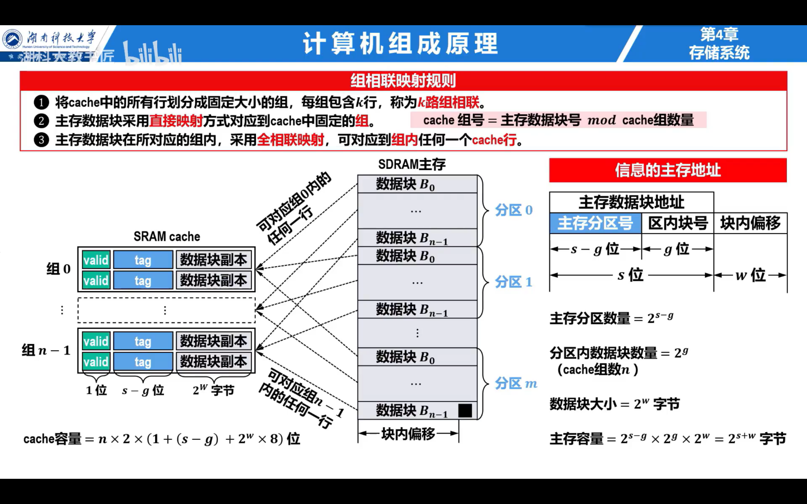

# 408 计算机组成原理大题专题总结

## 1. Cache

### 基础模型

- 层次化存储：寄存器 → Cache → 主存 → 磁盘
- Cache 原理：时间局部性、空间局部性
- 映射方式：直接映射、全相联、组相联
- 替换策略：FIFO、LRU、随机
- 写策略：写直达、写回



### 常考点

- **平均访问时间**：$T = H \cdot T_c + (1-H) \cdot T_m$
  - $H$：命中率
  - $T_c$：Cache 访问时间
  - $T_m$：主存访问时间

### 解题方法

1. 确认映射方式，分解地址字段（标记位 Tag、索引 Index、块内地址 Offset）。
2. 根据命中率计算平均访问时间或有效存储容量。
3. 遇到替换策略题，模拟访问序列逐步替换。

### 真题例题

一主存容量 64KB，Cache 容量 1KB，块大小 16B，采用直接映射。问：地址如何划分？

👉 思路：

- 主存块数 = $64KB / 16B = 4K$ 块。
- Cache 块数 = $1KB / 16B = 64$ 块。
- 索引位 = $\log_2 64 = 6$ 位。
- 块内地址 = $\log_2 16 = 4$ 位。
- 标记位 = 总地址位数 $16 - (6+4) = 6$ 位。

## 2. 虚拟存储器

### 基础模型

- 虚拟地址 → 页号 + 页内偏移
- 页表：实现虚拟地址到物理地址映射
- 快表（TLB）：加速页表查询
- 缺页中断：页不在内存时触发

### 常考点

- 有效访问时间：$T = (1-\alpha)(T_m+T_d) + \alpha(T_m)$
  - $\alpha$：TLB 命中率
  - $T_m$：内存访问时间
  - $T_d$：磁盘访问时间（缺页开销）
- 页表大小计算：页数 × 每项大小

### 解题方法

1. 写出地址结构（页号 + 页内偏移）。
2. 判断是否命中快表。
3. 根据缺页率计算平均访问时间。

### 真题例题

虚拟空间 4GB，页面大小 4KB，问：页表项数是多少？

👉 思路：

- 页面大小 = $2^{12}$ B → 页内偏移 = 12 位。
- 虚拟空间 4GB = $2^{32}$ B。
- 页数 = $2^{32-12} = 2^{20}$ 页 → 共 $2^{20} = 1M$ 个页表项。

## 3. 数据寻址与指令寻址

### 基础模型

- **数据寻址**：立即、直接、间接、寄存器、基址、变址
- **指令寻址**：顺序、条件转移、无条件转移、相对寻址

### 常考点

- 有效地址 EA 的计算：
   $EA = 基地址 + 偏移 + 寄存器内容$
- 相对寻址：$EA = (PC+1)+偏移$

### 解题方法

1. 写公式，带入操作数或 PC 值。
2. 跳转题：分情况 → 顺序 / 直接 / 相对。

### 真题例题

PC = 200H，指令 JZ +10H，零标志 = 1，问跳转后 PC =?

👉 思路：

- 取指后 PC = 201H。
- 相对寻址：目标 = 201H+10H = 211H。

## 4. 高级语言与机器语言的对应

### 基础模型

- 循环 → 条件转移 + 计数器
- 函数调用 → CALL、RET、栈帧

### 常考点

- 高级语言伪代码如何翻译成汇编序列
- 栈帧内容：参数、返回地址、局部变量

### 解题方法

1. 拆分控制结构（if、for、while）。
2. 匹配机器指令：循环 = 跳转，函数 = 压栈+跳转。
3. 栈变化画图辅助。

### 真题例题

```c
for(i = 0; i < 10; i++) sum += i;
```

👉 思路：

- MOV R0,0 → i = 0
- CMP R0,10 → 比较
- JGE Exit → 超过 10 跳出
- ADD sum, R0 → 累加
- INC R0 → i++
- JMP Loop → 回到循环

## 5. 数据通路的功能结构

### 基础模型

- **部件**：PC、IR、寄存器组、ALU、总线、存储器
- **过程**：数据在部件之间流动，由控制信号驱动

### 常考点

- 写出指令对应的微操作序列
- 取指、间址、执行、中断过程

### 解题方法

1. 拆成微操作：“源 → 目标”。
2. 注意控制信号：读/写、ALU 控制。

### 真题例题

执行 ADD R1, R2 的微操作？

👉 思路：

- 取指：PC→MAR，PC+1→PC，M [MAR] →IR
- 译码：确定 R1、R2
- 执行：R1+R2→ALU→R1

------

## 6. 指令流水线

### 基础模型

- 五段：取指、译码、执行、访存、写回
- 冒险：结构、数据、控制

### 常考点

- 吞吐率和加速比：
   $T = (k+n-1)\Delta t$
- 冒险解决方法：气泡、前递、预测

### 解题方法

1. 画二维表（时间 vs 指令）。
2. 遇冒险 → 插入气泡 / 说明解决办法。

### 真题例题

5 段流水线，10 条指令，每段 1ns，无冒险。总时间？

👉 思路：
 $T=(5+10-1)\times 1=14$ ns。

------

## 7. 中断与 DMA

### 基础模型

- 中断：CPU 被动响应 → 保存现场 → 处理 → 返回
- DMA：数据在 I/O 和内存间直接传输

### 常考点

- 中断优先级、嵌套
- 中断响应过程
- DMA 与中断区别

### 解题方法

1. 中断：按四步走（检测 → 响应 → 处理 → 返回）。
2. DMA：画出数据传输流程。

### 真题例题

DMA 与中断区别？

👉 思路：

- 中断：CPU 执行数据传输
- DMA：DMA 控制器执行，CPU 只发起请求

------

## 8. 计算机系统总线

### 基础模型

- 总线分类：数据、地址、控制
- 总线周期：仲裁、寻址、传输、结束

### 常考点

- 仲裁方式：集中式、分布式
- 总线带宽计算

### 解题方法

1. 带宽 = 总线宽度 × 传输频率
2. 仲裁题：画流程图说明优先级

### 真题例题

32 位数据总线，频率 50MHz，带宽？

👉 思路：
 带宽 = $32 \text{bit} \times 50\text{M}/s = 200 \text{MB/s}$。

------

## 9. 指令系统与控制方式

### 基础模型

- 控制器：硬布线、微程序
- 硬布线：逻辑电路直接生成控制信号
- 微程序：由微指令序列控制

### 常考点

- 硬布线 vs 微程序对比
- 下地址形成方式：顺序、断定

### 解题方法

1. 写出控制信号的来源
2. 对比两种控制方式：速度 vs 灵活性

### 真题例题

微程序控制器中，下地址如何形成？

👉 思路：

- 顺序法：下地址 = 当前地址+1
- 断定法：由机器指令类型决定下地址

------

## 10. 浮点数表示与运算

### 基础模型

- IEEE 754 单精度：1 位符号 + 8 位阶码 + 23 位尾数
- 双精度：1+11+52
- 对阶 → 尾数运算 → 规格化 → 舍入

### 常考点

- 浮点数范围与精度
- 加减运算步骤
- 溢出 / 下溢

### 解题方法

1. 先对阶（小阶向大阶对齐）
2. 尾数运算
3. 规格化
4. 判断溢出/下溢

### 真题例题

浮点数 $(-1)^s \times 1.M \times 2^{E-127}$，若阶码 = 10000001B，尾数 = 010000...，问数值？

👉 思路：

- 阶码 = 129 → $E=2$
- 尾数 = 1.01B = 1.25
- 数值 = $+1.25 \times 2^2=5$

