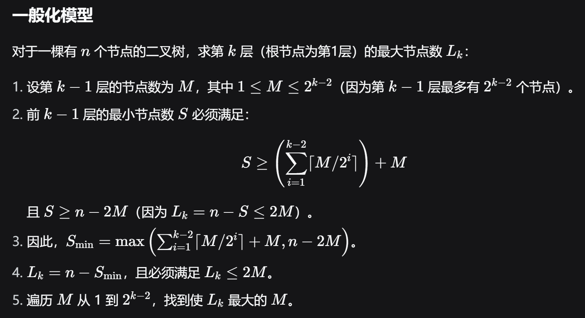
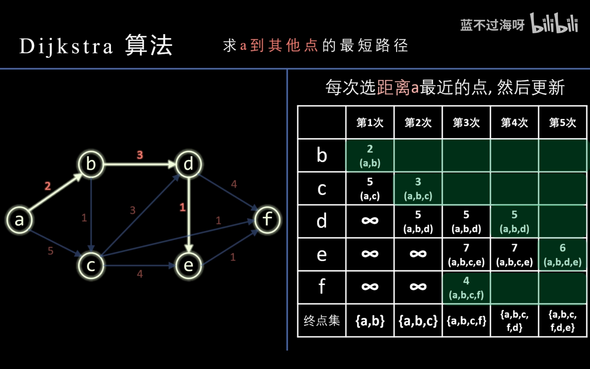
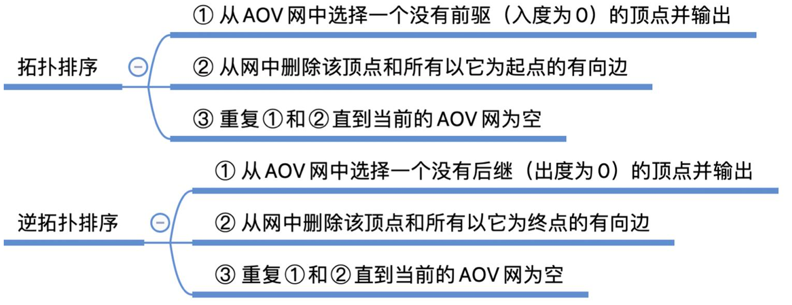
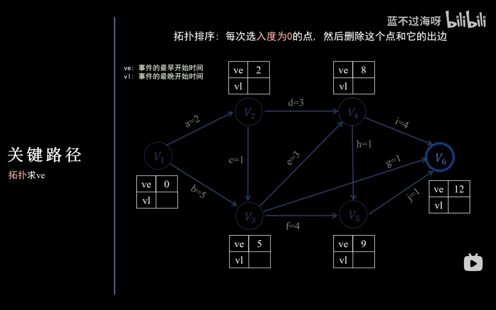
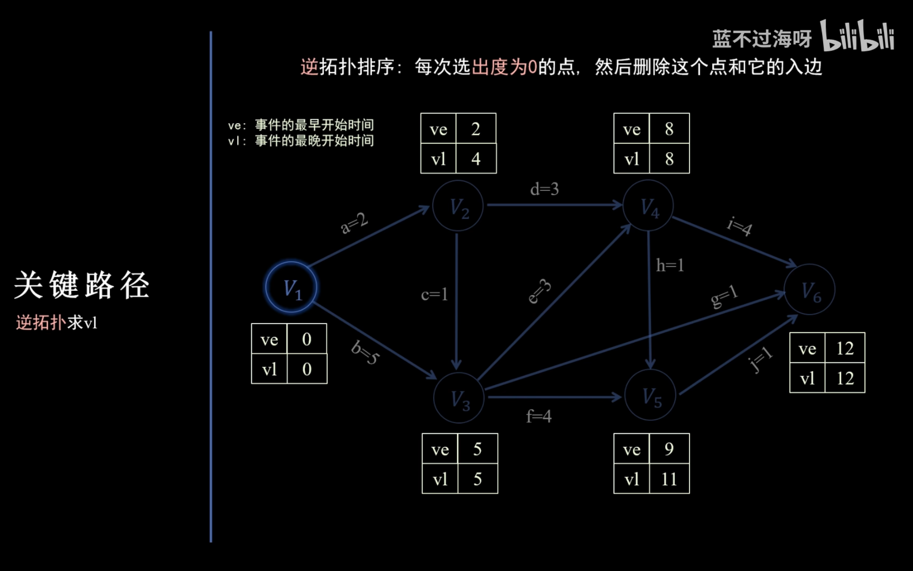
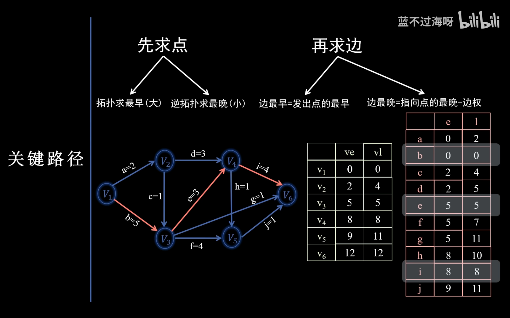
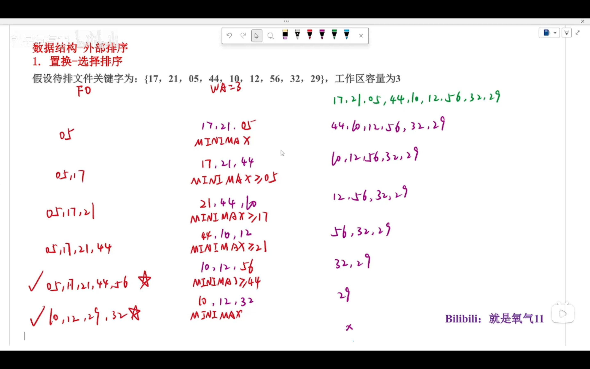
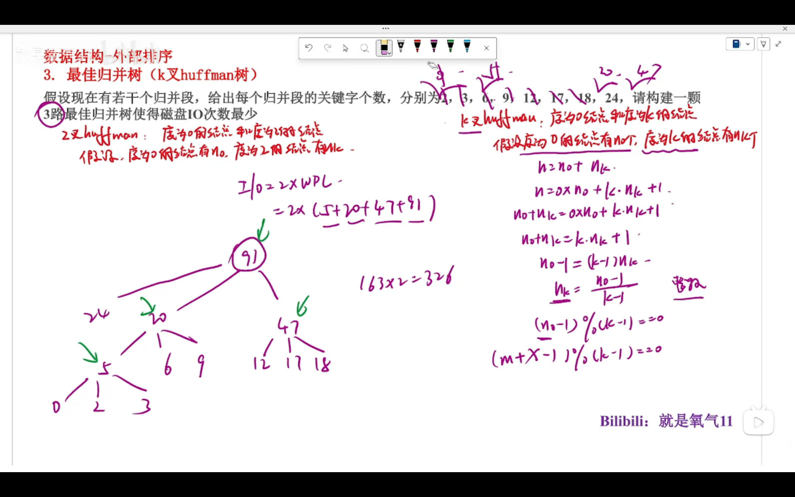
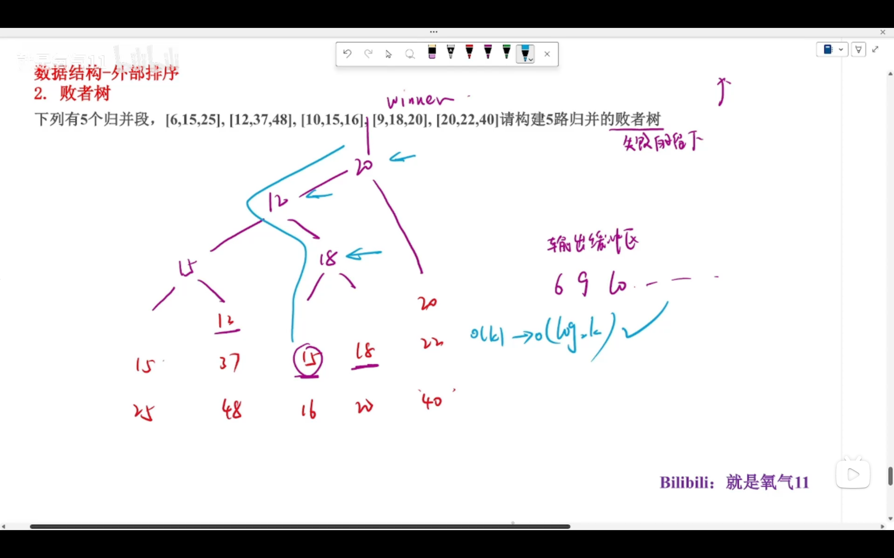

# **数据结构强化练习**

## “数组”的应用

### 对称矩阵的压缩存储

#### 1.1.1-6 对称阵推导

```shell
1 2 3 4 5
2 6 7 8 9
3 7 8 7 6 
4 8 7 5 4 
5 9 6 4 3

行优先: 1 / 2 6 / 3 7 8 / 4 8 7 5 / 5 9 6 4 3
列优先: 1 2 3 4 5 / 6 7 8 9 / 8 7 6 / 5 4 / 3
```

##### 行优先

**1-based**：对于 $a_{ij}$

* $i \ge j$ 时，设其对应一维数组下标为 $idx$（按王道书上定义，$idx$ 为 **0-based**）。显然 $a_{ij}$ 上方有 $i - 1$ 行，共有 $1 + 2 + \dots + (i - 1) = \cfrac{i(i - 1)}{2}$ 个元素，于是加上列偏移后 $idx = \cfrac{i(i - 1)}{2} + j - 1$
* $i \lt j$ 时，由于 $a_{ij} = a_{ji}$，故具有轮换对称性，即 $idx = \cfrac{j(j - 1)}{2} + i - 1$

**0-base**：令 $I = i - 1$，$J = j - 1$，则
$$
idx = \begin{cases}
\cfrac{(I + 1)I}{2} + J & I \ge J \\ 
\cfrac{(J + 1)J}{2} + I & I \lt J
\end{cases}
$$

##### 列优先

**1-based**：对于 $a_{ij}$

* $i \ge j$ 时，同理 $a_{ij}$ 前面有 $j - 1$ 列，共 $n + (n - 1) + \dots + (n - j + 2) = \cfrac{(2n - j + 2)(j - 1)}{2}$，从列首 $a_{jj}$ 开始计数，行偏移为 $i - j$，加上行偏移后 $idx = \cfrac{(2n - j + 2)(j - 1)}{2} + i - j$
* $i \lt j$ 时，由于 $a_{ij} = a_{ji}$，故具有轮换对称性，即 $idx = \cfrac{(2n - i + 2)(i - 1)}{2} + j - i$

**0-based**：令 $I = i - 1$，$J = j - 1$，则
$$
idx = \begin{cases}
\cfrac{(2n - J + 1)J}{2} + I - J & I \ge J \\ 
\cfrac{(2n - I + 1)I}{2} + J - I & I \lt J
\end{cases}
$$

#### 1.2.1-5 下三角矩阵推导

下三角矩阵跟对称阵 $i \ge j$ 的情况一致，$i \lt j$ 时为常量

#### 1.3.1-5 三对角矩阵推导

```shell
1 2 0 0 0
2 2 3 0 0
0 3 3 4 0
0 0 4 4 5
0 0 0 5 5 

行优先: 1 2 / 2 2 3 / 3 3 4 / 4 4 5 / 5 5
列优先: 1 2 / 2 2 3 / 3 3 4 / 4 4 5 / 5 5
```

##### 行优先

**1-based**：对于 $a_{ij}$

* $i \ne 1$ 时，前 $i - 1$ 行共有 $2 + 3(i - 2)$ 个元素，行偏移为 $j - i + 1$，则 $idx = 2 + 3(i - 2) + j - i + 1 = 2i + j - 3$
* $i = 1$ 时，显然 $idx = j - 1$
* 综上 $idx = 2i + j - 3$

##### 列优先

具有轮换对称性，即 $idx = 2j + i - 3$

## 串

### KMP 手算 next 数组


## 二叉树的性质

| 变量名 | 解释                        |
| ------ | --------------------------- |
| $n$    | 总节点数                    |
| $n_0$  | 度为 0 的节点数（叶子节点数） |
| $n_1$  | 度为 1 的节点数               |
| $n_2$  | 度为 2 的节点数               |
| $h$    | 树高                        |

### 一般二叉树

1. $n = n_0 + n_1 + n_2$
2. $n_0 = n_2 + 1$
3. $h \le n \le 2^h - 1$
4. 第 $k$ 层最多有 $2^{k - 1}$ 个节点

### 完全二叉树

树高 $h = \lceil \log_2{n + 1} \rceil$ 或 $\lfloor \log_2{n} \rfloor + 1$（两个公式总是给出相同的结果）

对完全二叉树按层序遍历顺序对节点依次编号 $1,2,\dots,n$，则有以下关系

1. 最后一个分支节点的编号为 $\lfloor n/2 \rfloor$，若 $i \le \lfloor n/2 \rfloor$ 则节点 $i$ 为分支节点，否则为叶结点
1. 节点 $i$ 所在层次（深度）为 $\lfloor \log_2{i} \rfloor + 1$（从根节点数起，1-based）
1. $i \gt 1$ 时，节点 $i$ 的父节点编号为 $\lfloor i/2 \rfloor$
1. 若节点 $i$ 有左右孩子，则左孩子编号为 $2i$，右孩子编号为 $2i + 1$

### 例题

**例 1：** 若一棵二叉树有 100 个节点，根节点为第 1 层，则第 7 层最多有多少节点？



```cpp
#include <bits/stdc++.h>

int main() {
    int n = 100, k = 7;
    int max_m = 1 << (k - 2);
    int max_lk = 0;
    for (int m = 1; m <= max_m; ++m) {
        int s = m;
        for (int i = 1; i <= k - 2; ++i) {
            s += ceil(1.0 * m / (1 << i));
        }
        int s_min = std::max(n - 2 * m, s);
        max_lk = std::max(max_lk, n - s_min);
    }
    std::cout << max_lk << std::endl;
}
```

## 树的性质

1. 树的节点数 $n$ 等于所有节点的度数之和加 $1$

2. 度为 $m$ 的树中第 $i$ 层上至多有 $m^{i - 1}$ 个节点（$i \ge 1$）

3. 高度为 $h$ 的 $m$ 叉树至多有 $1 + m + m^2 + \cdots + m^{h - 1} = \cfrac{m^h - 1}{m - 1}$

4. 度为 $m$，具有 $n$ 个节点的树的高度 $h$ 满足 $\lceil \log_m{(n(m - 1) + 1)} \rceil \le h \le n - m + 1$

6. 树的节点数为 $N$，度为 $i$ 的节点数为 $N_i$，则有
   $$
   N = \sum_{i = 1}^m iN_i + 1 = \sum_{i = 0}^m N_i = \sum_{i = 1}^m N_i + N_0 \\
   N_0 = \sum_{i - 2}^m (i - 1)N_i + 1
   $$

## 树（森林）的定义和画图

1. 对比：树的孩子表示法存储 v.s. 图的邻接表存储 v.s. 散列表的拉链法 v.s. 基数排序。你发现了什么？
   * 链表头指针组成一个线性表

## 并查集

```text
1. 调用init(5)后
fa = [0, 1, 2, 3, 4]
rk = [0, 0, 0, 0, 0]

0 (rk=0)  1 (rk=0)  2 (rk=0)  3 (rk=0)  4 (rk=0)

2. merge(0, 1);
fa = [1, 1, 2, 3, 4]
rk = [0, 1, 0, 0, 0]

1 (rk=1) 2 (rk=0)  3 (rk=0)  4 (rk=0)
|
0

3. merge(2, 3);
fa = [1, 1, 3, 3, 4]
rk = [0, 1, 0, 1, 0]

1 (rk=1)    3 (rk=1) 4 (rk=0)
|           |
0           2

4. merge(1, 2);
fa = [1, 3, 3, 3, 4]
rk = [0, 1, 0, 2, 0]

    3 (rk=2)   4 (rk=0)
   / \
  1   2
  |
  0

5. find(0);  // 触发路径压缩
fa = [3, 3, 3, 3, 4]  // 节点0直接指向3
rk = [0, 1, 0, 2, 0]  // 秩不变

      3 (rk=2) 4 (rk=0)
     /|\
    0 1 2

6. merge(3, 4)
fa = [3, 3, 3, 3, 3]
rk = [0, 1, 0, 2, 0]

      3 (rk=2)
     /|\ \
    0 1 2 4
```

## 二叉排序树、平衡二叉树

1. 左旋：顺时针旋转，冲突的右孩变左孩

   右旋：逆时针旋转，冲突的左孩变右孩


## 图的性质

### 概念

1. **结点数 (|V|)**：图中顶点的总数，通常记为 `n`

2. **边数 (|E|)**：图中边的总数，通常记为 `e`

3. **度数 (Degree)**：

   *   **无向图**：顶点 `v` 的度数 `deg(v)` 指与它相关联的边的条数

   *   **有向图**：
       *   **入度 (In-degree, id(v))**：以顶点 `v` 为终点的边的数目
       *   **出度 (Out-degree, od(v))**：以顶点 `v` 为起点的边的数目
       *   顶点 `v` 的总度数：`deg(v) = id(v) + od(v)`

4. **连通性 (Connectivity)**：

   *   **无向图**：如果图中任意两个顶点都是连通的（存在路径），则称该无向图是 **连通图**

   *   **有向图**：
       *   **强连通 (Strongly Connected)**：如果图中任意一对顶点 `v` 和 `w`，都存在从 `v` 到 `w` 和从 `w` 到 `v` 的路径，则称此有向图为 **强连通图**
       *   **弱连通 (Weakly Connected)**：如果忽略有向图所有边的方向后，其对应的无向图是连通的，则称该有向图为 **弱连通图**

### 度数与边数的关系

1. **无向图**
   *   **所有顶点的度数之和 = 2 × |E|**
   *   **公式**：$\sum_{i=1}^{n} deg(v_i) = 2e$
   *   **推论**：无向图中，所有顶点的度数之和必然是 **偶数**。因此，**度数为奇数的顶点必须有偶数个**（握手定理）
2. **有向图**
   *   **所有顶点的入度之和 = 所有顶点的出度之和 = |E|**
   *   **公式**：$\sum_{i=1}^{n} id(v_i) = \sum_{i=1}^{n} od(v_i) = e$
   *   **推论**：有向图中所有顶点的总度数（入度+出度）之和为 `2e`

### 连通性与边数的关系

1. **无向图**

   | 性质             | 最少边数 | 最多边数               | 说明                                                        |
   | :--------------- | :------- | :--------------------- | :---------------------------------------------------------- |
   | **任意无向图**   | 0        | $\frac{n(n-1)}{2}$     | 即完全图 $K_n$ 的边数                                       |
   | **连通无向图**   | **n-1**  | $\frac{n(n-1)}{2}$     | 最少边数的结构是 **树**。不连通则边数可少于 n-1             |
   | **非连通无向图** | 0        | $\frac{(n-1)(n-2)}{2}$ | 最多边的不连通图：由一个完全图 $K_{n-1}$ 和一个孤立顶点组成 |

   **推论**

   *   如果一个无向图有 `n` 个顶点、`e` 条边，且 $e < n-1$，则该图一定是 **非连通图**。
   *   要保证一个有 `n` 个顶点的无向图是 **连通** 的，至少需要 $\frac{(n-1)(n-2)}{2} + 1$ 条边。（即在最多边的不连通图上加一条边）

2. **有向图**

   | 性质             | 最少边数 | 最多边数   | 说明                                               |
   | :--------------- | :------- | :--------- | :------------------------------------------------- |
   | **任意有向图**   | 0        | **n(n-1)** | 即完全有向图（每个顶点都向其他所有顶点连边）的边数 |
   | **强连通有向图** | **n**    | **n(n-1)** | 最少边数的结构是一个 **有向环**                    |
   | **弱连通有向图** | **n-1**  | **n(n-1)** | 最少边数的结构是忽略方向后为一棵树的形状           |

3. **推论**

   * 一个有 `n` 个顶点的有向图要成为强连通图，**至少需要有 `n` 条边**（形成一个环）
   * 强连通图的要求远比连通无向图或弱连通有向图苛刻

### 常见考点总结

1.  **顶点数与度数**
    *   **无向图最大度数**：$\Delta(G) \leq n-1$
    *   **有向图最大出/入度**：$\Delta(od(v)), \Delta(id(v)) \leq n-1$

2.  **连通分支（Component）**
    *   一个无向图可以分为若干个 **连通子图**（极大连通子图称为连通分支）
    *   一个有向图可以分为若干个 **强连通分支**（极大强连通子图）
    *   **考点**：一个无向图有 `k` 个连通分支，则其 **最小边数** 为 `n - k`（即每个分支都是一棵树）

3.  **存储结构的影响**
    *   **邻接矩阵**：空间复杂度为 $O(n^2)$，与边数 `e` 无关。适用于 **稠密图**
    *   **邻接表**：空间复杂度为 $O(n+e)$。适用于 **稀疏图**

4.  **典型王道小题思路**
    *   **给出度数列，求最大可能顶点数/最小可能顶点数**：利用握手定理（$\sum deg(v) = 2e$）和最大度数 $\leq n-1$ 这两个约束条件来构造不等式
    *   **判断一个图是否可能存在**：检查是否满足握手定理（总和为偶数），或者是否存在某个顶点的度数大于等于 `n`（这不可能）
    *   **已知边数和顶点数，判断连通性**：比较 `e` 和 `n-1` 的关系。如果 `e < n-1`，则无向图必不连通
    *   **求最少加多少条边能使其连通/强连通**：先求出连通分支的数量 `k`，则需要加 `k-1` 条边才能使其连通（构造一个“生成树”连接所有分支）。对于有向图变为强连通，方法更复杂，通常需要分析分支间的拓扑关系

## 图的应用——最短路径

#### Dijkstra



#### bfs

bfs 只能求解无权图的最短路径，此时最短路径只取决于路径上边的个数

从一点开始 bfs，每遍历一层距离加 1，即可确定单源最短路径

## 图的应用——拓扑排序



### 有向无环图（DAG 图）压缩存储

1. 得到有向无环图拓扑序，根据图拓扑序重新对节点升序编号，这样所有边只能从编号小的顶点指向编号大的顶点，使用邻接矩阵表示即为上三角矩阵，可使用压缩存储
2. 判断顶点 $i$ 和顶点 $j$ 之间是否有边，按照上三角矩阵压缩存储的公式 $k = \cfrac{(i - 1)(2n - i + 2)}{2} + (j - i)$，求得一维数组映射下标，判断是否有值即可

## 图的应用——关键路径

1. 拓扑排序求 `ve`

   

2. 逆拓扑排序求 `vl`

   

3. 求边（活动）的 `e` 和 `l`

   

## 外部排序

采用归并的思想对磁盘元素进行排序，IO 次数为算法效率的衡量指标，对于长度为 $m$ 和 $n$ 的两个归并段，从读入输入缓冲区和从输出缓冲区写入磁盘所需总共的 IO 次数为 $2(m + n)$（可以画一棵归并树，节点值为归并段长度，总 IO 次数等于所有非叶子节点权重之和）

对这个流程可以从三个角度优化

1. 减少归并段个数，于是部分归并段元素个数增加（置换选择排序）
2. 选取最优归并顺序（最佳归并树 -`k叉huffman`）
3. k 个归并段进行合并，最少比较次数（败者树）

### 置换选择排序



### 最佳归并树

k 叉 `huffman` 树补充虚节点推导，设给定 $m$ 个初始归并段，需要补充 $x$ 个虚节点

树中度为 0 的节点个数为 $n_0$，度为 k 的节点个数为 $n_k$，于是
$$
n = n_0 + n_k = 0 \times n_0 + k \times n_k + 1 \\
n_k = \cfrac{n_0 - 1}{k - 1}
$$

对于 `huffman` 树，归并段的长度被放在叶结点上，于是 $n_0 = m$
要使 $n_k$ 为整数，考虑补充虚节点，使得 $(k - 1) | (m + x - 1)$，即可求出 $x$

确定了虚段的个数，添加 $x$ 个长度为 0 的归并段再重新构建 k 叉 `huffman` 树即可（注：虚拟节点权值是 0，对 `wpl` 无贡献）



### 败者树

第一步会比较所有选出胜者，之后的每一步只需要每次与父节点比较即可求出胜者，于是比较次数取决于败者树的深度，将每步比较次数 $O(k)$ 的合并优化为 $O(log_2{k})$



