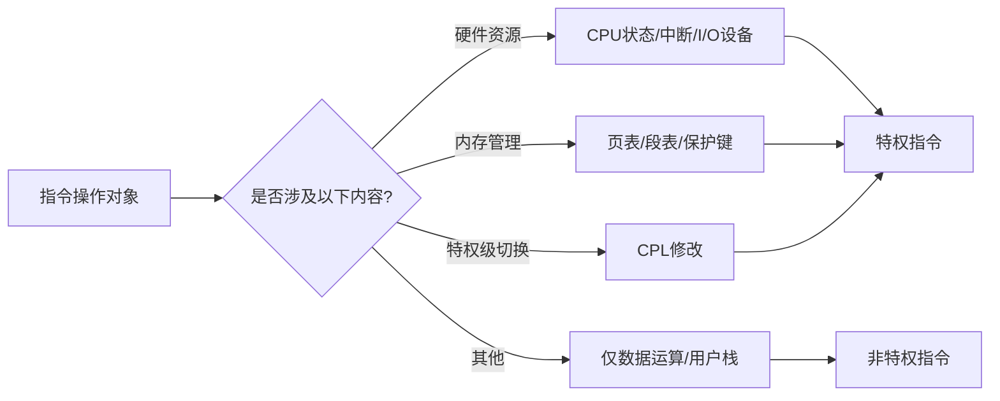
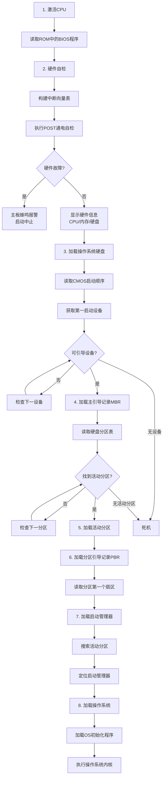
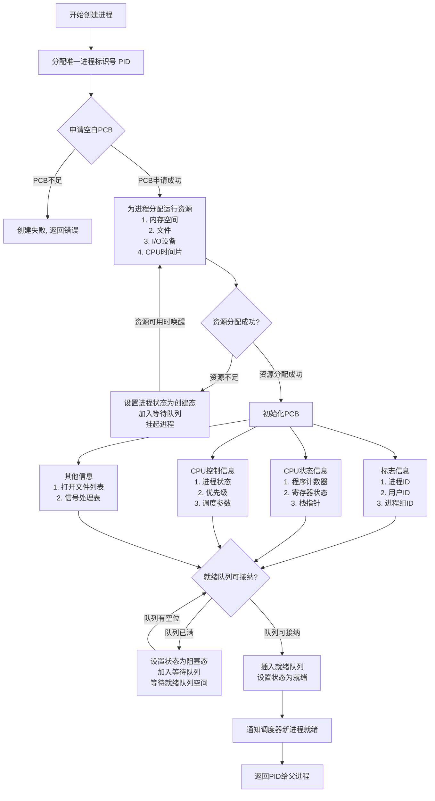
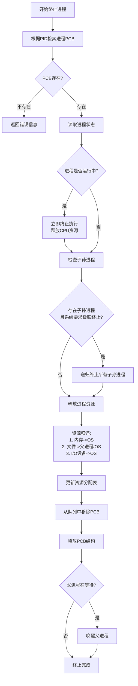

# **Operating System**

## 第 1 章 计算机系统概述

### OS 功能

1. 管理 **计算机资源**
2. 对上层服务提供接口
   * 命令接口
     * 联机命令接口（交互式命令接口）：cli
     * 脱机命令接口（批处理命令接口）：shell
   * 程序接口：系统调用（图形接口并非系统调用）
3. 对下层进行管理与隐藏

### OS 特征

1. **并发**：两个或多个事件在同一时间间隔内发生
2. **共享**：互斥共享（mutex）、同时访问（DMA）
3. 虚拟
4. 异步

### OS 发展进程

1. 手工操作阶段：无操作系统
2. 批处理阶段
   * 单道批处理：内存中仅有一道程序运行，CPU 需等待程序运行结束或异常后才能执行下一道程序
   * 多道批处理：作业调度程序维护作业队列，若一作业请求 IO，CPU 使用 **中断** 转去运行另一道程序
3. 分时操作系统：采用 **时间片** 轮转，让多个用户感觉自己独占一台计算机
4. 实时操作系统
   * 硬实时系统：飞控，某个特定的动作必须在规定的时间内完成
   * 软实时系统：飞机订票系统、银行管理系统，能接受偶尔违反时间规定且不会引起任何永久性的损害
5. 网络操作系统和分布式计算机系统：若干台计算机相互协同完成同一任务
6. 个人计算机操作系统

| 阶段                      | 描述                                                         | 优点                                                         | 缺点                                                         |
| ------------------------- | ------------------------------------------------------------ | ------------------------------------------------------------ | ------------------------------------------------------------ |
| **1. 手工操作阶段**       | 无操作系统，用户直接通过物理开关/纸带操作硬件                | 操作简单直接                                                 | 1. 用户独占全机资源 2. CPU 利用率极低 3. 人工操作速度慢，易出错 |
| **2. 单道批处理**         | 内存中仅驻留一道程序，CPU 需等待当前程序结束才能执行下一道程序 | 减少人工干预，提高 CPU 连续性                                | 1. I/O 操作时 CPU 空闲 2. 内存利用率低 3. 无法并行任务 |
| **2. 多道批处理**         | 作业调度程序管理队列，通过 **中断** 机制在程序 I/O 时切换运行其他程序 | 1. 提高 CPU/I/O 设备利用率 2. 系统吞吐量大 3. 支持多任务并行 | 1. 无交互能力 2. 作业响应时间长 3. 程序可能因资源竞争死锁 |
| **3. 分时操作系统**       | 采用 **时间片轮转** 调度，使多个用户通过终端共享主机资源     | 1. 用户交互性好 2. 公平分配资源 3. 多用户共享降低成本  | 1. 时间片切换开销大 2. 实时性弱 3. 复杂任务可能因时间片不足延迟 |
| **4. 硬实时系统**         | 严格时限要求（如飞控），必须在截止时间内完成动作             | 1. 高可靠性和可预测性 2. 关键任务零延迟处理              | 1. 资源分配严格 2. 开发成本高 3. 灵活性差            |
| **4. 软实时系统**         | 允许偶尔超时（如订票系统），超时不会导致永久损害             | 1. 兼顾实时性与通用性 2. 资源利用率较高                  | 1. 不保证绝对截止时间 2. 关键任务可能受影响              |
| **5. 网络操作系统**       | 多台计算机联网实现资源共享（如文件/打印机共享）              | 1. 资源集中管理 2. 扩展性强 3. 降低单点故障风险      | 1. 依赖网络稳定性 2. 数据安全风险高 3. 各节点独立性弱 |
| **5. 分布式计算机系统**   | 多台计算机协同完成同一任务，对用户透明（如集群计算）         | 1. 高性能并行处理 2. 高容错性 3. 负载均衡            | 1. 系统设计复杂 2. 通信开销大 3. 一致性维护困难      |
| **6. 个人计算机操作系统** | 为单用户设计的通用系统（如 Windows/macOS）                   | 1. 界面友好易用 2. 软硬件兼容性强 3. 支持丰富应用生态 | 1. 安全性相对较低 2. 资源规模有限 3. 不适合高并发场景 |

### 内核功能

1. 时钟管理
2. 中断机制
3. 原语：不可分割底层公用小程序
4. 系统控制的数据结构及处理

### 中断和异常

1. 中断（外中断）：来自 CPU 执行指令外部的事件（IO 中断、时钟中断（时间片到）等）
2. 异常（内中断）：来自 CPU 执行指令内部的事件（程序的非法操作码、地址越界、运算溢出、虚存缺页、陷入指令等）

* 中断处理程序属于操作系统程序

### 系统调用

1. 功能：设备管理/文件管理/进程控制/进程通信/内存管理
2. 用户程序按需提权，内核执行系统调用后返回用户态

3. 设备标识：用户程序对 IO 设备的请求采用逻辑设备名，而在程序实际执行时使用物理设备名

### 微内核

1. 基本功能
   * 进程（线程）管理
   * 低级存储器管理
   * 中断和陷入处理

### 外核（Exokernel）

1. 外核分配回收未经抽象（没有虚拟化或者说物理地址）的硬件资源

### 操作系统引导

1. 引导程序分为两种
   1. BIOS 的组成部分：位于 **ROM** 的自举程序，用于启动具体的设备
   2. 启动管理器：位于装有操作系统 **硬盘** 活动分区的引导扇区中的引导程序，用于引导操作系统

## 第 2 章 进程与线程

### 进程与线程

#### 进程的组成

1. 进程 = PCB + 程序 + 数据

   PCB 通常包含的内容

   | 进程描述信息      | 进程控制和管理信息 | 资源分配清单 | 处理计相关信息 |
   | ----------------- | ------------------ | ------------ | -------------- |
   | 进程标识符（PID） | 进程当前状态       | 代码段指针   | 通用寄存器值   |
   | 用户标识符（UID） | 进程优先级         | 数据段指针   | 地址寄存器值   |
   |                   | 代码运行入口地址   | 堆栈段指针   | 控制寄存器值   |
   |                   | 程序的外存地址     | 文件描述符   | 标志寄存器值   |
   |                   | 进入内存时间       | 键盘         | 状态字         |
   |                   | CPU 占用时间        | 鼠标         |                |
   |                   | 信号量使用         |              |                |

#### 进程的状态

#### 进程的创建

#### 进程的终止

#### 进程的通信

1. 共享存储：P/V 操作
2. 消息传递
3. 管道：互斥、同步、确定对方的存在
4. 信号：linux 中使用 `int` 状压 30 种信号。被阻塞（被屏蔽）的信号：某位为 1 代表进程忽略该信号

#### 线程

1. 用户级线程是 `代码逻辑` 的载体。内核级线程是 `运行机会` 的载体
2. 在 **纯粹的用户级线程模型** 中，一个用户线程执行阻塞操作会导致整个进程被内核阻塞，从而 **必然影响** 该进程中所有其他用户线程的运行，解决方案：
   * 使用多线程模型
   * 在用户级线程模型下，**严格避免阻塞式系统调用**，转而使用 **非阻塞/异步 I/O 编程模型**

### CPU 调度

## 第 3 章 内存管理

## 第 4 章 文件管理

## 第 5 章 输入/输出管理
