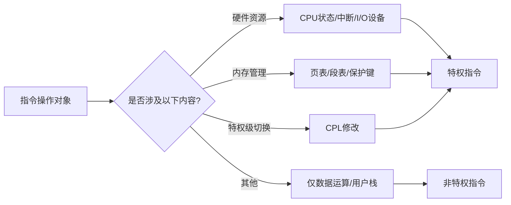
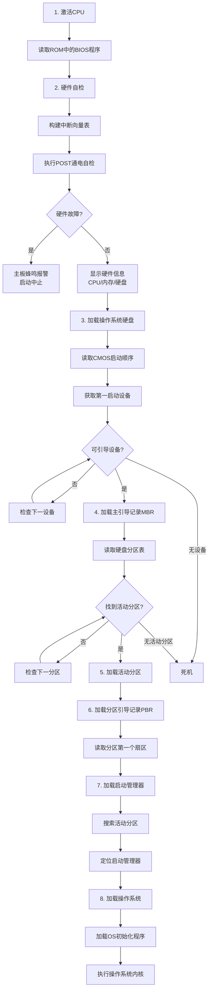
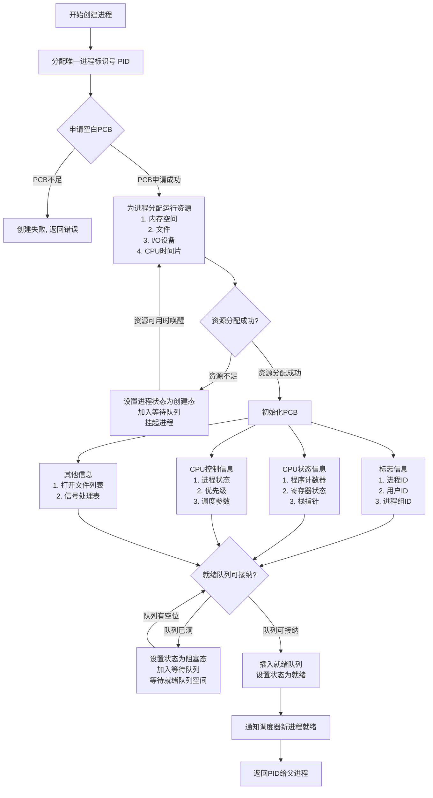
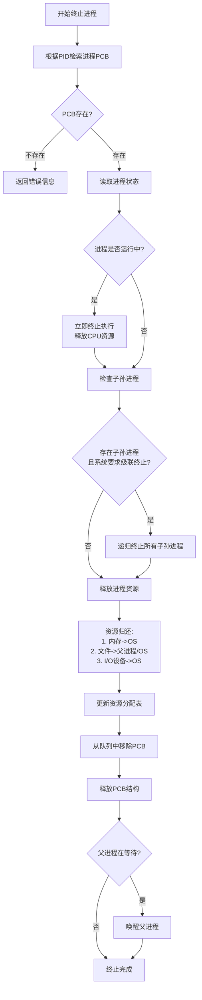
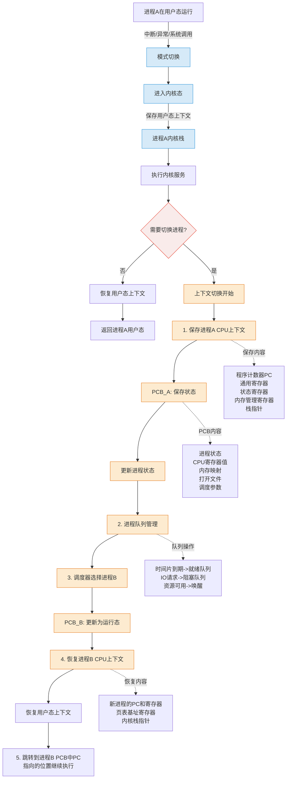

# **Operating System**

## 第 1 章 计算机系统概述

### OS 功能

1. 管理 **计算机资源**
2. 对上层服务提供接口
   * 命令接口
     * 联机命令接口（交互式命令接口）：cli
     * 脱机命令接口（批处理命令接口）：shell
   * 程序接口：系统调用（图形接口并非系统调用）
3. 对下层进行管理与隐藏

### OS 特征

1. **并发**：两个或多个事件在同一时间间隔内发生
2. **共享**：互斥共享（mutex）、同时访问（DMA）
3. 虚拟
4. 异步

### OS 发展进程

1. 手工操作阶段：无操作系统
2. 批处理阶段
   * 单道批处理：内存中仅有一道程序运行，CPU 需等待程序运行结束或异常后才能执行下一道程序
   * 多道批处理：作业调度程序维护作业队列，若一作业请求 IO，CPU 使用 **中断** 转去运行另一道程序
3. 分时操作系统：采用 **时间片** 轮转，让多个用户感觉自己独占一台计算机
4. 实时操作系统
   * 硬实时系统：飞控，某个特定的动作必须在规定的时间内完成
   * 软实时系统：飞机订票系统、银行管理系统，能接受偶尔违反时间规定且不会引起任何永久性的损害
5. 网络操作系统和分布式计算机系统：若干台计算机相互协同完成同一任务
6. 个人计算机操作系统

| 阶段                      | 描述                                                         | 优点                                                         | 缺点                                                         |
| ------------------------- | ------------------------------------------------------------ | ------------------------------------------------------------ | ------------------------------------------------------------ |
| **1. 手工操作阶段**       | 无操作系统，用户直接通过物理开关/纸带操作硬件                | 操作简单直接                                                 | 1. 用户独占全机资源 2. CPU 利用率极低 3. 人工操作速度慢，易出错 |
| **2. 单道批处理**         | 内存中仅驻留一道程序，CPU 需等待当前程序结束才能执行下一道程序 | 减少人工干预，提高 CPU 连续性                                | 1. I/O 操作时 CPU 空闲 2. 内存利用率低 3. 无法并行任务 |
| **2. 多道批处理**         | 作业调度程序管理队列，通过 **中断** 机制在程序 I/O 时切换运行其他程序 | 1. 提高 CPU/I/O 设备利用率 2. 系统吞吐量大 3. 支持多任务并行 | 1. 无交互能力 2. 作业响应时间长 3. 程序可能因资源竞争死锁 |
| **3. 分时操作系统**       | 采用 **时间片轮转** 调度，使多个用户通过终端共享主机资源     | 1. 用户交互性好 2. 公平分配资源 3. 多用户共享降低成本  | 1. 时间片切换开销大 2. 实时性弱 3. 复杂任务可能因时间片不足延迟 |
| **4. 硬实时系统**         | 严格时限要求（如飞控），必须在截止时间内完成动作             | 1. 高可靠性和可预测性 2. 关键任务零延迟处理              | 1. 资源分配严格 2. 开发成本高 3. 灵活性差            |
| **4. 软实时系统**         | 允许偶尔超时（如订票系统），超时不会导致永久损害             | 1. 兼顾实时性与通用性 2. 资源利用率较高                  | 1. 不保证绝对截止时间 2. 关键任务可能受影响              |
| **5. 网络操作系统**       | 多台计算机联网实现资源共享（如文件/打印机共享）              | 1. 资源集中管理 2. 扩展性强 3. 降低单点故障风险      | 1. 依赖网络稳定性 2. 数据安全风险高 3. 各节点独立性弱 |
| **5. 分布式计算机系统**   | 多台计算机协同完成同一任务，对用户透明（如集群计算）         | 1. 高性能并行处理 2. 高容错性 3. 负载均衡            | 1. 系统设计复杂 2. 通信开销大 3. 一致性维护困难      |
| **6. 个人计算机操作系统** | 为单用户设计的通用系统（如 Windows/macOS）                   | 1. 界面友好易用 2. 软硬件兼容性强 3. 支持丰富应用生态 | 1. 安全性相对较低 2. 资源规模有限 3. 不适合高并发场景 |

### 内核功能

1. 时钟管理
2. 中断机制
3. 原语：不可分割底层公用小程序
4. 系统控制的数据结构及处理

### 中断和异常

1. 中断（外中断）：来自 CPU 执行指令外部的事件（IO 中断、时钟中断（时间片到）等）
2. 异常（内中断）：来自 CPU 执行指令内部的事件（程序的非法操作码、地址越界、运算溢出、虚存缺页、陷入指令等）

* 中断处理程序属于操作系统程序

### 系统调用

1. 功能：设备管理/文件管理/进程控制/进程通信/内存管理
2. 用户程序按需提权，内核执行系统调用后返回用户态

3. 设备标识：用户程序对 IO 设备的请求采用逻辑设备名，而在程序实际执行时使用物理设备名

### 微内核

1. 基本功能
   * 进程（线程）管理
   * 低级存储器管理
   * 中断和陷入处理

### 外核（Exokernel）

1. 外核分配回收未经抽象（没有虚拟化或者说物理地址）的硬件资源

### 操作系统引导

1. 引导程序分为两种
   1. BIOS 的组成部分：位于 **ROM** 的自举程序，用于启动具体的设备
   2. 启动管理器：位于装有操作系统 **硬盘** 活动分区的引导扇区中的引导程序，用于引导操作系统

## 第 2 章 进程与线程

### 进程与线程

#### 进程的组成

1. 进程 = PCB + 程序 + 数据

   PCB 通常包含的内容

   | 进程描述信息      | 进程控制和管理信息 | 资源分配清单 | 处理计相关信息 |
   | ----------------- | ------------------ | ------------ | -------------- |
   | 进程标识符（PID） | 进程当前状态       | 代码段指针   | 通用寄存器值   |
   | 用户标识符（UID） | 进程优先级         | 数据段指针   | 地址寄存器值   |
   |                   | 代码运行入口地址   | 堆栈段指针   | 控制寄存器值   |
   |                   | 程序的外存地址     | 文件描述符   | 标志寄存器值   |
   |                   | 进入内存时间       | 键盘         | 状态字         |
   |                   | CPU 占用时间        | 鼠标         |                |
   |                   | 信号量使用         |              |                |

#### 进程的状态

#### 进程的创建

#### 进程的终止

#### 进程的通信

1. 共享存储：P/V 操作
2. 消息传递
3. 管道：互斥、同步、确定对方的存在
4. 信号：linux 中使用 `int` 状压 30 种信号。被阻塞（被屏蔽）的信号：某位为 1 代表进程忽略该信号

#### 线程

1. 用户级线程是 `代码逻辑` 的载体。内核级线程是 `运行机会` 的载体
2. 在 **纯粹的用户级线程模型** 中，一个用户线程执行阻塞操作会导致整个进程被内核阻塞，从而 **必然影响** 该进程中所有其他用户线程的运行，解决方案：
   * 使用多线程模型
   * 在用户级线程模型下，**严格避免阻塞式系统调用**，转而使用 **非阻塞/异步 I/O 编程模型**

### CPU 调度

#### 调度的概念

|                          | 要做什么                                                     | 调度发生在...                     | 发生频率 | 对进程状态的影响                                           |
| ------------------------ | ------------------------------------------------------------ | --------------------------------- | -------- | ---------------------------------------------------------- |
| 高级调度（**作业调度**） | 按照某种规则，从后备队列中选择合适的作业将其调入内存，并为其创建线程 | 外存 $\rightarrow$ 内存（面向作业） | 最低     | 无 $\rightarrow$ 创建态 $\rightarrow$ 就绪态                   |
| 中级调度（**内存调度**） | 按照某种规则，从挂起队列中选择合适的进程将其数据调回内存     | 外存 $\rightarrow$ 内存（面向进程） | 中等     | 挂起态 $\rightarrow$ 就绪态（阻塞挂起 $\rightarrow$ 就绪挂起） |
| 低级调度（**进程调度**） | 按照某种规则，从就绪队列中选择一个进程为其分配处理机         | 内存 $\rightarrow$ CPU              | 最高     | 就绪态 $\rightarrow$ 运行态                                  |

#### 七状态模型

#### 进程调度的时机、切换和过程

#### 调度算法的评价指标

1. CPU 利用率：$利用率 = \frac{忙碌的时间}{总时间}$
2. 系统吞吐量：单位时间内完成作业的数量，$系统吞吐量 = \frac{总共完成多少道作业}{总共花了多少时间}$
3. 周转时间：**作业被提交给系统** 开始，到 **作业完成为止** 的这段时间间隔
   * $（作业）周转时间 = 作业完成时间 - 作业提交时间$
   * $平均周转时间 = \cfrac{各作业周转时间之和}{作业数}$
   * $带权周转时间 = \cfrac{作业周转时间}{作业实际运行的时间} = \cfrac{作业完成时间 - 作业提交时间}{作业实际运行的时间}$
   * $平均带权周转时间 = \cfrac{各作业周转时间之和}{作业数}$
4. 等待时间：进程/作业处于等待处理机状态的时间之和，等待时间越长，用户满意度越低
   * 对于进程，等待时间是指进程建立后等待被服务的时间之和，在等待 IO 完成的期间其实进程也是被服务的，所以不计入等待时间
   * 对于作业，不仅要考虑建立进程后的等待时间，还要加上作业在外存后备队列中的等待时间
   * 没有 IO 操作的进程：$等待时间 = 周转时间 - 运行时间$
   * 有 IO 操作的进程：$等待时间 = 周转时间 - 运行时间 - IO操作时间$
5. 响应时间：从用户提交请求到首次产生响应所用的时间

>1. 带权周转时间必然 $\ge 1$
>2. 带权周转时间与周转时间都是越小越好

#### 进程切换

#### CPU 调度算法

| 算法                  | 思想&规则 | 可抢占？                                                     | 优点                       | 缺点                                                 | 考虑到等待时间&运行时间？             | 会导致饥饿？ |
| --------------------- | --------- | ------------------------------------------------------------ | -------------------------- | ---------------------------------------------------- | ------------------------------------- | ------------ |
| FCFS （先来先服务） | 严格按进程到达顺序执行，先到先服务 | 非抢占式                                                     | 公平：实现简单             | 对短作业不利                                         | 等待时间&#x2714; 运行时间&#x2716;  | 不会         |
| SJF/SPF （短作业优先） | 优先执行预计运行时间最短的进程 | 默认为非抢占式，也有 SJF 的抢占式版本最短剩余时间优先算法（SRTN） | "最短的" 平均等待和周转时间 | 对长作业不利，可能导致饥饿；难以做到真正的短作业优先 | 等待时间&#x2716; 运行时间&#x2714; | 会 |
| HRRN （高响应比优先） | 选择 $\frac{等待时间 + 运行时间}{运行时间}$ 比值最高的进程 | 非抢占式 | 上述两种算法的权衡折中，综合考虑等待时间和运行时间 |                                                      | 等待时间&#x2714; 运行时间&#x2714; | 不会 |

* 以上三种算法适合用于早期的批处理系统，交互性很糟糕

| 算法                      | 思想&规则                                                    | 可抢占？                                     | 优点                                                         | 缺点                               | 会导致饥饿？ | 补充                                                         |
| ------------------------- | ------------------------------------------------------------ | -------------------------------------------- | ------------------------------------------------------------ | ---------------------------------- | ------------ | ------------------------------------------------------------ |
| RR （时间片轮转）      | 将 CPU 时间划分为固定大小的时间片，按 FCFS 顺序轮流执行各进程 | 抢占式                                       | 响应快、公平性强，保证所有进程获得执行机会（如分时系统）     | 频繁切换有开销，不区分优先级       | 不会         | 时间片影响：   1. 过大：退化为 FCFS 2. 过小：上下文切换开销剧增 |
| PS （优先级调度）     | 根据预设优先级分配 CPU，高优先级进程优先执行                 | 有抢占式的，也有非抢占式的。注意做题时的区别 | 灵活适配不同场景需求（如实时系统）                           | 可能导致饥饿                       | 会           | 优先级设置： 1. 系统进程 > 交互进程 > 批处理进程 2. 动态调整：根据等待时间/执行历史调整 |
| MLFQ （多级反馈队列） | 多队列分级调度： 1. 新进程入最高优先级队列 2. 时间片用完未完成则降级 3. 仅当上级队列空才执行下级 | 抢占式                                       | 综合优势： 1. 短作业优先（高层队列快速完成） 2. 自适应调整优先级 | 一般不说它有缺点，不过可能导致饥饿 | 会           | 防饥饿机制： 1. 底层队列可采用 FCFS 保证长作业执行 2. 可设置等待时间阈值提升优先级 |

* 以上三种算法适合用于交互式系统

**多级队列调度算法**

系统中按照进程类型设置多个队列，进程创建成功后插入某个队列

* 各队列可采取固定优先级，或时间片划分
  * 固定优先级：高优先级空时低优先级进程才能被调度
  * 时间片划分：如三个队列分配时间 $50\%$、$40\%$、$10\%$

* 各队列可采用不同的调度策略，例如
  * 系统进程队列采用优先级调度
  * 交互式队列采用 RR
  * 批处理队列采用 FCFS

>* 调度算法准则：
>
>* 面向用户准则：
> 1. 周转时间短
> 2. 响应速度快
> 3. 截止时间有保证
>
>* 面向系统的准则：
> 1. 系统吞吐量高
> 2. 处理机利用率好（CPU 有效忙起来哈）
> 3. 各类资源平衡利用（大中形系统，cpu，内存，外存，IO，不能某项资源过多忙碌也不能某项资源过多空闲。微型系统这个指标不重要）
>
>* **注：第一个进入就绪队列的进程也会触发一次进程调度**
>* CPU 繁忙型作业：长时间占用 CPU，不使用 IO，类似于长作业
>* IO 繁忙型作业：频繁调用 IO，频繁放弃 CPU，占用 CPU 时间不会太长
>

**例题 [2018 真题]**：某系统采用基于优先权的非抢占式进程调度策略，完成一次进程调度和进程切换的系统时间开销为 $1\mu s$。在 $T$ 时刻就绪队列中有 3 个进程 $P_1$、$P_2$ 和 $P_3$，其参数如下：

| 进程名 | 等待时间  | 需要的 CPU 时间 | 优先权 |
| ------ | --------- | --------------- | ------ |
| $P_1$  | $30\mu s$ | $12\mu s$       | 10     |
| $P_2$  | $15\mu s$ | $24\mu s$       | 30     |
| $P_3$  | $18\mu s$ | $36\mu s$       | 20     |

若优先权值大的进程优先获得 CPU（优先权 30 > 20 > 10），从 $T$ 时刻起系统开始进程调度，则系统的平均周转时间为（ ）。  
A. $54\mu s$  	B. $73\mu s$ 	 C. $74\mu s$ 	D. $75\mu s$

**解答**

这个题坑就坑在到达时间需要推导（**这里是重点，以后遇到等待时间要注意**）

- $P_1$ 到达时间 = $T - 30\mu s$  
- $P_2$ 到达时间 = $T - 15\mu s$  
- $P_3$ 到达时间 = $T - 18\mu s$

#### 多处理机调度

## 第 3 章 内存管理

## 第 4 章 文件管理

## 第 5 章 输入/输出管理
