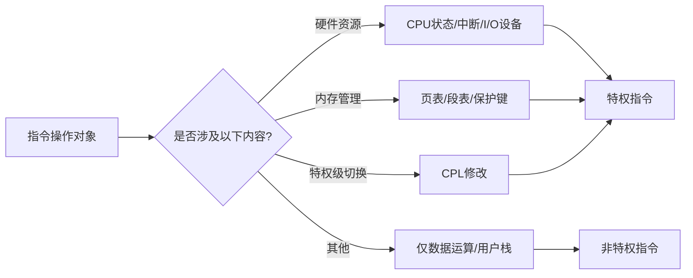
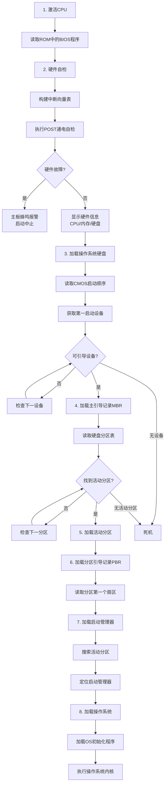
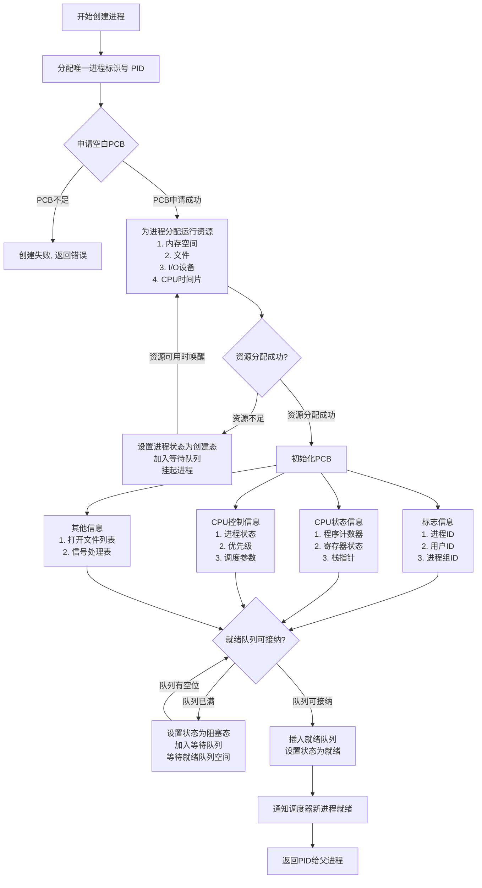
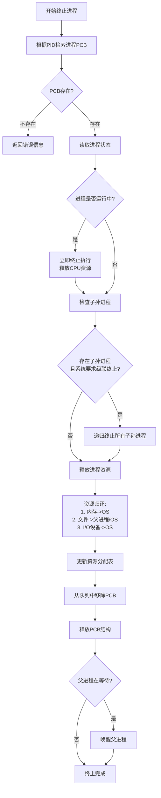
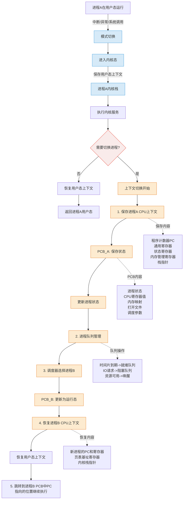
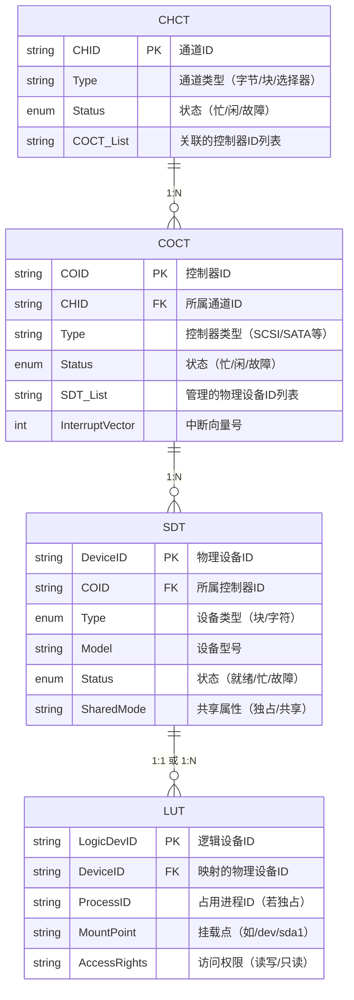

# **Operating System**

## 第 1 章 计算机系统概述

### OS 功能

1. 管理 **计算机资源**
2. 对上层服务提供接口
   * 命令接口
     * 联机命令接口（交互式命令接口）：cli
     * 脱机命令接口（批处理命令接口）：shell
   * 程序接口：系统调用（图形接口并非系统调用）
3. 对下层进行管理与隐藏

### OS 特征

1. **并发**：两个或多个事件在同一时间间隔内发生
2. **共享**：互斥共享（mutex）、同时访问（DMA）
3. 虚拟
4. 异步

### OS 发展进程

1. 手工操作阶段：无操作系统
2. 批处理阶段
   * 单道批处理：内存中仅有一道程序运行，CPU 需等待程序运行结束或异常后才能执行下一道程序
   * 多道批处理：作业调度程序维护作业队列，若一作业请求 IO，CPU 使用 **中断** 转去运行另一道程序
3. 分时操作系统：采用 **时间片** 轮转，让多个用户感觉自己独占一台计算机
4. 实时操作系统
   * 硬实时系统：飞控，某个特定的动作必须在规定的时间内完成
   * 软实时系统：飞机订票系统、银行管理系统，能接受偶尔违反时间规定且不会引起任何永久性的损害
5. 网络操作系统和分布式计算机系统：若干台计算机相互协同完成同一任务
6. 个人计算机操作系统

| 阶段                      | 描述                                                         | 优点                                                         | 缺点                                                         |
| ------------------------- | ------------------------------------------------------------ | ------------------------------------------------------------ | ------------------------------------------------------------ |
| **1. 手工操作阶段**       | 无操作系统，用户直接通过物理开关/纸带操作硬件                | 操作简单直接                                                 | 1. 用户独占全机资源<br/>2. CPU 利用率极低<br/>3. 人工操作速度慢，易出错 |
| **2. 单道批处理**         | 内存中仅驻留一道程序，CPU 需等待当前程序结束才能执行下一道程序 | 减少人工干预，提高 CPU 连续性                                | 1. I/O 操作时 CPU 空闲<br/>2. 内存利用率低<br/>3. 无法并行任务 |
| **2. 多道批处理**         | 作业调度程序管理队列，通过 **中断** 机制在程序 I/O 时切换运行其他程序 | 1. 提高 CPU/I/O 设备利用率<br>2. 系统吞吐量大<br>3. 支持多任务并行 | 1. 无交互能力<br>2. 作业响应时间长<br>3. 程序可能因资源竞争死锁 |
| **3. 分时操作系统**       | 采用 **时间片轮转** 调度，使多个用户通过终端共享主机资源     | 1. 用户交互性好<br>2. 公平分配资源<br>3. 多用户共享降低成本  | 1. 时间片切换开销大<br/>2. 实时性弱<br/>3. 复杂任务可能因时间片不足延迟 |
| **4. 硬实时系统**         | 严格时限要求（如飞控），必须在截止时间内完成动作             | 1. 高可靠性和可预测性<br/>2. 关键任务零延迟处理              | 1. 资源分配严格<br/>2. 开发成本高<br/>3. 灵活性差            |
| **4. 软实时系统**         | 允许偶尔超时（如订票系统），超时不会导致永久损害             | 1. 兼顾实时性与通用性<br/>2. 资源利用率较高                  | 1. 不保证绝对截止时间<br/>2. 关键任务可能受影响              |
| **5. 网络操作系统**       | 多台计算机联网实现资源共享（如文件/打印机共享）              | 1. 资源集中管理<br/>2. 扩展性强<br/>3. 降低单点故障风险      | 1. 依赖网络稳定性<br/>2. 数据安全风险高<br/>3. 各节点独立性弱 |
| **5. 分布式计算机系统**   | 多台计算机协同完成同一任务，对用户透明（如集群计算）         | 1. 高性能并行处理<br/>2. 高容错性<br/>3. 负载均衡            | 1. 系统设计复杂<br/>2. 通信开销大<br/>3. 一致性维护困难      |
| **6. 个人计算机操作系统** | 为单用户设计的通用系统（如 Windows/macOS）                   | 1. 界面友好易用<br/>2. 软硬件兼容性强<br/>3. 支持丰富应用生态 | 1. 安全性相对较低<br/>2. 资源规模有限<br/>3. 不适合高并发场景 |

### 内核功能

1. 时钟管理
2. 中断机制
3. 原语：不可分割底层公用小程序
4. 系统控制的数据结构及处理

### 中断和异常

1. 中断（外中断）：来自 CPU 执行指令外部的事件（IO 中断、时钟中断（时间片到）等）
2. 异常（内中断）：来自 CPU 执行指令内部的事件（程序的非法操作码、地址越界、运算溢出、虚存缺页、陷入指令等）


* 中断处理程序属于操作系统程序

### 系统调用

1. 功能：设备管理/文件管理/进程控制/进程通信/内存管理
2. 用户程序按需提权，内核执行系统调用后返回用户态



3. 设备标识：用户程序对 IO 设备的请求采用逻辑设备名，而在程序实际执行时使用物理设备名

### 微内核

1. 基本功能
   * 进程（线程）管理
   * 低级存储器管理
   * 中断和陷入处理

### 外核（Exokernel）

1. 外核分配回收未经抽象（没有虚拟化或者说物理地址）的硬件资源

### 操作系统引导

1. 引导程序分为两种
   1. BIOS 的组成部分：位于 **ROM** 的自举程序，用于启动具体的设备
   2. 启动管理器：位于装有操作系统 **硬盘** 活动分区的引导扇区中的引导程序，用于引导操作系统



## 第 2 章 进程与线程

### 进程与线程

#### 进程的组成

1. 进程 = PCB + 程序 + 数据

   PCB 通常包含的内容

   | 进程描述信息      | 进程控制和管理信息 | 资源分配清单 | 处理计相关信息 |
   | ----------------- | ------------------ | ------------ | -------------- |
   | 进程标识符（PID） | 进程当前状态       | 代码段指针   | 通用寄存器值   |
   | 用户标识符（UID） | 进程优先级         | 数据段指针   | 地址寄存器值   |
   |                   | 代码运行入口地址   | 堆栈段指针   | 控制寄存器值   |
   |                   | 程序的外存地址     | 文件描述符   | 标志寄存器值   |
   |                   | 进入内存时间       | 键盘         | 状态字         |
   |                   | CPU 占用时间        | 鼠标         |                |
   |                   | 信号量使用         |              |                |

#### 进程的状态


#### 进程的创建



#### 进程的终止



#### 进程的通信

1. 共享存储：P/V 操作
2. 消息传递
3. 管道：互斥、同步、确定对方的存在
4. 信号：linux 中使用 `int` 状压 30 种信号。被阻塞（被屏蔽）的信号：某位为 1 代表进程忽略该信号

#### 线程

1. 用户级线程是 `代码逻辑` 的载体。内核级线程是 `运行机会` 的载体
2. 在 **纯粹的用户级线程模型** 中，一个用户线程执行阻塞操作会导致整个进程被内核阻塞，从而 **必然影响** 该进程中所有其他用户线程的运行，解决方案：
   * 使用多线程模型
   * 在用户级线程模型下，**严格避免阻塞式系统调用**，转而使用 **非阻塞/异步 I/O 编程模型**


### CPU 调度

#### 调度的概念

|                          | 要做什么                                                     | 调度发生在...                     | 发生频率 | 对进程状态的影响                                           |
| ------------------------ | ------------------------------------------------------------ | --------------------------------- | -------- | ---------------------------------------------------------- |
| 高级调度（**作业调度**） | 按照某种规则，从后备队列中选择合适的作业将其调入内存，并为其创建线程 | 外存 $\rightarrow$ 内存（面向作业） | 最低     | 无 $\rightarrow$ 创建态 $\rightarrow$ 就绪态                   |
| 中级调度（**内存调度**） | 按照某种规则，从挂起队列中选择合适的进程将其数据调回内存     | 外存 $\rightarrow$ 内存（面向进程） | 中等     | 挂起态 $\rightarrow$ 就绪态（阻塞挂起 $\rightarrow$ 就绪挂起） |
| 低级调度（**进程调度**） | 按照某种规则，从就绪队列中选择一个进程为其分配处理机         | 内存 $\rightarrow$ CPU              | 最高     | 就绪态 $\rightarrow$ 运行态                                  |

#### 七状态模型


#### 进程调度的时机、切换和过程


#### 调度算法的评价指标

1. CPU 利用率：$利用率 = \frac{忙碌的时间}{总时间}$
2. 系统吞吐量：单位时间内完成作业的数量，$系统吞吐量 = \frac{总共完成多少道作业}{总共花了多少时间}$
3. 周转时间：**作业被提交给系统** 开始，到 **作业完成为止** 的这段时间间隔
   * $（作业）周转时间 = 作业完成时间 - 作业提交时间$
   * $平均周转时间 = \cfrac{各作业周转时间之和}{作业数}$
   * $带权周转时间 = \cfrac{作业周转时间}{作业实际运行的时间} = \cfrac{作业完成时间 - 作业提交时间}{作业实际运行的时间}$
   * $平均带权周转时间 = \cfrac{各作业周转时间之和}{作业数}$
4. 等待时间：进程/作业处于等待处理机状态的时间之和，等待时间越长，用户满意度越低
   * 对于进程，等待时间是指进程建立后等待被服务的时间之和，在等待 IO 完成的期间其实进程也是被服务的，所以不计入等待时间
   * 对于作业，不仅要考虑建立进程后的等待时间，还要加上作业在外存后备队列中的等待时间
   * 没有 IO 操作的进程：$等待时间 = 周转时间 - 运行时间$
   * 有 IO 操作的进程：$等待时间 = 周转时间 - 运行时间 - IO操作时间$
5. 响应时间：从用户提交请求到首次产生响应所用的时间

>1. 带权周转时间必然 $\ge 1$
>2. 带权周转时间与周转时间都是越小越好

#### 进程切换



#### CPU 调度算法

| 算法                  | 思想&规则 | 可抢占？                                                     | 优点                       | 缺点                                                 | 考虑到等待时间&运行时间？             | 会导致饥饿？ |
| --------------------- | --------- | ------------------------------------------------------------ | -------------------------- | ---------------------------------------------------- | ------------------------------------- | ------------ |
| FCFS<br/>（先来先服务） | 严格按进程到达顺序执行，先到先服务 | 非抢占式                                                     | 公平：实现简单             | 对短作业不利                                         | 等待时间&#x2714;<br>运行时间&#x2716;  | 不会         |
| SJF/SPF<br/>（短作业优先） | 优先执行预计运行时间最短的进程 | 默认为非抢占式，也有 SJF 的抢占式版本最短剩余时间优先算法（SRTN） | "最短的" 平均等待和周转时间 | 对长作业不利，可能导致饥饿；难以做到真正的短作业优先 | 等待时间&#x2716;<br/>运行时间&#x2714; | 会 |
| HRRN<br/>（高响应比优先） | 选择 $\frac{等待时间 + 运行时间}{运行时间}$ 比值最高的进程 | 非抢占式 | 上述两种算法的权衡折中，综合考虑等待时间和运行时间 |                                                      | 等待时间&#x2714;<br/>运行时间&#x2714; | 不会 |

* 以上三种算法适合用于早期的批处理系统，交互性很糟糕

| 算法                      | 思想&规则                                                    | 可抢占？                                     | 优点                                                         | 缺点                               | 会导致饥饿？ | 补充                                                         |
| ------------------------- | ------------------------------------------------------------ | -------------------------------------------- | ------------------------------------------------------------ | ---------------------------------- | ------------ | ------------------------------------------------------------ |
| RR<br>（时间片轮转）      | 将 CPU 时间划分为固定大小的时间片，按 FCFS 顺序轮流执行各进程 | 抢占式                                       | 响应快、公平性强，保证所有进程获得执行机会（如分时系统）     | 频繁切换有开销，不区分优先级       | 不会         | 时间片影响：  <br>1. 过大：退化为 FCFS<br>2. 过小：上下文切换开销剧增 |
| PS<br/>（优先级调度）     | 根据预设优先级分配 CPU，高优先级进程优先执行                 | 有抢占式的，也有非抢占式的。注意做题时的区别 | 灵活适配不同场景需求（如实时系统）                           | 可能导致饥饿                       | 会           | 优先级设置：<br>1. 系统进程 > 交互进程 > 批处理进程<br>2. 动态调整：根据等待时间/执行历史调整 |
| MLFQ<br/>（多级反馈队列） | 多队列分级调度：<br/>1. 新进程入最高优先级队列<br/>2. 时间片用完未完成则降级<br/>3. 仅当上级队列空才执行下级 | 抢占式                                       | 综合优势：<br/>1. 短作业优先（高层队列快速完成）<br/>2. 自适应调整优先级 | 一般不说它有缺点，不过可能导致饥饿 | 会           | 防饥饿机制：<br>1. 底层队列可采用 FCFS 保证长作业执行<br>2. 可设置等待时间阈值提升优先级 |

* 以上三种算法适合用于交互式系统

**多级队列调度算法**

系统中按照进程类型设置多个队列，进程创建成功后插入某个队列

* 各队列可采取固定优先级，或时间片划分
  * 固定优先级：高优先级空时低优先级进程才能被调度
  * 时间片划分：如三个队列分配时间 $50\%$、$40\%$、$10\%$

* 各队列可采用不同的调度策略，例如
  * 系统进程队列采用优先级调度
  * 交互式队列采用 RR
  * 批处理队列采用 FCFS

>* 调度算法准则：
>
>* 面向用户准则：
> 1. 周转时间短
> 2. 响应速度快
> 3. 截止时间有保证
>
>* 面向系统的准则：
> 1. 系统吞吐量高
> 2. 处理机利用率好（CPU 有效忙起来哈）
> 3. 各类资源平衡利用（大中形系统，cpu，内存，外存，IO，不能某项资源过多忙碌也不能某项资源过多空闲。微型系统这个指标不重要）
>
>* **注：第一个进入就绪队列的进程也会触发一次进程调度**
>* CPU 繁忙型作业：长时间占用 CPU，不使用 IO，类似于长作业
>* IO 繁忙型作业：频繁调用 IO，频繁放弃 CPU，占用 CPU 时间不会太长
>

**例题 [2018 真题]**：某系统采用基于优先权的非抢占式进程调度策略，完成一次进程调度和进程切换的系统时间开销为 $1\mu s$。在 $T$ 时刻就绪队列中有 3 个进程 $P_1$、$P_2$ 和 $P_3$，其参数如下：

| 进程名 | 等待时间  | 需要的 CPU 时间 | 优先权 |
| ------ | --------- | --------------- | ------ |
| $P_1$  | $30\mu s$ | $12\mu s$       | 10     |
| $P_2$  | $15\mu s$ | $24\mu s$       | 30     |
| $P_3$  | $18\mu s$ | $36\mu s$       | 20     |

若优先权值大的进程优先获得 CPU（优先权 30 > 20 > 10），从 $T$ 时刻起系统开始进程调度，则系统的平均周转时间为（ ）。  
A. $54\mu s$  	B. $73\mu s$ 	 C. $74\mu s$ 	D. $75\mu s$

**解答**

这个题坑就坑在到达时间需要推导（**这里是重点，以后遇到等待时间要注意**）

- $P_1$ 到达时间 = $T - 30\mu s$
- $P_2$ 到达时间 = $T - 15\mu s$  
- $P_3$ 到达时间 = $T - 18\mu s$


#### 多处理机调度


#### 同步与互斥

1. 临界区：访问临界资源的 **代码程序**（比如 5 个进程访问共享变量 A，显然有 5 段代码，于是 A 的相关临界区数为 5）
2. 实现临界区互斥必须遵循的准则
   1. 空闲让进
   2. 忙则等待
   3. 有限等待：对请求访问的进程，应保证能在有限时间内进入临界区，防止进程无限等待
   4. 让权等待（非必需）：当进程不能进入临界区时，应立即释放处理器，防止进程忙等待

3. 并发进程因为共享资源而长生相互之间的制约关系
   1. 互斥关系：指进程之间因相互竞争使用独占型资源（互斥资源）所产生的制约关系
   2. 同步关系：指进程之间为协同工作需要交换信息、相互等待而产生的制约关系
4. **互斥信号量初值都为 1**

#### Peterson 算法

* flag：用于标记各个线程想进入临界区的意愿
* turn：用于表示允许进入临界区的线程编号

```c
P_0() {
    flag[0] = true; // 表明意愿，我要用
    turn = 1; // 表达谦让，可以优先让对方用
    while(flag[1] && turn == 1); // 若对方要用且最后是自己表达谦让，则等待
    critical section; // 访问临界资源
    flag[0] = false; // 使用结束
    remainder section; // 剩余区
}

P_1() {
    flag[1] = true; // 表明意愿，我要用
    turn = 0; // 表达谦让，可以优先让对方用
    while(flag[0] && turn == 0); // 若对方要用且最后是自己表达谦让，则等待
    critical section; // 访问临界资源
    flag[1] = false; // 使用结束
    remainder section; // 剩余区
}
```

#### PV 机制

1. P 是荷兰语 Proberen（测试）的首字母，V 是荷兰语 Verhogen（增加）的首字母

2. 整型信号量未遵循“让权等待”，而是使进程处于“忙等待”状态

3. 记录型信号量

   ```c
   typedef struct {
       int value;
       struct process* L;
   } semaphore;
   
   // P(S) 申请资源
   void wait(semaphore S) {
       S.value--;
       if(S.value < 0) {
           add this process to S.L;
           block(S.L); // 阻塞
       }
   }
   
   // V(S) 释放资源
   void signal(semaphore S) {
       S.value++;
       if(S.value <= 0) { // 本进程释放信号量后，value <= 0代表阻塞队列中存在阻塞的进程
           remove a process P from S.L;
           wakeup(P);
       }
   }
   ```


#### 生产者-消费者问题

1. 缓冲区没满时，生产者生产
2. 缓冲区不空时，消费者消费
3. 缓冲区是临界资源，各进程必须互斥地访问

```c
semaphore mutex = 1; // 临界区互斥信号量
semaphore empty = n; // 空缓冲区单元数，初始为n
semaphore full = 0; // 满缓冲区单元数，初始为0

// 生产者
producer() {
    while(1) {
        生产一个产品;
        P(empty); // 申请一个空缓冲区单元
        P(mutex); // 进入临界区
        将产品放入缓冲区;
        V(mutex); // 离开临界区
        V(full); // 释放一个满缓冲区单元
    }
}

// 消费者
comsumer() {
    while(1) {
        P(full); // 申请一个满缓冲区单元
        P(mutex); // 进入临界区
        从缓冲区中取出一个产品;
        P(mutex); // 离开临界区
        V(empty); // 释放一个空缓冲区单元
        消费产品;
    }
}
```

 #### 读者-写者问题

1. 读者之间不互斥，写者之间都互斥
2. 读者写者共享一个文件

```c
int cnt = 0; // 当前的读者数量
semaphore mutex = 1; // 用于保护更新cnt变量时的互斥
semaphore rw = 1; // 用于保证读者写者互斥地访问文件
semaphore w = 1; // 用于保证写进程不会被打扰，若没有w，可能出现写进程饥饿

// 写者
writer() {
    while(1) {
        P(w); // 在无写进程时请求进入
        P(rw); // 互斥地访问文件
        写文件;
        V(rw); // 释放共享文件
        V(w); // 恢复对共享文件的访问
    }
}

// 读者
reader() {
    while(1) {
        P(w); // 在无写进程时请求进入
        P(mutex); // 互斥访问cnt
		if(cnt == 0) { // 当第一个读进程读内存时
	        P(rw); // 阻止写进程写
        }
        cnt++;
        V(mutex); // 释放互斥变量cnt
        V(w); // 恢复对共享文件的访问
        读文件;
		P(mutex); // 互斥访问cnt
        cnt--;
        if(cnt == 0) { // 当最后一个进程读完共享文件
	        V(rw); // 允许写进程写            
        }
        V(mutex); // 释放互斥变量cnt
    }
}
```

 #### 哲学家进餐问题

1. $5$ 名哲学家围坐在圆桌前，两两之间摆放一根筷子，每个哲学家必须手持两根筷子才可进餐

**解决方案（三种方案）**

1. 最多允许 $4$ 名哲学家同时进餐，以保证至少有一名哲学家能拿到左右两边的筷子，破坏 **循环等待**
2. 仅当一名哲学家左右两边的筷子都可用时，才允许他拿起筷子，破坏 **请求和保持条件**
3. 对哲学家顺序编号，要求奇数号哲学家先拿左边的筷子，然后拿右边的筷子，而偶数号哲学家刚好相反，以保证相邻的两名哲学家都想进餐时，只有一名哲学家拿起第一根筷子，另一名哲学家会被阻塞，破坏 **循环等待**

例如第二种方案

```c
semaphore chopstick[5] = {1, 1, 1, 1, 1};
semaphore mutex = 1; // 取筷子的互斥量

// 第 i 名哲学家
P_i() {
    do {
        P(mutex);
        P(chopstick[i]);
        P(chopstick[(i + 1) % 5]);
        V(mutex);
        进餐;
        V(chopstick[(i + 1) % 5]);
        V(chopstick[i]);
        思考;
    } while(1);
}
```

#### 管程

1. 将 PV 操作像类一样封装起来，对外提供简单的接口，外界只能通过接口来访问
2. 每次仅允许一个进程进入管程（类似 java 对方法标 `syncronized`）
3. 管程中 $wait$ 和 $signal$ 的作用与信号量机制的 $P$ 和 $V$ 均不同
4. **管程是编程语言层面的同步原语**，由编译器或运行时系统实现（如 Java 的 `synchronized` 方法/块、`ReentrantLock` + `Condition` 组合）
5. **它无法像进程/线程一样动态创建或撤销**，而是作为代码结构（类、模块、方法）在 **编译时定义**

#### 死锁

1. 发生死锁的进程一定处在阻塞态
2. 发生饥饿的进程可能处在阻塞态，也可能处在就绪态
3. 循环等待未必死锁，死锁一定有循环等待
4. $n$ 个并发进程，$m$ 个某类资源，每个进程需要 $k$ 个同类资源
   * 则系统必然不会发生死锁的最小资源为 $n(k - 1) + 1$
   * 每个进程都获得了 $k - 1$ 个资源，还差一个就凑齐了，此时只需要有一个资源即可消除死锁


## 第 3 章 内存管理

### 基本概念

1. 对主存的访问是以字节或字为单位

2. PCB 常驻内存，不会被换出外存

3. 静态装入：**编程** 阶段就把物理地址计算好

   可重定位：在 **装入** 时把逻辑地址转换为物理地址，但装入后不能改变

   动态重定位：在 **执行** 时再决定装入的地址并装入，装入后有可能换出

4. 动态重定位
   * 程序装入时动态重定位
   * 系统只有一个重定位寄存器
   * 程序在内存中的位置可以发生移动
   * 依赖于：可重定位装入程序、重定位寄存器、地址变换机构

5. 可变分区管理

   * 拼接：合并空闲区

### 连续分配管理

1. **动态分区分配无内部碎片**：分配大小与进程需求 **精确相等**
2. **动态分区分配有外部碎片**：空闲内存被割裂成 **不连续的小块**

>* 若采取统一标准进行分配，就有内部碎片
>* 若按照条件匹配分配，就没有内部碎片


#### 动态分区分配算法


* 首次适应综合来看效果最好

### 非连续分配管理

* 也可称作离散分配管理

| 概念类别         | 英文术语              | 中文译名 (常见同义词)                             | 定义                                                         |
| :--------------- | :-------------------- | :------------------------------------------------ | :----------------------------------------------------------- |
| **物理内存单元** | `Frame`/`Page Frame`  | **页框** (页帧、内存块、物理块、物理页面)         | 物理内存被划分成的固定大小的块。是存放 **页/页面** 内容的实际物理位置 |
| **物理单元编号** | `Frame Number`        | **页框号** (页帧号、内存块号、物理块号、物理页号) | 唯一标识一个 **页框** 的编号                                 |
| **虚拟内存单元** | `Page`/`Virtual Page` | **页** (页面)                                     | 虚拟地址空间被划分成的固定大小的块。程序视角的“内存块”       |
| **虚拟单元编号** | `Page Number`         | **页号**                                          | 在虚拟地址中用于索引 **页表**，找到对应 **页框号** 的部分。标识一个虚拟 **页** |

#### 基本分页存储管理


* 若没有快表机构，$N$ 级页表访问一个逻辑地址需要 $N + 1$ 次访存
* 查找页表由硬件（MMU）完成
* 缺页是内部异常

#### 基本分段存储管理


1. 引入段式存储管理方式，是为了满足用户的下列要求：方便编程、分段共享、分段保护、动态链接和动态增长
2. **可重入程序** 通过共享来使用同一块存储空间，或通过动态链接的方式将所需的程序段映射到相关进程中去，优点是减少了对程序段的调入/调出，因此减少了对换数量
3. 查找段表由硬件（MMU）完成

#### 段页式存储管理

1. 段号的位数决定了每个进程最多可以分多少段：段号 $k_1$ 位，进程最多可以分为 $2^{k_1}$ 个段
2. 页号位数决定了每个段最多有多少页：页号 $k_2$ 位，段最多可以分为 $2^{k_2}$ 个页
3. 页内偏移量决定了页面大小、内存块大小是多少：页面偏移量 $k_3$ 位，每个页面大小为 $2^{k_3}B$


1. 无论是分段还是分页共享数据，共享的物理地址一定相等，段号或页号不一定相等，因为在段或页中的使用位置不同

### 虚拟内存管理 

1. 虚拟内存特征：多次性、对换性和离散性；传统存储系统的特征：一次性
1. 进程的虚拟地址空间寻址由系统的地址结构决定，与内存外存的容量没有必然联系，地址寄存器 $32$ 位，虚拟存储器的最大容量为 $2^{32}$


#### 请求分页管理方式

* 越界检查在查询页表之前，缺页中断发生在查询页表时，操作系统可能会分配内存
* 提高 TLB 命中率：增大 TLB 容量、提高页面大小
* 多级页表若考虑虚拟存储，需要按照虚拟地址位数来计算级数，而不是实地址
* 若考虑虚拟地址，页表项的计算也与物理地址没有关系，需要按照虚拟地址位数来计算


补充细节：

1. 只有“写指令”才需要修改“修改位”。并且，一般来说只需修改快表中的数据，只有要将快表项删除时才需要写回内存中的慢表。这样可以减少访存次数（类似线段树的 `lazy tag`）
2. 和普通的中断处理一样，缺页中断处理依然需要保留 CPU 现场
3. 需要用“页面置换算法”来决定一个换出页面
4. 换入/换出页面都需要启动慢速的 I/O 操作，可见，如果换入/换出太频繁，会有很大的开销
5. 页面调入内存后，需要修改慢表，同时也需要将表项复制到快表中

>多线程访问内存中被修改页（脏页）是否导致数据不一致？
>
>1. 写内存前，MMU 会先原子化地设置脏位（修改位）。如果一个页被标记为 `Dirty`，那么它 **一定** 包含了至少一次成功写入后的最新数据（相对于它从磁盘加载时的状态）
>2. 换出操作会先清除 `Present` 位，导致后续访问该页的进程缺页中断

#### 页面置换算法

1. 总缺页中断次数 $PF$、内存块数 $M$ 和页面置换次数 $PR$ 的关系
   * $PF = PR + M$
   * 前提条件：**内存初始为空**、**页面访问序列包含至少 $M$ 个不同的页面**
   * 等式成立的原因是由于最开始的“预热阶段”每次访问都会引起缺页中断
2. **Belady 现象**：在使用“先进先出”(**FIFO**)这种简单的页面置换算法时，对于某些特定的页面访问顺序，增加给程序使用的物理内存空间（页框数），反而会导致程序运行过程中更频繁地发生缺页中断（需要从硬盘读数据），性能变得更差。这违背了我们“内存越大性能越好”的直觉


* LRU 开销大的原因是需要对所有页进行排序，由此 **导致** 需要硬件支持
* 改进型 CLOCK 淘汰次序：(0, 0)，(0,1)，(1,0)，(1,1)
* 考虑页面置换算法，页面引用串包含 $n$ 个不同的页号，无论用什么算法，缺页次数不会少于 $n$
  * 因为每种页面第一次访问时不可能在内存中，必然发生缺页

* 页面尺寸增大，存放程序需要的页帧数就减少，缺页中断的次数也会减少

#### 页面分配策略


* 缺页异常 **新** 调入的页会与页号建立映射关系
* 对换区大小与进程优先级都与抖动无关

#### 内存映射文件

* 内存映射文件按需加载部分文件到内存
* 可以通过修改内存中的数据实现对文件的写操作


#### 地址翻译

1. 操作系统对 **虚拟地址** 使用页号和页内偏移映射解释，页号拿去查页表得到物理页号，物理页号+页内偏移就是 **物理地址**
2. 操作系统得到物理地址会先去访问 Cache，miss 了才回去访问主存
3. 若 hit，操作系统对物理地址使用 Tag/Cache 行号/块内地址映射解释（计组的Cache小节）

## 第 4 章 文件管理

### 文件系统基础

1. 用户发起 open 系统调用
   * 主要工作：把指定文件的目录项复制到内存指定的区域（这个目录项不一定在指定文件所在的存储介质上，因为可能之前也打开过该文件，此时是从内存中读取目录项）
   * 只有 **第一次** 打开才会磁盘 IO 并且 **系统打开文件表** 将增加一个条目
     * 系统打开文件表只有一张，每个进程也有一张打开文件表
     * 每多一个用户进程打开该文件，系统打开文件表中的打开计数器（链接计数器）加 $1$
   * open 调用的参数不同时，如果文件是 **硬连接**，可能打开的是同一个文件实体
   * 流程
     1. 按文件描述符在打开文件表中找到该文件的目录项
     2. 按存取控制说明检查访问的合法性
     3. 根据目录项中该文件的逻辑和物理组织形式，将逻辑记录号转换为物理块号
     4. 向设备驱动程序发出 IO 请求，完成数据交换工作
2. 用户发起 close 系统调用
   * 只会将文件当前的控制信息从内存写回磁盘
   * 内存索引节点的链接计数减 $1$
   * 链接计数变为 $0$，文件系统会释放内存索引节点
   * 只有调用 write 时才会将文件内容写回磁盘

#### 文件的逻辑结构

* 逻辑结构分为无结构文件（流式文件 ）、有结构文件
* 目录项分解是将目录项分解为符号目录项（文件名和文件号）和基本目录项（文件号和其他文件描述信息）
  * 减少查找文件时的 IO 信息量

* 使用簇可以大幅减少查找时间，但是会增加内部碎片


**例题 P267 T33**：某文件系统采用显示链接分配方式组织文件，磁盘块大小为 $4KB$，一个簇包含两个磁盘块，操作系统以簇为单位进行盘块分配。已知系统支持的最大文件长度为 $512MB$，若 FAT 的每个表项仅存放簇号，则 FAT 表占用的空间大小大约是（）

A. $64KB$				B. $128KB$				C. $512KB$				D. $1024KB$

**解答**：一个簇占 $8KB$，$512MB$ 的文件中有 $\frac{2^{29}}{2^{13}} = 2^{16}$ 个簇，需要 $16$ 位的簇号表示，所以一个簇号占 $2B$，于是 FAT 表占用的空间大小为 $2^{16} \cross 2B = 128KB$。故选 $B$

#### 文件的物理结构

1. 显式链接（FAT 类似链式前向星）支持顺序访问也支持随机访问，因为这里的访问是针对 **磁盘** 的，不是针对该数据结构
2. 所有对于文件的分配方式（顺序分配、链接分配、索引分配（索引节点 inode））都是针对一个文件的，对于传统 UNIX 文件系统的混合索引分配，其会导致大文件的头部、中部、尾部访问时间一次递增
3. 计算 IO 次数时，必须注意 FCB 是否已经调入内存，如果没有，对 FCB 的访问也算一次磁盘 IO


* 访问第 $n$ 条记录
  * 连续分配：$1$
  * 链接分配：$n$
  * 索引分配：$m$ 级需访问磁盘 $m + 1$ 次

#### 文件操作

1. **create 系统调用**

   ```mermaid
   sequenceDiagram
       participant 用户进程
       participant 内核VFS
       participant 文件系统
       participant 磁盘驱动
       participant 磁盘
   
       用户进程->>内核VFS: creat(path, mode)
       内核VFS->>内核VFS: 路径解析
       内核VFS->>文件系统: 检查父目录权限
       文件系统-->>内核VFS: 权限有效
       内核VFS->>文件系统: 申请新inode
       文件系统->>磁盘驱动: 分配inode
       磁盘驱动->>磁盘: 读取位示图
       磁盘-->>磁盘驱动: 返回空闲inode
       磁盘驱动-->>文件系统: 分配成功
       文件系统->>磁盘驱动: 初始化inode(mode,time)
       文件系统->>内核VFS: 创建目录项
       内核VFS->>文件系统: 写入父目录
       文件系统->>磁盘驱动: 更新目录数据
       磁盘驱动->>磁盘: 写目录块
       磁盘-->>磁盘驱动: 写完成
       内核VFS->>内核VFS: 创建文件表项
       内核VFS-->>用户进程: 返回文件描述符(fd)
   ```

2. **open 系统调用**

   ```mermaid
   sequenceDiagram
       participant 用户进程
       participant 内核VFS
       participant 文件系统
       participant 页缓存
       participant 磁盘驱动
   
       用户进程->>内核VFS: open(path, flags)
       内核VFS->>内核VFS: 路径解析
       alt 文件不存在且 O_CREAT
           内核VFS->>文件系统: 触发create流程
           文件系统-->>内核VFS: 创建成功
       end
       内核VFS->>文件系统: 检查访问权限
       文件系统-->>内核VFS: 权限有效
       内核VFS->>内核VFS: 分配文件表项
       内核VFS->>页缓存: 建立文件映射
       页缓存->>文件系统: 预读元数据
       文件系统->>磁盘驱动: 读取inode
       磁盘驱动-->>页缓存: 返回inode数据
       内核VFS-->>用户进程: 返回文件描述符(fd)
   ```

3. **read 系统调用**

   ```mermaid
   sequenceDiagram
       participant 用户进程
       participant 内核VFS
       participant 文件表
       participant 页缓存
       participant 磁盘驱动
       participant 磁盘
   
       用户进程->>内核VFS: read(fd, buf, count)
       内核VFS->>文件表: 验证fd
       文件表-->>内核VFS: fd有效
       内核VFS->>页缓存: 查找数据页
       alt 页缓存命中
           页缓存-->>内核VFS: 返回数据页
       else 页缓存未命中
           内核VFS->>文件表: 获取文件偏移
           文件表-->>内核VFS: 当前offset
           内核VFS->>文件系统: 计算物理块
           文件系统-->>内核VFS: 块地址
           内核VFS->>磁盘驱动: 读取块数据
           磁盘驱动->>磁盘: 发起IO请求
           磁盘-->>磁盘驱动: 返回数据
           磁盘驱动->>页缓存: 缓存数据
           页缓存-->>内核VFS: 数据就绪
       end
       内核VFS->>内核VFS: 复制数据到用户空间
       内核VFS->>文件表: 更新offset
       内核VFS-->>用户进程: 返回读取字节数
   ```

4. **write 系统调用**

   ```mermaid
   sequenceDiagram
       participant 用户进程
       participant 内核VFS
       participant 文件表
       participant 页缓存
       participant 磁盘驱动
       participant 磁盘
   
       用户进程->>内核VFS: write(fd, buf, count)
       内核VFS->>文件表: 验证fd
       文件表-->>内核VFS: fd有效
       内核VFS->>内核VFS: 复制用户数据
       内核VFS->>页缓存: 写入数据页
       页缓存->>页缓存: 标记脏页
       页缓存-->>内核VFS: 写入完成
       内核VFS->>文件表: 更新offset
       内核VFS-->>用户进程: 返回写入字节数
       
       loop 异步回写
           页缓存->>文件系统: 脏页达到阈值
           文件系统->>磁盘驱动: 分配磁盘块
           磁盘驱动->>磁盘: 写入数据
           磁盘-->>磁盘驱动: 写确认
           磁盘驱动->>文件系统: 更新inode大小
           文件系统->>磁盘驱动: 更新元数据
       end
   ```

5. **close 系统调用**

   ```mermaid
   sequenceDiagram
       participant 用户进程
       participant 内核VFS
       participant 文件表
       participant 页缓存
       participant 磁盘驱动
   
       用户进程->>内核VFS: close(fd)
       内核VFS->>文件表: 查找文件表项
       文件表-->>内核VFS: 获取文件状态
       内核VFS->>页缓存: 检查脏页
       alt 存在脏页
           页缓存->>磁盘驱动: 同步写回
           磁盘驱动-->>页缓存: 写完成
       end
       内核VFS->>文件表: 释放表项
       内核VFS->>内核VFS: 释放fd
       内核VFS->>页缓存: 减少引用计数
       alt 引用计数 = 0
           页缓存->>页缓存: 释放缓存页
       end
       内核VFS-->>用户进程: 返回0(成功)
   ```

6. **delete (unlink) 系统调用**

   ```mermaid
   sequenceDiagram
       participant 用户进程
       participant 内核VFS
       participant 文件系统
       participant 磁盘驱动
       participant 磁盘
   
       用户进程->>内核VFS: unlink(path)
       内核VFS->>内核VFS: 路径解析
       内核VFS->>文件系统: 获取目标inode
       文件系统->>磁盘驱动: 读取inode
       磁盘驱动-->>文件系统: 返回inode
       文件系统-->>内核VFS: inode有效
       内核VFS->>文件系统: 删除目录项
       文件系统->>磁盘驱动: 更新父目录
       磁盘驱动->>磁盘: 写目录块
       磁盘-->>磁盘驱动: 写完成
       内核VFS->>文件系统: 减少链接计数
       文件系统->>磁盘驱动: 更新inode
       alt 链接计数=0
           文件系统->>磁盘驱动: 标记块空闲
           磁盘驱动->>磁盘: 更新位示图
           文件系统->>磁盘驱动: 释放inode
           磁盘驱动->>磁盘: 更新inode位图
       end
       内核VFS-->>用户进程: 返回0(成功)
       
       loop 异步回收
           磁盘驱动->>磁盘: 实际擦除数据块
       end
   ```


#### 文件保护

1. 用户访问权限是指用户有没有权限访问该文件
2. 用户优先级是指在多个用户同时请求该文件时应该先满足谁
3. 文件的属性包括保存在 FCB 中对文件访问的控制信息

### 目录 


#### 文件共享


### 文件系统

1. 从系统角度看，文件系统负责对文件的存储空间进行组织、分配，负责文件的存储并对文件进行保护、检索

   从用户角度看，文件系统根据一定的格式将文件存放在存储器中适当的地方，当用户需要使用文件时，系统按名存取

2. 硬盘的主引导扇区包含分区表和主引导程序

**例题 P302 T14**：文件系统用位图法表示磁盘空间的分配情况，位图存于磁盘的 $32 \sim 127$ 号块中，每个盘块占 $1024B$，盘块和块内字节均从 $0$ 开始编号。假设要释放的盘块号为 $409612$，则位图中要修改的位所在的盘块号和块内字节序号分别是（）

A. 81,1				B. 81,2				C. 82,1				D. 82,2

**解答**

位图的位索引与磁盘块号一一对应，所以知道要释放的盘块号为 $409612$，即知道位索引为 $409612$

于是字节索引为 $\lfloor \frac{409612}{8} \rfloor = 51201$，盘块大小 $1024B$，于是所在的盘块号为 $32 + \lfloor \frac{51201}{1024} \rfloor = 82$

块内字节序号为 $51201 \% 1024 = 1$。故选 $C$

>1. 对于位示图，需要有一个直观：**位索引 $i$ 等于磁盘块号 $b$**
>2. 位示图的行和列从 1 开始时，已知盘块号 $b$，行号 $i = \lfloor (b - 1) / n \rfloor + 1$，列号 $j = \lfloor (b - 1) \% n \rfloor + 1$

## 第 5 章 输入/输出管理

### IO 管理概述

#### IO 设备

| **分类依据**     | **类别**         | **主要特征**                                                 | **典型例子**                     |
| :--------------- | :--------------- | :----------------------------------------------------------- | :------------------------------- |
| **信息交换单位** | **块设备**       | 信息交换以 **数据块** 为单位。**传输速率高**，**可寻址**（支持随机读写）。 | 磁盘、磁带、光盘                 |
|                  | **字符设备**     | 信息交换以 **字符** 为单位。**传输速率低**，**不可寻址**（通常顺序访问）。通常采用 **中断 I/O 方式**。 | 键盘、鼠标、显示器、终端、打印机 |
| **传输速率**     | **低速设备**     | 传输速率：**几字节/秒 ~ 几百字节/秒**。                      | 键盘、鼠标                       |
|                  | **中速设备**     | 传输速率：**几千字节/秒 ~ 几万字节/秒**。                    | 激光打印机、针式打印机           |
|                  | **高速设备**     | 传输速率：**几百千字节/秒 ~ 千兆字节/秒**。                  | 磁盘、光盘、固态硬盘(SSD)        |
| **使用特性**     | **人机交互设备** | 用于 **用户和计算机之间** 交互信息。                           | 键盘、显示器、鼠标、打印机       |
|                  | **存储设备**     | 用于 **存储信息**（数据和程序）。                             | 磁盘、磁带、光盘、U 盘、SSD       |
|                  | **网络通信设备** | 用于 **计算机和计算机之间** 的通信。                           | 网卡、调制解调器、路由器、交换机 |
| **共享属性**     | **独占设备**     | **同一时刻只能由一个进程占用**。分配后进程独占直至释放。通常为低速设备。 | 打印机、磁带驱动器（某些模式）   |
|                  | **共享设备**     | **同一时间段内允许多个进程同时访问**。通过分时共享使用。     | 磁盘、光盘库                     |
|                  | **虚拟设备**     | 通过 **SPOOLing 技术** 将 **独占设备**（物理设备）模拟为 **共享设备**（多个逻辑设备），允许多个进程“同时”使用。 | 虚拟打印机（通过打印 SPOOLing 池） |

* **SPOOLing 技术：** 是操作系统管理独占设备（尤其是慢速设备如打印机）的核心技术，通过引入磁盘作为高速缓冲（SPOOLing 池），将物理独占设备转化为逻辑上的共享设备，显著提高了设备利用率和系统吞吐量。

#### IO 控制器

1. IO 逻辑用于实现设备控制功能


#### IO 控制方式

1. 通道技术是一种硬件机制
2. DMA 方式是在 IO 设备和主存之间建立一条逻辑数据通路


#### IO 软件层次结构


### 设备独立性软件

1. 设备独立性是指用户程序和实际使用的物理设备无关
2. 设备驱动程序的处理过程
   1. 将抽象要求转化为具体要求（例如将抽象要求中的盘块号转化为磁盘的柱面号、盘面号和扇区号）
   2. 对服务请求进行校验（检查服务请求是不是该设备可以执行的）
   3. 检查设备的状态（只有设备处于就绪状态时才能启动）
   4. 传送必要的参数
   5. 启动 IO 设备


#### 缓冲区管理

1. 系统内存中设置磁盘缓冲区的主要目的是减少磁盘 IO 次数，因为从高速缓存中复制的访问比磁盘 IO 的机械操作要快很多
1. 缓冲区是一种临界资源，需要考虑申请和释放（互斥）的问题


**例题 P332 T37**：某文件占 $10$ 个磁盘块，现要把该文件的磁盘块逐个读入主存缓冲区，并且送到用户区进行分析，假设一个缓冲区与一个磁盘块大小相同，把一个磁盘块读入缓冲区的时间为 $100\mu s$，将缓冲区的数据传送到用户区的时间是 $50\mu s$，CPU 对一块数据进行分析的时间为 $50\mu s$。在单缓冲区和双缓冲区结构下，读入并分析完该文件的时间分别是（）

A. $1500μs$, $1000μs$				B. $1550μs$, $1100μs$				C. $1550μs$, $1550μs$				D. $2000μs$, $2000μs$

**解答**

>* **单缓冲区**：只有一个缓冲区，因此读入磁盘块和将数据传送到用户区不能并行（两者都需要缓冲区）。但 CPU 分析数据（在用户区）可以与下一个块的读入并行（因为分析不占用缓冲区）
>* **双缓冲区**：有两个缓冲区，因此读入磁盘块和将数据传送到用户区可以并行（使用不同缓冲区）。CPU 分析数据可以与后续操作并行

* 单缓冲区：

  - 第一个块：$读入100 + 传送50 + 分析50 = 200\mu s$（无并行）

  - 后续每个块：读入和传送必须顺序（共 $150μs$），但分析可以与下一个块的读入并行。由于读入+传送时间（$150μs$）大于分析时间（$50μs$），瓶颈为读入+传送阶段

  - 每个后续块增加 $150μs$（从第一个块结束时间起）

  - 第 $10$ 块结束时间：$第一个块结束时间 + 9 × 150μs = 200 + 1350 = 1550 \mu s$


* 双缓冲区：

  - 两个缓冲区允许读入和传送并行：读入一个块时，可同时传送另一个块

  - 读入时间 $100μs$ 是瓶颈，因为传送时间 $50μs$ 更短，分析时间 $50μs$ 独立

  - 第一个块：$读入100 + 传送50 + 分析50 = 200 \mu s$（初始延迟）

  - 后续每个块：读入开始间隔为 $100μs$（读入速率限制），分析在传送后立即开始

  - 第 $10$ 块分析结束时间：$读入开始时间900μs + 读入100 + 传送50 + 分析50 = 900 + 100 + 50 + 50 = 1100 \mu s$


故选 $B$

#### 设备分配与回收

// TODO 修正 ER 图




#### SPOOLing 技术（假脱机技术）

1. SPOOLing 技系统主要包含三部分，即输入井和输出井、输入缓冲区和输出缓冲区以及输入进程和输出进程
   * 这三部分有预输入程序。井管理程序和缓输出程序管理
2. 空间换时间，需要高速大容量且可随机存取的外存支持
3. 将磁盘的一部分作为公共缓冲区以代替独占设备，用户对设备的操作实际上是对磁盘的存储操作，用以代替设备的部分由虚拟设备完成


### 磁盘和固态硬盘

// TODO 看完计组第七章 IO 再回来搞

## 大题总结

### PV 操作

### 银行家算法

### 逻辑地址转物理地址

### 段页式管理

### 页面置换算法

### 文件的分配方式

### 位示图

### 缓冲区耗时计算

// TODO 单缓冲、双缓冲、循环缓冲、缓冲池面对一块数据和多块数据耗时的计算

### 磁盘题
