# **408 真题错题本**

## 2018 年

### 选择题

#### 3 W A

在 408 考试中，当使用具体的编程语言（如 C）实现算法时，默认数组下标从 0 开始；但在算法的描述、推导和伪代码中，为了方便，常常使用从 1 开始的下标。考生需要具备在这两种模式间灵活转换的能力

#### 8 W A

$m$ 阶 B 树，最小度 $t = \lceil m/2 \rceil$

1. 根节点关键字数：闭区间 $[1, m - 1]$
2. 非根节点关键字树：闭区间 $[t - 1, m - 1]$
3. 节点孩子数 = 节点关键字数 + 1
   * 根节点若 $h = 0$ 则孩子数为 0
   * 非根节点若为叶结点则孩子数为 $0$

利用树形根据等比数列求和公式推导即可

#### 11 W

上滤：与父节点比较，若破坏堆序性就与父节点交换

下滤：与两个子节点比较，若为大根堆，则与较大的子节点交换，若为小根堆则与较小的子节点交换

建堆方法

1. 自顶向下建堆法：将元素插入堆，上滤，适用于优先队列 $O(n\log{n})$
2. 自下而上建堆法：倒序对每个非叶节点进行下滤，适用于堆化 $O(n)$

#### 13 A

```
 FFFFFFDF
+      21
---------
100000000 
```

$x = (-21)_{16} = (-33)_{10}$

$y = (41)_{16} = (65)_{10}$

法一：直接减

```
 FFFFFFDF
-      41
---------
 FFFFFF9E
```

法二：转换为相反数然后加

```
-00000041H = FFFFFFBF
  FFFFFFDF
+ FFFFFFBF
----------
 1FFFFFF9E
```

#### 14 W A

若阶码 **不全为 0** 也 **不全为 1**，则为规格化浮点数

最小的正规格化数 $0/00000001/00\cdots00$，即 $1.0 \times 2^{-126}$

#### 17 W A

DRAM 采用的是行列地址线复用技术，我们尽量选用行列差值不要太大的

DRAM 一般是按行刷新的，所以应选行数值较少的。类比二维数组，也是行数少的性能较高

>DRAM 芯片行、列数的优化原则：
>假定有一个 $2^n \times b$ 位 DRAM 芯片的存储阵列，其行数为 $r$，列数为 $c$，则 $2^n = rc$。存储阵列的地址位数为 $n$，其中行地址位数为 $\log_2{r}$，列地址位数为 $\log_2{c}$，则 $n = \log_2{r} + \log_2{c}$。由于 DRAM 芯片采用地址引脚复用技术，为减少地址引脚数，应尽量使行、列位数相同，即满足 $|r-c|$ 最小。又由于 DRAM 按行刷新，为减少刷新开销，应使行数较少，因此还需满足 $r \le c$

#### 20 A

指令流水线的每个流水段的时间单位为时钟周期，题中指令流水线的指令需要用到 $A\sim E$ 五个部件，所以每个流水段的时间应取：**最大部件时间** $80ps$，此外还有 **寄存器延时** 为 $20ps$，则 CPU 的时钟周期为 $100ps$

#### 21 W

总线数据传输率 ＝ 总线工作频率 x 总线带宽（＝ 总线宽度/8), 所以 I 和 II 会影响总线数据传输率

采用 **突发传输方式**（也称猝发传输），在一个总线周期内传输存储地址连续的多个数据字， 从而提高了传输效率

**采用地址/数据线复用只是减少了线的数量，节省了成本，并不能提高传输率**

#### 22 A

**中断隐指令** 完成的工作有

1. 关中断
2. 保存断点
3. 引出中断服务程序

通用寄存器的保护由 **中断服务程序** 完成

**中断允许状态即开中断后，才能响应中断请求**

#### 24 A

**例题 [2018 真题]**：某系统采用基于优先权的非抢占式进程调度策略，完成一次进程调度和进程切换的系统时间开销为 $1\mu s$。在 $T$ 时刻就绪队列中有 3 个进程 $P_1$、$P_2$ 和 $P_3$，其参数如下：

| 进程名 | 等待时间  | 需要的 CPU 时间 | 优先权 |
| ------ | --------- | --------------- | ------ |
| $P_1$  | $30\mu s$ | $12\mu s$       | 10     |
| $P_2$  | $15\mu s$ | $24\mu s$       | 30     |
| $P_3$  | $18\mu s$ | $36\mu s$       | 20     |

若优先权值大的进程优先获得 CPU（优先权 30 > 20 > 10），从 $T$ 时刻起系统开始进程调度，则系统的平均周转时间为（ ）。  
A. $54\mu s$  	B. $73\mu s$ 	 C. $74\mu s$ 	D. $75\mu s$

**解答**

这个题坑就坑在到达时间需要推导（**这里是重点，以后遇到等待时间要注意**）

- $P_1$ 到达时间 = $T - 30\mu s$
- $P_2$ 到达时间 = $T - 15\mu s$  
- $P_3$ 到达时间 = $T - 18\mu s$

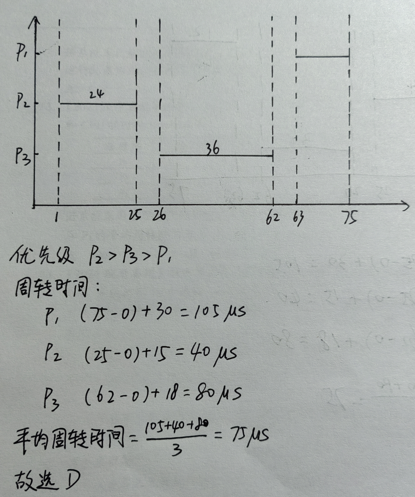

#### 27 W

进程等待某资源为可用（不包括处理机）或等待 IO 完成均会进入 **阻塞状态**

系统将 CPU 分给高优先权的进程，进程进入就绪状态

#### 28 W

“条件变量” 是管程内部说明和使用的一种特殊变量，其作用类似于信号量机制中的 “信号量”，都是用于实现进程同步的。
需要注意的是，在同一时刻，管程中只能有一个进程在执行。
如果进程 A 执行了 `x.wait()` 操作，那么该进程会阻塞，并挂到条件变量 x 对应的阻塞队列上。
这样，管程的使用权被释放，就可以有另一个进程进入管程。
如果进程 B 执行了 `x.signal()` 操作， 那么会唤醒 x 对应的阻塞队列队头进程。
在 Pascal 语言的管程中，规定只有一个进程要离开管程时才能调用 `signal()` 操作。

>管程中 `x.wait()` 与信号量中的 `wait()` 区别：管程的 `wait()` 是关于 **条件等待** 的，会自动释放锁；信号量的 `wait()` 是关于 **资源获取** 的，不涉及锁的自动管理

#### 29 W A

时钟中断的主要工作是处理和时间有关的信息以及决定是否执行调度程序，**和时间有关的所有信息**，包括系统时间、进程的时间片、延时、使用 CPU 的时间、各种定时器，故 I、II、III 均正确，选 D。

其他冷门中断类型

| 中断类型               | 主要功能                                                     | 触发条件/说明                                                |
| :--------------------- | :----------------------------------------------------------- | :----------------------------------------------------------- |
| **机器校验中断**       | 处理硬件故障，如电源故障、主存校验错误，确保系统在严重硬件错误时能安全处理 | 由设备故障引发。通常为 **不可屏蔽中断**，优先级最高         |
| **访管中断**           | 用户程序 **请求操作系统服务**（如 I/O 操作、创建进程）的桥梁，实现用户态向内核态的切换 | 由执行 **访管指令**（如 x86 的 `INT` 指令）主动引发             |
| **程序性中断**（异常） | 处理程序运行时自身错误或异常，如除零、地址越界、非法指令、断点调试 | 由 **当前正在执行的程序** 本身的问题引发，属于 **不可屏蔽中断** |
| **外部中断**（狭义）   | 响应来自 CPU 外部的异步事件，如 **定时器中断**、按键中断      | 由外部信号触发，与当前执行的指令无关                       |
| **I/O 中断**            | 由 I/O 控制器产生，用于通知 CPU 某个 I/O 操作已经完成或就绪      | I/O 操作完成时触发                                          |

#### 32 W

硬件方法（swap 指令、TestAndSet 指令）实现进程同步不能实现让权等待

Peterson 算法满足有限等待但不满足让权等待

记录型信号量由千引入阻塞机制，消除了不让权等待的情况

>让权等待：当进程不能进入自己的临界区时，应立即释放处理机，以免进程陷入“忙等”状态（受惠的是其他进程）

#### 36 W

变量说明

* $n$：帧序号比特数

* $k$：发送窗口
* $t_1$：分组发送时延（传输时延）
* $t_2$：确认帧发送时延（传输时延）
* $\tau$：单向传播时延

信道利用率 $U = \cfrac{kt_1}{t_1 + 2\tau + t_2}$

注意这里是 $2\tau$，也即 RTT

#### 39 W A M

传输层分用的定义是：接收方的传输层剥去报文首部后，将数据分开并交付给目的进程。C 和 D 选项显然不符。
端口号是传输层服务访问点 TSAP，用来标识主机中的应用进程。 
对于 A 和 B 选项，**源端口号是在需要对方回信时选用**，不需要时可用全 0。
**目的端口号是在终点交付报文时使用到**，符合题意，故选 B。

### 大题

#### 41

```cpp
/**
 * @see P20 T13
 * 
 * 使用哈希对数组计数，找到数组中的最大元素m，从1枚举到m，若计数为0则找到了未出现的最小正整数，若不存在返回m+1
 * 不允许使用STL
 * 
 * 时间复杂度 O(n)
 * 空间复杂度 O(n)
 */
int findMinNotExists(int data[], int length) {
    int max_ = 0;
    for(int i = 0; i < length; ++i) {
        if(data[i] > 0) {
            max_ = std::max(max_, data[i]);
        }
    }
    int* hash = (int*) malloc(sizeof(int) * (max_ + 1));
    for(int i = 0; i <= max_; ++i) {
        hash[i] = 0;
    }
    for(int i = 0; i < length; ++i) {
        if(data[i] > 0) {
            hash[data[i]]++;
        }
    }
    int ans = -1;
    for(int i = 1; i <= max_; ++i) {
        if(hash[i] == 0) {
            ans = i;
            break;
        }
    }
    free(hash);
    return ans == -1 ? max_ + 1 : ans;
}
```

#### 43

定时查询 IO，最长轮询间隔为填满数据缓冲区的时间

IO 占 CPU 总时间的百分比 $ = \cfrac{1s用于IO的时钟周期数}{CPU主频即1s的时钟周期数} = \cfrac{1sIO次数\times 每次时钟周期数}{CPU主频}$

若 **准备数据的时间** 小于 **中断响应和中断处理的时间**，那么数据就会被刷新，造成丢失

$1s$ 内 IO 次数 $ = \cfrac{1s}{每次IO用时}$

#### 44 A

第二问：物理地址分为三段，只可能是两种情况：直接映射和组相联映射。这里中间那一段引出的线分别连接了两个 cache 行，可以推断是 2 路组相联

Cache 的总容量：由物理地址结构知，cache 共 8 组（看组号位数），每组 2 行（2 路），每行数据部分为 $2^5 = 32B$（看偏移量位数）。此外还需要考虑有效位 1 位、替换算法位 1 位、脏位 1 位，标记 20 位，故总容量为 $8\times 2\times (20 + 1 + 1 + 1 + 2^5 \times 8) = 4464b = 558B$

第四问最后一空：这个虚拟地址无法转换为物理地址，但是不影响算组号，因为低 12 位是不变的，故组号为 3

#### 45

CLOCK 置换算法：访问位

改进型 CLOCK 置换算法：访问位、**修改位**（推迟页面写回磁盘的时间，减少 IO 次数）

#### 46

纯粗心

是簇存地址项，而不是文件索引节点存地址项，故一个簇可以存 $\cfrac{4KB}{4B} = 1024$ 个地址项

于是整道题计算的都是错误的

**注：文件索引节点 `inode` 存储文件元数据（`metadata`）**

```cpp
struct ext4_inode {
    __le16 i_mode;        // 文件模式和类型
    __le16 i_uid;         // 所有者UID
    __le32 i_size_lo;     // 文件大小
    __le32 i_atime;       // 访问时间
    __le32 i_ctime;       // 创建时间
    __le32 i_mtime;       // 修改时间
    __le32 i_blocks_lo;   // 块计数
    __le32 i_block[15];   // 数据块指针（12直接+3间接）
    // ... 其他字段
};
```

#### 47

第一问：算这个子网下有多少个 IP，可以用 $254-129 + 1 = 126$，也可以用 $2^7 - 2 = 126$。已经分配了 $208 - 129 + 1 = 80$ 台，还可以分配 $126 - 80 - 1 = 45$ 台

>为什么要再减一：在子网中，网关或路由器的接口通常需要一个 IP 地址，这个地址虽然属于可用主机地址范围，但不能分配给普通主机


第二问（纯粗心）：IP 分片需要保证数据部分长度为 $8$ 的倍数，片偏移为下标除以 8（以 8 为单位）

## 2021 年

### 选择题

#### 1 W

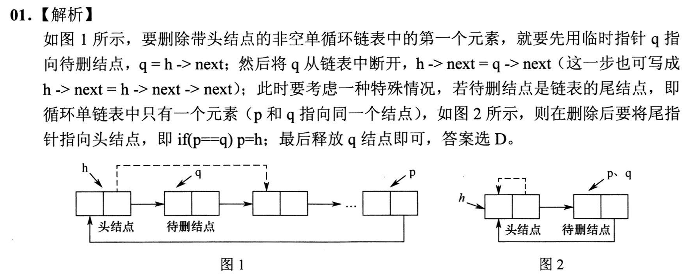

#### 4 A

* 已知先序中序：先序为纵轴从上至下，中序为横轴从左至右
* 已知后序中序：先序为纵轴从下至上，中序为横轴从左至右
* 其他情况不能唯一确定二叉树

#### 5 A

看到二叉树的最小带权路径长度，想到哈夫曼树

结点的带权路径长度（WPL）：从树的根结点到任意结点的路径长度（经过的边数）与该结点上权值的乘积

#### 8 W A

粗心

dijkstra：首先初始化 dis 数组全为无穷，遍历顶点 1 所有邻接顶点 i，将距离写入 dis [i]。算法每次选择则一个到顶点 1 距离最近的顶点 j 加入顶点集 S，并判断由顶点 1 绕行顶点 j 后到任一顶点 k 是否距离更短，将到顶点 k 的距离松弛为顶点 1 到顶点 j 的距离加顶点 j 到顶点 k 的距离

本题的错误点在于没看到从顶点 5 绕行顶点 2 的路径距离更近

#### 12 A

* **M** FLOPS：百万 $10^6$
* **G** FLOPS：十亿 $10^9$ 
* **T** FLOPS：万亿 $10^{12}$ 
* **P** FLOPS：千万亿 $10^{15}$ 
* **E** FLOPS：百京 $10^{18}$，$1京 = 1亿亿 = 10^{16}$ 
* **Z** FLOPS：十万京 $10^{21}$

#### 16 W A

粗心

本题的错误点在于错误地认为 $32 = 2^6$，实际上 $32 = 3^5$。不是哥们

#### 18 A M

* **数据通路** 是处理器中用于执行算术和逻辑操作的部分，主要包括组合逻辑元件（如 ALU）和时序逻辑元件（如寄存器）
* 状态单元：进行数据存储（时序逻辑电路 & 指令、数据锁存器）
* 组合单元：进行运算操作（组合逻辑电路 & 与或非的电路组合）
* **数据通路包含用于异常事件检测及响应的电路**

#### 19 A M

* 同步总线是指总线通信的双方采用同一个时钟信号，但是一次总线事务不一定在一个时钟周期内完成，即 **时钟频率不一定等于工作频率**
* 异步总线采用握手的方式进行通信，每次握手的过程完成一次通信，但一次通信往往会交换 **多位** 而非一位数据

#### 20 W M

I/O 接口即 I/O 控制器，其功能是接收主机发送的 I/O 控制信号，并实现主机和外部设备之间的信息交换。磁盘驱动器是由磁头、磁盘和读写电路等组成的，也就是我们平常所说的磁盘本身

I/O 接口：打印机适配器、网络控制器、可编程中断控制器

#### 23 A M

常见的特权指令：只能在内核态执行

* 有关对 IO 设备操作的指令
* 有关访问程序状态的指令
* 存取寄存器指令
* 其他指令

会使 CPU 从用户态进入内核态的指令属于非特权指令

#### 25 A

调度程序从 **就绪队列** 中选择一个进程为其分配时间片

阻塞队列中的进程只有被唤醒进入就绪队列后，才能参与调度，所以该调度过程不使用阻塞队列

#### 26 A 重要-差一问题

* 磁头从磁道 $a$ 移动到磁道 $b$，移动距离为 $|a - b|$（关注的是间隔）
* 闭区间中有多少个整数（包含端点）：$b - a + 1$（关注的是点）
* 从 $a$ 开始往后数 $b$ 个数（位移/第 $b$ 个数）：$a + b - 1$

>解决典型 off-by-one 问题（差一问题）：点的个数 = 步数 + 1
>距离/步数关注的是“间隔”（edges），计数关注的是“点”（vertices）

#### 28 W A

存在位 = 0 的页根本不在内存，页框号字段是无效的，所以也无法被替换。换句话说，只有存在位 = 1 的页，才“真的”在内存中，才会参与替换算法

存在位 = 0 是什么原因导致的？

* 该页从未被访问过
* **该页之前在内存中，但被换出**，其内容已保存到外存
* 页表刚建立时

#### 32 W M

系统调用是由用户进程发起的，请求操作系统的服务

* 页置换由操作系统自动完成，不涉及系统调用
* 进程调度完全有操作系统完成，无法通过系统调用完成
* 创建新进程可以由系统调用完成

#### 33 W M

注意题目是 TCP/IP 参考模型，即 4 层模型

端到端报文段传输是传输层的问题

传输层下一层为网络层，主要功能为路由选择

#### 34 A M

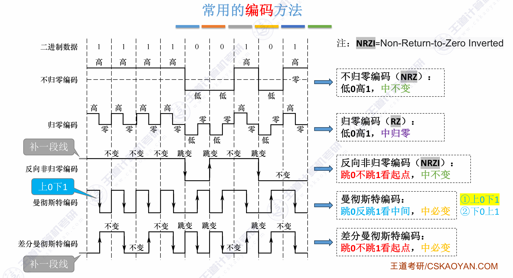

#### 38 A M

记忆题，注意客户端和服务器状态的变化

**三次握手**

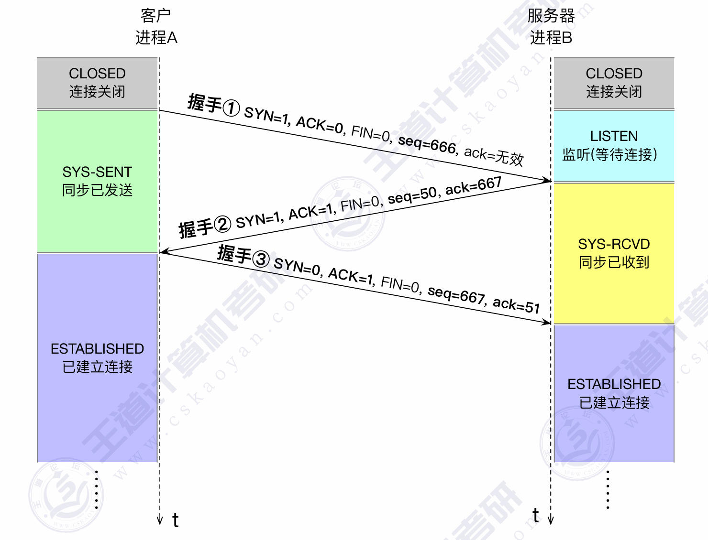

**四次挥手**

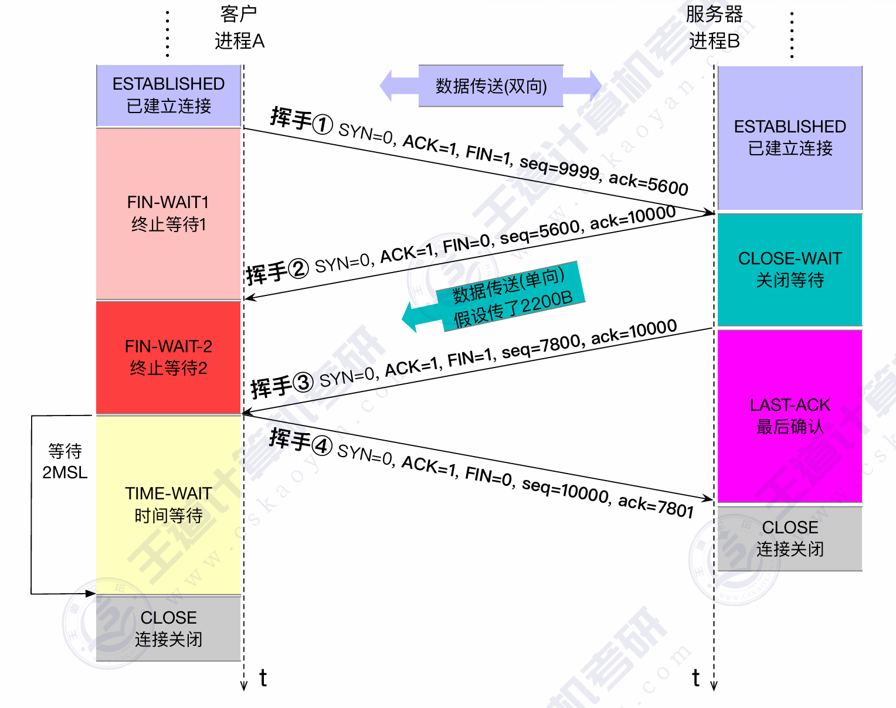

#### 39 A M

记忆题，关键在于记住常用协议的首部长度，题目中一般不会给

| 协议/层次               | 默认首部长度             |
| :---------------------- | :----------------------- |
| **应用层-HTTP**         | 无固定首部               |
| **应用层-DNS**          | 12B                      |
| **传输层-TCP**          | **20B**                  |
| **传输层-UDP**          | **8B**                   |
| **网络层-IPv4**         | 20B                      |
| **网络层-IPv6**         | 40B                      |
| **网络层-ICMP**         | 8B                       |
| **数据链路层-ARP**      | 28B                      |
| **数据链路层-以太网帧** | 18B (14B 首部 + 4B 尾部) |

### 大题

#### 41

粗心，注意题目说的是无向图！

无向图中，节点的度等于节点邻接节点的个数

若采用有向图的算法来计算入度和出度（虽然无向图中没有“入度”和“出度”的概念），计算出的结果是正确值的 2 倍

于是这个算法将给出错误的结果，因为按照算法所有节点的度都将为偶数

纠正错误后，我们可以在第一层循环里设置 deg 变量，只要 deg 为奇数就计数，这样就可以将空间复杂度优化为 O(1)

```cpp
int IsExistEL(MGraph G) {
    int cnt = 0;
    for(int i = 0; i < G.numVertices; i++) {
        int deg = 0;
        for(int j = 0; j < G.numVertices; j++) {
            deg += G.Edge[i][j];
        }
        if(deg & 1) {
            cnt++;
        }
    }
    return cnt == 0 || cnt == 2;
}
```

#### 42

无错误

#### 43

1. ALU 的宽度即 ALU 运算对象的宽度，通常与字长相同

   MAR 的宽度取决于定长指令字的宽度

   MDR 的宽度取决于数据线宽度

2. 一般来说，指令格式能定义 $2^{操作码位数}$ 种操作

   本题 R 型格式操作码为 4 位，于是有 $2^4 = 16$ 种操作

   I 型和 J 型均有 6 位操作码，共享这 6 位操作码空间，特别的，$000000$ 被 R 型指令占用，于是共有 $2^6 - 1 = 63$ 种操作

#### 44

**三种映射方式中 Tag 的用途**

* 直接映射：用于唯一标识主存块，直接映射只需比较一个 Tag 即可判断命中与否
* 全相联映射：用于唯一标识主存块，全相联映射必须比较所有 Tag 才能知道命中与否
* 组相联映射：用于区分同一组中不同主存块

当访问一个主存块时：

* 根据 **组号** 找到对应的一组
* 比较该组中每个 Cache 行存储的 **Tag**
  * 若有一个 Tag 相同且有效位为 1 → 命中
  * 若两个 Tag 都不匹配 → 未命中（需要替换，此时需要替换算法出场）

本题采用 LRU 替换策略，根据最近最少使用原则，12 刚被访问过，应该淘汰 4

#### 45

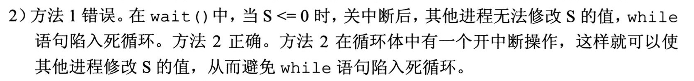

#### 46

无错误

#### 47

1. 对于有线网络：现代交换式以太网的数据链路层已不再使用 CSMA/CD。CSMA/CD 只与早期的共享式总线以太网相关

   对于无线网络：其数据链路层遵循 IEEE 802.11 标准，核心介质访问控制协议就是 CSMA/CA

   本题的网络拓扑结构正好属于早期的共享式总线以太网，于是数据链路层使用的 CSMA/CD 协议

   在 408 考试的语境下，当不涉及更基础的随机访问协议时，**通常默认有线局域网的数据链路层介质访问控制协议就是 CSMA/CD**

   所谓更基础，指的是信道划分介质访问控制、ALOHA 协议和 CSMA 协议

2. 在整个过程中，并没有涉及 H2，H2 没有主动交换数据

3. H2 会收到两个 ARP 帧，第一次是 H1 希望查询本地域名服务器的 MAC 地址，第二次是 H1 访问 Web 服务器前希望查询路由器 R 的 MAC 地址

## 2022 年

## 2023 年

### 选择题

#### 9 A

| 0    | 1    | 2    | 3    | 4            |
| ---- | ---- | ---- | ---- | ------------ |
|      | 2025 | 12   |      | 25(删除标记) |
| 1    | 3    | 2    | 1    | 2            |

$ASL_{fail} = \cfrac{1 + 3 + 2 + 1 + 2}{5} = 1.8$

线性探测再散列法中删除一个关键字会导致后面的关键字无法通过线性探测找到正确的位置。当删除一个关键字时，为了保持散列表的连续性，通常会将后续的关键字向前移动填充空缺，这样后续的查找操作才能继续正确地找到它们然而，如果删除的是一个位于中间位置的关键字，后面的关键字需要依次向前移动，这会导致删除操作的时间复杂度较高，因为需要移动大量的关键字。为了解决删除操作中的位置依赖性问题，可以使用 **删除标记** 来表示一个位置上的关键字已被删除。

散列表长度为 $n$，散列函数 $H(k) = k \% m$，插入 $t$ 个元素

* $ASL_{success}$：在构建散列表时表明每个元素的查找长度 $a_i$，$ASL_{success} = \frac{1}{t} \sum_{i = 1}^t a_i$
* $ASL_{fail}$：需要分析散列表的每个位置，注意取模
  * 若没有元素，查找长度为 $1$
  * 若有元素，需要判断该元素到最近的空节点的距离（从空节点 $1$ 开始数，包含自身和空节点）
  * 若该元素已被删除（`del`），也需要判断该元素到最近的空节点的距离（可能循环访问，同上）

#### 7 W M

B 树删除非叶节点元素最终都转换成删除叶结点元素

#### 12 A

主频 = 1.5GHz 表示 CPU 时钟周期为 $\cfrac{1}{1.5\times 10^9}s$

CPI = 1.2 表示 每条指令执行平均需要 1.2 个时钟周期

指令执行速度（每秒执行多少条指令） = $1.5G / 1.2 = 1.25G$ 条

用户 CPU 时间（执行程序 P 所用时间） = $\cfrac{1}{1.5\times 10^9} \times 1.2 \times 5 \times 10^5 = 0.4ms$

#### 14 W

80200000H 阶码全零，符号位为 1，位数为 0100...，为非规格化负数

于是指数为 $-126$，尾数形式为 $0.M$ 而不是 $1.M$

故结果为 $-0.01\times 2^{-126} = 2^{-128}$

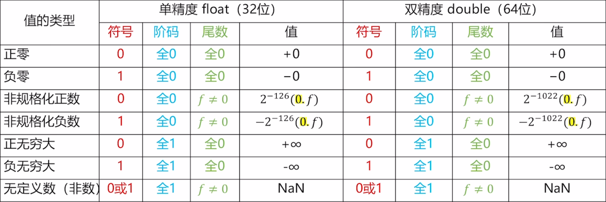

#### 15 W A

法一：地址空间 $2^{30}$，可以将高 2 位的 $00$，$01$，$10$ 状态分给 RAM，于是 ROM 地址范围为 $1100..0\sim 1111..1$，即 $30000000H \sim 3FFFFFFFH$

法二：本题说存储芯片要占满所有可能的存储地址空间，并且 ROM 在高地址区，故 ROM 最大地址为 $2^{30} - 1$，即 $3FFFFFFFH$，据此也能判断选 C

法三：地址空间 $2^{30}$，RAM/ROM 占用比为 $3:1$，且 RAM 在低地址，于是有 $2^{30} \times \cfrac{3}{4} = \cfrac{3}{4} \times 4 \times 2^{28} = 3 \times 2^{28} = (3000\,0000)_{16}$，于是 RAM 地址范围为 $0000\,0000H \sim 2FFF\,FFFFH$，同理 $2^{30} \times \cfrac{1}{4} = 2^{28} = (1000\,0000)_{16}$，于是 ROM 地址范围为 $3000\,0000H \sim 3FFF\,FFFFH$

#### 16 W

法一：计算 OF 时要当成有符号数计算，而 CF 表示无符号整数运算时的进位/借位，因此计算 CF 时要当成无符号数计算
x = 10，y = -20，当成无符号数时 x 不够减 y，故 CF = 1。此外，OF 显然为 0

法二：管他七的八的，直接转补码算，公式 $OF = C_n \oplus C_{n - 1}$，$CF = C_{out} \oplus Sub$

```cpp

  0000 1010
+ 1110 1100 // Sub = 1, Cn = 0, Cn-1 = 0, Cout = Cn = 0
-----------
  1111 0110
OF = 0 ^ 0 = 0;
CF = 0 ^ 1 = 1;
```

#### 18 W A M

1. **组合逻辑元件** 是那些仅由组合逻辑电路组成的元件，其输出仅取决于当前的输入，而不受存储器或时钟信号的影响。算术逻辑部件 ALU 和多路选择器 MUX 都属于组合逻辑元件，它们的输出仅由当前输入决定
2. 程序计数器 PC 和通用寄存器是 **时序逻辑元件**，也称为状态元件。它们的输出不仅取决于当前输入，还受存储器或时钟信号的影响，并且具有状态或存储功能

#### 19 W A S

**取指 IF、译码/取数 ID、执行 EX、访存 MEM、写回 WB**

旁路技术将结果从执行阶段的功能单元（如 ALU）直接转发给需要使用该结果的指令，绕过了中间的写回阶段

1. 旁路技术允许将结果从 EX 或 MEM 阶段直接转发给需要数据的指令的 EX 或 ID 阶段
2. 但对于 **load 指令** 后立即使用数据的情况（如 load 后接分支或算术指令），如果后续指令在 ID 阶段就需要数据，则必须阻塞直到 MEM 阶段结束
3. 控制冒险需要通过阻塞或预测处理，本题采用硬件阻塞，分支指令后的指令会被阻塞直到分支决策完成

>只有 load 指令在 MEM 阶段才产生数据，所以仅考虑 load 指令只能在访存阶段旁路取数这一特例

#### 20 W A

总线数据传输过程中，需要同时考虑数据传输和地址传输，后者常常隐含在题目中或题目说明忽略不计。本题需要考虑以下三个时间

* **地址传输**
* **数据准备**
* **数据传输**

每个时钟周期 $10^{-9}s$，准备数据 $6ns$，CPU 通过地址线传输地址 $1ns$，主存传输数据到 CPU $1ns$，一共 $6 + 1 + 1 = 8ns$

$32B$ 的数据在 $64b$ 的总线上需要传输 $\cfrac{32\times 8}{64} = 4$ 次，于是总时间 $4\times 8 = 32ns$

>二刷：不支持突发传送，说明每次 CPU 想读取 64b 数据都要给出地址，于是每次访存时间为 $传地址 + 准备数据 + 传数据 = 1 + 6 + 1ns = 8ns$，重复 4 次即 $32ns$

#### 21 W S M

1. 异常在指令执行过程中检测
2. 中断请求信号在指令执行完毕后检测
3. 外设向 CPU 发送中断请求信号而不是中断结束信号：**中断请求信号总是从外设发向 CPU，中断结束信号总是从 CPU 发向中断控制器**

>二刷：C 选项也是错的，即使开中断，受到中断屏蔽字影响不会立即中断
>这样看的话，题出错了，CD 均可选

#### 26 W A S

注意审题，题目说的是下列操作 **完成** 时，执行系统调用完成时 CPU 从内核态转为用户态

>二刷：
>
>A. 阻塞进程完成时，CPU 仍可能处于内核态，因为可能要执行进程调度
>B. 执行进程调度完成时，CPU 仍可能处于内核态，因为若下一个进程是内核进程，CPU 将保持内核态
>C. 唤醒进程完成时，CPU 通常处于内核态，因为需要继续处理中断或进程调度
>D. 执行系统调用完成时，CPU 一定出于用户态

#### 30 A

页表完成虚拟地址到物理地址的转换，两进程共享数据 data 的情况，二者虚拟地址可能不相等，但 data 被映射到物理内存的同一页框中

这是因为共享的数据页被映射到相同的物理页框中，不同进程的虚拟地址映射到相同的物理地址

#### 31 W A S M

索引节点是指文件系统中的一种数据结构，每个索引节点保存了文件系统中的一个文件系统对象的元信息数据，但不包括数据内容或者文件名。内存索引节点是存放在内存中的索引节点，文件被打开时，需要将磁盘索引节点复制到内存索引节点中。因此本题进程 P 关闭 F 时，需释放 F 的索引节点所占的内存空间

#### 32 W A S

设备分配需要考虑的是

1. **设备的类型**：不同类型的设备有不同的特性和接口，需要根据设备类型进行适当的分配和管理
2. **设备的访问权限**：不同的进程可能对设备的访问有不同的权限要求。设备分配时需要考虑进程的访问权限，确保只有具有适当权限的进程能够访问和使用设备
3. **设备的占用状态**：需要考虑设备的当前使用状态，即设备是否已经被其他进程占用或者正在执行某个操作，设备分配时需要避免资源冲突
4. **逻辑设备与物理设备的映射关系**：在系统中，逻辑设备和物理设备之间存在映射关系。逻辑设备是用户程序或操作系统中对设备的抽象表示，而物理设备是实际的硬件设备。设备分配需要确保逻辑设备与物理设备之间的正确映射

>二刷：不能被设备独立性软件干扰，以为有了数据独立性软件就不必考虑逻辑设备与物理设备的映射关系
>相反，设备分配需要调用设备独立性软件来管理逻辑设备与物理设备的映射关系

#### 33 W S

传输时延 = $\cfrac{1000\times 8b}{100\times 10^6 bps} = 0.08ms$

传播时延 = $\cfrac{1000b}{100\times 10^6bps} = 0.01ms$

一共 $\cfrac{1MB}{1000B} = 10^3$ 个分组

画分组时空图可知总时间为 $0.08 \times 10^3 + 0.02 + 0.08ms = 80.10ms$

>本题错就错在没有计算路由器转发的传输时延 $0.08ms$

>二刷：很好，又错在没计算路由器转发的传输时延

#### 34 W A S

某 **无噪声理想信道** 带宽为 4MHz，采用 QAM 调制，若该信道的最大数据传输速率是 48Mb/s，
则该信道采用的 QAM 调制方案是（）。
A. QAM-16
B. QAM-32
C. QAM- 64
D. QAM-128

奈奎斯特定理和香农公式完全忘了

对于无噪声理想信道，信道的最大数据传输速率可以通过奈奎斯特定理计算

根据奈奎斯特定理，波特率（符号传输速率） = $2W = 2\times 4MHz = 8MHz$，即每秒传输 $8M$ 次

又最大数据传输率为 $48Mbps$，则每次需要传输的比特数量为 $\cfrac{48Mbps}{8MHz} = 6b$

采用的 QAM 调制方案为 $2^6 = 64$，即 QAM-64

>QAM：调幅（AM）与调相（PM）结合，形成叠加信号，若有 $m$ 种振幅，$n$ 种相位，则 $1码元 = log_2{(mn)}bit$
>
>QAM-64：采用 QAM 调制技术，有 64 种码元
>
>关于奈奎斯特定理和香农公式，前者适合无噪声、带宽有限的信道，后者适合有噪声、带宽有限的信道
>
>* 奈奎斯特定理 $2W$ 计算得出的 **极限波特率** 指每秒最大符号传输次数
>* 香农公式 $W\log_2{(1 + S/N)}$ 计算得出的 **极限比特率** 指每秒传输的最大比特数

#### 35 A S

停止-等待协议的信道利用率公式为 $\cfrac{T_D}{T_D + RTT + T_A}$

GBN 协议和 SR 协议的信道利用率公式均为 $\cfrac{WT_D}{T_D + RTT + T_A}$

于是 $U_1$ 最小

GBN 协议和 SR 协议二者的比较：主要看窗口大小谁比较大，令 $n$ 为帧序号位数

* GBN 协议的发送窗口尺寸 W 范围：$[1, 2^n - 1]$
* SR 协议的发送窗口尺寸 W 范围：$[1, 2^{n - 1}]$

题目给定 $n = 3$，显然信道利用率 GBN > SR

>二刷：信道利用率 = $有效发送数据所占用的时间 / 整个发送周期$

#### 36 A

CSMA/CD 协议发送方发送过程中检测到冲突后会随机等待一段时间，时间间隔使用二进制指数退避算法计算，设争用期时长为 $m$，这是第 $k$ 次冲突
$$
随机数 r \in [0, 2^{\min(k, 10)} - 1] \\
等待时间 t = rm
$$

#### 38 W

在 NAT（网络地址转换）中，路由器选择转换后的 IP 地址时，通常从配置的公共 IP 池中动态选取或静态映射，地址池可能包含路由器接口 IP 或专用公共 IP 地址

本题中，路由器可用公共 IP 地址只有两个（一头一尾分别被网络号和广播号占用），并且 195.123.0.34 已被接口占用，因此 NAT 必须使用剩余可用地址 195.123.0.33 作为转换地址，以确保 IP 分组在 Internet 上可路由

#### 39 A

$168.16.84.24/20$ 展开后为 $168.16.0101 0100.24$

于是最小为 $168.16.0101 0000.0000 0001 = 168.16.80.1$

最大为 $168.16.0101 1111.11111110 = 168.16.95.254$

### 大题

#### 42

// TODO

#### 43

// TODO

#### 44

// TODO

#### 46

// TODO

#### 47

// TODO

## 2024 年

### 选择题

#### 4 A

**邻接多重表**

1. 适用于无向图的存储
2. 画法：
   1. 列出所有节点，标上节点索引，每个节点对应一个表头结点，表头节点有 `data`（存点权）和 `firstedge`（类似 next 指针）
   2. 对每个节点，在表头结点右侧画出邻接边
      * 边结构包含 5 个字段： `mark`（遍历标记，一般省略）、`ivex`（边的一个顶点）、`ilink`（指向下一条依附于顶点 `ivex` 的边）、`jvex`（边的另一个顶点）、`jlink` 指向下一条依附于顶点 `jvex` 的边
   3. 构建链接体系。对每个节点，从第一条边开始，将 `ilink` 指向下一条依附于顶点 `ivex` 的边，将 `jlink` 指向下一条依附于顶点 `jvex` 的边（像穿针一样）
3. 从顶点的表头结点出来，沿 `ilink` 或 `jlink` 遍历，可以快速的遍历该顶点的所有邻接顶点

**十字链表**

1. 适用于有向图的存储
2. 画法：
   1. 列出所有节点，标上节点索引，每个节点对应一个表头结点，表头节点有 `data`（存点权）、`firstin`（首个弧头节点，这一行都相同）、`firstout`（首个弧尾节点）
   2. 对每个节点，在表头结点右侧画出邻接边
      1. 边结构包含 4 个字段：`tailvex`（弧尾节点索引）、`headvex`（弧头节点索引）、`hlink`（指向下一个具有相同弧头的边），`tlink`（指向下一个具有相同弧尾的边）

   3. 构建链接体系。对每个节点，本行的弧尾都相同，直接从 `firstout` 出发链接起来。从 `firstin` 出发，链接所有弧头相同的边


#### 12 A

$$
\begin{align}
i &= (32777)_{10} = (1000\,0000\,0000\,1001)_2 = (0000\cdots1000\,0000\,0000\,1001)_{补} \\
si &= (1000\,0000\,0000\,1001)_{补} & 截断，变为负数 \\ 
j &= (1111\cdots1000\,0000\,0000\,1001)_{补} = (-0111\,1111\,1111\,0111)_2 = (-(32767 - 8))_{10} = (-32759)_{10} & 扩展符号位 
\end{align}
$$

#### 13 A

* 机器语言：计算机能识别的二进制代码，可以 **直接执行**，一般不用机器语言直接写程序
* 汇编语言：用助记符表示的机器语言，需要翻译成机器语言才能执行
* 机器指令：CPU 能 **直接识别并执行** 的指令，它的表现形式是二进制编码
* 汇编指令：是汇编语言中使用的一些操作符和助记符，还包括一些伪指令（如 assume，end），汇编指令同机器指令一一对应
* 微指令：是指在微程序控制的计算机中，同时发出的控制信号所执行的一组微操作。微指令是由同时发出的控制信号的有关信息汇集起来形成的。将一条指令分成若干条微指令，按次序 **执行** 就可以实现指令的功能。若干条微指令可以构成一个微程序，而一个微程序就对应了一条机器指令

#### 16 A M

* Cache-主存层次的交换单位为 **主存块**，主存-外存层次交换单位为 **页**
* 硬件实现的运行速度比软件实现的运行速度要快的多，对于 Cache-主存层次交换需要快速运行的应用场景，其替换算法必须由 **硬件** 实现。主存-外存层次替换相比前者要慢得多，所以可以由 **软件** 实现，软件实现虽然比硬件实现要慢得多，但也更加灵活
* Cache-主存层次的交换运行速度很快（为纳秒级别）且交换数据量很小（交换单位为主存块，大小 64 字节或 128 字节等），其写策略 **既可以用全写法也可以用回写法**，主存-外存层次交换运行速度相比前者要慢很多（为毫秒级别）且交换数据量相比前者要大很多（交换单位为页，典型的页大小为 4KB），因此通常采用 **回写法** 写策略
* Cache-主存层次的交换运行速度很快（为纳秒级别）且交换数据量很小（交换单位为主存块，大小为 64 字节、128 字节等），如果采用直接映射方式，考虑最坏情况，所有主存块都被映射到同一个 Cache 行中，Cache 也能处理。主存-外存层次交换运行速度相比前者要慢很多（为毫秒级别）且交换数据量相比前者要大很多（交换单位为页，典型的页大小为 4 KB），如果采用直接映射方式，考虑最坏情况，所有页都被映射到同一个页框中，会出现频繁的调页，主存无法处理，所以主存-外存层次通常采用全相联映射方式。现代计算机一般采用虚拟存储技术，常见的虚拟存储映射方法包括：分页式存储管理、分段式存储管理、段页式存储管理

#### 17 A

页式虚拟存储管理方式、组相联映射的 TLB 地址结构为：标记 | 组号 | 页内偏移量

虚拟地址为 32 位，则 TLB 地址长度为 32 位

页大小为 $1KB$，则页内偏移量为 10 位

TLB 共 32 个表项，采用 4 路组相联，则共有 $32/4 = 8$ 组，组号为 3 位

于是标记至少 $32 - 10 - 3 = 19$ 位

#### 18 W M

MMU 与 cache 缺失无关，不会检查 cache 缺失

**内存访问全局流程** // TODO 传给Cache是物理地址还是逻辑地址？这个图有问题

以 `load arr[i]` 为例，涉及计组/OS 交叉领域

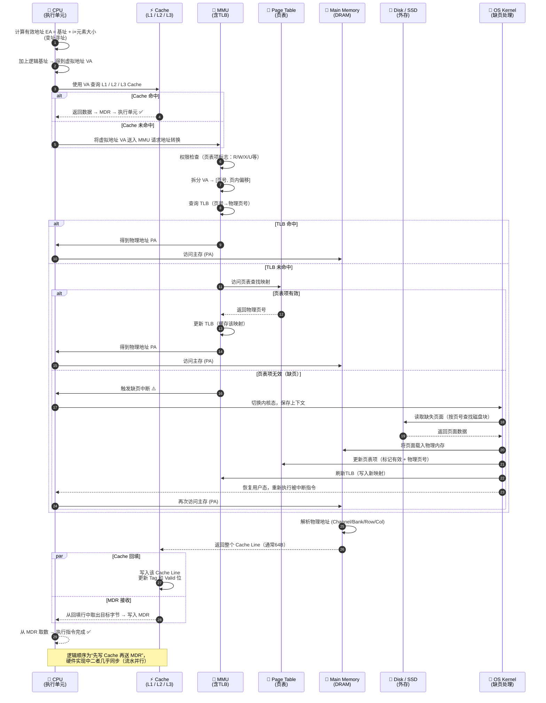

#### 20 W A

$2 \times 64 \times \cfrac{1}{8} \times 420 \times 10^6 B/s = 6.72GB/s$

注意，本题其他条件为干扰条件，我们只需要考虑有数据传送时候的情况，无需增加没有数据传送时候的情况，本题考查的是带宽（最大传输速率），是传播速率的最大值，而非平均传输速率。而且总线带宽是总线的固有性能指标，不受传送方式的影响

#### 21 W A

* 选项 A：中断优先级包含响应优先级和处理优先级，
  * **响应优先级** 是指 CPU 响应各中断源请求的优先次序，这种优先级往往是硬件电路已经设置好的，不便于改动
  * **处理优先级** 是指 CPU 实际对各中断源请求的处理优先次序。若不采用屏蔽技术，则应的优先次序就是处理的优先次序。若采用屏蔽技术，则中断屏蔽字用于确定中断处理的优先级。因此选项 A 错误
* 选项 B：中断过程主要包括中断响应和中断处理两个阶段。中断响应阶段包含保存保存断点和程序状态字。因此选项 B 正确
* 选项 C：中断过程主要包括中断响应和中断处理两个阶段。
  * 中断处理过程包含 **保存通用寄存器**，中断处理过程由中断服务程序进行处理
  * 在中断服务程序中 **设置适当的屏蔽字**，能起到对优先级不同的中断源的屏蔽作用
  * 中断服务程序由用户（或系统）用机器指令编程实现，属于 **软件**。因此选项 C 正确

* 选项 D：区别于多重中断方式，单重中断方式不允许中断嵌套，中断处理时 CPU 处于关中断（即禁止 CPU 响应中断源的中断请求）状态。因此选项 D 正确

#### 24 W

对题干“不一定执行”理解有误，理解成了不会执行

终止子孙进程的前提是存在子孙进程，故不一定执行

#### 27 A

伙伴算法即伙伴分配算法 (Buddy Allocation Algorithm) 将可用内存分割成大小相等、成对的“伙伴”块。当请求内存时，系统会找到大于等于请求大小的最小块（$2^i$，若不存在则继续向上找 $2^{i + 1}\cdots$），并分配给请求的大小，将剩余部分形成新的伙伴块。这种方法有利于减少外部碎片，但可能会生成一定量的内部碎片

* 内部碎片：已经被分配出去但未被完全利用的内存空间
* 外部碎片：未被分配的内存空间，但由于这些空间过小或不连续，无法满足新的内存分配请求

#### 28 A

线程可共享其所属进程的地址空间和资源，包括堆和全局变量。每个线程都有自己的栈，用于保存其局部变量和返回地址

#### 29 A

* open() 系统调用用于打开文件，是通过文件按名查找实现的，open() 系统调用返回一个文件描述符，该描述符用于后续的文件操作，如读取、写入等
* read() 系统调用用于从文件中读取数据。read() 需要在文件已被打开的情况下才能实现
* write() 系统调用用于向文件中写入数据。write() 需要在文件已被打开的情况下才能实现
* close() 系统调用用于关闭一个打开的文件。close() 需要在文件已被打开的情况下才能实现

#### 30 A

**举一反三**

假设某系统使用时间片轮转调度算法进行 CPU 调度，时间片大小为 5 ms，系统共有 10 个进程，初始时均处于就绪队列，执行结束前仅处于执行态或就绪态。若队首的进程 P 所需 CPU 时间最短，时间为 25 ms。在不考虑系统开销的情况下，则进程 P 的周转时间为

A. 200 ms

B. 205 ms

C. 250 ms

D. 295 ms

参考答案：B，示意图如下。

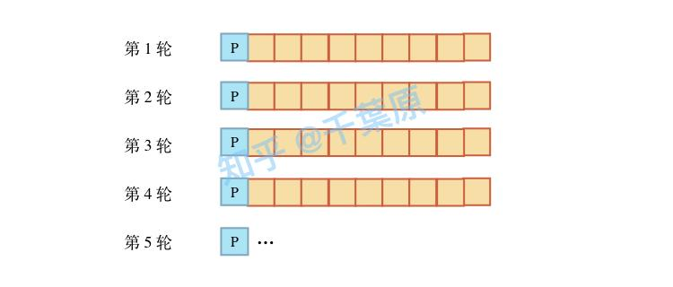

假设某系统使用时间片轮转调度算法进行 CPU 调度，时间片大小为 5 ms，系统共有 10 个进程，初始时均处于就绪队列，执行结束前仅处于执行态或就绪态。若队首的进程 P 所需 CPU 时间最短，时间为 25 ms，队尾的进程 Q 所需 CPU 时间第二短，时间为 30 ms，在不考虑系统开销的情况下，则进程 Q 的周转时间为

A. 200 ms

B. 205 ms

C. 250 ms

D. 295 ms

参考答案：D，示意图如下。

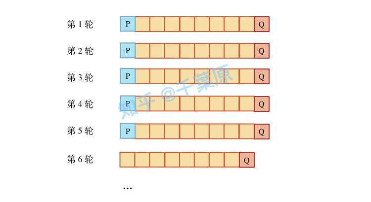

#### 31 A

当键盘输入数据时，首先会将数据发送到键盘控制器的数据寄存器中。当键盘控制器的数据寄存器接收到数据后，它会触发一个中断请求 (IRQ1)，通知 CPU 有数据等待处理。CPU 响应中断请求后，会执行键盘中断服务例程。在中断服务例程中，CPU 从键盘控制器的数据寄存器读取输入数据，并将其存放到 **内核缓冲区** 中

#### 32 A

$|0 - 200| + |0 - 399| + |210 - 399| = 788$

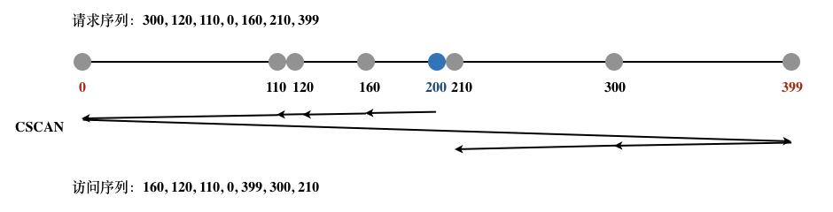

#### 34 A M

* ASK (Amplitude Shift Keying) 幅移键控，这种调制方式是利用载波幅度的变化来传送数字信息的
* PSK (Phase Shift Keying) 相移键控，这种调制方式是利用载波振荡相位的变化来传送数字信息的
* FSK (Frequency Shift Keying) 频移键控，这种调制方式是利用载波频率的变化来传送数字信息的。在二进制数字调制中，常见的是二进制 0 和 1 对应不同的频率
* DPSK (Differential Phase Shift Keying) 差分相移键控，它不是利用载波相位的绝对数值传送数字信息，而是用前后码元的相对载波相位值传送数字信息

#### 36 W A

冷门协议 CSMA/CA

$DATA = \cfrac{1998B}{54Mb/s} = \cfrac{1998 \times 8b}{54 \times 10^6 b/s} = 296\mu s$

$NAV = SIFS + DATA + SIFS + ACK = 28 + 296 + 28 + 2 = 354\mu s$

**802.11 预约信道机制 CSMA/CA 协议**

* DIFS：信道空闲后，发送数据帧前必须等待的一段固定时间，用于确保信道真正空闲、避免冲突
* SIFS：最短时间间隔
* NAV：网络分配向量，指出信道忙的持续时间，除发送站和接收站外的站点都不能在这段时间内发送数据

**RTS（Request To Send）和 CTS 帧（Clear To Send）**

* RTS 帧：站点 A 向接入点 AP 预约信道的帧，首部包含预约时间 $SIFS + CTS + SIFS + DATA + SIFS + ACK$
* CTS 帧：AP 广播响应，停止其他隐藏站的数据发送，首部包含预约时间 $SIFS + DATA + SIFS + ACK$

**源站（站点 A）发送数据帧**

在源站发送数据帧首部中，有时间 $DATA + SIFS + ACK$，这个时间的用途是：如果有的站没有收到 RTS 和 CTS 帧，那么收到数据帧后，也能设置其 NAV

**总结**

- 收到源站发出的 RTS 帧的站设置其 NAV = [SIFS + CTS + SIFS + DATA + SIFS +ACK]
- 收到接入点 AP 发出的 CTS 帧的站设置其 NAV = [SIFS + DATA + SIFS +ACK]
- 没有收到以上 RTS 和 CTS 帧但收到数据帧的站设置其 NAV = [DATA + SIFS +ACK]

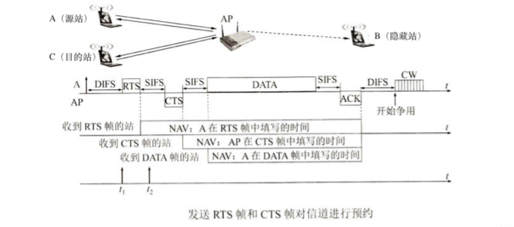

#### 38 A

需要考虑慢开始，两个 RTT 内数据就发送完了

**注：三次握手最后一个报文可以携带数据（连接已建立）；四次挥手第一个报文不能携带数据（表示数据发送完毕）**

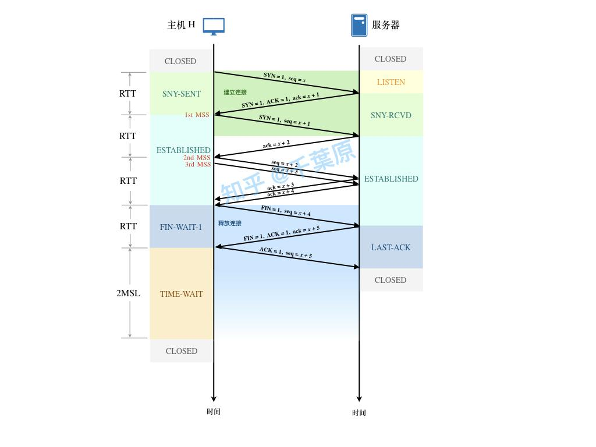

#### 39 W A

错在没有对结果取反

```shell
  1011 1001 1011 0110
+ 0110 0101 1100 0101
---------------------
  0001 1111 0111 1011
+                   1  // 高位进位
---------------------
  0001 1111 0111 1011
  1110 0000 1000 0100  // 加完一定记得取反！
```

[UDP 校验和计算详解：反码求和与 Python 实现-CSDN 博客](https://blog.csdn.net/ethan0ly/article/details/119047714)

通用校验和计算规则 **一补校验**（One’s Complement Checksum）（适用于 IP/TCP/UDP 等）

1. 将 UDP 数据报的伪头部（包含源 IP 地址、目的 IP 地址、协议类型和 UDP 长度）、UDP 头部和数据拼接成一个连续的二进制流
2. 将这个二进制流视为一系列 16 位整数，对这些整数进行累加。在累加过程中，如果发生溢出（即超过 16 位），将高位的进位加回到低 16 位，这一过程可能需要多次循环，直到没有溢出
3. 取累加后的低 16 位，然后对其进行 **按位取反**（即求反码），得到的就是校验和

| 协议层     | 协议                | 校验内容范围                    | 是否包含伪首部 | 校验算法                  | 说明                                             |
| ---------- | ------------------- | ------------------------------- | -------------- | ------------------------- | ------------------------------------------------ |
| **网络层** | **IPv4**            | IP 首部（不含数据部分）         | ❌ 否           | 16 位一补和               | 仅校验首部正确性，每次转发都要重新计算           |
| **网络层** | **IPv6**            | 无（弃用）                      | —              | —                         | IPv6 不再使用首部校验和，依赖上层（TCP/UDP）校验 |
| **传输层** | **UDP**             | UDP 首部 + 数据 + 伪首部        | ✅ 是           | 16 位一补和               | IPv4 中可选、IPv6 中强制                         |
| **传输层** | **TCP**             | TCP 首部 + 数据 + 伪首部        | ✅ 是           | 16 位一补和               | 用于端到端数据可靠传输                           |
| **链路层** | **以太网帧（FCS）** | 整个 MAC 帧（除帧校验序列本身） | ❌ 否           | **CRC32（循环冗余校验）** | 与上层的“校验和”不同，是多项式除法结果           |
| **链路层** | **PPP、HDLC 等**    | 帧数据部分                      | ❌ 否           | **CRC16/CRC32**           | 同样使用多项式校验                               |

#### 40 A

| 协议版本                           | HTTP/1.0                                                     | HTTP/1.1                                                     | HTTP/2.0                                                     | HTTP/3.0                                                     |
| ---------------------------------- | ------------------------------------------------------------ | ------------------------------------------------------------ | ------------------------------------------------------------ | ------------------------------------------------------------ |
| **连接方式**                       | TCP（短连接）                                                | TCP（长连接）                                                | TCP（长连接）                                                | QUIC（基于 UDP）                                             |
| **是否复用连接**                   | 否                                                           | 是                                                           | 是                                                           | 是                                                           |
| **并发请求**                       | 无                                                           | 支持管线化                                                   | 多路复用（帧级）                                             | 多路复用（流级）                                             |
| **队头阻塞**                       | TCP 队头阻塞                                                 | TCP 队头阻塞仍存在                                           | TCP 队头阻塞仍可能存在                                       | 无                                                           |
| **握手携带请求**                   | 否                                                           | 是（可在最后一次握手报文中发送第一个请求）                   | 是                                                           | 是                                                           |
| **请求 HTML + n 静态资源最少 RTT** | 2 × (n+1)                                                    | 2                                                            | 2                                                            | 1（0-RTT 可更低）                                            |
| **说明**                           | 每个资源都独立建立 TCP 连接，握手中可携带请求可优化 1 RTT，但仍为短连接模式 | 长连接 + 管线化，HTML + n 个资源共享 TCP 连接，仍可能受队头阻塞影响 | 所有请求在同一连接并行发送，HTTP 层消除队头阻塞，TCP 层仍有可能阻塞 | QUIC 内建加密，多路复用，消除 TCP 队头阻塞，首次连接可 1 RTT 或 0-RTT |

### 大题

#### 41

需要优化算法描述的表述

构造一个可以容纳 G.numVertices 个元素的数组作为辅助队列。初始时，所有入度为 0 的顶点都被放入队列中，检查队列中元素个数，若队列中元素个数大于 1，则意味着拓扑序列不唯一，返回 0。在广度优先搜索的每一步中，我们取出队首的结点 u，我们移除 u 的所有出边，也就是将 u 的所有相邻顶点 v 的入度减少 1，如果某个相邻顶点 v 的入度变为 0，那么我们就将 v 放入队列中，若队列中元素个数大于 1，则意味着拓扑序列不唯一，返回 0。重复该过程，直到队列为空。检查顶点入度表，若所有顶点的入度均为 0，则意味着存在唯一的拓扑序列，返回 1，否则说明 G 中存在环，意味着不存在拓扑排序，返回 0

[(10 封私信) 2024 年 408 真题数据结构篇 - 知乎](https://zhuanlan.zhihu.com/p/721714546)

#### 42

// TODO

#### 43

// TODO

#### 44

// TODO

#### 45

// TODO

#### 46

第二问：注意这里只执行一次！题目简化为简单的同步问题，一个信号量即可控制二者执行的先后顺序。不是生产者-消费者模型，生产者-消费者模型是在一个循环里不断执行的

#### 47

冷门协议

// TODO

## 2025 年

### 选择题

#### 5 W

唉真题少印个 8，cnmd，这两分不算

#### 7 A M

分块大小设置为 $\sqrt{n}$ 时，分块查找的平均查找长度最小

#### 8 W A

B 树阶数为 $m$，总关键字个数为 $N$，根节点中关键字个数为 $n_r$，普通节点中关键字个数 $n$，树高为 $h$（从 1 开始）

1. 对每个节点：分支数（孩子数） = 关键字个数 + 1
2. 令 $t = \lceil \frac{m}{2} \rceil$
3. $1 \le n_r \le m - 1$
4. $t - 1 \le n \le m - 1$
5. $2t^{h - 1} - 1 \le N \le m^h - 1$
6. $\lceil \log_m (n + 1) \rceil \le h \le \lfloor \log_t (\frac{n + 1}{2}) \rfloor + 1$


#### 10 W

| 排序算法 | 最好情况比较 | 最坏情况比较 | 平均比较   | 最好移动   | 最坏移动  | 平均移动   |
| -------- | ------------ | ------------ | ---------- | ---------- | --------- | ---------- |
| 冒泡排序 | O(n)         | O(n²)        | O(n²)      | O(0)       | **O(n²)** | O(n²)      |
| 插入排序 | O(n)         | O(n²)        | O(n²)      | O(n)       | **O(n²)** | O(n²)      |
| 快速排序 | O(n log n)   | O(n²)        | O(n log n) | O(n log n) | **O(n²)** | O(n log n) |
| 选择排序 | O(n²)        | O(n²)        | O(n²)      | O(n)       | **O(n)**  | O(n)       |

#### 12 W

没有注意到赋值后符号位会扩展

1. SI =  -32767，其二进制补码(16 位)是 1000000000000001
2. 当把 SI 赋值给时，进行符号位扩展到 32 位得到 111111111111111110000000000001
3. 这个值在无符号整数表示下是 $2^{32} - 2^{15} + 1$

**通用计算模型**

位宽 = N，有符号数值 = x
$$
U = 2^N + x
$$

| 题型                        | 已知条件                 | 要求                      | 解法公式/方法                                                | 示例                                                         |
| --------------------------- | ------------------------ | ------------------------- | ------------------------------------------------------------ | ------------------------------------------------------------ |
| **十进制有符号数 → 补码**   | 一个整数 $x$，位宽 $N$   | 写出 $N$ 位补码           | $x \ge 0 \Rightarrow \text{补码} = x$ <br> $x < 0 \Rightarrow \text{补码} = 2^N + x$ | $-5$ 的 8 位补码：$2^8 - 5 = 251 = 11111011$                 |
| **补码 → 真值（有符号数）** | $N$ 位补码（二进制串）   | 对应的十进制整数          | 若最高位 = 0：正数，直接转十进制 <br> 若最高位 = 1：负数，结果 $= X - 2^N$ | `11111011` (8 位) → $251 - 256 = -5$                         |
| **补码负数 → 无符号数**     | 有符号值 $x<0$，位宽 $N$ | 对应无符号数值            | $U = 2^N + x = 2^N - |x|$                                    | $-32767$ 的 32 位无符号：$2^{32} - 32767$                    |
| **无符号数 → 有符号数**     | $N$ 位二进制串           | 对应的十进制有符号数      | 若 $U < 2^{N-1}$，真值 $= U$ <br> 若 $U \ge 2^{N-1}$，真值 $= U - 2^N$ | 32 位无符号 $4294967295$ → 真值 $= -1$                       |
| **符号扩展（有符号数）**    | $N$ 位补码               | 扩展为 $M$ 位补码 ($M>N$) | 复制符号位到高位                                             | 8 位 `11111011` (-5) → 16 位：`11111111 11111011`            |
| **移位运算**                | 补码或无符号数           | 移位结果                  | **逻辑移位**：左/右补 0 <br> **算术右移**：补符号位          | $-8$ 的 8 位补码：`11111000` 算术右移 1 → `11111100` ($-4$)  |
| **数值范围**                | 位宽 $N$                 | 有符号/无符号范围         | 有符号：$[-2^{N-1}, 2^{N-1}-1]$ <br> 无符号：$[0, 2^N-1]$    | 16 位：有符号范围 $[-32768, 32767]$，无符号范围 $[0, 65535]$ |

#### 14 A

本题用双符号位可以判断溢出

#### 16 A M

* 选项 A：是否采用阵列乘法器，这属于 **处理器内部** 的实现细节，不属于 ISA 规定的内容。阵列乘法器是一种硬件实现乘法运算的电路，它与 ISA 没有直接关系。
* 选项 B：是否采用定长指令字格式，这是由 **ISA** 规定的。ISA 会规定指令的格式，包括指令长度是固定的还是可变的等情况。
* 选项 C：是否采用微程序控制器，这是 **处理器内部** 的控制机制，属于硬件实现层面，不属于 ISA 规定的内容。微程序控制器是用于产生控制信号的一种硬件结构。
* 选项 D：是否采用单总线数据通路，这也是 **处理器内部** 的数据传输机制，属于硬件设计细节，不属于 ISA 规定的内容。单总线数据通路是一种硬件架构。

#### 18 A M

Cache 缺失率增加时，CPI 也会增大

有关单周期 CPU 和流水线 CPU

| **对比维度**         | **单周期 CPU**                                        | **多周期 CPU**                                               | **流水线 CPU**                                             |
| -------------------- | ----------------------------------------------------- | ------------------------------------------------------------ | ---------------------------------------------------------- |
| **本质区别**         | 所有指令在 **一个时钟周期** 内完成执行                | 每条指令拆分为多个步骤，在 **多个时钟周期** 内完成           | 指令分段并行执行，每条指令仍需多周期，但多条指令可重叠执行 |
| **部件冗余**         | **高冗余**：数据通路按最慢指令设计，部件利用率低      | **低冗余**：部件分时复用（如 ALU），硬件利用率高             | 部件复用 + 并行执行，提高利用率                            |
| **时间利用率**       | **低效**：时钟周期 = 最慢指令时间，简单指令等待时间长 | **高效**：时钟周期按最短步骤设计，空闲部件可执行其他指令     | 时钟周期 = 最慢流水段时间，短阶段时间浪费小                |
| **CPI**              | **固定 CPI = 1**（每条指令 1 周期）                   | **可变 CPI > 1**（不同指令周期数不同，如加法 = 4 周期，LOAD = 5 周期） | 理想情况下 CPI ≈ 1（考虑冒险后略大于 1）                   |
| **时钟频率**         | **低频率**：由最慢指令（如 LOAD）决定                 | **高频率**：由最长执行阶段（如访存）决定                     | **高频率**：由最慢流水段决定                               |
| **控制逻辑**         | 简单组合逻辑，直接生成控制信号                        | 复杂状态机控制，需多周期时序协调                             | 控制逻辑需处理流水线阶段、冒险与冲突                       |
| **硬件复杂度**       | 数据通路复杂（宽而深），控制简单                      | 数据通路精简（窄而浅），控制逻辑复杂                         | 数据通路介于两者，控制逻辑复杂（冒险处理）                 |
| **性能瓶颈**         | 受限于最慢指令，无法优化局部操作                      | 可通过优化关键阶段（如 ALU）提升整体性能                     | 受最长流水段影响，阶段不平衡会限制时钟频率                 |
| **典型应用场景**     | 教学模型（简单直观）                                  | 实际处理器基础（如 MIPS 多周期实现）                         | 高性能 CPU、现代处理器                                     |
| **功耗**             | 较高（每个周期激活全部部件）                          | 较低（仅激活当前阶段所需部件）                               | 介于单周期与多周期之间，根据流水线深度不同                 |
| **时钟周期确定原则** | **最慢指令时间**                                      | **最长步骤时间**                                             | **最长流水段时间**                                         |

* **单周期 CPU** → “最慢指令说了算”

  **多周期 CPU** → “最长步骤说了算”

  **流水线 CPU** → “最长流水段说了算”

#### 22 A

外部中断：外部中断是由 **外部设备向 CPU** 发出的中断请求信号引起的中断

* A：DMA（直接内存访问）控制器在完成数据传送后，会向 CPU 发出一个中断请求，告知 CPU 数据传送已经完成。这个中断请求是由外部设备（DMA 控制器）发出的，属于外部中断
* B：总线事务结束通常是由 CPU 内部的总线控制逻辑处理的，它不会产生外部中断请求
* C：页故障处理是由内存管理单元（MMU）和操作系统共同处理的，属于内部中断的范畴，不会产生外部中断请求
* D：执行断点指令会引发调试中断，这是由 CPU 内部的调试机制产生的中断，不属于外部中断

#### 24 A

VMM（虚拟机监控器）的特权级高于操作系统，负责管理和分配硬件资源给虚拟机和其中的操作系统，需要对硬件有完全的控制能力

#### 26 A

**LRU** 是 Least Recently Used 的缩写，即最近最少使用

#### 27 W A

注意题目中是 **进程运行** 所需的最小页框数

指令系统支持的寻址方式：指令系统的寻址方式对确定进程运行所需的最少页框数有重要作用。不同的寻址方式决定了进程能够访问的内存范围和方式。例如，如果指令系统支持间接寻址，并且可以通过多级间接寻址访问大量的虚拟地址，那么为了保证进程能够正确运行，就需要提供足够的页框来满足这种寻址需求。如果没有足够的页框，可能会导致无法正确寻址，进而影响进程的运行。所以在确定进程运行所需的最少页框数时，需要考虑指令系统支持的寻址方式

#### 28 A M

虚拟文件系统（VFS）：虚拟文件系统是一种 **抽象层**，它位于操作系统内核和具体的文件系统（如 ext4、NTFS 等）之间。它的主要目的是为不同的文件系统提供一个 **统一的接口**，使得操作系统能够以一种统一的方式处理各种不同类型的文件系统

#### 29 W A M

索引节点（inode）方式的文件系统：在这种文件系统中，**索引节点** 用于存储文件的元数据，如文件大小、文件的物理块位置、访问权限等信息。**目录文件** 主要包含文件名和对应的索引节点号，用于通过文件名查找文件的索引节点

#### 30 A

**内存映射文件**：将文件的全部或部分内容映射到进程的 **虚拟地址空间**，进程可以像访问普通内存一样操作文件内容

访问操作系统会自动处理：

- 虚拟地址 → 物理地址的转换（页表）
- 文件映射 **虚拟地址**，物理内存按需加载，缺页时将磁盘块内容加载到物理内存
- 文件内容更新同步到磁盘（取决于映射类型，如 MAP_SHARED）

主要特性与作用：

| 特性                  | 作用与说明                                                   | 示例 / 应用场景                                              |
| --------------------- | ------------------------------------------------------------ | ------------------------------------------------------------ |
| **进程间通信（IPC）** | 多个进程可以映射同一个文件，实现数据共享与通信               | 数据库系统多个进程共享访问数据库文件，修改即时可见           |
| **虚拟地址映射**      | 文件映射到进程虚拟地址空间，而不是直接映射到物理内存         | 通过 `mmap` 系统调用将文件内容映射到指定虚拟地址，访问方式如操作内存 |
| **页面到磁盘块映射**  | 当访问映射区域页面缺失时，操作系统根据文件的磁盘块分配，将内容加载到内存 | 虚拟页面缺页时，OS 根据 inode 的磁盘块指针加载对应数据到物理内存 |

#### 32 W A M

温彻斯特硬盘：传统机械硬盘

无论是机械硬盘还是固态硬盘，文件系统都需要确定盘块大小

#### 33 W A

[(9 封私信) 哈工大计算机|必考知识点解读——第一章计算题（上） - 知乎](https://zhuanlan.zhihu.com/p/597108110)

[(10 封私信) 哈工大计算机|必考知识点解读——第一章计算题（下） - 知乎](https://zhuanlan.zhihu.com/p/598177618)

#### 34 W A N

**基于最小汉明距离的差错控制理论**

**汉明距离（Hamming Distance）**：指两个等长码字之间对应位不同的数量。编码集的 **最小汉明距离（$d_{min}$）** 是所有码字对之间汉明距离的最小值，它决定了编码的检错和纠错能力

检错能力：可以检测出最多 $e$ 位错误，其中 $e \le d_{min} - 1$

纠错能力：可以纠正最多 $t$ 位错误，其中 $t \le \lfloor (d_{min} - 1) / 2 \rfloor$

>标准汉明码的 $d_{min} = 3$，可以纠正单比特错误或检测双比特错误

#### 35 W N M

二进制指数退避算法
$$
退避时间 = 随机数 \times 时隙时间 \\
随机数 \in [0, 2^{min(k, 10)} - 1]
$$
**（隐含条件）** IEEE 802.3 规定：$时隙时间 = 512 \times 比特时间 = 512 / 数据速率(Mbps)$

#### 38 A

**注意：`cwnd` 增加都发生在确认报文后**

MSS 决定了每个 TCP 段能够携带的最大数据量，建议将题目中的拥塞窗口、发送窗口和拥塞控制阈值转换为 MSS 的倍数

题目中甲之前发送的数据量是 $1MSS$，接受到一个 ACK 显示乙的接收窗口为 $4MSS$，在甲未收到新的确认段前，根据慢开始，下一轮甲的拥塞窗口倍增为 $2MSS$，即可以发送两个 TCP 段

#### 40 A

答案错了，我的选项没错

POP3 主要用于用户从邮件服务器上把邮件下载到本地计算机，不能发送

| 协议名称 | 主要功能     | 能否发送邮件？ | 能否接收邮件？           | 工作方式/特点                                                |
| :------- | :----------- | :------------- | :----------------------- | :----------------------------------------------------------- |
| **SMTP** | **发送** 邮件 | **能**         | **不能**                 | 用于将邮件从客户端 **推送** 到邮件服务器，或在不同邮件服务器之间 **中继** 邮件。是“只发不收”的协议 |
| **POP3** | **下载** 邮件 | **不能**       | **能**（下载并通常删除） | 用于将邮件从服务器 **下载** 到本地计算机。通常是“下载后删除”模式，邮件在本地管理 |
| **IMAP** | **管理** 邮件 | **能**（间接） | **能**（在线管理）       | 用于在服务器上 **直接管理和同步** 邮件。所有操作（读、删、移动）都会在服务器同步，允许从多个设备访问同一邮箱状态。**发送邮件本身仍由 SMTP 处理**，但客户端通过 IMAP 管理“已发送”文件夹 |

### 大题

#### 41

```cpp
/**
 * @see 2025年 41题
 * 时间复杂度 O(n)
 * 空间复杂度 O(n)
 */
void calc_mul_max(int a[], int res[], int n) {
    // max_p[i] 表示 a[i..n-1] 区间内的最大正数
    // min_n[i] 表示 a[i..n-1] 区间内的最小负数
    int* max_p = (int*)malloc(sizeof(int) * n);
    int* min_n = (int*)malloc(sizeof(int) * n);
    memset(max_p, 0, sizeof(int) * n);
    memset(min_n, INT_MAX, sizeof(int) * n);

    max_p[n - 1] = min_n[n - 1] = a[n - 1];
    for (int i = n - 2; i >= 0; --i) {
        max_p[i] = std::max(max_p[i + 1], a[i]);
        min_n[i] = std::min(min_n[i + 1], a[i]);
    }

    for (int i = 0; i < n; ++i) {
        if (a[i] > 0) {
            res[i] = a[i] * max_p[i]; // 正数与最大正数相乘
        } else {
            res[i] = a[i] * min_n[i]; // 负数与最大负数相乘
        }
    }

    free(min_n);
    free(max_p);
}
```

#### 42

b 的持续时间为 5，最晚开始时间为 5，若 b 延期到 6 开始，则 b 的持续时间只能被压缩为 4

若不压缩 b，需要重新构建 AOE 网络的最早开始时间和最晚开始时间，找到新的关键路径，然后再压缩关键路径上的活动保证总用时与计划一致

#### 43

// TODO

#### 44

// TODO

#### 45

PV 函数首先要用 while(true) 包裹

// TODO

#### 46

// TODO

#### 47

// TODO

## 附录：说明

1. `W`：错误

   `A`：模棱两可或看答案才恍然大悟

   `N`：课本上没有或新考法

2. `F`：一级错题，做错过或模棱两可或看答案才恍然大悟的题

   `S`：二级错题，**不看答案重做** 一级错题做错或不会的题

3. `M`：记忆题