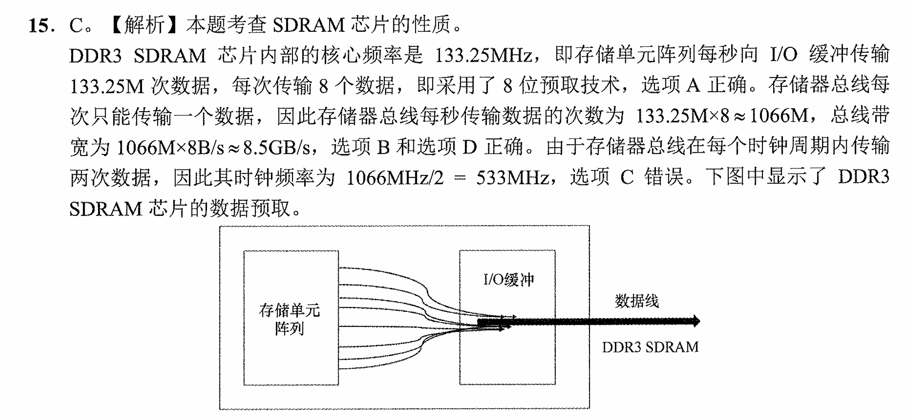

# **王道 408 模拟卷错题本**

## （一）

### 选择

#### 3 A

模拟

#### 4 A

当有 7 个结点的树转换为二叉树后，该二叉树根节点没有右孩子，对于根节点左子树，问题转化为 6 个节点的二叉树有多少种形态

即卡特兰数 $f(n) = \cfrac{C_{2n}^n}{n + 1}$

#### 7 A

强连通图为有向图，若两个强连通分量之间最多只能有单向边连接，如果存在一条反向边横跨两个强连通分量，则二者必然合二为一

对于强连通分量的题可以使用锁点（将强连通分量缩成一个节点）的思想来思考

#### 9 A

这道题可以用 dp 的方法做

令 $dp[h]$ 为高度为 $h$ 的满足题意的 AVL 树的节点数

对根节点，不妨设其左子树高度为 $h - 1$，右子树高度为 $h - 2$，于是状态转移方程为
$$
dp [h] = dp [h - 1] + dp [h - 2] + 1
$$
初始化 $dp[1] = 1$，$dp[2] = 2$

递推可得 $dp[11] = 232$

#### 11 W A

快速排序的最好情况不是逆序，而是每次的枢轴都将整个数组分为两个长度之差绝对值最小的子数组

#### 12 A

直接令改进前时钟周期为 1 个单位，改进后为 1.1 个单位

考虑 100 条指令，那么 10 条是 20 个时钟周期的，90 条是 5 个时钟周期的

就简单了

#### 14 A

**浮点数的“大数吃小数”**：浮点数的加减法由于要对阶，当一个大数加减小数的时候，小数的尾数会右移以对阶，题目中的这种情况小数尾数右移 32 位直接丢失所有信息，于是加了等于没加，于是结果就是 0

#### 15 W

#### 17 W A

| 阶段                       | 是否访问主存（Memory）？ | 说明                       |
| -------------------------- | ------------------------ | -------------------------- |
| **IF：Instruction Fetch**  | ✔ 是                     | 从主存（指令存储器）取指令 |
| **ID：Instruction Decode** | ✘ 否                     | 只读寄存器堆，不访问主存   |
| **EX：Execute**            | ✘ 否                     | 做运算、计算地址、比较等   |
| **MEM：Memory Access**     | ✔ 是                     | load/store：访问数据存储器 |
| **WB：Write Back**         | ✘ 否                     | 写寄存器堆，不访问主存     |

* 注意：在五段式指令流水线中，考生需要熟练掌握各种常见的指令在各个流水段的具体操作
* 本题中的 **lw 指令** 的 IF 段与 ID 段和其他指令的没有什么不同，在执行阶段计算有效的取数地址，在 Mem 段执行从主存取数的操作，在 WB 段将取到的数写回相应的寄存器
* **sw 指令** 的 IF 段和 ID 段与其他指令的没有什么不同，在执行阶段计算有效的存数地址，在 Mem 段执行往主存写数的操作，WB 段为空操作。

#### 19 A

单周期处理器的时钟周期等于执行时间最长的指令的执行时间，于是单周期处理器的所有指令 CPI 均为 1

#### 22 A

中断响应周期的工作由中断隐指令完成。中断处理周期的工作由 CPU 完成

顺序：中断请求 → **中断响应周期**（硬件） → **中断处理周期**（软件） → IRET → 回到原程序

多级中断系统中，硬件在响应中断（隐指令）后会暂时关中断；当中断服务程序执行开中断（EI）后，如果出现更高优先级的中断请求，则能中断当前中断处理（即形成嵌套中断）

**扩展**

零壹考研二模 21 题

假设计算机采用中断嵌套技术，即中断系统允许 CPU 在执行某个中断服务程序时可以被新的中断请求打断。有五个中断源，分别记为 1、2、3、4、5 号中断，同时中断响应优先级为 5 > 4 > 2 > 3 > 1, 而中断处理优先级为 4 > 1 > 3 > 2 > 5。若在运行主程序的指令 A 时同时出现 2 和 5 中断请求，在处理 2 号中断服务程序的第一条的过程中同时出现 1，3 号中断请求， 在处理 3 号中断服务程序的第一条指令的过程中出现了 4 号中断请求。1 代表屏蔽，0 代表未屏蔽，根据这些中断的嵌套过程选出下列说法哪些的正确的：( ) 

① 中断执行完成的顺序的 4 1 3 2 5，中断响应的顺序是 5 2 3 4 1 
② 在处理 2 号中断服务程序的第一条指令执行周期结束后会根据 1，3 号中断的处理优先级，选择 1 号中断进行响应。 
③2 号中断对 1、2、3、4、5 号中断源的屏蔽字分别为 0 1 0 0 1 
④ 指令 A 的中断周期 CPU 做的是关中断、保护断点和程序状态、识别中断源同时把 5 号中 断服务程序的首地址与初始程序状态字分别送到 PC 与 PSWR 

A. ①②③ B.①③④ C.①②④ D.②③④

>根据中断嵌套技术的中断响应优先级（5 > 4 > 2 > 3 > 1）和处理优先级（4 > 1 > 3 > 2 > 5），分析事件序列：
>
>- 在运行主程序的指令 A 时，同时出现 2 和 5 中断请求。中断响应优先级 5 > 2，因此 CPU 响应 5 号中断。中断周期 CPU 关中断、保护断点和程序状态、识别中断源，并将 5 号中断服务程序的首地址与初始程序状态字分别送到 PC 与 PSWR。选项 ④ 正确。
>- 随后，由于处理优先级 2 > 5，2 号中断打断 5 号中断服务程序，CPU 开始执行 2 号中断服务程序。在执行 2 号中断服务程序的第一条指令时，同时出现 1 和 3 号中断请求。处理优先级 1 > 3 > 2，因此 1 和 3 均可打断 2 号中断服务程序。但中断响应优先级 2 > 3 > 1，因此 CPU 响应 3 号中断，而非 1 号中断。选项 ② 错误。
>- 中断执行完成的顺序为后进先出：4 号最先完成，然后 1 号完成，接着 3 号完成，随后 2 号完成，最后 5 号完成，即 41325。中断响应顺序为 5、2、3、4、1，即 52341。选项 ① 正确。
>- 2 号中断的处理优先级为 2，允许处理优先级更高的中断（4、1、3）打断，屏蔽处理优先级更低的中断（2 和 5）。因此，2 号中断的屏蔽字对于中断源 1、2、3、4、5 分别为 0、1、0、0、1，即 01001。选项 ③ 正确。
>
>因此，正确选项为 ①③④，对应答案 B。

#### 24 W

计算机开机流程

| 阶段                                | 谁执行              | 从哪里取指/读数据                         | 做什么（按 408 考纲要求）                                      |
| ----------------------------------- | ------------------- | ----------------------------------------- | ------------------------------------------------------------ |
| **1. 通电与复位**                   | 硬件（CPU、电源）   | 主板 ROM 中的固定入口（如 BIOS 入口地址） | 电源稳定 → CPU 复位 → CPU 自动从 ROM 中的固件入口执行第一条指令 |
| **2. 加载 BIOS 并执行**             | CPU                 | 主板 ROM（只读存储器）                    | 执行 BIOS 程序：初始化 CPU、控制器、I/O 接口等基本硬件        |
| **3. 上电自检 POST**                | BIOS                | 主板 ROM + 基本硬件                       | 自检内存、显卡、键盘、基础 I/O；若失败则报警，若成功继续     |
| **4. 建立最基本系统环境**           | BIOS                | 主板 ROM                                  | 初始化中断向量表（若是 BIOS 架构）、初始化设备控制器，使设备进入工作状态 |
| **5. 选择并读取引导设备**           | BIOS                | 读外设（磁盘的第 0 扇区）                   | 根据启动顺序选择磁盘/SSD/U 盘；读取“**外存的引导扇区**”（即 **引导程序**）到内存固定位置 |
| **6. 加载引导程序（Boot Program）** | BIOS → CPU          | 外存（磁盘 0 号扇区） → 内存              | 将磁盘中的 **引导扇区（boot sector）** 读入内存并转交 CPU 执行（跳转） |
| **7. 执行引导程序（一级引导）**     | CPU                 | 外存 → 内存                               | 引导程序负责：继续从磁盘读取更大的引导代码或 OS 内核；将 OS 内核加载到内存 |
| **8. 加载操作系统内核**             | CPU（执行引导程序） | 外存（OS 内核文件） → 内存                | 将操作系统的核心部分（内核）装入内存相应区域                 |
| **9. OS 内核开始执行**              | CPU                 | 内存（已加载的内核）                      | 内核初始化：创建中断向量表/IDT，初始化内存管理、进程管理、设备管理，建立第一个进程 |
| **10. OS 接管系统，完成启动**       | 操作系统            | 内存                                      | 创建系统进程与用户登录界面                                   |

**扩展**

计算机从 U 盘启动一个操作系统时，在哪个阶段将 U 盘中的操作系统内核加载到主内存中？（C）
A. 上电自检 B. 选择并读取引导设备 C. 执行引导程序 D. 内核初始化

B 只是读引导扇区中的引导程序
C 才是继续从磁盘读取更大的引导代码或 OS 内核

#### 25 A

引起进程创建的主要事件有用户登录、**作业调度**、提供用户需要的服务、应用请求等

关于作业调度为什么会引起进程创建：作业被调入内存后必须创建 PCB 才能运行

#### 26 A

进程的创建流程中包括了给进程分配运行所需的资源，故成功执行完创建原语后，进程的状态转为就绪态

#### 28 W

互斥共享 ≠ 原子申请多个资源：**互斥共享（mutual exclusion sharing）** 指的是每台设备在同一时刻只能被一个进程使用（不是可并发使用资源）。**不是** 指进程一次申请多个资源的操作是原子的

于是有可能产生死锁，因为 R1 资源不足

#### 29 A

**整个操作系统中只有一张共享段表**，共享段表包含共享进程计数变量 count、存取控制、段号等字段

其中，变量 count 记录有多少个进程正在共享该分段，只有当 count 值为 0 时，才由系统回收该段所占用的内存区

存取控制字段可为不同的进程赋予不同的存取权限，一个共享段在不同的进程中有不同的段号，每个进程可用自已进程的段号去访问该共享段

#### 31 A

设备驱动程序有以下特点：

1. 设备驱动程序主要是指在请求 I/O 的进程与设备控制器之间的一个通信和转换程序
2. 设备驱动程序与设备控制器和 I/O 设备的硬件特性密切相关
3. 设备驱动程序与 I/O 设备所采用的 I/O 控制方式紧密相关
4. 由于设备驱动程序与硬件紧密相关，因此其中的一部分须用汇编语言编写，目前许多设备驱动程序的基本部分已经固化在 ROM 中
5. 设备驱动程序应允许可重入，相同的设备可以使用相同的设备驱动程序
6. **设备驱动程序不允许系统调用，设备驱动程序本身就运行在内核态，而系统调用是用户态的程序请求使用内核态的服务**

#### 32 A

一个磁道 10 条记录，20ms 转一圈，每个记录就是 2ms，处理时间 4ms，于是总时间 6ms

对于第一种情况，首先读 A 总用时 6ms，也就是说读完时磁头指向 4 号块，接下来转一圈指向 B 时扫过了 8 个磁盘块，显然对于 A 之后的 9 个块的读取都要预先扫过 8 个磁盘块，于是总用时为 $6 + 9\times (6 + 8\times 2) = 204ms$

对于第二种情况，首先读 A 总用时 6ms，读完时指向 4 号块正好立即能读 B，之后的以此类堆，于是一共转了 3 圈（包括读 A），总用时为 $20 \times 3 = 60ms$

显然二者之差为 $144ms$

#### 33 A

假设要传输的报文共 x 位，从源点到终点共经过 k 段链路，每段链路的传播时延为 d 秒，数据传 输率为 bb/s，各节点的排队等待时间忽略不计。当采用电路交换时，电路的建立时间为 c 秒。当采用 分组交换时，分组长度为 p 位，每个分组所必须添加的首部都很短，每个分组都是等长的, 对分组的发送时延的影响在本题中可不考虑

电路交换：$c + \cfrac{x}{b} + kd$（先建立连接，然后一次发送整个报文）

分组交换：$kd + \cfrac{(k - 1)p}{b} + \cfrac{x}{b}$（每次转发分组）

特别的，报文交换：$kd + \cfrac{kx}{b}$（每次转发整个报文）

>画竖着的甘特图来做

#### 34 A

当题目给出了“每个码元携带多少比特”（即给定调制阶数 MMM，或码元与比特的关系）时：

信道的最大数据率必须同时满足：

- 奈奎斯特码元速率上限（无噪声约束）
- 香农信道容量上限（噪声约束）

**最终的数据率 = 两者值取较小者**

但是本题没给，于是只需使用香农公式计算信道最大数据传输率（数据传输带宽，注意与信道带宽加以区分）

可以直接使用香农公式的结果计算时延带宽积

#### 35 A

首先 $W_T + W_S \le 2^n$，于是 $W_T \le 11$，题目说取最大值，即最大发送窗口取 11

根据题意，0 号帧超时，滑动窗口没有移动，当前发送窗口要减去已确认的帧数和未超时的帧数，即 $11 - 3 - 1 = 7$

注意：滑动窗口协议（GBN 和 SR）的滑动窗口的下限取决于当前未确认的最小帧序号

#### 36 A

网络层重传时，IP 数据报首部的标识字段会有另一个标识符。仅当标识符相同时，IP 数据报片才能组装成一个 IP 数据报。前两个报片的 **标识符** 与后两个报片的标识符不同，因此不能组装成一个 IP 数据报。

#### 37 A

首先集线器会无脑转发，交换机有自学习功能

ARP 请求报文是广播报文，ARP 响应报文是单播报文

流程是这样的：A 发送 ARP 请求报文，显然在这个广播域下的所有主机都会收到。E 发送 ARP 响应报文，交换机只会从一个端口转发，但是集线器会转发给其连接的 3 台主机

于是接收到请求报文的有 5 台，响应报文的有 3 台

**常考协议细节（重要）**

| 协议           | 广播/单播                                    | 关键字段取值                                                 | 执行流程                                                     |
| -------------- | -------------------------------------------- | ------------------------------------------------------------ | ------------------------------------------------------------ |
| **ARP**        | 请求：广播 响应：单播                    | 1. 目标 MAC = `ff:ff:ff:ff:ff:ff` 2. 源 MAC = 本机 MAC 3. 目标 IP = 查询 IP 4. 响应时：目标 MAC = 请求主机 MAC | 1. 发送请求广播 2. 目标主机收到并生成响应 3. 单播回发送者 4. 更新 ARP 表 |
| **DHCP**       | Discover/Request：广播 Offer/ACK：广播或单播 | 1. 事务 ID = 随机数 2. 客户端 MAC = 本机 MAC 3. 分配 IP = 服务器分配 IP 4. 子网掩码/网关 = 掩码/网关地址 | 1. 客户端广播 Discover 2. 服务器 Offer 3. 客户端广播 Request 4. 服务器 ACK |
| **DNS**        | 单播                                         | 1. 查询类型 = 类型(A/AAAA/MX) 2. 事务 ID = 随机数 3. 源端口 = 客户端端口 4. 目的端口 = 53 | 1. 客户端向 DNS 服务器查询 2. 服务器递归解析或直接答复 3. 返回响应 |
| **ICMP**       | 单播                                         | 1. Type = 8/0 2. Code = 0 3. Identifier = 唯一标识 4. Sequence Number = 序列号 | 1. 发送 Echo Request 2. 接收方生成 Echo Reply 3. 返回发送方 |
| **TCP**        | 单播                                         | 1. Seq = 序列号 2. Ack = 确认号 3. Flags = SYN/ACK/FIN 4. Source/Dest Port = 端口 | 1. 三次握手建立连接 2. 四次挥手断开连接                  |
| **UDP**        | 单播                                         | 1. Source Port = 端口 2. Dest Port = 端口 3. Length = 长度 4. Checksum = 校验和 | 上层应用定义请求/响应，如 DNS、DHCP                          |
| **HTTP**       | 单播                                         |                                                              | 客户端发送请求 → 服务器处理 → 返回响应                       |
| **BGP**        | 单播                                         | 1. ASN = 自治系统号 2. Msg Type = OPEN/UPDATE/NOTIFICATION/KEEPALIVE 3. Next Hop = 下一跳 4. Prefix = 路由前缀 | 1. 建立 TCP 连接 2. 交换 OPEN 消息建立 BGP 会话 3. 发送 KEEPALIVE 保持连接 4. UPDATE 消息通告路由 |
| **OSPF**       | 请求：广播或多播 响应：单播/多播         | 1. Router ID = 路由器 ID 2. LSA Type = LSA 类型 3. Seq Number = 序列号 4. Area ID = 区域 ID | 1. 发送 Hello 建立邻居 2. 数据库同步 3. 广播链路状态更新 |
| **RIP**        | 单播或广播（RIP v1）                         | 1. Route Entry = 路由条目 2. Metric = 跳数 3. Source = 路由源 4. Version = 版本 | 1. 周期性发送路由更新 2. 收到请求返回路由表              |
| **PPP**        | 单播                                         | 1. Protocol = 协议字段 2. Flags = 标志位 3. Control = 控制字段 4. Payload = 数据 | 1. 链路初始化 2. 配置协商 3. 链路激活                |
| **SNMP**       | 单播                                         | 1. OID = 对象标识 2. Request ID = 请求 ID 3. Value = 值 4. Type = 数据类型 | 1. 管理站发 GET → Agent 返回 RESPONSE 2. TRAP 主动上报   |
| **FTP / TFTP** | 单播                                         | 1. Command = USER/PASS/PUT/GET 2. Response Code = 200/220/530 3. Data Port = 端口 4. Filename = 文件名 | 1. 建立控制连接 → 发送命令 → 返回响应 → 数据连接传输         |

#### 39 A

* TCP 共使用 4 种计时器：
  * 重传计时器（超时计时器）
  * 持续计时器
  * 保活计时器
  * 时间等待计时器
* TCP 每发送一个报文段，就对这个报文段设置一个 **重传计时器**，用来判断该报文段是否需要超时重传
* 当发送方收到一个窗口大小为零的确认时，为避免双方死锁等待，就启动 **持续计时器**
* 当客户端突然出现故障时，使用 **保活计时器** 可避免服务器在客户端突然出现故障时一直等待
* **时间等待计时器** 在连接释放时使用，其初始值设置为最长报文段寿命的 2 倍

#### 40 A

对于非持续的 HTTP，需要使用 4 个 TCP 连接来分别传输这四个网页对象

对于持续的 HTTP，可在一个 TCP 连接上传输这四个网页对象，当然，不论 HTTP 采用的是持续连接还是非持续连接，都需要发送 4 个请求报文才能收到 4 个响应报文，选项 I 错误

x.com/1.html 和 x.com/2.html 在同一个服务器上，若使用 HTTP/1.1 持续连接，则可在同一个 TCP 连接上传输这两个网页，选项 II 正确

当 HTTP 使用非持续连接时，每个新 HTTP 请求都必须建立一个新 TCP 连接，选项 III 错误

有些响应报文不用实体主体字段，例如，当服务器无法找到客户所请求的文件时，服务器返回的响应报文就没有实体主体字段，此时在响应报文的状态行中会返回一个状态码 404，选项 IV 错误

### 大题

#### 41

| 算法        | 稀疏图上时间复杂度 | 稠密图上时间复杂度 |
| ----------- | ------------------ | ------------------ |
| Prim 算法    | $O(E\log{V})$ | $O(V^2)$ |
| Kruskal 算法 | $O(E\log{V})$（实现简单且常数较小） | $O(E\log{V}) = O(V^2\log{V})$ |

**Prim 算法在稠密图中表现更好，Kruskal 算法在稀疏图中更具优势**

#### 44

跳转指令的功能是将本条指令中的 target 字段（0~25 位）拼接上 I 旧 PC 值的高 4 位，并送入 PC，高 4 位不变，相当于在某个固定范围内转移，因为 target 字段占 26 位，新 PC 值只有低 26 位是可以设置的，因此在可转移的目标范围内共包含 $2^26$ 条指令

#### 45

关于 A 与 B 还能生产的件数的约束

这样思考，A 每生产一件，B 也就可以生产一件，这不违背题目约束，于是 A 可以先申请生产一件的额度，生产完后通知 B 生产，B 同理

只要将 A 的生产额度设置为 m，B 的生产额度设置为 n，即可满足题目关于 A 和 B 的件数关系

题目给的不等式看似很唬人 $-n \le A - B \le m$，实际拆分成两部分分别算一下就知道是最宽泛的约束，即不能一方生产全部产品，另一方一件也不生产

#### 46

注意题目中说该系统的逻辑地址和物理地址均为 32 位，于是页目录条目的地址 = 页基址寄存器的值 + 页目录号 $\times$ **4**

**一般性原则：在计算数组、表或缓冲区的元素地址时，必须考虑元素大小**
