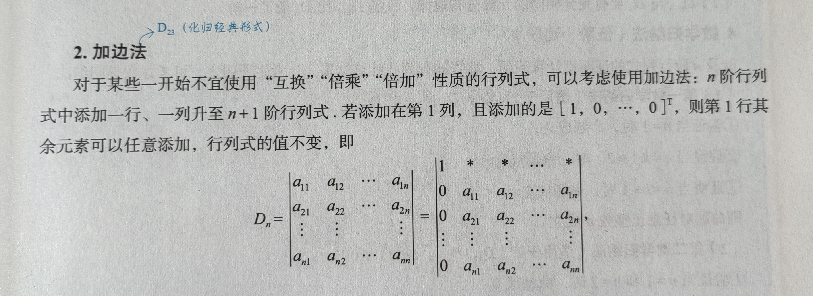
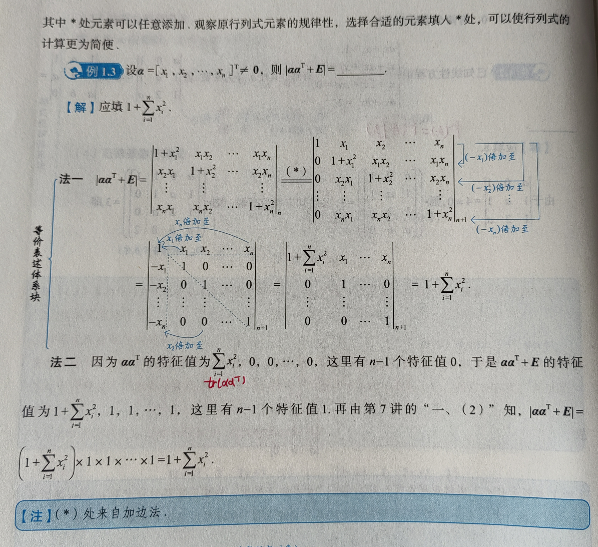

# **线性代数**

## 第 1 讲 行列式

### 一、具体型行列式的计算：$a_{ij}$ 已给出

**加边法**

## 第 2 讲 余子式和代数余子式的计算

// TODO

## 第 3 讲 矩阵运算

// TODO

## 第 4 讲 矩阵的秩

// TODO

## 第 5 讲 线性方程组

// TODO

## 第 6 讲 向量组

// TODO

## 第 7 讲 特征值与特征向量

// TODO

## 第 8 讲 相似理论

// TODO

## 第 9 讲 二次型

// TODO

## 附录：杂项

// TODO

## 附录：常考已知条件

1. $r(A) = r \lt n$

   * $\Rightarrow |A| = 0$

   * $\Rightarrow A$ 不可逆

   * $\Rightarrow A$ 的列向量线性相关，且有 $r$ 个向量组成的部分组线性无关

   * $\Rightarrow Ax = 0$ 有非 0 解，且基础解系中有 $n - r$ 个向量，即有 $n - r$ 个自由变量

   * $\Rightarrow 0$ 是 $A$ 的特征值，且对应着 $n - r$ 个无关的特征向量

     （若 $A$ 为实对称矩阵，则 $0$ 是 $A$ 的 $n - r$ 重特征值）

2. $r(A) = 1$（$A_{n\times n}$）

   * $\Leftrightarrow A$ 各行成比例
   * $\Leftrightarrow A = \alpha\beta^T(\alpha,\beta \ne 0)$
     * $\Rightarrow tr(A) = \alpha^T\beta$ 或 $\beta^T \alpha$
     * $A$ 的特征值为 $n - 1$ 个 $0$ 和一个 $\alpha^T \beta$

3. $A$ 各行元素之和均为 $k$（$A = (a_{ij})_{n\times n}$）

   * $\Leftrightarrow \begin{cases} a_{11} + \cdots + a_{1n} = k \\ \cdots \\ a_{n1} + \cdots + a_{nn} = k \end{cases}$
   * $\Leftrightarrow Ax = (k, \cdots, k)^T$ 有解 $(1, \cdots, 1)^T$
   * $\Leftrightarrow A(1, \cdots, 1)^T = (k, \cdots, k)^T = k(1, \cdots, 1)^T$
   * $\Leftrightarrow k$ 是 $A$ 的特征值，对应特征向量为 $(1, \cdots, 1)^T$

4. $A^* = A^T$（$A = (a_{ij})_{n\times n}$）

   * $\Leftrightarrow \begin{pmatrix} A_{11} & \cdots & A_{1n} \\ \vdots &  & \vdots \\ A_{n1} & \cdots & A_{nn} \end{pmatrix} = \begin{pmatrix} a_{11} & \cdots & a_{1n} \\ \vdots &  & \vdots \\ a_{n1} & \cdots & a_{nn} \end{pmatrix}$ 
   * $\Leftrightarrow A_{ij} = a_{ij}$

5. $AB = O$（$A_{m\times n}$，$B_{n\times s}$）

   * $\Leftrightarrow A(\beta_1, \cdots , \beta_s) = (0, \cdots, 0)$ 
   * $\Leftrightarrow A\beta_1 = 0, \cdots ,A\beta_s = 0$
     1. $\Rightarrow B$ 的列向量是 $Ax = 0$ 的解（的子集）
     2. $\Rightarrow r(B) \le n - r(A) \Rightarrow r(A) + r(B) \le n$

6. $AB = C$（$A_{m\times n}$，$B_{n\times s}$）

   * $\Leftrightarrow (\alpha_1, \cdots, \alpha_n) \begin{pmatrix} b_{11} & \cdots & b_{1s} \\ \vdots &  & \vdots \\ b_{n1} & \cdots & b_{ns} \end{pmatrix} = (\gamma_1, \cdots, \gamma_s)$
   * $\Leftrightarrow \begin{cases} \alpha_1 b_{11} + \cdots + \alpha_n b_{n1} = \gamma_1 \\ \vdots \\ \alpha_1 b_{1s} + \cdots + \alpha_n b_{ns} = \gamma_s \end{cases}$
   * $\Leftrightarrow C$ 的列向量组能由 $A$ 的列向量组线性表示
   * $\Leftrightarrow r(A|C) = r(A) \Rightarrow r(A|AB) = r(A)$

7. 一组向量由另一组向量线性表示 $\begin{cases} \beta_1 = k_{11} \alpha_1 + \cdots + k_{1n} \alpha_n \\ \vdots \\ \beta_n = k_{n1} \alpha_1 + \cdots + k_{nn} \alpha_n \end{cases}$

   * $\Leftrightarrow (\beta_1, \cdots, \beta_n) = (\alpha_1, \cdots, \alpha_n) \begin{pmatrix} k_{11} & \cdots & k_{n1} \\ \vdots &  & \vdots \\ k_{1n} & \cdots & k_{nn} \end{pmatrix}$

   * $\Leftrightarrow B = AP$

     若 $P$ 可逆，则 $P^{-1}AP = B$

     

   

