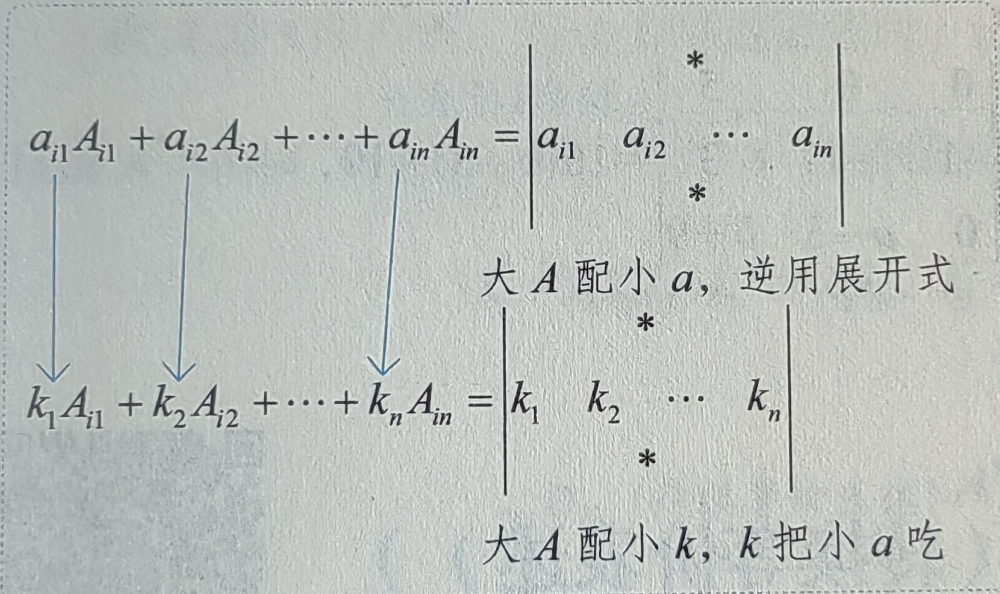
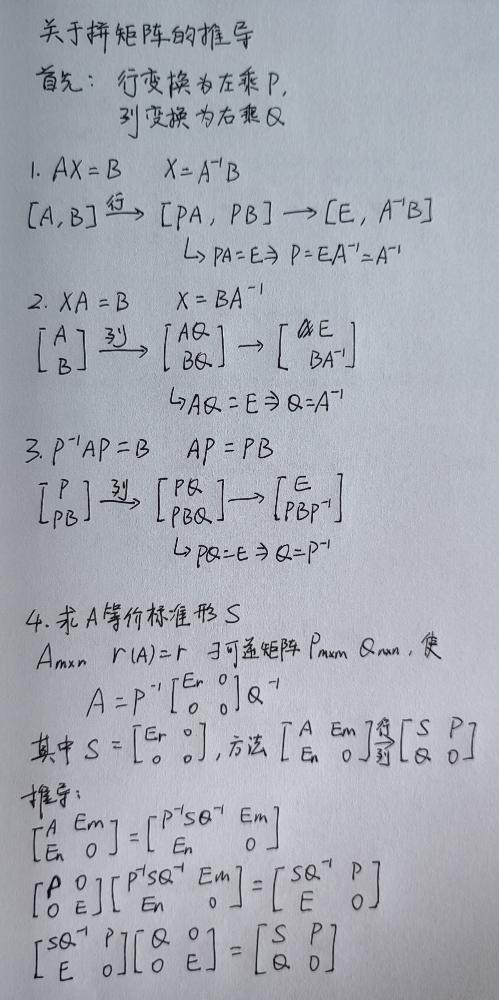
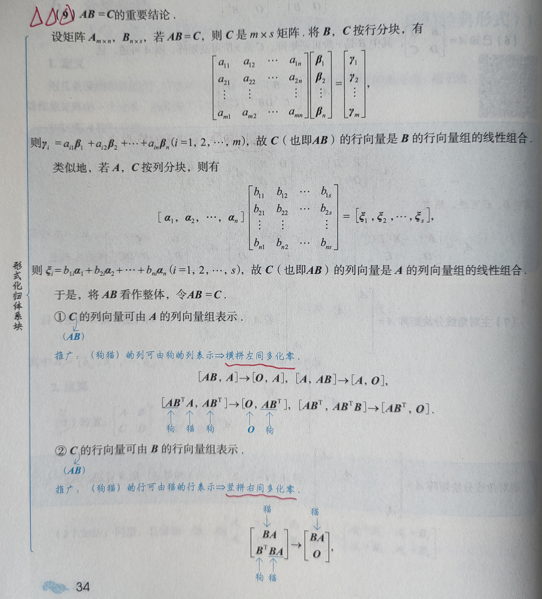
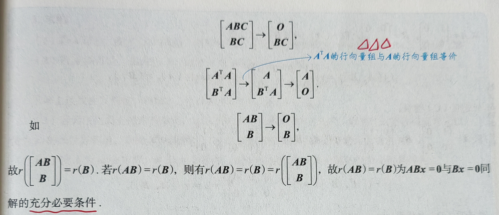
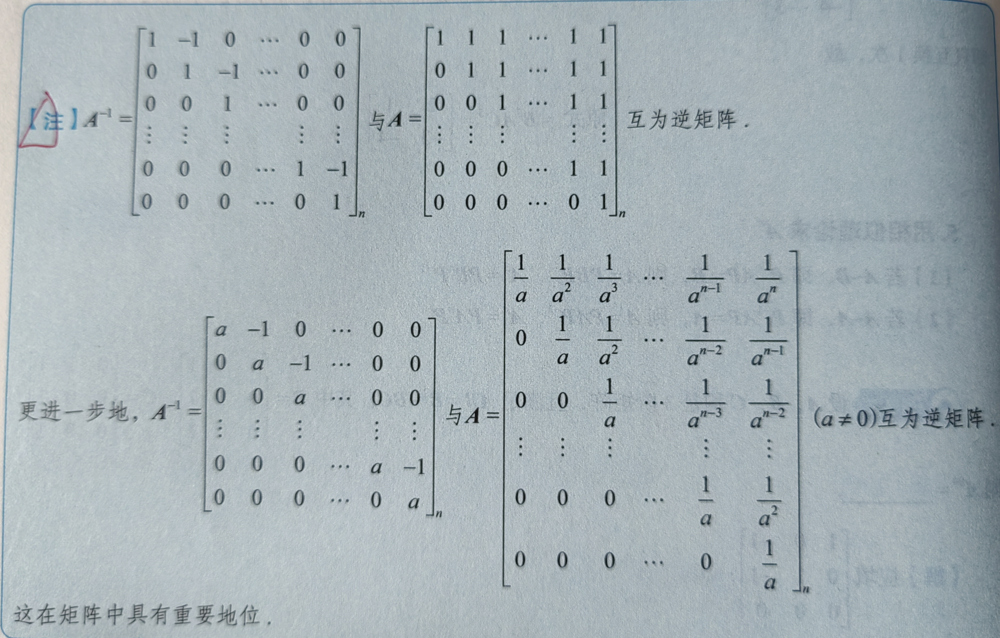
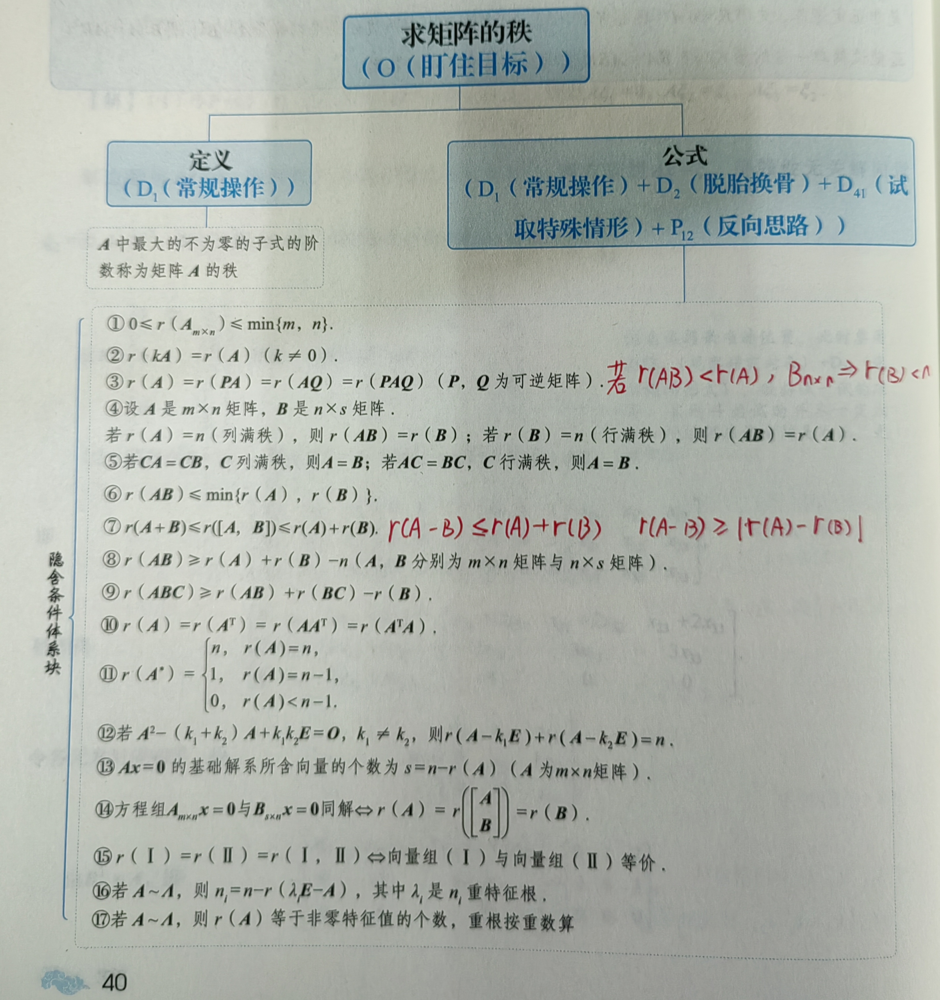
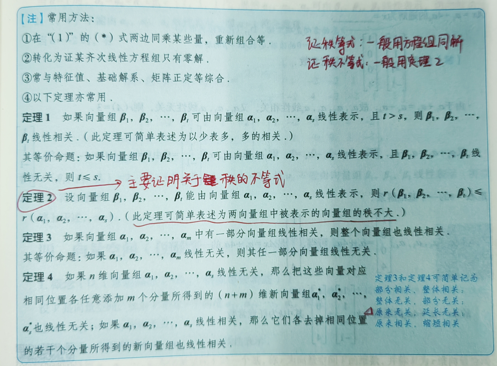

# **线性代数**

## 第 1 讲 行列式

### 一、具体型行列式的计算：$a_{ij}$ 已给出

**加边法**

**爪型行列式**

许多爪型行列式难以通过初等变换化简，此时如果是求行列式值的题应考虑递推式，如果是证明题应考虑数学归纳法

### 二、抽象型行列式的计算：$a_{ij}$ 未给出

**行和相等的行列式**
$$
\left|\begin {array}{c}
a &b &\cdots &b \\
b &a &\cdots &b \\
\vdots &\vdots & &\vdots \\
b &b &\cdots &a
\end{array}\right| = [a + (n - 1)b](a - b)^{n - 1}
$$

**特征多项式**

$A$ 为 $3$ 阶矩阵，则其特征多项式形如
$$
|\lambda E - A| = \lambda^3 + a\lambda^2 + b \lambda + c
$$

## 第 2 讲 余子式和代数余子式的计算

### 一、用行列式

### 二、用矩阵

当 $|A| \ne 0$ 时，有 $A^* = |A|A^{-1}$，由于 $A^*$ 由 $A_{ij}$ 构成，用该式求出 $A^*$，即得到所有的 $A_{ij}$

注：此方法要求 $|A| \ne 0$

### 三、用特征值

设 $A$ 为三阶方阵，可逆，特征值为 $\lambda_1$，$\lambda_2$，$\lambda_3$
$$
A_{11} + A_{22} + A_{33} = tr(A^*) = \lambda_1^* + \lambda_2^* + \lambda_3^* = \lambda_2\lambda_3 + \lambda_1\lambda_3 + \lambda_1\lambda_2
$$

>证明：
>
>$A^{-1}$ 的特征值为 $\lambda_1^{-1}$，$\lambda_2^{-1}$，$\lambda_3^{-1}$ ，且由 $A^* = |A|A^{-1} = \lambda_1\lambda_2\lambda_3A^{-1}$
>
>故 $A$ 的特征值 $\lambda_1 = \lambda_2\lambda_3$，$\lambda_2 = \lambda_1\lambda_3$，$\lambda_3 = \lambda_1\lambda_2$

## 第 3 讲 矩阵运算

### 证 $A = O$

1. $r(A) = 0$，则 $A = O$
2. $r(A) \lt n - 1$，则 $A^* = O$
3. $tr(AA^T) = 0$，则 $A = O$，**注：格拉姆矩阵的迹为 $A$ 列向量模长的平方和。$tr(AA^T) = tr(A^TA)$**
   * $tr(A^TA)$ 也符合这个结论
4. $A$ 的行向量与 $B$ 的列向量均正交，则 $AB = \begin{pmatrix} \alpha_1 \\ \vdots \\ \alpha_n \end{pmatrix} \begin{pmatrix} \beta_1 & \cdots & \beta_m \end{pmatrix} = O$
   * $r(A) + r(B) \le A的列数$

### 计算 $A^n$

1. $A$ 为方阵且 $r(A) = 1$，拆分为 $\alpha\beta^T$，列出式子再合并 $\beta^T \alpha$（一个数）
2. 试算 $A^2$（或 $A^3$）找规律
   * 若 $A^2 = kA$，则 $A^n = k^{n - 1}A$
   * 若 $A^2 = kE$，则 $\begin{cases} A^{2n} = k^n E & (若k = -1，则A^4 = E) \\ A^{2n + 1} = k^n A \end{cases}$
3. 分解 $A = B + C$，若 $BC = CB$，则可以使用二项式定理
   * 若 $B = E$，则可简化二项式定理
   * 若 $BC = CB = O$，则二项式定理只剩一头一尾，$A^n = B^n + C^n$
4. 用初等矩阵知识求 $P_1^m A P_2^n$，左行右列，几次方就是做几次初等变换
5. 用相似理论求 $A^n$
   * 若 $A\sim B$，即 $P^{-1}AP = B$，则 $A = PBP^{-1}$，$A^n = PB^nP^{-1}$
   * 若 $A\sim \Lambda$，即 $P^{-1}AP = \Lambda$，则 $A = P\Lambda P^{-1}$，$A^n = P\Lambda^nP^{-1}$

### 初等变换与初等矩阵

1. 初等变换

   * 初等 **行** 变换：左乘可逆矩阵 $P$，保持 **列** 向量的线性相关性，但改变 **行** 关系
   * 初等 **列** 变换：右乘可逆矩阵 $Q$，保持 **行** 向量的线性相关性，但改变 **列** 关系

2. 初等矩阵的性质

   * $|E_{ij}| = -1$，$|E_{ij}(k)| = 1$，$|E_i(k)| = k$

   * $E_{ij}^T = E_{ij}$，$E_{ij}^T(k) = E_{ji}(k)$，$E_i^T(k) = E_i(k)$

   * $E_{ij}^{-1} = E_{ij}$，$E_{ij}^{-1}(k) = E_{ij}(-k)$，$E_i^{-1}(k) = E_i(\cfrac{1}{k})$

   * $E_{ij}^* = |E_{ij}|E_{ij}^{-1} = -E_{ij}$

     $E_{ij}^*(k) = |E_{ij}(k)|E_{ij}^{-1}(k) = E_{ij}(-k)$

     $E_i^*(k) = |E_i(k)|E_i^{-1}(k) = kE_i(\cfrac{1}{k})$

3. 初等变换的各种使用场合

   * 用于联系初等变换前、后行列式的关系
   * 用于求逆矩阵：$[A, E] \xrightarrow{\text{行}} [E, A^{-1}]$ 或 $\begin{bmatrix} A \\ E \end{bmatrix} \xrightarrow{\text{列}} \begin{bmatrix} E \\ A^{-1} \end{bmatrix}$
   * 用于求矩阵的秩：可行可列
   * 用于解线性方程组：若 $Ax = \beta$，则 $[A, \beta] \xrightarrow{\text{行}} [PA, P\beta]$
   * 用于解矩阵方程
     * $AX = B$，则 $X = A^{-1}B$，于是 $[A, B] \xrightarrow{\text{行}} [E, A^{-1}B]$
     * $XA = B$，则 $X = BA^{-1}$，于是 $\begin{bmatrix} A \\ B \end{bmatrix} \xrightarrow{\text{列}} \begin{bmatrix} E \\ BA^{-1} \end{bmatrix}$
     * 求解 $P^{-1}AP = B$ 中的 $A$，可写成 $AP = PB$，于是 $\begin{bmatrix} P \\ PB \end{bmatrix} \xrightarrow{\text{列}} \begin{bmatrix} E \\ PBP^{-1} \end{bmatrix} = \begin{bmatrix} E \\ A \end{bmatrix}$
   * 用于求极大线性无关组
     * 化行最简，行阶梯
     * 若台阶数为 $r$，按列找出 $r$ 个线性无关的列向量，即为极大线性无关组

   * 用于求矩阵 $A$ 的等价标准形及分解方法
   * 用于矩阵的满秩分解（P30 圈 8）

   

### 分块矩阵

1. 转置：$\begin{pmatrix} A & B \\ C & D \end{pmatrix}^T = \begin{pmatrix} A^T & C^T \\ B^T & D^T \end{pmatrix}$

2. 分块阵求逆
   $$
   A = \left[
   \begin{matrix}
   B & O \\
   D & C
   \end{matrix}
   \right], A^{-1} = \left[
   \begin{matrix}
   B^{-1} & O \\
   -C^{-1}DB^{-1} & C^{-1}
   \end{matrix}
   \right] \\
   
   A = \left[
   \begin{matrix}
   B & D \\
   O & C
   \end{matrix}
   \right], A^{-1} = \left[
   \begin{matrix}
   B^{-1} & -B^{-1}DC^{-1} \\
   O & C^{-1}
   \end{matrix}
   \right] \\
   
   A = \left[
   \begin{matrix}
   O & B \\
   C & D
   \end{matrix}
   \right], A^{-1} = \left[
   \begin{matrix}
   -C^{-1}DB^{-1} & C^{-1} \\
   B^{-1} & O
   \end{matrix}
   \right] \\
   
   A = \left[
   \begin{matrix}
   D & B \\
   C & O
   \end{matrix}
   \right], A^{-1} = \left[
   \begin{matrix}
   O & C^{-1} \\
   B^{-1} & -B^{-1}DC^{-1}
   \end{matrix}
   \right]
   $$

   * 左乘同行，右乘同列，再添负号
   * **副** 对角阵，就有 **附** 加的操作，即先交换主副对角线，再做相同的操作

3. $AB = O$，$r(A) + r(B) \le n$

4. $AB = C$ 重要结论

   
   
   

### 求解矩阵方程

看到矩阵方程，一定要关注矩阵的可逆性，若可逆就意味着可以将矩阵拿到等号另一边去化简

若不可逆，如 $AX = B$，考虑将 $X$ 和 $B$ 按列分块，得
$$
A [\xi_1, \xi_, \cdots, \xi_n] = [\beta_1, \beta_2, \cdots, \beta_n]
$$
即 $A\xi_i = \beta_i(i = 1, 2, \cdots, n)$

求解上述线性方程组，得解 $\xi_i$，从而得 $X = [\xi_1, \xi_, \cdots, \xi_n]$

### 杂项

1. $a_n = \cfrac{n(n - 1)}{2}$，数列以 $0, 1, 3, 6$ 开头
2. $A = \begin{pmatrix} \cos{\theta} & -\sin{\theta} \\ \sin{\theta} & \cos{\theta} \end{pmatrix}$ 为正交矩阵，其几何意义为当作用于 $\vec{OP}$ 时，有 $\vec{OP}$ 绕原点逆时针旋转 $\theta$
   * 推论：若 $\theta = \cfrac{\pi}{3}$ 时，$A^6 = E$，即转一圈，$A^{12} = E$，即转两圈
3. 

## 第 4 讲 矩阵的秩

1. n 阶可逆矩阵的秩是 n
1. 矩阵的秩越乘越小

## 第 5 讲 线性方程组

### 一、线性方程组理论总结

1. 齐次线性方程组 $Ax = 0$，系数矩阵 $A$ 的行向量与 $Ax = 0$ 的解向量正交。解题时可以考虑将 $A$ 拆成行向量
   * 线性代数的基本研究对象是向量，将矩阵拆成向量可能是解题的突破口
2. 非齐次线性方程组 $Ax = b$ 的通解
   * 其导出组 $Ax = 0$ 的基础解系为 $\xi_1,\xi_2,\cdots,\xi_{n - r}$
   * $Ax = b$ 的一个特解为 $\eta^*$
   * 通解为 $x = \eta^* + k_1\xi_1 + k_2\xi_2 + \cdots + k_{n - r}\xi_{n - r}$

### 二、线性方程组问题

1. 一般求解问题（含参常考）
2. 公共解问题：本质是联立方程组求解，体现在矩阵上就是矩阵竖拼
3. 同解问题
   * 齐次：$Ax = 0,Bx = 0$
     * 三秩相同
     * 行向量组等价
     * 存在矩阵 $P,Q$，使得 $B = PA,A = QB$
   * 非齐次：$Ax = \beta,Bx = \gamma$
     * 四秩相同
     * 各自导出组同解，且非齐次有公共解
     * $[A, \beta]$ 与 $[B, \gamma]$ 的行向量组等价

## 第 6 讲 向量组

### 研究具体型向量关系

1. 设 $a_1,a_2,a_3$ 是三个向量，将它们作为列向量拼成一个矩阵 $A = [a_1,a_2,a_3]$。那么：
   - 向量组线性无关 $\Leftrightarrow A$ 满秩  $\Leftrightarrow$ 齐次方程组只有零解 $\Leftrightarrow$ 如果 $A$ 是方阵，则 $|A| = 0$
   - 向量组线性相关 $\Leftrightarrow A$ 不满秩 $\Leftrightarrow$ 齐次方程组有非零解 $\Leftrightarrow$ 如果 $\Leftrightarrow$ 是方阵，则 $|A| = 0$

### 研究抽象型向量关系

1. **向量组等价** 的条件是三秩相等：$ r(1) = r(2) = r(1|2) $。当此条件被破坏时，有以下推论：

   - 若向量组 1 可线性表示向量组 2，但反之不真，则 $ r(1) = r(1|2) $ 且 $ r(1) > r(2) $
   - 若向量组 2 可线性表示向量组 1，但反之不真，则 $ r(2) = r(1|2) $ 且 $ r(1) < r(2) $

   此结论反映了线性表示关系与秩的大小关系：能表示对方的一方秩较大，且合并组的秩与能表示方相同

2. $n$ 个向量线性无关，则这 $n$ 个向量均不为零向量

3. **当向量个数明显超过维数时，可直接判定为线性相关**

   要证明 "必线性无关" 不成立，只需构造一个线性相关的例子

   将向量作为列构成矩阵 $A$，则 $r(A) = 最大线性无关向量数$

4. 定义研究抽象型向量组线性相关线性无关

   

## 第 7 讲 特征值与特征向量 

### 特征值的作用

1. **简化运算**：特征值能将复杂的矩阵运算（如幂级数 $f(A)$）转化为简单的标量运算（$f(A)$ 的特征值就是 $f(\lambda)$）
2. **判断可逆**：矩阵是否可逆，取决于它是否存在为零的特征值
3. **计算行列式**：矩阵的行列式等于其所有特征值的乘积
4. **实现对角化**：利用特征值和特征向量，可以将矩阵分解为对角形式，从而极大简化矩阵的幂运算

### 用特征值命题

1. 若 $|aA + bE| = 0$（或 $aA + bE$ 不可逆）$a \ne 0$，则 $-\cfrac{b}{a}$ 是 $A$ 的特征值

### 用特征向量命题

1. 特征值可能一对多特征向量，反之不真
2. $n$ 阶矩阵只有一个线性无关的特征向量 $\lambda$，则 $\lambda$ 一定是 $n$ 重根
3. 特征向量可以随意缩放（只要缩放因子不为 0），要求所有特征向量的时候可以用一个任意系数表示
   * 特别的 $k$ 重根的特征向量表示为所有对应特征向量的线性组合

## 第 8 讲 相似理论

### 杂项

1. 若 $n$ 阶矩阵 $A$，$B$ 满足 $AB = BA$，且 $A$ 有 $n$ 个互异特征值，则 $A$ 的特征向量都是 $B$ 的特征向量
   * 在上述结论中，这 $n$ 个互异特征值对应的 $n$ 个特征向量线性无关，故可以构成同一可逆矩阵 $P$ 将两个矩阵相似对角化

## 第 9 讲 二次型

### 正交变换与可逆变换

1. 正交变换：存在正交矩阵 $Q$ 使得 $Q^TAQ = B$，A、B 既相似又合同
2. 可逆变换：存在可逆矩阵 $P$ 使得 $P^{-1}AP = B$，A、B 既相似又合同

### 合同的判定与手段

1. 若矩阵 $A$，$B$ 相似于同一对角阵，即 $\lambda_A = \lambda_B$，$A\sim B$，则可使用 **正交变换法** 求解合同变换的手段 $Q$

   若矩阵 $A$，$B$ 相似于不同对角阵，即 $\lambda_A \ne \lambda_B$，不相似，无法使用正交变换法，则可使用 **配方法** 求解合同变换的手段 $Q$

### 合同与相似的异同

1. 对于实对称矩阵 $A$，$B$，相似必合同，反之不成立

## 附录：杂项

// TODO

## 附录：常考已知条件

1. $r(A) = r \lt n$

   * $\Rightarrow |A| = 0$

   * $\Rightarrow A$ 不可逆

   * $\Rightarrow A$ 的列向量线性相关，且有 $r$ 个向量组成的部分组线性无关

   * $\Rightarrow Ax = 0$ 有非 0 解，且基础解系中有 $n - r$ 个向量，即有 $n - r$ 个自由变量

   * $\Rightarrow 0$ 是 $A$ 的特征值，且对应着 $n - r$ 个无关的特征向量

     （若 $A$ 为实对称矩阵，则 $0$ 是 $A$ 的 $n - r$ 重特征值）

2. $r(A) = 1$（$A_{n\times n}$）

   * $\Leftrightarrow A$ 各行成比例
   * $\Leftrightarrow A = \alpha\beta^T(\alpha,\beta \ne 0)$
     * $\Rightarrow tr(A) = \alpha^T\beta$ 或 $\beta^T \alpha$
     * $A$ 的特征值为 $n - 1$ 个 $0$ 和一个 $\alpha^T \beta$

3. $A$ 各行元素之和均为 $k$（$A = (a_{ij})_{n\times n}$）

   * $\Leftrightarrow \begin{cases} a_{11} + \cdots + a_{1n} = k \\ \cdots \\ a_{n1} + \cdots + a_{nn} = k \end{cases}$
   * $\Leftrightarrow Ax = (k, \cdots, k)^T$ 有解 $(1, \cdots, 1)^T$
   * $\Leftrightarrow A(1, \cdots, 1)^T = (k, \cdots, k)^T = k(1, \cdots, 1)^T$
   * $\Leftrightarrow k$ 是 $A$ 的特征值，对应特征向量为 $(1, \cdots, 1)^T$

4. $A^* = A^T$（$A = (a_{ij})_{n\times n}$）

   * $\Leftrightarrow \begin{pmatrix} A_{11} & \cdots & A_{1n} \\ \vdots &  & \vdots \\ A_{n1} & \cdots & A_{nn} \end{pmatrix} = \begin{pmatrix} a_{11} & \cdots & a_{1n} \\ \vdots &  & \vdots \\ a_{n1} & \cdots & a_{nn} \end{pmatrix}$ 
   * $\Leftrightarrow A_{ij} = a_{ij}$

5. $AB = O$（$A_{m\times n}$，$B_{n\times s}$）

   * $\Leftrightarrow A(\beta_1, \cdots , \beta_s) = (0, \cdots, 0)$ 
   * $\Leftrightarrow A\beta_1 = 0, \cdots ,A\beta_s = 0$
     1. $\Rightarrow B$ 的列向量是 $Ax = 0$ 的解（的子集）
     2. $\Rightarrow r(B) \le n - r(A) \Rightarrow r(A) + r(B) \le n$

6. $AB = C$（$A_{m\times n}$，$B_{n\times s}$）

   * $\Leftrightarrow (\alpha_1, \cdots, \alpha_n) \begin{pmatrix} b_{11} & \cdots & b_{1s} \\ \vdots &  & \vdots \\ b_{n1} & \cdots & b_{ns} \end{pmatrix} = (\gamma_1, \cdots, \gamma_s)$
   * $\Leftrightarrow \begin{cases} \alpha_1 b_{11} + \cdots + \alpha_n b_{n1} = \gamma_1 \\ \vdots \\ \alpha_1 b_{1s} + \cdots + \alpha_n b_{ns} = \gamma_s \end{cases}$
   * $\Leftrightarrow C$ 的列向量组能由 $A$ 的列向量组线性表示
   * $\Leftrightarrow r(A|C) = r(A) \Rightarrow r(A|AB) = r(A)$

7. 一组向量由另一组向量线性表示 $\begin{cases} \beta_1 = k_{11} \alpha_1 + \cdots + k_{1n} \alpha_n \\ \vdots \\ \beta_n = k_{n1} \alpha_1 + \cdots + k_{nn} \alpha_n \end{cases}$

   * $\Leftrightarrow (\beta_1, \cdots, \beta_n) = (\alpha_1, \cdots, \alpha_n) \begin{pmatrix} k_{11} & \cdots & k_{n1} \\ \vdots &  & \vdots \\ k_{1n} & \cdots & k_{nn} \end{pmatrix}$

   * $\Leftrightarrow B = AP$

     若 $P$ 可逆，则 $P^{-1}AP = B$

     

   

