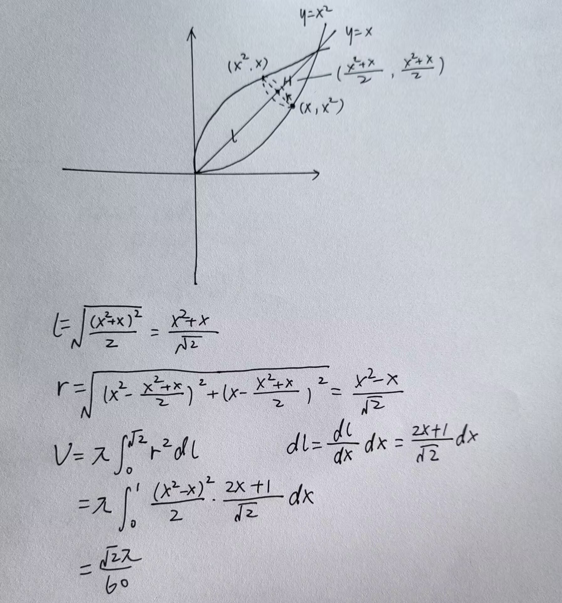

# **高等数学**

## 零基础

1. | 符号   | 名称       | 符号        | 名称 |
   | ------ | ---------- | ----------- | ---- |
   | $\cup$ | 并集（或） | $\bigvee$   | 析取 |
   | $\cap$ | 交集（且） | $\bigwedge$ | 合取 |

2. 逆否命题：若 $A \to B$，则 $\bar{B} \to \bar{A}$

   德摩根律：**短** 的并/交变成 **长** 的交/并

   * $\overline{A} \cup \overline{B} = \overline{A \cap B}$

   * $\overline{A} \cap \overline{B} = \overline{A \cup B}$

3. 数学归纳法：设 $T(n)$ 是关于自然数 $n$ 的命题，若

   1. $T(1)$ 成立
   2. 设 $T(k)(k \ge 1)$ 成立
   3. 证得 $T(k+1)$

   则 $T(n)$ 成立

4. 有理式的运算 // TODO

5. 无理式的运算

   * $(\sqrt[n]{a})^k = \sqrt[n]{a^k}$

   * 只要根号下为偶数次方，化简出来就必须要加绝对值

6. 均值不等式：$\cfrac{2}{\cfrac{1}{a} + \cfrac{1}{b}} \le \sqrt{ab} \le \cfrac{a + b}{2} \le \sqrt{\cfrac{a^2 + b^2}{2}}$

   三角不等式：$\vert \vert a \vert - \vert b \vert \vert \le \vert a + b \vert \le \vert a \vert + \vert b \vert$

   * 第一个小于等于号：当且仅当 $ab \le 0$，即 $a$、$b$ 异号时取等
   * 第二个小于等于号：当且仅当 $ab \ge 0$，即 $a$、$b$ 同号时取等

   柯西不等式：$(a_1^2 + a_2^2 + \dots + a_n^2)(b_1^2 + b_2^2 + \dots + b_n^2) \ge (a_1b_1 + a_2b_2 + \dots + a_nb_n)^2$

   * 常考 $(a_1^2 + a_2^2)(b_1^2 + b_2^2) \ge (a_1b_1 + a_2b_2)^2$
   * 可化为 $\| \alpha \| \cdot \| \beta  \| \ge \| \alpha \| \| \beta  \| \cos{\theta}$

7. 多次相乘、相除、开方、乘方的式子，取对数可以化简

8. | 函数         | 定义域               | 值域                                               |
   | ------------ | -------------------- | -------------------------------------------------- |
   | $\arcsin{x}$ | $ x \in [-1, 1] $    | $ \left[ -\dfrac{\pi}{2}, \dfrac{\pi}{2} \right] $ |
   | $\arccos{x}$ | $ x \in [-1, 1] $    | $ \left[ 0, \pi \right] $                          |
   | $\arctan{x}$ | $ x \in \mathbb{R} $ | $ \left( -\dfrac{\pi}{2}, \dfrac{\pi}{2} \right) $ |

9. 图形变换

   * 函数上加下减，自变量左加右减
   * 函数乘 $k$ 垂直伸长 $k$ 倍，自变量乘 $k$ 水平伸长 $\cfrac{1}{k}$ 倍

10. 三角万能公式：$asin{x} + bcos{x} = \sqrt{a^2 + b^2}sin{x + \phi}$，其中 $tan{\phi} = \cfrac{b}{a}$

11. 双阶乘

    * 偶数的双阶乘：$(2n)!! = 2 \times 4 \times 6 \times \dots \times 2n = 2^n n!$
    * 奇数的双阶乘：$(2n - 1)!! = 1 \times 3 \times 5 \times \dots \times (2n - 1) = \cfrac{(2n)!}{2^nn!}$
    * 

## 第 1 讲 函数极限与连续

### [P52] 反函数

1. $f[f^{-1}(x)] = x$

   $f^{-1}[f(x)] = x$

### [P56] 函数有界

1. 有界 $\Rightarrow \exists M \gt 0$，使得在 $x_0$ 的邻域内有 $|f(x_0)| \lt M$

2. 函数 $f(x)$ 在 **开区间** $(a, b)$ 有界的充分条件，必须同时满足
   * $f(x)$ 在 $(a, b)$ 连续
   * $\lim_{x \to a^+} f(x)$ 存在
   * $\lim_{x \to b^-} f(x)$ 存在

3. 闭区间内函数连续必有界

4. 若 $f(x)$ 单调递减，且 $\lim_{x \to +\infty} f(x) = A$，则 $f(x) \ge A$（对数列也适用）

   若 $f(x)$ 单调递增，且 $\lim_{x \to +\infty} f(x) = A$，则 $f(x) \le A$（对数列也适用）

### [P75] 函数极限的定义 

$\lim_{x \to x_0} f(x) = A \Leftrightarrow$ $\forall \epsilon \gt 0,\exists \delta \gt 0$，当 $0 \lt |x - x_0| \lt \delta$ 时，有 $|f(x) - A| \lt \epsilon $

[数列极限的定义](#数列极限的定义)

### [P83] 函数极限的性质

1. **唯一性**：若极限 $\lim_{x \to x_0}f(x)$ 存在，那么极限唯一
2. **局部有界性**：若 $\lim_{x \to x_0} f(x) = A$，则存在正常数 $M$ 和 $\delta$，使得当 $0 \lt |x - x_0| \lt \delta$ 时，有 $|f(x)| \le M$
3. **局部保号性**：脱帽严格不等，带帽非严格不等

### [P90] 无穷小

1. $\alpha (x)$ 是 $\beta(x)$ 的 **高阶** 无穷小：$\lim \cfrac{\alpha (x)}{\beta (x)} = 0$
2. $\alpha (x)$ 是 $\beta(x)$ 的 **低阶** 无穷小：$\lim \cfrac{\alpha (x)}{\beta (x)} = \infty$
3. $\alpha (x)$ 与 $\beta(x)$ 是 **同阶** 无穷小：$\lim \cfrac{\alpha (x)}{\beta (x)} = c \ne 0$
4. $\alpha (x)$ 与 $\beta(x)$ 是 **等价** 无穷小：$\lim \cfrac{\alpha (x)}{\beta (x)} = 1$

>若 $\lim \cfrac{\alpha (x)}{\beta (x)}$ 不存在，则两个无穷小无法比阶

### [P93] 极限计算

1. 极限四则运算规则：当 $f(x)$ 与 $g(x)$ 极限都存在时，函数的加减乘除分别等于极限的加减乘除（除要求分母极限不为零）

2. 洛必达法则：$\cfrac{0}{0}$、$\cfrac{\infty}{\infty}$；**注：右存在，则左存在；但左存在，并不意味着右存在**

3. 泰勒公式：[泰勒公式记忆方法_泰勒公式怎么记忆-CSDN 博客](https://blog.csdn.net/fhuaiyun/article/details/127795519)

   * 具体展开到几阶的原则：

4. 无穷小的运算：设 $m$、$n$ 为正整数，则

   * $o(x^m) \pm o(x^n) = o(x^l)，l = \min{\{m, n\}}$（加减法时低阶“吸收”高阶）
   * $o(x^m) \cdot o(x^n) = o(x^{m + n})，x^m \cdot o(x^n) = o(x^{m + n})$（乘法时阶数“累加”）
   * $o(x^m) = o(kx^m) = k \cdot o(x^m)，k \ne 0$ 且为常数（非零常数相乘不影响阶数）

   >对于无穷小来说，次数越小越大，对于无穷大来说，次数越大越大

5. 泰勒公式应用时的展开原则：分式同阶，相减互异

   * $\cfrac{A}{B}$ 型，展开到上下同阶
   * $A - B$ 型，将 $A$，$B$ 分别展开到它们的系数不相等的 $x$ 的最低次幂为止

6. 两个重要极限
   $$
   \lim_{x \rightarrow 0} \frac{\sin{x}}{x} = 1，\lim_{x \rightarrow \infty} (1 + \frac{1}{x}^x) = e
   $$

7. 夹逼准则

**七种未定式处理方法**

| 未定式形式               | 典型例子                                                  | 主要处理方法                                                 | 关键注意事项                                                 |
| :----------------------- | :-------------------------------------------------------- | :----------------------------------------------------------- | :----------------------------------------------------------- |
| $\cfrac{0}{0}$           | $\lim_{x\to0}\cfrac{\sin x}{x}$                           | 1. **洛必达**：$\lim\cfrac{f}{g}=\lim\cfrac{f'}{g'}$ 2. **因式分解** 3. **有理化** 4. **泰勒展开** 5. **等价无穷小**：$\sin x \sim x$ | • 洛必达需验证条件 • 等价代换仅乘除有效                   |
| $\cfrac{\infty}{\infty}$ | $\lim_{x\to\infty}\cfrac{2x^2+3}{x^2-5}$                  | 1. **洛必达** 2. **同除最高次幂**：$\lim\cfrac{a_nx^n}{b_mx^m} = \cfrac{a_n}{b_m}\delta_{nm}$ | • 有理函数首选同除法 • 可重复洛必达                       |
| $0 \cdot \infty$         | $\lim_{x\to0^+}x\ln x$                                    | **转化为标准型**： $\begin{cases} \cfrac{0}{1/\infty} \Rightarrow 0/0 \\ \cfrac{\infty}{1/0} \Rightarrow \infty/\infty \end{cases}$ | • 选择易求导形式 • 注意定义域限制                         |
| $\infty - \infty$        | $\lim_{x\to0}\left(\cfrac{1}{\sin x}-\cfrac{1}{x}\right)$ | 1. **通分** 2. **有理化**：$\cfrac{A-B}{1}$ 3. **提取公因子** 4. **转化为 0/0 或 ∞/∞ 型**：如令 $t = \cfrac{1}{x}$ | • 根式差必有理化 • 目标使分子分母可导                     |
| $1^{\infty}$             | $\lim_{x\to\infty}\left(1+\cfrac{1}{x}\right)^x$          | 1. **重要极限** 2. **对数恒等式**：$a^b = e^{b\ln{a}}$    | • 凑重要极限 • 对数恒等式通用                             |
| $0^0$                    | $\lim_{x\to0^+}x^x$                                       | **对数转化**： $\begin{cases} y=f^g \\ \ln y = g\ln f \\ \Rightarrow 0·\infty \end{cases}$ | • 要求 $f(x)>0$ • 结果 $e^L$ $L=\lim g\ln f$           |
| $\infty^0$               | $\lim_{x\to\infty}x^{1/x}$                                | **同 $0^0$ 型**                                              | • 转化后 $\ln f \to \infty$ • 结果可能是 $1$, 某个正数或无穷大 |

* $1^\infty$ 型
  * $\lim{u(x)^{v(x)}} = e^{\lim{v(x) \ln{u(x)}}} = e^{\lim{v(x) [u(x) - 1]}}$，后者使用 $(x \to 1) \quad \ln{x} \sim x - 1$

## 第 2 讲 数列极限

### [P126] 数列极限的定义 

$\{x_{n}\}$ 为一数列，存在常数 $a$，$\forall \epsilon \gt 0$，$\exists N \in \mathbb{N^+}$，使得当 $n > N$ 时，$|x_n - a| \lt \epsilon $ 恒成立，则称常数 $a$ 是数列 $\{x_{n}\}$ 的极限，或者称数列 $\{x_{n}\}$ 收敛于 $a$

[函数极限的定义](#函数极限的定义)

### [P129] 收敛数列的性质

1. **唯一性**：给出数列 $\{x_{n}\}$，若极限 $\lim_{n \to \infty}x_n = a$ 存在，则 $a$ 是唯一的
2. **有界性**：若数列 $\{x_{n}\}$，则数列 $\{x_{n}\}$ 有界
3. **保号性**：脱帽严格不等，带帽非严格不等

### [P129] 极限四则运算规则

1. 收敛 $\pm$ 收敛 = 收敛

   收敛 $\pm$ 发散 = 发散
   
   发散 $\pm$ 发散 = **不确定**

### [P130] 海涅定理（归结原则）

设函数 $ f(x) $ 在点 $ x_0 $ 的 **去心邻域** $ \mathring{U}(x_0, \delta) $ 内有定义，则  $\lim_{{x \to x_0}} f(x) = A$ 存在 $\Leftrightarrow$  对任何 $ \mathring{U}(x_0, \delta) $ 内以 $x_0$ 为极限的数列 $ \{x_n\} (x_n \ne x_0)$，极限 $\lim_{{n \to \infty}} f(x_n) = A$ 存在

>人话：对函数 $f(x)$，任意取值出来的数列在 $x \to x_0$ 时都收敛于 $A$，则 $\lim_{{x \to x_0}} f(x) = A$，否则 $\lim_{{x \to x_0}} f(x)$ 不存在
>
>数列极限与函数极限的桥梁

### [P132] 放缩的常用方法

1. **利用简单的放大与缩小**
   
   * 针对无穷项相加：$n \cdot n_{min} \le u_1 + u_2 + \dots + u_n \le n \cdot u_{max}$
   * 针对有限项相加：$1 \cdot u_{max} \le u_1 + u_2 + \dots + u_n \le n \cdot u_{max}$
   
2. **利用重要不等式**
   
   * $a,b \in \mathbb{R}$，则 $|a \pm b| \le |a| + |b|$，$\big\lvert |a| - |b|\big\rvert \le |a - b|$
   
     * 推广为 $n$ 个实数，$|a_1 \pm a_2 \pm \dots \pm a_n| \le |a_1| + |a_2| + \dots + |a_n|$
   
   * a. $\sqrt{ab} \le \cfrac{a + b}{2} \le \sqrt{\cfrac{a^2 + b^2}{2}} \quad (a,b \ge 0)$；$|ab| \le \cfrac{a^2 + b^2}{2}$
   
     b. $\sqrt[3]{abc} \le \cfrac{a + b + c}{3} \le \sqrt{\cfrac{a^2 + b^2 + x^2}{3}} \quad (a,b,c \ge 0)$
   
   * 设 $a \ge b \ge 0$，则
     $$
     \begin{cases}
     当 m \gt 0 时，a^m \ge b^m \\
     当 m \lt 0 时，a^m \le b^m \\
     \end{cases}
     $$
   
   * 若 $0 \lt a \lt x \lt b$，$0 \lt c \lt y \lt d$，则 $\cfrac{c}{b} \lt \cfrac{y}{x} \lt \cfrac{d}{a}$
   
   * $\sin{x} \lt x \lt \tan{x} \quad (0 \lt x \lt \cfrac{\pi}{2})$
   
   * $\sin{x} \lt x \quad (x \gt 0)$
   
   * 当 $0 \lt x \lt \cfrac{\pi}{4}$ 时，$x \lt \tan{x} \lt \cfrac{4}{\pi} x$
   
   * 当 $0 \lt x \lt \cfrac{\pi}{2}$ 时，$x \gt \sin{x} \gt \cfrac{2}{\pi} x$
   
   * $\arctan{x} \le x \le \arcsin{x} \quad (0 \le x \le 1)$
   
   * $e^x \ge x + 1 \quad (任意x)$
   
   * $x - 1 \ge \ln{x} \quad (x \gt 0)$
   
   * $\cfrac{1}{x + 1} \lt \ln{(1 + \cfrac{1}{x})} \lt \cfrac{1}{x} \quad (x \gt 0)$
   
     $\cfrac{x}{x + 1} \lt \ln{(1 + x)} \lt x \quad (x \gt 0)$
   
3. **利用闭区间上连续函数必有最大值与最小值**

4. **利用压缩映射原理**

   * 对数列 $\{x_{n}\}$，若存在常数 $k(0 \lt k \lt 1)$，使得 $|x_{n + 1} - a| \le k|x_n - a|$，$n = 1,2,\dots$，则 $\{x_{n}\}$ 收敛于 $a$
   
     >证明：$0 \le |x_{n + 1} - a| \le k|x_n - a| \le k^2|x_{n - 1} - a| \le \dots \le k^n |x_1 - a|$
     >
     >$\because \lim_{n \to +\infty} k^n = 0$
     >
     >由夹逼准则 $\lim_{n \to +\infty} |x_n - a| = 0$，即 $\lim_{n \to +\infty} x_n = a$
   
   * 对数列 $\{x_{n}\}$，若 $x_{n + 1} = f(x_n)$，$n = 1,2,\dots$，$f(x)$ 可导，$a$ 是 $f(x) = x$ 的唯一解，且对任意 $x \in \mathbb{R}$，有 $|f'(x)| \le k \lt 1$，则 $\{x_{n}\}$ 收敛于 $a$
   
     >证明：$|x_{n + 1} - a| = |f(x_n) - f(a)| = |f'(\xi)||x_n - a| \le k|x_n - a|$

## 第 3 讲 一元函数微分学的概念

### [P147] 导数定义

$f(x)$ 在 $x = x_0$ 处的 $U(x_0, \delta)$ 上有定义，$f(x)$ 在 $x = x_0$ 处的导数定义为：
$$
f^{'}(x_0) = \lim_{\Delta x \to 0} \cfrac{f(x_0 + \Delta x) - f(x_0)}{\Delta x}
$$

### [P152] 绝对值函数与可导

1. 若 $\phi(x)$ 在 $x = x_0$ 连续，则 $f(x) = |x - x_0|\phi(x)$ 在点 $x_0$ 处可导 $\Leftrightarrow \phi(x_0) = 0$
2. $f(x)$ 在 $x_0$ 处连续，则 $|f(x)|$ 在 $x_0$ 处连续，**反之不真**
3. 若 $f(x)$ 连续，有
   1. 若 $f(x_0) \ne 0$，$f(x)$ 在 $x_0$ 处可导 $\Leftrightarrow |f(x)|$ 在 $f(x_0)$ 处可导
   2. 若 $f(x_0) = 0$，则
      * $f'(x_0) = 0$ $\Leftrightarrow |f(x)|$ 在 $f(x_0)$ 处可导
      * $f'(x_0) \ne 0$ $\Leftrightarrow |f(x)|$ 在 $f(x_0)$ 处不可导（零点，但不是驻点）

>$f(x)$ 的零点 $x_0$ 若不是驻点，$|f(x)|$ 在 $x_0$ 不可导（翻折成为尖点）
>
>可使用极限保号性证明

### [P156] 导数的几何意义

1. 曲线 $y = f(x)$ 在 $(x_0, y_0)$ 处
   * 切线方程为 $y - y_0 = f'(x_0)(x - x_0)$
   * 法线方程为 $y - y_0 = -\cfrac{1}{f'(x_0)}(x - x_0) \quad (f'(x_0) \ne 0)$

### [P158] 高阶导数

[高等数学重难点突破：高阶导数的计算_求高阶导数的方法-CSDN 博客](https://blog.csdn.net/weixin_62613321/article/details/140460656)

### [P160] 可微的充分条件

1. 可导 $\Leftrightarrow$ 可微
2. 定义法判断某点可微 
   1. 写增量 $\Delta y = f(x_0 + \Delta x) - f(x_0)$
   2. 写线性增量 $A\Delta x = f'(x_0) \Delta x$
   3. 作极限 $\lim_{\Delta x \to 0} \cfrac{\Delta y - A\Delta x}{\Delta x} \Leftrightarrow \Delta y = A\Delta x + o(\Delta x)$，若为 0 则 $y = f(x)$ 在点 $x_0$ 处可微，否则不可微

### 介值定理

闭区间 $[a,b]$ 上的连续函数 $f(x)$ 可取得介于 $f(a)$ 和 $f(b)$ 之间的任意值

$\forall l$ 介于 $f(a)$ 和 $f(b)$ 之间，$\exists \xi \in [a, b]$，使得 $f(\xi) = l$

### 趋向速度

// TODO

## 第 4 讲 一元函数微分学的计算

### 参数方程求导

$\begin{cases} x = \psi(t) \\ y = \Psi(t) \end{cases}$
$$
\begin{align}
\cfrac{dy}{dx} &= \cfrac{dy/dt}{dx/dt} = \cfrac{\Psi'(t)}{\psi'(t)} \\
\cfrac{d^2y}{dx^2} &= \cfrac{d(\cfrac{dy}{dx})}{dx} = \cfrac{d(\cfrac{dy}{dx})/dt}{dx/dt} = \cfrac{\cfrac{\Psi''(t)\psi'(t) - \Psi'(t)\psi''(t)}{[\psi'(t)]^2}}{\psi'(t)} = \cfrac{\Psi''(t)\psi'(t) - \Psi'(t)\psi''(t)}{[\psi'(t)]^3}
\end{align}
$$

### 高阶导数

$(uv)^{(n)} = \sum_{k = 0}^n C_n^k u^{(k)}v^{(n - k)}$

## 第 5 讲 一元函数微分学的应用——几何应用

### [P190] 极值第三充分条件

设 $f(x)$ 在 $x=x_0$ 处 $n$ 阶可导，且 $f^{(m)}(x_0)=0(m=1,2,\cdots,n-1),f^{(n)}\neq0(n\geq2)$，则

1. 当 $n$ 为偶数且 $f^{(n)}(x_0)\lt0$ 时，$f(x)$ 在 $x_0$ 处取得 **极大值**
2. 当 $n$ 为偶数且 $f^{(n)}(x_0)\gt0$ 时，$f(x)$ 在 $x_0$​处取得 **极小值**

### [P195] 拐点第三充分条件

设 $f(x)$ 在 $x_0$ 处 $n$ 阶可导，且 $f^{(m)}(x_0)=0(m=2,\cdots,n-1),f^{(n)}(x_0)\neq0(n\geq3)$，则当 $n$ 为奇数时，点 $(x_0,f(x_0))$​为曲线的 **拐点**

* 若 $f^{(n)}(x_0) \gt 0$，则左凸右凹
* 若 $f^{(n)}(x_0) \lt 0$，则左凹右凸

### [P196] 极值点与拐点的重要结论

1. 曲线的可导点不可同时为极值点和拐点；曲线的不可导点可同时为极值点和拐点
   * P196 例 5.6
2. 设多项式函数 $f(x) = (x - a)^ng(x)(n > 1)$，且 $g(a) \ne 0$，则
   * 当 $n$ 为 **偶数** 时，$x = a$ 是 $f(x)$ 的极值点
   * 当 $n$ 为 **奇数** 时，点 $(a, 0)$ 是曲线 $f(x)$ 的拐点
   * P197 例 5.7，需注意 $n > 1$ 条件
3. 设多项式函数 $f(x) = (x - a_1)^{n_1}(x - a_2)^{n_2}...(x - a_k)^{n_k}$，其中 $n_i$ 为正整数，$a_i$ 是实数且 $a_i$ 两两不等，$i = 1, 2, ..., k$
   * 记 $k_1$ 为 $n_i = 1$ 的个数，$k_2$ 为 $n_i > 1$ 且 $n_i$ 为偶数的个数，$k_3$ 为 $n_i > 1$ 且 $n_i$ 为奇数的个数，则 $f(x)$ 的 **极值点** 个数为 $k_1 + 2k_2 + k_3 - 1$，**拐点** 个数为 $k_1 + 2k_2 + 3k_3 - 2$

### [P198] 渐近线

1. 寻找渐近线的程序
   * 先找函数的 **无定义点**，**定义区间的端点** 或 **分段函数的分段点**
   * 若 $\lim\limits_{x \to x_0^+} f(x) = \infty$ 或 $\lim\limits_{x \to x_0^-} f(x) = \infty$，则 $x = x_0$ 为一条铅直渐近线
   * 若 $\lim\limits_{x \to \infty} f(x) = C$，则存在水平渐近线
   * 若 $\lim\limits_{x \to \infty} f(x) = \infty$，执行以下步骤
     1. 若 $\lim\limits_{x \to \infty} \cfrac{f(x)}{x} = a \ne 0$
     2. 则求 $b = \lim\limits_{x \to \infty} [f(x) - ax]$
     3. 当 $a$、$b$ 都存在时，则存在斜渐近线，否则没有斜渐近线

### [P206] 曲率及曲率半径

1. 设 $f(x)$ 二阶可导，则曲线 $y = y(x)$ 在点 $(x, y(x))$ 处的曲率 $k = \cfrac{|y^{''}|}{[1 + (y')^2]^{\frac{3}{2}}}$
2. 曲率半径 $R = \cfrac{1}{k} \, (y^{''} \ne 0)$

### 杂项

1. $f(x)^{''} > 0$ 凹

   $f(x)^{''} < 0$ 凸

2. 求解极值点/最值点时对函数的化简技巧

   * $|u| = \sqrt{u^2}$，用 $u^2$ 代替
   * $\sqrt{u}$，用 $u$ 代替
   * $u_1 \cdot u_2$，用 $\ln{u_1} + \ln{u_2}$ 代替

## 第 6 讲 一元函数微分学的应用（二）——中值定理、微分等式与微分不等式

### 费马定理

$f(x)$ 在点 $x_0$ 处满足 $\begin{cases} 1. 可导， \\ 2. 取极值， \end{cases}$ 则 $f'(x_0) = 0$

### 导数介值定理

$f(x)$ 在 $[a,b]$ 上可导，若 $f_+'(a) \ne f_-'(b)$，则对于任意介于 $f_+'(a)$ 和 $f_-'(b)$ 之间的 $\mu$，$\exists \xi \in (a,b)$，使得 $f'(\xi) = \mu$

>证明：
>
>不妨设 $f_+'(a) \lt f_-'(b)$，则 $f_+'(a) \lt \mu \lt f_-'(b)$
>
>设 $F(x) = f(x) - \mu$，则 $F_+'(a) = f_+'(a) - \mu \lt 0$，$F_-'(b) = f_-'(b) - \mu \gt 0$
>
>$f_+'(a) = \lim_{x \to a^+} \cfrac{F(x) - F(a)}{x - a} \lt 0$
>
>$f_-'(b) = \lim_{x \to b^-} \cfrac{F(x) - F(b)}{x - b} \gt 0$
>
>由极限保号性：
>
>在 $x = a$ 的某个右邻域内，$\cfrac{F(x) - F(a)}{x - a} \lt 0$，即 $F(x) \lt F(a)$
>
>在 $x = b$ 的某个右左邻域内，$\cfrac{F(x) - F(b)}{x - b} \gt 0$，即 $F(x) \lt F(b)$
>
>$\therefore F(a)$ 和 $F(b)$ 均不是函数 $F(x)$ 在 $[a,b]$ 上的最小值，于是最小值取在 $(a,b)$ 中，由费马定理
>
>$\exists \xi \in (a,b)$，使得 $F'(\xi) = 0$，即 $f'(\xi) = \mu$

* 介值经典形式：$0 \lt \lambda \lt 1$，$\lambda a + (1 - \lambda)b$ 介于 $a$，$b$ 之间

  >证明：
  >
  >不妨设 $a \lt b$
  >
  >$\lambda a + (1 - \lambda)b - a = (1 - \lambda)(b - a) \gt 0$
  >
  >$\lambda a + (1 - \lambda)b - b = \lambda(a - b) \lt 0$
  >
  >于是 $a \lt \lambda a + (1 - \lambda)b \lt b$

### 罗尔定理

### 拉格朗日中值定理

### 柯西中值定理

### 泰勒公式

1. 带皮亚诺余项的泰勒公式，描述泰勒多项式在点 $x_0$ 附近的局部行为
   $$
   \begin{align}
   f(x) &= \sum_{k = 0}^{n} \frac{f^{(k)}(x_0)}{k!} (x - x_0)^k + o((x - x_0)^n) \\
   &= f(x_0) + f'(x_0)(x - x_0) + \frac{f''(x_0)}{2!}(x - x_0)^2 + \cdots + \frac{f^{(n)}(x_0)}{n!}(x - x_0)^n + o((x - x_0)^n)
   \end{align}
   $$
   
2. 带拉格朗日余项的泰勒公式提供了余项的一个具体表达式，适用于全局误差估计（$\xi$ 介于 $x_0$ 和 $x$ 之间）
   $$
   \begin{align}
   f(x) &= \sum_{k = 0}^{n} \frac{f^{(k)}(x_0)}{k!} (x - x_0)^k + \frac{f^{(n+1)}(\xi)}{(n+1)!} (x - x_0)^{n+1} \\
   &= f(x_0) + f'(x_0)(x - x_0) + \frac{f''(x_0)}{2!}(x - x_0)^2 + \cdots + \frac{f^{(n)}(x_0)}{n!}(x - x_0)^n + \frac{f^{(n+1)}(\xi)}{(n+1)!}(x - x_0)^{n+1}
   \end{align}
   $$

## 第 7 讲 一元函数微分学的应用（三）——物理应用与经济应用

// TODO

## 第 8 讲 一元函数积分学的概念与性质

### [P244] 原函数存在定理（不定积分存在定理）

1. 连续函数 $f(x)$ 必有原函数 $F(x)$
2. 含有 **第一类间断点** 和 **无穷间断点** 的函数没有原函数

### [P253] 定积分存在定理

1. 若 $f(x)$ 在 $[a,b]$ 上有界，且只有 **有限个** 间断点，则 $\int^b_af(x)dx$​存在（黎曼积分）
1. // TODO P255 原函数、定积分存在定理

### [P254] 黎曼积分性质

1. 积分的保号性：若在区间 $[a,b]$ 上 $f(x) \le g(x)$，则有 $\int_a^b f(x) dx \le \int_a^b g(x) dx$

   * 若 $f(x) - g(x)$ 连续，且不恒为 $0$，则 $\int_a^b f(x) dx \lt \int_a^b g(x) dx$

   * 特殊地，有（亡羊补牢 $\le$ 未雨绸缪）
     $$
     \Big|\int_a^b f(x) dx \Big| \le \int_a^b |f(x)| dx
     $$
     

2. 估值定理 TODO
3. 积分中值定理 TODO

### [P261] 变限积分性质

1. 若 $f(x)$ 在 $I$ 上连续，则 $F(x)=\int^x_af(t)dt$ 在 $I$ 上可导，且 $F'(x)=f(x)$

   * 上代上导 - 下代下导
     $$
     \Big [\int_{\psi(x)}^{\phi(x)} f(t) dt \Big]' = f [\phi(x)]\phi'(x) - f [\psi(x)]\psi'(x)
     $$

2. 若 $x=x_0$ 是 $f(x)$ 在 $I$ 上唯一跳跃间断点，则 $F(x)$ 不可导，且 $\begin{cases}F'_-(x_0)=\lim\limits_{x\to x_0^-} f(x)\\F'_+(x_0)=\lim\limits_{x\to x_0^+}f(x)\end{cases}$

3. 若 $x=x_0$ 是 $f(x)$ 在 $I$ 上唯一可去间断点，则 $F(x)$ 在 $x_0$ 处可导，且 $F'(x_0)=\lim\limits_{x\to x_0}f(x)$

## 第 9 讲 一元函数积分学的计算

### [P283] 分部积分法

1. $\int udv = uv - \int vdu$

   $\int u'v dx = uv - \int uv' dx$

2. 反对幂指三（三指）

   * 越往右越倾向于拿到 $d$ 右边去
   * 因为越往左越容易求导，分部积分后从 $d$ 右边拿到左边求导

### [P285] $e^{ax}sin{bx}$ 和 $a^{ax}cos{bx}$ 的积分

$$
\int e^{ax}sin{bx} dx = \frac{1}{a^2 + b^2} \begin{vmatrix} (e^{ax})^{'} & (sin{bx})^{'} \\ e^{ax} & sin{bx} \end{vmatrix} + C \\
\int e^{ax}cos{bx} dx = \frac{1}{a^2 + b^2} \begin{vmatrix} (e^{ax})^{'} & (cos{bx})^{'} \\ e^{ax} & cos{bx} \end{vmatrix} + C
$$

### [P286] 有理函数的积分

1. $\int \cfrac{P(x)}{ax + b}dx$ 直接积
2. $\int \cfrac{P(x)}{(ax + b)^k} dx = \int \cfrac{A_1}{ax + b} + \cfrac{A_2}{(ax + b)^2} + \dots + \cfrac{A_k}{(ax + b)^k} dx$
3. $\int \cfrac{P(x)}{px^2 + qx + r} dx$ 直接积
4. $\int \cfrac{P(x)}{(px^2 + qx + r)^k} dx = \int \cfrac{B_1x + C_1}{px^2 + qx + r} + \cfrac{B_2x + C_2}{(px^2 + qx + r)^2} + \dots + \cfrac{B_kx + C_k}{(px^2 + qx + r)^k} dx$

### [P292] 区间再现公式

1. 设 $f(x)$ 为连续函数，则 $\int_a^b f(x) dx = \int_a^b f(a + b - x) dx$

   >证明：
   >
   >令 $t = a + b - x$，$dx = -tdt$
   >
   >$\int_a^b f(a + b - x) dx = -\int_b^a f(t) dt = \int_a^b f(t)dt = \int_a^b f(x) dx$

#### 区间再现下的积分公式

1. $\int_a^b f(x) dx = \int_a^b f(a + b - x) dx$
2. $\int_a^b f(x) dx = \cfrac{1}{2} \int_a^b [f(x) + f(a + b - x)] dx$
3. $\int_a^b f(x) dx = \int_a^{\frac{a + b}{2}} [f(x) + f(a + b - x)] dx$
4. $\int_0^{\pi} xf(\sin{x})dx = \cfrac{\pi}{2} \int_0^{\pi} f(\sin{x}) dx$
5. $\int_0^{\pi} xf(\sin{x})dx = \pi \int_0^{\frac{\pi}{2}} f(\sin{x}) dx$
6. $\int_0^{\frac{\pi}{2}} f(\sin{x})dx = \int_0^{\frac{\pi}{2}} f(\cos{x}) dx$
7. $\int_0^{\frac{\pi}{2}} f(\sin{x}, \cos{x})dx = \int_0^{\frac{\pi}{2}} f(\cos{x}, \sin{x}) dx$

### [P292] 华里士公式

* $\int^{\frac{\pi}{2}}_0\sin^nxdx=\int^{\frac{\pi}{2}}_0\cos^nxdx=\begin{cases}\cfrac{n-1}{n}·\cfrac{n-3}{n-2}\cdots·1 = \cfrac{(n - 1)!!}{n!!}&n为大于1的奇数\\\cfrac{n-1}{n}·\cfrac{n-3}{n-2}\cdots·\cfrac{\pi}{2} = \cfrac{(n - 1)!!}{n!!} \cdot \cfrac{\pi}{2} &n为正偶数\end{cases}$

* $\int^{\pi}_0\sin^nxdx=\begin{cases}2·\cfrac{n-1}{n}·\cfrac{n-3}{n-2}\cdots·1&n为大于1的奇数\\2·\cfrac{n-1}{n}·\cfrac{n-3}{n-2}\cdots·\cfrac{\pi}{2}&n为正偶数\end{cases}$

* $\int^{\pi}_0\cos^nxdx=\begin{cases}0&n为正奇数\\2·\cfrac{n-1}{n}·\cfrac{n-3}{n-2}\cdots·\cfrac{\pi}{2}&n为正偶数\end{cases}$

* $\int^{2\pi}_0\sin^nxdx=\int^{2\pi}_0\cos^nxdx=\begin{cases}0&n为正奇数\\4·\cfrac{n-1}{n}·\cfrac{n-3}{n-2}\cdots·\cfrac{\pi}{2}&n为正偶数\end{cases}$

* 推论

  令标准华里士公式：
  $$
  I_n = \int_{0}^{\pi/2} \sin^n x \, dx = \int_{0}^{\pi/2} \cos^n x \, dx = 
  \begin{cases} 
  \dfrac{(n-1)!!}{n!!} \cdot \dfrac{\pi}{2} & n \text{ 为偶数} \\
  \dfrac{(n-1)!!}{n!!} & n \text{ 为奇数}
  \end{cases}
  $$
  则：
  $$
  \int_{\frac{\pi}{2}}^{\pi} \sin^n{x} dx = I_n \\
  \int_{\frac{\pi}{2}}^{\pi} \cos^n{x} dx = (-1)^nI_n \\
  $$

### [P301] $\Gamma$ 函数

1. $\Gamma(\alpha)=\int^{+\infty}_0x^{\alpha-1}e^{-x}dx=2\int^{+\infty}_0t^{2\alpha-1}e^{-t^2}dt$
2. $\Gamma(\alpha+1)=\alpha\Gamma(\alpha)$
3. $\Gamma(1)=1,\Gamma(\cfrac{1}{2})=\sqrt \pi, \Gamma(n + 1) = n!, \Gamma(\cfrac{5}{2}) = \cfrac{3}{2} \cdot \cfrac{1}{2} \cdot \Gamma(\cfrac{1}{2}) = \cfrac{3}{4}\sqrt{\pi}$

### 杂项

1. $\sin{x}$ 和 $\cos{x}$ 一拱的面积为 $2$

## 第 10 讲 一元函数积分学的应用（一）——几何应用

| 用途                              | 坐标系     | 公式                                                         |
| --------------------------------- | ---------- | ------------------------------------------------------------ |
| 面积                          | 直角坐标系 | $S = \int_a^b |f_1(x) - f_2(x)| dx$                          |
| 面积                          | 极坐标系   | $S = \int_{\alpha}^{\beta} \frac{1}{2} |r_2^2(\theta) - r_1^2(\theta)| d\theta$ |
| 参数方程面积                  | -          | $S = \int_a^b |y| dx \overset{x = x(t)}{=} \int_{\alpha}^{\beta} |y(t) \cdot x'(t)| dt$ |
| 绕 x 轴旋转，旋转体体积             | 直角坐标系 | $V = \pi \int_a^b f^2(x) dx$                                 |
| 绕 y 轴旋转，旋转体体积             | 直角坐标系 | $V = 2\pi \int_a^b x|f(x)| dx$                               |
| $y = f(x)$ 绕 $Ax + By + C = 0$ 旋转 | 直角坐标系 | $V = \cfrac{\pi}{(A^2 + B^2)^{\frac{3}{2}}} \int_a^b [Ax + Bf(x) + C]^2|Af'(x) - B| dx$ |
| $D = \{ (r, \theta) | 0 \le r \le r(\theta), \theta \in [\alpha, \beta] \subset [0, \pi] \}$ 绕极轴旋转 | 极坐标系 | $V = \cfrac{2}{3} \pi \int_{\alpha}^{\beta} r^3(\theta) \sin{\theta} d\theta$ |
| 弧长 | 直角坐标系 | $s = \int_a^b \sqrt{1 + [y'(x)]^2} dx = \int_a^b \sqrt{1 + [x'(y)]^2} dy$ |
| 弧长 | 极坐标系 | $s = \int_{\alpha}^{\beta} \sqrt{[r(\theta)]^2 + [r'(\theta)]^2} d\theta$ |
| 参数方程弧长 | - | $s = \int_{\alpha}^{\beta} \sqrt{[x'(t)]^ 2+ [y'(t)]^2} dt$ |
| 旋转曲面的面积 | 直角坐标系 | $S = 2\pi \int_a^b |y(x)| \sqrt{1 + [y'(x)]^2} dx$ |
| 旋转曲面的面积 | 极坐标系 | $S = 2\pi \int_{\alpha}^{\beta} |r(\theta)\sin{\theta}| \sqrt{[r(\theta)]^2 + [r'(\theta)]^2} d\theta$ |
| 参数方程旋转曲面的面积 | - | $S = 2\pi \int_{\alpha}^{\beta} \sqrt{[x'(t)]^2 + [y'(t)]^2} dt$ |

1. 平均值：$x \in [a, b]$，函数 $f(x)$ 在 $[a, b]$ 上的平均值为 $\overline{f} = \cfrac{1}{b - a} \int_a^b f(x) dx$
   * 若 $f(x)$ 连续，由积分中值定理，$\exists \xi \in (a, b)$，使得 $\overline{f} = f(\xi)$

**例题**：求 $y =x^2$ 与 $y = x$ 围成的封闭图形绕 $y = x$ 旋转一周得到的旋转体体积

## 第 11 讲 一元函数积分学的应用（二）——积分等式与积分不等式

### [P330] 积分等式

1. 用 **中值定理**

   设 $f(x)$、$g(x)$ 在 $[a,b]$ 上连续，$g(x)$ 在 $[a,b]$ 上不变号，则 $\exists \xi \in (a,b)$，有
   $$
   \int^{b}_{a}f(x)g(x)dx = f(\xi)\int^{b}_{a}g(x)dx
   $$

2. 用 **夹逼准则**

   **例 11.5**：设函数 $f(x) = x - [x]$，则 $\displaystyle \lim_{x \to +\infty}\cfrac{1}{x}\int^{x}_{0}f(t)dt = ?$

   **解答**：当 $n \leq x \leq n+1$ 时，$\cfrac{n}{2} \leq \int^{x}_{0}f(t)dt \leq \cfrac{n+1}{2}$.

   从而有 $\cfrac{n}{2(n+1)} \leq \cfrac{1}{x}\int^{x}_{0}f(t)dt \leq \cfrac{n+1}{2n}$。由夹逼准则得到原式的值为 $\cfrac{1}{2}$

3. 用 **积分法**

### [P334] 积分不等式

1. 用函数单调性：见 $f(x)$ 单调想到它，积分上限变量化

2. 用拉格朗日中值定理：见 $f(x)$ 一阶可导想到它

3. 用泰勒公式：见 $f(x)$ 二阶可导想到它

4. 用积分法

5. 用牛顿-莱布尼茨公式

   **例 11.11**：设 $f'(x)$ 在 $[a,b]$ 上连续，$f(a) = f(b) = 0$, 证明：$|f(x)| \leq \cfrac{1}{2}\int^{b}_{a}|f'(x)|dx$

   **解答：** 由 $f(x) = f(x) - f(a) = \int^{x}_{a}f'(t)dt$，$-f(x) = f(b) - f(x) = \int^{b}_{x}f'(t)dt$ 得 $|f(x)|+|f(x)|=2|f(x)| \leq \int^{x}_{a}|f'(t)|dt + \int^{b}_{x}|f'(t)|dt =\int^{b}_{a}|f'(t)|dt$，将 $2$ 除到右边得证。

## 第 12 讲 一元函数积分学的应用（三）——物理应用与经济应用

// TODO

## 第 13 讲 多元函数微分学

### [P357] 可微的必要条件

1. 若函数 $z=f(x,y)$ 在点 $(x,y)$ 处可微，则该函数在该点处 **偏导数必存在**

2. 若函数 $f(x, y)$ 在点 $(a, b)$ 处可微，则满足
   $$
   f(x, y) - f(a, b) = f_x'(a, b)(x - a) + f_y'(a, b)(x - b) + o(\rho) \\
   \rho = \sqrt{(x - a)^2 + (x - b)^2}
   $$
   可比较系数求出该点处的偏导数值

### [P358] 可微的充分条件

1. 若函数 $z=f(x,y)$ 在点 $(x,y)$ 处 **偏导数存在且连续**，则函数在点 $(x,y)$​处可微
2. 定义法判断某点可微，[可联系一元函数 P160](#一元函数可微的充分条件)
   1. 写出全增量 $\Delta z=f(x_0+\Delta x,y_0+\Delta y)-f(x_0,y_0)$
   2. 写出线性增量 $A\Delta x+B\Delta y$，其中 $A=f'_x(x_0,y_0),B=f'_y(x_0,y_0)$
   3. 求极限 $\displaystyle \lim_{\Delta x\to 0,\Delta y\to0}\cfrac{\Delta z-(A\Delta x+B\Delta y)}{\sqrt {(\Delta x)^2+(\Delta y)^2}}$，若为 $0$ 则可微

### [P364] 隐函数存在定理

**例 13.14**：设 $F(x,y)$ 在 $(x_0,y_0)$ 某邻域内有连续的偏导数，且 $F(x_0,y_0)=0$，则 $F'_y(x_0,y_0)\neq 0$ 是 $F(x,y)=0$ 在点 $(x_0,y_0)$ 的某邻域内能确定一个连续函数 $y=y(x)$，且满足 $y_0=y(x_0)$，并有连续导数的（）条件

**解答**：充分不必要。$\cfrac{\partial y}{\partial x}=-\cfrac{F'_x}{F'_y}$ 可以推出 $F'_y\neq0$ 时为充分条件。反之不一定，如 $F(x,y)=x^3-xy,F(0,0)=0,F'_y(0,0)=-x\vert _{x=0}=0$，但 $F(x,y)=0$ 可确定函数 $y=x^2$

### [P370] 多元函数无条件极值

二元函数取极值的充分条件：记 $\begin{cases}f^"_{xx}(x_0,y_0)=A,\\f^"_{xy}(x_0,y_0)=B,\\f^"_{yy}(x_0,y_0)=C,\end{cases}$ 则 $\Delta=AC-B^2\begin{cases}>0\Rightarrow极值 \begin{cases}A<0\Rightarrow极大值\\A>0\Rightarrow极小值\end{cases}\\<0\Rightarrow非极值\\=0\Rightarrow方法失效\end{cases}$

>**关于 $\Delta = 0$ 时，否定极值性**
>a. 沿坐标轴，如沿 $x$ 轴，极小值；沿 $y$ 轴，极大值
>b. 沿 $y = kx$，如沿不同路径既有极大值也有极小值
>c. 看区域，邻域内不同区域，有极大值有极小值均可否定极值性

### [P371] 条件最值与拉格朗日乘数法

#### 拉格朗日乘数法

求目标函数 $u = f(x, y, z)$ 在约束条件 $\begin{cases} \phi(x, y, z) = 0 \\ \psi(x, y, z) = 0 \end{cases}$ 下的最值的步骤

1. 构造辅助函数 $F(x, y, z, \lambda, \mu) = f(x, y, z) + \lambda \phi(x, y, z) + \mu \psi(x, y, z)$

2. 令
   $$
   \begin{cases}
   F_x' = f_x' + \lambda \phi_x' + \mu \psi_x' = 0 \\
   F_y' = f_y' + \lambda \phi_y' + \mu \psi_y' = 0 \\
   F_z' = f_z' + \lambda \phi_y' + \mu \psi_y' = 0 \\
   F_{\lambda}' = \phi(x, y, z) = 0 \\
   F_{\mu}' = \psi(x, y, z) = 0
   \end{cases}
   $$

3. 解上述方程组得备选点 $P_i$，$i = 1, 2, 3, \dots, n$，并求 $f(P_i)$，取其最大值为 $u_{max}$，最小值为 $u_{min}$

#### 几何上的结论

在可微的条件下，条件极值点处满足
$$
\begin{vmatrix}
f_x' & f_y' & f_z' \\
\phi_x' & \phi_y' & \phi_z' \\
\psi_x' & \psi_y' & \psi_z' \\
\end{vmatrix}_{\Big | P_0} = 0
$$

### [强化 P165] 闭区域 D 上的最值

1. $D$ 内部
   * 按无条件极值，写 $\begin{cases} f_x' = 0 \\ f_y' = 0 \end{cases}$
   * 保留 $D$ 内部的可疑点，删去 $D$ 外的可疑点
2. $\partial D$：按条件极值，使用拉格朗日乘数法
3. 比较所有可疑点，取函数值最小者为最小值，最大者为最大值

>有时含参讨论

### 杂项

1. 若 $f_{xy}'(x, y)$ 与 $f_{yx}'(x, y)$ 均连续，则二者必相等

## 第 14 讲 二重积分

### [P384] 二重积分中值定理

1. 设 $f(x,y)$ 在有界闭区域 $D$ 上 **连续**，$A$ 为 $D$ 的面积，则在 $D$ 上至少存在一点 $(\xi,\eta)$ 使得 $\displaystyle\iint_Df(x,y)d\sigma=f(\xi,\eta)A$。

2. **例 14.2**：设 $D_t=\{(x,y)|2x^2+3y^2\leq6t\}(t\geq0),f(x,y)=\begin{cases}\cfrac{\sqrt[3]{1-(x^2+y^2)}-1}{e^{x^2+y^2}-1},(x,y)\neq(0,0)\\a,(x,y)=(0,0)\end{cases}$ 为连续函数，令 $F(t)=\displaystyle\iint_{D_t}f(x,y)dxdy$，则 $F'_+(0)=?$

   **解答**：由连续可得 $a=-\cfrac{1}{3}$；根据中值定理，有 $F(t)=\displaystyle\iint_{D_t}f(x,y)dxdy=f(\xi,\eta)\sqrt{6}\pi t$，于是 $F'_+(0)=\displaystyle \lim_{t\to0^+}\cfrac{F(t)-F(0)}{t-0}=\displaystyle\lim_{t\to0^+}\cfrac{f(\xi,\eta)\sqrt6\pi t}{t}=-\cfrac{\sqrt6\pi}{3}$

### [P387] 轮换对称性

// TODO

### [P392] 计算

1. 后积先定限

   限内画条线

   先交写下限

   后交写上限

### [P400] 换元法

1. 雅可比行列式：$\displaystyle\iint_{D_{xy}}f(x,y)dxdy=\iint_{D_{uv}}f[x(u,v),y(u,v)]|\cfrac{\partial(x,y)}{\partial(u,v)}|dudv$，其中 $\cfrac{\partial(x,y)}{\partial(u,v)}=\begin{vmatrix}\cfrac{\partial x}{\partial u}&\cfrac{\partial x}{\partial v}\\\cfrac{\partial y}{\partial u}&\cfrac{\partial y}{\partial v}\end{vmatrix}\neq0$
   * $f(x,y) \to f[x(u,v),y(u,v)]$
   * $\displaystyle\iint_{D_{xy}} \to \displaystyle\iint_{D_{uv}}$
   * $dxdy \to |\cfrac{\partial(x,y)}{\partial(u,v)}|$（雅可比行列式的绝对值）

## 第 15 讲 微分方程

### [P422] 可分离变量型微分方程

// TODO

### [P424] 齐次型微分方程

// TODO

### [P424] 一阶线性微分方程

1. $y'+p(x)y=q(x)$ 通解为（推导：两边乘以 $e^{\int p(x)dx}$）
   $$
   y = e^{-\int p(x) dx} \Bigg [\int e^{\int p(x) dx} \cdot q(x) dx + C \Bigg]
   $$

2. 亦可写成（此写法在研究解的性质时颇为有用）
   $$
   y = e^{-\int_{x_0}^x p(t) dt} \Bigg [\int_{x_0}^x e^{\int_{x_0}^t p(s) ds} \cdot q(t) dt + C \Bigg]
   $$

3. 特别地，若 $\int p(x) dx = \ln{|\phi(x)|}$，这里的绝对值可不加

### [P427] 伯努利方程

1. $\cfrac{dy}{dx}+p(x)y=q(x)y^n(n\neq0,1)$ 解法：
   * 同乘 $y^{-n}$，$y^{-n}\cfrac{dy}{dx} + p(x)y^{1 - n} = q(x)$
   * 令 $z=y^{1-n}$

### [P428] 二阶可降阶微分方程

// TODO

### [P430] 二阶常系数齐次线性微分方程

$y''+py'+qy=0$

* 解的结构：$y(x)=C_1y_1(x)+C_2y_2(x)$，其中 $\cfrac{y_1(x)}{y_2(x)}\neq C$

* 通解：对于特征方程 $r^2+pr+q=0$
  * 若 $p^2-4q>0$，设 $r_1,r_2$ 为两个不等实根，则通解为 $y=C_1e^{r_1x}+C_2e^{r_2x}$
  * 若 $p^2-4q=0$，则通解为 $y=(C_1+C_2x)e^{rx}$
  * 若 $p^2-4q<0$，设 $\alpha\pm\beta i$ 是一对共轭复根，则通解为 $y=e^{\alpha x}(C_1\cos\beta x+C_2\sin\beta x)$

复数根通解推导：[常系数二阶线性齐次微分方程的求解 - 知乎](https://zhuanlan.zhihu.com/p/25518193)

### [P432] 二阶常系数非齐次线性微分方程

$y''+py'+qy=f(x)(f(x) \ne 0)$

* 解的结构：
  * 若 $y_1^*(x),y_2^*(x)$ 分别是 $y''+py'+qy=f_1(x),y''+py'+qy=f_2(x)$ 的解，则 $y_1^*(x)+y_2^*(x)$ 是 $y''+py'+qy=f_1(x)+f_2(x)$ 的解。
  * 若 $y_1^*(x),y_2^*(x)$ 都是 $y''+py'+qy=f(x)$ 的特解，则 $y_1^*(x)-y_2^*(x)$ 是对应齐次方程（导出方程）的解。

* 特解：// TODO 这里需要记忆
  1. 当 $f(x)=P_n(x)e^{\alpha x}$ 时，特解为 $y^*=e^{\alpha x}Q_n(x)x^k$，其中 $k=\begin{cases}0,\alpha不是特征根\\1,\alpha是单特征根\\2,\alpha是二重特征根\end{cases}$
  2. 当 $f(x)=e^{\alpha x}[P_m(x)\cos\beta x+P_n(x)\sin\beta x]$ 时，特解为 $y^*=e^{\alpha x}[Q_l^{(1)}(x)\cos\beta x+Q_l^{(2)}(x)\sin\beta x]x^k$，其中 $l=max(m,n);k=\begin{cases}0,\alpha\pm\beta i不是特征根\\1,\alpha\pm\beta i 是特征根\end{cases}$

**例 15.19**：已知某四阶常系数 **齐次** 线性微分方程有特解 $y_1(x)=e^x\cos2x,y_2(x)=x$，且方程中 $y^{(4)}$ 前系数为 1，该方程为__

**解答**：

特征根分别为 $1\pm2i,0,0$.（$(C_1+C_2x)e^{rx}$ 知 0 为二重根）

于是特征方程为 $[r - (1 + 2i)][r - (1 - 2i)]r^2 = 0$

化简得 $r^4 - 2r^3 + 5r^2 = 0$

故方程为 $y^{(4)}-2y^{(3)}+5y''=0.$

### [P433] 微分算子法

将微分方程 $y''+py'+qy=f(x)$ 写成 $(D^2+pD+q)y=f(x)$，记 $D^2+pD+q=F(D)$，即 $y^*=\cfrac{1}{F(D)}f(x)$.

1. $\cfrac{1}{F(D)}e^{\alpha x}$ 型

   若 $F(D)|_{D=\alpha}\neq0，则y^*=\cfrac{1}{F(D)|_{D=\alpha}}e^{\alpha x}$.

   若 $F(D)|_{D=\alpha}=0,F'(D)|_{D=\alpha}\neq0，则y^*=x\cfrac{1}{F'(D)|_{D=\alpha}}e^{\alpha x}$

2. $\cfrac{1}{D^2+q}\cos\beta x（\sin\beta x同理）$

   若 $(D^2+q)|_{D=\beta i}\neq0$，则 $y^*=\cfrac{1}{(D^2+q)|_{D=\beta i}}\cos\beta x$

   若 $(D^2+q)|_{D=\beta i}=0$，则 $y^*=x\cfrac{1}{(D^2+q)'}\cos\beta x$

3. $\cfrac{1}{F(D)}\cos\beta x（\sin\beta x同理）$

   优先把 $D^2=(\beta i)^2$ 代进去

4. $\cfrac{1}{F(D)}(x^k+a_1x^{k-1}+\cdots+a_{k-1}x+a_k)$

   将 $\cfrac{1}{F(D)}$ 展开为 $k$ 次泰勒多项式。（其实不如拆成多个方程用待定系数法）

5. $\cfrac{1}{F(D)}e^{\alpha x}v(x)$

   $y^*=e^{\alpha x}\cfrac{1}{F(D+\alpha)}v(x)$，即 $e^{\alpha x}$ 提到前面，$D$ 换成 $D+\alpha$.

**例题**：微分方程 $y'' - 4y' + 8y = e^{2x}(1 + \cos{2x})$ 的特解可设为__

**解答**：

方程可化为：$y'' - 4y' + 8y = e^{2x} + e^{2x}\cos{2x}$，即分别计算 $y'' - 4y' + 8y = e^{2x}$ 和 $y'' - 4y' + 8y = e^{2x}\cos{2x}$ 的特解

导出方程的根 $r_{1,2} = 2 \pm 2i$

法一：待定系数法 **（适合设定特解不计算）**

* $y_1^* = e^{\alpha x}Q_n(x)x^k = Ae^{2x}$
* $y_2^* = e^{\alpha x}[Q_l^{(1)}(x)\cos{\beta x} + Q_l^{(2)}(x)\sin{\beta x}]x^k = e^{2x}[B\cos{2x} + C\sin{2x}]x^1 = xe^{2x}[B\cos{2x} + C\sin{2x}]$

故 $y^* = y_1^* + y_2^* = Ae^{2x} + xe^{2x}[B\cos{2x} + C\sin{2x}]$

法二：微分算子法 **（适合计算出特解）**

* $y_1^* = \cfrac{1}{D^2 - 4D + 8}\Bigg{|}_{D = 2} e^{2x} = \cfrac{1}{4}e^{2x}$
* $y_2^* = e^{2x}\cfrac{1}{(D + 2)^2 - 4(D + 2) + 8}\cos{2x} = e^{2x}\cfrac{1}{D^2 + 4} \cos{2x} = e^{2x}x\cfrac{1}{(D^2 + 4)'} \cos{2x} = e^{2x}x\cfrac{1}{2D} \cos{2x} = \cfrac{1}{4}xe^{2x}\sin{2x}$

故 $y^* = \cfrac{1}{4}e^{2x} + \cfrac{1}{4}xe^{2x}\sin{2x}$

>若 $y_1^*$ 是 $y'' + py' + qy = f_1(x)$ 的解，$y_2^*$ 是 $y'' + py' + qy = f_2(x)$ 的解，则 $y_1^* + y_2^*$ 是 $y'' + py' + qy = f_1(x) + f_2(x)$ 的解

### [P439] 欧拉方程

$x^2y''+pxy'+qy=f(x)$

1. 当 $x>0$ 时，令 $x=e^t$
   $$
   \begin{array}{l}
   \cfrac{dt}{dx} = \cfrac{1}{x} \\
   \cfrac{dy}{dx} = \cfrac{dy}{dt}\cfrac{dt}{dx} = \cfrac{1}{x}\cfrac{dy}{dt} \\
   \cfrac{d^2y}{dx^2} = \cfrac{d}{dx}(\cfrac{1}{x}\cfrac{dy}{dt}) = -\cfrac{1}{x^2}\cfrac{dy}{dt} + \cfrac{1}{x}\cfrac{d}{dx}(\cfrac{dy}{dt}) = -\cfrac{1}{x^2}\cfrac{dy}{dt} + \cfrac{1}{x}\cfrac{d}{dt}\cfrac{dt}{dx}(\cfrac{dy}{dt}) = -\cfrac{1}{x^2}\cfrac{dy}{dt} + \cfrac{1}{x^2}\cfrac{d^2y}{dt^2} \\
   方程化为：-\cfrac{d^2y}{dt^2} + (p - 1)\cfrac{dy}{dt} + qy = f(e^t)
   \end{array}
   $$

2. 当 $x<0$ 时，令 $x=-e^t$，同理

### 杂项

1. 微分方程表达了函数及其各阶导数的关系
2. 微分方程任意阶可导
3. 微分方程解题步骤：辨别出形式，使用对应方法求解

## 附录：杂项

### 常用等价无穷小

 $x \to 0$ 时

1. $\sin{x} \sim x$
2. $\tan{x} \sim x$
3. $\arcsin{x} \sim x$
4. $\arctan{x} \sim x$
5. $e^x - 1 \sim x$
6. $\ln{(1 + x)} \sim x$
7. $\ln{(x + \sqrt{1 + x^2})} \sim x$
8. $a^x - 1 = e^{a\ln{a}} - 1 \sim x\ln{a}$（$a \gt 0$ 且 $a \ne 1$）
9. $1 - \cos{x} \sim \cfrac{1}{2}x^2$ $1 - \cos^{\alpha}{x} \sim \cfrac{\alpha}{2} x^2$ ($\alpha \ne 0$)
10. $(1 + x)^{\alpha} - 1 \sim \alpha x$ ($\alpha \ne 0$)
11. $(1 + x)^x - 1 = e^{x\ln{(1 + x)}} - 1 \sim x^2$

### 常用高阶导数

1. $(e^{ax+b})^{(n)}=a^ne^{ax+b}$
2. $[\sin(ax+b)]^{(n)}=a^n\sin(ax+b+\cfrac{n\pi}{2})$
3. $[\cos(ax+b)]^{(n)}=a^n\cos(ax+b+\cfrac{n\pi}{2})$
4. $[\ln(ax+b)]^{(n)}=(-1)^{n-1}a^n\cfrac{(n-1)!}{(ax+b)^n}$
5. $(\cfrac{1}{ax+b})^{(n)}=(-1)^na^n\cfrac{n!}{(ax+b)^{n+1}}$

### 麦克劳林公式

$$
\begin{align}
e^x &= 1 + x + \frac{x^2}{2!} + \frac{x^3}{3!} + o(x^3) & \sum_{k = 0}^n \frac{x^k}{k!}，根据 e^x 导数性质按公式直接写 \\
\sin{x} &= x - \frac{x^3}{3!} + o(x^3) & e^x 的偶数项，正负交替 \\
\cos{x} &= 1 - \frac{x^2}{2!} + \frac{x^4}{4!} + o(x^4) & e^x 的奇数项，正负交替 \\
\tan{x} &= x + \frac{x^3}{3} + o(x^3) & e^x 的偶数项，符号不变，分母无阶乘 \\
\arctan{x} &= x - \frac{x^3}{3} + o(x^3) & e^x 的偶数项，正负交替，分母无阶乘 \\
\arccot{x} &= -x + \frac{x^3}{3} - o(x^3) & -\arctan{x} \\
\arcsin{x} &= x + \frac{1}{2} \cdot \frac{x^3}{3} + o(x^3) & \sum_{k = 0}^n \frac{(2k - 1)!!}{(2k)!!} \frac{x^{2k + 1}}{2k + 1} + o(x^{2n + 1})，系数部分上积下偶，双阶乘 \\
\frac{1}{1 - x} &= 1 + x + x^2 + x^3 + o(x^3) & 首项为 1，公比为 x 的等比数列求和 \\
\frac{1}{1 + x} &= 1 - x + x^2 - x^3 + o(x^3) & 首项为 1，公比为-x 的等比数列求和 \\
\frac{1}{1 + x^2} &= 1 - x^2 + x^4 + o(x^4) & 首项为 1，公比为-x^2 的等比数列求和 \\
\ln{(1 + x)} &= x - \frac{x^2}{2} + \frac{x^3}{3} + o(x^3) & \frac{1}{1 + x}的各项求积分 \\
(1 + x)^{\alpha} &= 1 + \alpha x + \frac{\alpha (\alpha - 1)}{2!}x^2 + o(x^2) & 二项式展开项的前几项 \sum_{k = 0}^n C_{\alpha}^k x^k + o(x^k)
\end{align}
$$

记忆方法：

1. $\sin{x},\cos{x},\arctan{x},\cfrac{1}{1 + x},\cfrac{1}{1 + x^2}$ 求导会出现正负号，所以这些函数展开会正负交替
2. $\tan{x}.\cfrac{1}{1 - x}$ 求导符号不变，所以不会正负交替
3. 记得规律不记得第一项时，可用定义写出第一项，即 $f(0)$
4. $\arcsin{x}$ 的 $\cfrac{A}{B} \cfrac{x^C}{C}$ 中，$A \to B \to C$ 分别加 $1$，前面双阶乘，$C$ 无阶乘

### 重要展开式

1. $e^x=\sum^\infty_{n=0}\cfrac{x^n}{n!},-\infty<x<+\infty$​
2. $\sin x=\sum^\infty_{n=0}(-1)^n\cfrac{x^{2n+1}}{(2n+1)!},-\infty<x<+\infty$
3. $\cos x=\sum^\infty_{n=0}(-1)^n\cfrac{x^{2n}}{(2n)!},-\infty<x<+\infty$
4. $\cfrac{e^x+e^{-x}}{2}=\sum^\infty_{n=0}\cfrac{x^{2n}}{(2n)!},-\infty<x<+\infty$
5. $\cfrac{e^x-e^{-x}}{2}=\sum^\infty_{n=0}\cfrac{x^{2n+1}}{(2n+1)!},-\infty<x<+\infty$
6. $\cfrac{1}{1+x}=\sum^\infty_{n=0}(-1)^nx^n,-1<x<1$
7. $\cfrac{1}{1-x}=\sum^\infty_{n=0}x^n,-1<x<1$
8. $\ln(1+x)=\sum^\infty_{n=1}(-1)^{n-1}\cfrac{x^n}{n},-1<x\leq1$
9. $(1+x)^\alpha=1+\alpha x+\cfrac{\alpha(\alpha-1)}{2!}x^2+\cdots+\cfrac{\alpha(\alpha-1)\cdots(\alpha-n+1)}{n!}x^n+\cdots.$
10. $\arctan x=\sum^\infty_{n=0}(-1)^n·\cfrac{x^{2n+1}}{2n+1},-1\leq x\leq 1$

### 常用幂级数

1. $\sum^\infty_{n=1}\cfrac{x^n}{n}=-\ln(1-x),-1\leq x<1$
2. $\sum^\infty_{n=1}nx^{n-1}=\cfrac{1}{(1-x)^2},-1<x<1$

### 常用积分

1. $\int a^x dx = \cfrac{1}{\ln{a}} a^x + C$
2. $\int \tan xdx=-\ln|\cos x|+C,\int \cot xdx=\ln|\sin x|+C$
3. $\int \sec xdx=\ln|\sec x+\tan x|+C,\int \csc xdx=\ln|\csc x-\cot x|+C$
4. $\int \cfrac{1}{a^2-x^2}dx=\cfrac{1}{2a}\ln|\cfrac{x+a}{x-a}|+C,\int\cfrac{1}{x^2-a^2}=\cfrac{1}{2a}\ln|\cfrac{x-a}{x+a}|+C$
5. $\int\cfrac{1}{a^2+x^2}dx=\cfrac{1}{a}\arctan\cfrac{x}{a}+C$
6. $\int\cfrac{1}{\sqrt{a^2-x^2}}dx=\arcsin\cfrac{x}{a}+C$
7. $\int\cfrac{1}{\sqrt{x^2+a^2}}dx=\ln(x+\sqrt{x^2+a^2})+C$
8. $\int\cfrac{1}{\sqrt{x^2-a^2}}dx=\ln|x+\sqrt{x^2-a^2}|+C$
9. $\int\sqrt{a^2 - x^2} dx(a\gt 0) = \cfrac{a^2}{2}(\arcsin{\cfrac{x}{a}} + \cfrac{x}{a}\sqrt{1 - \cfrac{x^2}{a^2}}) + C$
10. $\int\sqrt{a^2 + x^2} dx(a\gt 0) = \cfrac{1}{2}x\sqrt{a^2 + x^2} + \cfrac{a^2}{2} \ln{(\cfrac{x + \sqrt{a^2 + x^2}}{a})} + C$
11. $\int\sqrt{x^2 - a^2} dx(a\gt 0) = \cfrac{x\sqrt{x^2 - a^2}}{2} - \cfrac{a^2}{2} \ln{\Big|\cfrac{x + \sqrt{x^2 - a^2}}{a}\Big|} + C$

### 常用和差化积、积化和差 

1. $\tan2\alpha=\cfrac{2\tan\alpha}{1-\tan^2\alpha}$​
2. $\tan(\alpha+\beta)=\cfrac{\tan\alpha+\tan\beta}{1-\tan\alpha\tan\beta}$​
3. $\sin\alpha\cos\beta=\cfrac{1}{2}[\sin(\alpha+\beta)+\sin(\alpha-\beta)]$
4. $\cos\alpha\sin\beta=\cfrac{1}{2}[\sin(\alpha+\beta)-\sin(\alpha-\beta)]$
5. $\cos\alpha\cos\beta=\cfrac{1}{2}[\cos(\alpha+\beta)+\cos(\alpha-\beta)]$
6. $\sin\alpha\sin\beta=\cfrac{1}{2}[\cos(\alpha-\beta)-\cos(\alpha+\beta)]$
7. $\sin\alpha+\sin\beta=2\sin(\cfrac{\alpha+\beta}{2})\cos(\cfrac{\alpha-\beta}{2})$
8. $\sin\alpha-\sin\beta=2\cos(\cfrac{\alpha+\beta}{2})\sin(\cfrac{\alpha-\beta}{2})$
9. $\cos\alpha+\cos\beta=2\cos(\cfrac{\alpha+\beta}{2})\cos({\cfrac{\alpha-\beta}{2}})$
10. $\cos\alpha-\cos\beta=-2\sin(\cfrac{\alpha+\beta}{2})\sin(\cfrac{\alpha-\beta}{2})$

### 常用杂项公式

1. 曲率：$k=\cfrac{|y''|}{[1+y'^2]^{\cfrac{3}{2}}}$，曲率半径：$R=\cfrac{1}{k}$
2. **点到直线距离**：点 $(x_0,y_0)$ 到直线 $Ax+By+C=0$ 距离 $d=\cfrac{|Ax_0+By_0+C|}{\sqrt {A^2+B^2}}$
3. $\int e^{ax}\sin bxdx=\cfrac{\begin{vmatrix}(e^{ax})'&(\sin bx)'\\e^{ax}&\sin bx\end{vmatrix}}{a^2+b^2}+C$
4. 斯特林公式：$n!\approx \sqrt{2\pi n}(\cfrac{n}{e})^n$
5. 组合数：$n\cdot C^n_m=m\cdot C^{n-1}_{m-1}$
6. $x^x = e^{x\ln{x}}$
7. $\int_0^{\infty} \frac{x^{\mu-1}}{1+x^{\nu}}  dx = \frac{\pi}{\nu} \csc\left( \frac{\pi \mu}{\nu} \right)$，收敛条件为 $0 < \mu < \nu$

### 常用 Details

1. **极值点** 是 **横坐标**，**拐点** 是 **点**
2. **截距** 有正负

### 常用放缩

1. $x + A > x$

   $a > b \Rightarrow A * a > A * b$

2. $(1+x)^n \ge 1 + nx$
