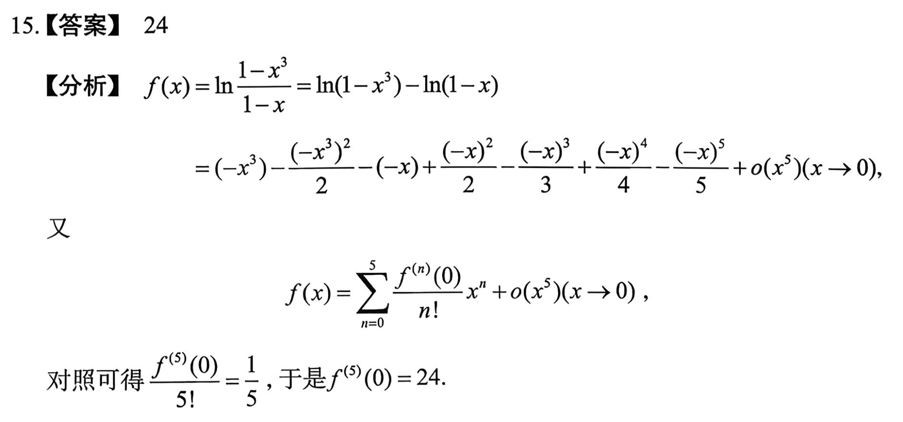

# **张八错题本**

## （二）

### 选填

#### 2 W A

放了，其实画个图猜测也是收敛的

#### 3 A

首先看到在积分区域内被积函数的局部（或整体）取值不同，想到拆区间

令 $f(x) = \cfrac{1}{1 + 2^{\sqrt[3]{x - 2}}}$，考虑对称性，注意到 $f(x) + f(4 - x) = 1$，说明函数关于 $x = 2$ 反对称（odd）

看到对称性，想到换元 $t = 4 - x$

于是 $I = \int_2^5 1 - f(t) dt + \int_2^5 f(x) dx = 3$

>本题放在选择题第三题的位置，一定不会太难，从区间可拆性和对称性角度思考即可找到突破口

#### 6 A

三倍角公式
$$
\sin{3\theta} = 3\sin{\theta} - 4\sin^3{\theta} \\
\cos{3\theta}= 4\cos^3{\theta}−3\cos{\theta}
$$
转换为直角坐标系，利用多元函数导数定义求解

#### 10 A

C 选项的矩阵是可以化简的，化简后可以立即判断是正确的

对于 AB，矩阵 A 未必可逆，于是可能有非零解

#### 12 W A

放了，太难

#### 15 W

#### 16 A

二次型 $f$ 化为标准型 $g$，分别对应二次型矩阵 $A$ 和 $B$（B 是对角阵）

* 若变换是可逆变换，则矩阵 A 和 B 合同，即存在可逆阵 $Q$，使得 $Q^TAQ = B$，反之仍成立
* 若变换是正交变换，则矩阵 A 和 B 相似，即存在正交阵 $Q$，使得 $Q^TAQ = Q^{-1}AQ = B$，反之不成立

对于实对称矩阵 $A$ 和 $B$，相似必合同，反之不成立

**正交变换是可逆变换的一种特殊情况，相似是合同的一种特殊情况**

于是题目说二次型可经可逆变换但不可经正交变换化为标准型，即矩阵 A 与 B 合同但不相似

于是说明两矩阵有相同的正、负惯性指数，但特征值不完全相同

### 大题

#### 17

看到绝对值，想到分类讨论

看到带绝对值的积分，想到拆区间

看到变限积分中夹带自变量，想到换元

#### 18

很不好想，凑导数定义

#### 19

第一问直接代

第二问 // TODO

#### 20

常规题，积分，然后多元函数无条件极值

#### 21

跟真题很像，也是给你换元思路让你求解超纲微分方程

换元方法：抓主要矛盾，也就是有微分的地方，看能不能通过换元变成另一个微分

#### 22

司马题，计算量大的一批

