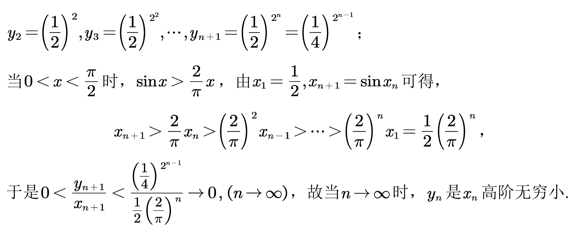
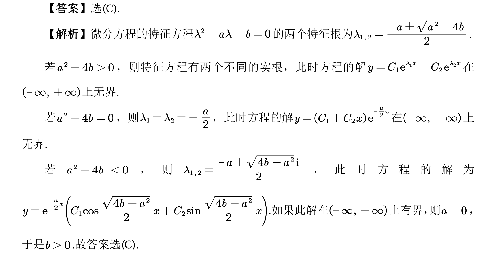
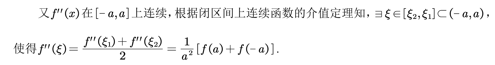
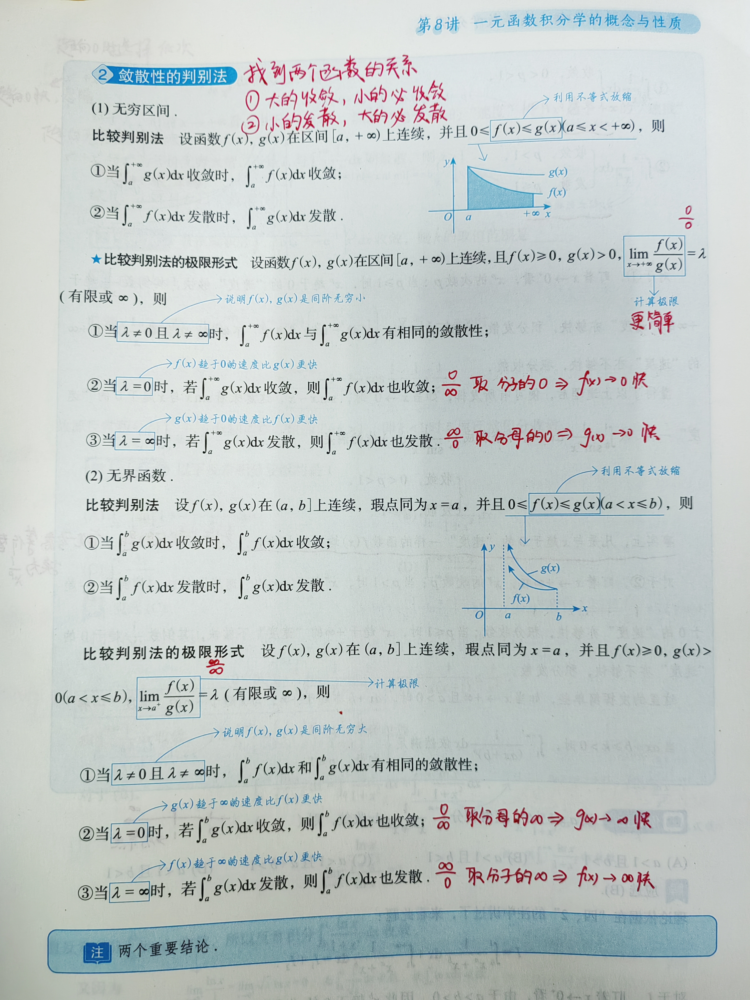

# **数学真题错题本**

## 2023 年

### 数二

#### 3 A

$y_n$ 可通过递推式求出通项，$x_n$ 需要通过 **放缩**：$0 \le x \le \cfrac{\pi}{2}$ 时 $\sin{x} \gt \cfrac{2}{\pi} x$

#### 4 W A

实际上常规题，只是需要记得二阶常系数非齐次线性微分方程解的结构

#### 6 W A

考试时误以为这个积分不好积，导致考虑 P 积分判敛散去了，实际上这个积分很好积，把 $\cfrac{1}{x}$ 移到 $d$ 右边即可，积出关于 $\alpha$ 的函数求最小值即可

#### 12 W

算错了

#### 15 W A

这种题不能只往换源和区间再现公式上套，也应该考虑积分可拆性

#### 21 W

##### (1)

看到二阶连续导数，想到泰勒展开，将 $f(a)$ 和 $f(-a)$ 在 $x = 0$ 处的展开相加即可

问题出在需要使用 **闭区间上连续函数的介值定理** 来给出 $\xi$，否则证明不够眼镜，会扣部分分数

##### (2)

## 2024 年

### 数二

#### 4 W A S

纯恶心人，无法正向证明，只能举反例

A. $2,\cfrac{1}{2},2,\cfrac{1}{2},2,\cfrac{1}{2},\cdots$，$a_n + \cfrac{1}{a_n} = \cfrac{5}{2}$

B. $a_n = (-1)^n$，$a_n - \cfrac{1}{a_n} = 0$（注：$\cfrac{1}{(-1)^n} = \cfrac{(-1)^n}{(-1)^{2n}} = (-1)^n$）

C. $a_n = (-1)^n$，$e^{a_n} + \cfrac{1}{e^{a_n}} = e^{(-1)^n} + e^{(-1)^{n + 1}} = e + \cfrac{1}{e}$（注：$\cfrac{1}{e^{(-1)^n}} = e^{-(-1)^n} = e^{(-1)^{n + 1}}$，$n$ 和 $n + 1$ 必然一奇一偶）

排除 A, B, C，选 D

#### 7 A S

结论：若函数 $f(x)$ 在 $[a, +\infty]$ 连续，且 $\int_a^{+\infty}f(x)dx$ 收敛，则 $\lim_{x \to +\infty} f(x) = 0$

1. 使用结论证明，或举反例 $f(x) = \cfrac{1}{x + 1}$（其由 $\cfrac{1}{x}$ 关注到题设区间 $[0, +\infty]$ 调整得出）

2. 使用比较判别法
   $$
   \begin{align}
   \lim_{x \to +\infty} x^p f(x) &= \lim_{x \to +\infty} \cfrac{x^p}{(x + 1)^p}(x + 1)^p f(x) \\
   &= \lim_{x \to +\infty} (x + 1)^p f(x) \\
   &= \lim_{x \to +\infty} \cfrac{f(x)}{\frac{1}{(x + 1)^p}} = A
   \end{align}
   $$

   $A \ne 0$ 时， $f(x)$ 与 $\frac{1}{(x + 1)^p}$ 同敛散，$p \gt 1$ 时，后者的积分收敛

   $A = 0$ 时，$f(x)$ 小，而大的收敛，小的必收敛
   
3. 举反例 $f(x) = \cfrac{1}{(x + 2)\ln{(x + 2)}}$（主要由 $x^p$ 与 $\ln{x}$ 在 $x \to +\infty$ 时无论 $p$ 如何取值，幂函数收敛地都比对数函数快的结论想到，并且这里为了调整区间，尝试 $x + 1$ 发现带进去分母为 $0$，故选取 $x + 2$）

#### 9 A

由 $AB = 0$ 以及矩阵秩的结论不断缩小 $r(A)$ 的取值范围

#### 10 W S

// TODO 强化完特征值和相似对角化后再做

#### 12 W

算错了，其中一个应该算出来 $\Delta \lt 0$，为鞍点不是极值点

#### 13 W A S

倒一下 $x' = (x + y)^2$，令 $u = x + y$，于是 $x = u - y$，$\cfrac{dx}{dy} = \cfrac{du}{dy} - 1$

方程可化为 $\cfrac{du}{dy} - 1 = u^2$，分离变量得 $\arctan{u} = y + C$，即 $\arctan{(x + y)} = y + C$，带入 $y(1) = 0$ 得 $C = \cfrac{\pi}{4}$

于是结果为 $y = \arctan{(x + y)} - \cfrac{\pi}{4}$

#### 14 A

乘积的高阶导数首选使用莱布尼茨公式，本题只需算 3 项即可求出

而不是看到阶数不高就硬算求导！

#### 16 W S

// TODO 强化了向量组再写

#### 17 A

积分区域很复杂，被积函数很简单，看似像极坐标换元，实则这样换计算量巨大

注意到积分区域轮换，于是 $\iint_Dxdxdy = \iint_Dydxdy$（此即本题的关键）将被积函数消为 $1$，然后就好积了

#### 18 A

知识点遗忘：欧拉方程化简后为二阶常系数线性微分方程（本题模棱两可在会换元，但是换元后的二阶常系数齐次线性微分方程一时脑子抽了想不出怎么算）

## 2025 年

### 数二

#### 2 W S

任意阶可导，放心导导导，nm，导求错了

#### 3 A

对于二阶齐次线性微分方程，要使其解 $y(x)$ 满足 $\int_0^{+\infty}y(x)dx$ 收敛，则特征方程的两个根均小于 0

于是使用韦达定理即可求得取值范围

#### 7 A S

// TODO

#### 10 W A S

特例
$$
A = \begin{pmatrix}
1 & 0 & 0 \\
0 & 0 & 0 \\
0 & 0 & 0
\end{pmatrix} 
B = \begin{pmatrix}
0 & 0 & 1 \\
0 & 0 & 0 \\
0 & 0 & 0
\end{pmatrix}
$$

#### 11 A

有理函数的积分，拆分，待定系数法

拆分案例：
$$
\cfrac{1}{(x - 1)^2 (x^2 + x + 1)^2} = \cfrac{A}{(x - 1)^2} + \cfrac{B}{x - 1} + \cfrac{Cx + D}{(x^2 + x + 1)^2} + \cfrac{Ex + F}{x^2 + x + 1}
$$
注意：这里拆分后，**不能** 直接将被积函数拆成两个积分相减（这样两个积分都是无穷）。解决方案是，找到被积函数的原函数，利用牛顿莱布尼兹公式直接带入上下限即可，不必多想

#### 14 W

bro 导又求错了，这次是哪里正负号丢了

#### 20 W S

算错了，把 $4^4 = 256$ 算成了 $4^4 = 64$

#### 21 W S

// TODO

## 附录：说明

1. `W`：错误

   `A`：模棱两可或看答案才恍然大悟

   `N`：课本上没有或新考法

2. `F`：一级错题，做错过或模棱两可或看答案才恍然大悟的题（不标默认为一级错题）

   `S`：二级错题，**不看答案重做** 一级错题做错或不会的题