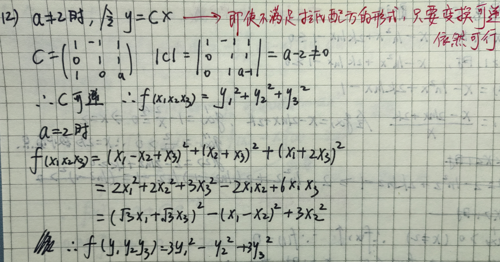
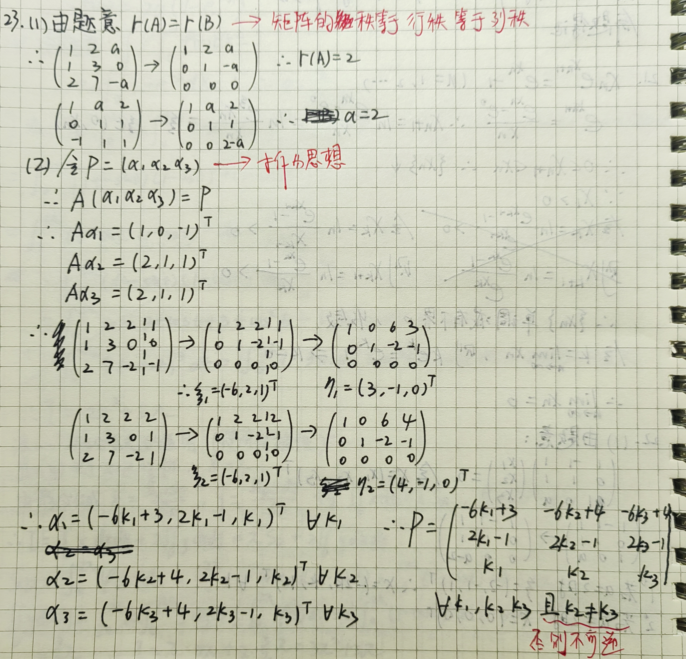
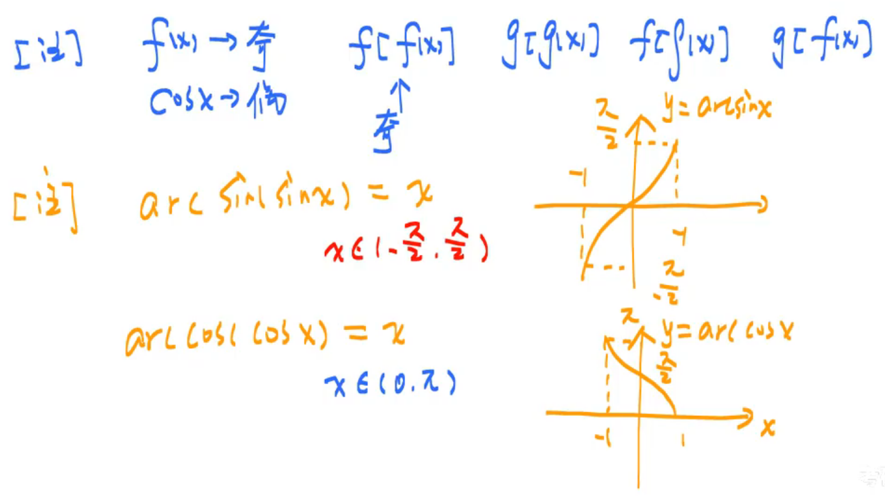
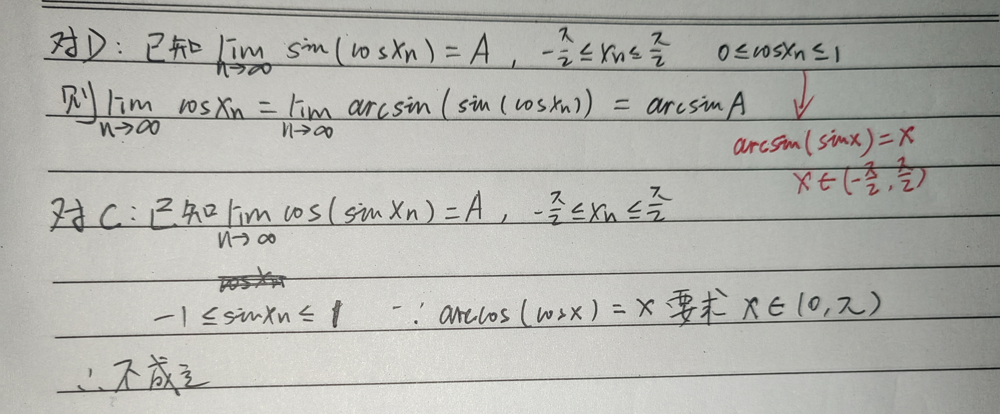
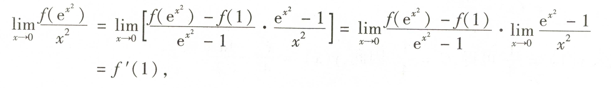
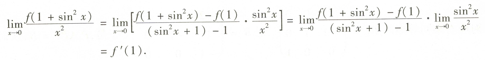
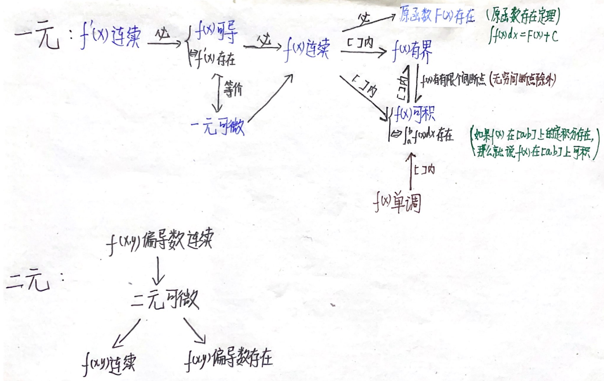

# **数学真题错题本**

## 2017 年

### 数二

#### 3 A

看到数列 $\{x_n\}$ 收敛，想到令 $\lim_{n\to +\infty} x_n = A$

#### 6 A

题目怎么说，你就怎么做
$$
S_甲 = \int_0^{t_0} v_甲(t) dt \\
S_乙 = \int_0^{t_0} v_乙(t) dt \\
$$
$t = t_0$ 时，有 $S_乙 = S_甲 + 10$

于是
$$
\int_0^{t_0} [v_乙(t) - v_甲(t)] dt = 10
$$
即 $t_0 = 25$

#### 7 A

$$
(\alpha_1, \alpha_2, \alpha_3) \begin{pmatrix}
0 & 0 & 0 \\
0 & 1 & 0 \\
0 & 0 & 2
\end{pmatrix} = (0, \alpha_2, 2\alpha_3)
$$

#### 10 W

代值代错了，一定要区分 $x'(t)$，$y'(t)$，$x''(t)$，$y''(t)$

#### 13 W

算错了，$\sin{x}$ 移到 $d$ 后面去变成的是 $-\cos{x}$，一定不能忘记负号

#### 15 W

算错了，换元反解时少算了个负号，导致结果多了个负号

#### 19 W

有时要跳出思维定式，理清当前手头有哪些条件，分别能推出什么条件

#### 20 W

思路没有问题，又双叒叕算错了

#### 21 A

有一个向量可由另两个向量线性表示，则 $r(A) \le 2$

$P^{-1}AP = \Lambda$，特征值两两不同，则 $r(A) \ge 2$

于是 $r(A) = 2$

第二问仍然是需要注意手头有哪些条件，总共就是两个等式，一个对应通解，一个对应特解

#### 22 A

见到矩阵有一行为 0，想到 $|A| = 0$，不可逆。**对于计算矩阵未知数，利用行列式更方便，而不是利用秩**

## 2018 年

### 数二

#### 7 A

这个结论经常被忽略，在其他手段无效时使用，矩阵 A，B 相似 $\Rightarrow$ $r(\lambda E - A) = r(\lambda E - B)$

#### 15 W S

bro 勾股定理斜边要开根号

#### 16 W

bro 定积分换元上下限不换

#### 17 A S

法一：

直接对 $dx$ 换元为 $d(t - \sin{t})$

对 $y$ 积分上界即可换元为 $y(t) = 1 - \cos{t}$

然后就好积了

法二：

形心公式：封闭区域的形心（重心）坐标为 $(\bar x, \bar y)$
$$
\bar x = \cfrac{\iint_D xd\sigma}{\iint_D d\sigma} = \cfrac{\iint_D xd\sigma}{S_D} \\
\bar y = \cfrac{\iint_D yd\sigma}{\iint_D d\sigma} = \cfrac{\iint_D yd\sigma}{S_D}
$$

逆用形心公式
$$
\iint_D xd\sigma = \bar x S_D \\ 
\iint_D yd\sigma = \bar y S_D
$$
另外，有一个结论：若有界闭区域关于 $x = x_0$ 对称，则 $\bar x = x_0$；若有界闭区域关于与 $y = y_0$ 对称，则 $\bar y = y_0$

本题的有界闭区域是摆线的一拱与 $x$ 轴围成的区域，显然关于 $x = \pi$ 对称，故 $\bar x = \pi$
$$
I = \iint_D x + 2y d\sigma = \iint_D x d\sigma + 2\iint_D y d\sigma = \bar x S_D + 2\iint_D y d\sigma = \pi S_D + 2\iint_D y d\sigma
$$

摆线的一拱面积为（使用法一的换元法计算）
$$
S_D = \int_0^{2\pi} \psi(x) dx = \int_0^{2\pi} (1 - \cos{t}) d(t - \sin{t}) = 3\pi
$$
另一半用同样的换元法计算
$$
\iint_D y d\sigma = \int_0^{2\pi} dx \int_0^{\psi(x)} y dy = \cfrac{1}{2}\int_0^{2\pi} \psi^2(x) dx = \cfrac{1}{2} \int_0^{2\pi} (1 - \cos{t})^2 d(t - \sin{t}) = \cfrac{1}{2} \int_0^{2\pi} (1 - \cos{t})^3 dt = \cfrac{5}{2}\pi
$$

于是结果为
$$
I = 3\pi^2 + 5\pi
$$

>对于区域表达式复杂，但是区域对称，被积函数简单的情况，可以考虑使用逆用形心公式减轻计算量

**扩展**

2017-20 考的很类似

看到 $\iint_D (x + 1)^2 dxdy$，不要直接上手积，拆开发现有奇函数（用形心公式判断也行）和一个 $S_D$，再算会简单很多

#### 18 W

思路想偏了，凑立方和立方差去了

正解：要证 $(x - 1)(x - \ln^2{x} + 2k\ln{x} - 1) \ge 0$，显然 $x\gt 0$，令 $f(x) = x - \ln^2{x} + 2k\ln{x} - 1$

于是只需证当 $0 \lt x \lt 1$ 时，$f(x) \lt 0$，当 $x \gt 1$ 时，$f(x) \gt 0$

求导证明即可

#### 21 W

单调有界，一般先证有界

$x_{n + 1} - x_n = \ln{\cfrac{e^{x_n} - 1}{x_n}} - x_n = \ln{\cfrac{e^{x_n} - 1}{x_n}} - \ln{e^x_n}$，尤其要注意这里是 $ - x_n$，**不推荐** 将 $x_n$ 也用递推式展开！

根据题意可以合理猜测数列单调递减

即 $\ln{\cfrac{e^{x_n} - 1}{x_ne^{x_n}}} \lt 0$

看到 $e^x - 1$，想到 $e^x - e^0$，想到拉格朗日中值定理，易得不等式成立

**二刷**

对 $x_{n + 1} = \ln{\cfrac{e^{x_n} - e^0}{x_n}}$ 直接应用拉格朗日中值定理证出单调，使用数学归纳法易证有界

#### 22

**二刷**

#### 23

**二刷**

## 2019 年

### 数二

#### 3 A

反常积分快速判断敛散性方法（万能公式）
$$
\int_0^{\infty} \cfrac{1}{x^{\alpha}\ln^{\beta}{x}} dx
$$

* $x\to 0$ 时收敛的条件（满足一个即可）
  * $\alpha \lt 1$
  * $\alpha = 1,\beta \gt 1$
* $x\to \infty$ 时收敛的条件（满足一个即可）
  * $\alpha \gt 1$
  * $\alpha = 1,\beta \gt 1$
* 使用步骤：
  1. 找瑕点：无穷区间和无界函数
  2. 使用万能公式
* 注意
  * 出现 $e$ 指数，看趋近速度
  * 若 $x\to u$ 不是万能公式的情况，换元令 $x - u = t$ 即有 $t \to 0$，此时就可以使用等价无穷小化简
  * 出现绝对值，直接忽略，因为正负号不改变敛散性
  * 出现三角函数，等价无穷小或放缩（比如 $|\sin{x}|\le 1$ 或使用诱导公式换元然后再等价无穷小）
  * 如果被积函数不直接匹配万能公式，可通过比较法（与 $\cfrac{1}{x^p}$ 或 $\cfrac{1}{x^{\alpha}\ln^{\beta}{x}}$ 比较）或极限比较法判断。

本题的函数均有界，于是看 $x\to \infty$ 的情况

AB 显然收敛

C 在 $x\to \infty$ 时趋近于 $0$，收敛

D $\lim_{x\to \infty} \cfrac{x}{1 + x^2} = \lim_{x\to \infty} \cfrac{1}{\cfrac{1}{x} + x} = \lim_{x\to \infty} \cfrac{1}{x}$，根据万能公式 $\alpha = 1,\beta = 0$，发散

**二刷**

对 CD，$x\to 0$ 时，二者同敛散，由于是单选题，必然收敛，于是 C 只需判断 $x\to \infty$ 的情况

#### 4 W A

根据通解形式，特征方程显然有二重根，$\alpha = -1$，于是特征方程为 $(r + 1)^2 = 0$，故只能在 $CD$ 中选

剩下一个 $y = e^x$ 是 $y'' + 2y' + y = ce^x$ 的特解，不必使用特解的通式，只需带入特解即可求出 $c$

#### 5 W A

**这种类型的题，无非就是比较积分区域或比较函数值**

换元 $r = \sqrt{x^2 + y^2}$，显然 $r \in [0, \cfrac{\pi}{2}]$，积分区域变成以原点为圆心，半径为 $\cfrac{\pi}{2}$ 的圆

三个函数分别变为 $r$，$\sin{r}$，$1 - \cos{r}$，显然 $r \gt \sin{r}$

对于后两个

法一：$\sin{r} \ge \sin^2{r} = 1 - \cos^2{r} = (1 + \cos{r})(1 - \cos{r}) \ge 1 - \cos{r}$

法二：作差，使用导数工具

#### 6 W

**本题的本质是在 $x = a$ 点处研究函数值、一阶导、二阶导的关系，显然是用泰勒公式最方便**，在极限中分别在 $x = a$ 处展开 $f(x)$ 和 $g(x)$，由于分母是二次项，展开到二阶即可，化简式子，显然函数值、一阶导、二阶导均相等，正推可以。反推由于曲率公式二阶导有绝对值，正负不一定相同，于是反推不行

本题也可使用导数定义来做，但是比较麻烦

**二刷**

可以使用我总结的 [高阶导数与低阶导数存在与连续的关系](#高阶导数与低阶导数存在与连续的关系) 来做，用洛必达来正推

（这里由于二阶导数存在且连续，使用洛必达时稳妥的）

本题的关键在于曲率公式中的二阶导有绝对值，逆推不成立

#### 14 W

余子式是一个数，$A_{11} - A_{12}$ 表示两个数的差

如果题目想让你写出“两个子行列式相减”，它会明确写成 “去掉第一行第一列的子行列式 − 去掉第一行第二列的子行列式”

**二刷**

$A_{ij}$ 是代数余子式 $A_{ij} = (-1)^{i + j}M_{ij}$

余子式 $M_{ij}$ 是指从矩阵中删除第 $i$ 行和第 $j$ 列后，得到的子矩阵的行列式

注意哪里才与 $a_{ij}$ 有关呢？答案是计算整个行列式的值时 $|A| = \sum_{j = 1}^n a_{ij}A_{ij}$

#### 15 W

这种题最好画个草图做。易得两个极小值点，函数连续，但在 $x = 0$ 处不可导，显然在 $x = 0$ 处函数是尖点，此时就需要注意看函数值是否为极大值或极小值，这里果然为极大值，不能漏掉 $x = 0$ 处的函数值

#### 18 W

二重积分题必须要做的三步！

1. 画图
2. 对称性化简（尤为重要！）
3. 计算（本题错在这里，不是哥们，这个 b 题是怎么能算错的）

二重积分区域画图方法

* 描点法
  * $r = r(\theta)$ 就取 $0,\cfrac{\pi}{2},\pi,\cfrac{3\pi}{2},2\pi$
  * $r = r(2\theta)$ 就取 $0,\cfrac{\pi}{4},\cfrac{2\pi}{4},\cfrac{3\pi}{4},\pi,\cfrac{5\pi}{4},\cfrac{6\pi}{4},\cfrac{7\pi}{4},2\pi$，此时需要画 $y = x$ 和 $y = -x$ 作辅助线，总之就是取满一个周期
  * 遇到负极径怎么办：从原点引向量标记当前 $\theta$ 角，反向延长向量取极径长度描点
  * 遇到 $r^2 = r(\theta)$ 且为负极径怎么办：我们是在实数域内画图，复根连带附近一片区域的负极径均舍掉不画，也就是函数在这片区域没有图像

**二刷**

利用对称性化简二重积分是重中之重，每一步都要关注手头的积分能否化简而非一昧死算

一、关于坐标轴的对称性

1. **关于 $x$ 轴对称**  
   - 若 $D$ 关于 $x$ 轴对称，且 $f(x, -y) = -f(x, y)$，则 $I = 0$
   - 若 $D$ 关于 $x$ 轴对称，且 $f(x, -y) = f(x, y)$，则 $I = 2\iint_{D_1} f(x,y) \, dA$，其中 $D_1$ 是 $D$ 在 $y \geq 0$ 的部分

2. **关于 $y$ 轴对称**  
   - 若 $D$ 关于 $y$ 轴对称，且 $f(-x, y) = -f(x, y)$，则 $I = 0$
   - 若 $D$ 关于 $y$ 轴对称，且 $f(-x, y) = f(x, y)$，则 $I = 2\iint_{D_1} f(x,y) \, dA$，其中 $D_1$ 是 $D$ 在 $x \geq 0$ 的部分

二、关于原点的对称性

- 若 $D$ 关于原点对称（即 $(x,y) \in D \Rightarrow (-x,-y) \in D$)，且 $f(-x, -y) = -f(x, y)$，则 $I = 0$
- 若 $D$ 关于原点对称，且 $f(-x, -y) = f(x, y)$，则 $I = 2\iint_{D_1} f(x,y) \, dA$，其中 $D_1$ 是 $D$ 的任意一半使得 $D = D_1 \cup (-D_1)$ 且 $D_1 \cap (-D_1) = \emptyset$

三、关于直线 $y = x$ 的对称性（轮换对称性）

- 若 $D$ 关于直线 $y = x$ 对称（即 $(x,y) \in D \Rightarrow (y,x) \in D$)，且 $f(x, y) = -f(y, x)$，则 $I = 0$
- 若 $D$ 关于直线 $y = x$ 对称，且 $f(x, y) = f(y, x)$，则 $I = 2\iint_{D_1} f(x,y) \, dA$，其中 $D_1$ 是 $D$ 在 $y \geq x$（或 $y \leq x$）的部分

#### 19 A

首先题目怎么说你就怎么做，$S_n$ 的积分形式显然可以写出来，注意要加绝对值

显然如果去掉绝对值这个定积分对应的不定积分是可以计算出来的

加上绝对值无非是使用和式把每段加起来，每一段内都是没有绝对值的，最后无非是在前面乘一个 $(-1)^{k}$

于是 $S_n = \sum_{k = 0}^{n - 1} (-1)^k [\cfrac{1}{2}e^{-x}(\sin{x} + \cos{x})] \Big{|}_{k\pi}^{(k + 1)\pi}$

接下来一步步化简即可求出 $S_n$，最后一步是等比数列求和

极限直接瞪眼法

#### 20 A

关于多元函数微分，现有的理论体系是正确的，需要注意的是如何不被复杂的函数干扰而用不出这个理论体系

本题无论是用 $w = e^{ax + by}$ 换元，然后对 $u = vw$ 根据对应关系图求导，还是直接用乘法求导公式求导殊途同归

#### 21 W

本题第二问可能第一个想到的是泰勒公式，但是需要注意，**泰勒公式无论是带入 $x$ 还是 $x_0$，拉格朗日余项中的 $\xi$ 都会变**。使用泰勒公式不好做

仔细观察，题目要证 $f''(\eta) \lt -2$，唱反调得 $f''(\eta) + 2 \lt 0$，考虑构造函数 $\psi(x) = f(x) + x^2$，即证 $\psi''(x) \lt 0$

于是分别在 $\xi_1 \in (0, \xi)$ 和 $\xi_2 \in (\xi, 1)$ 上用拉格朗日中值定理，再在 $(\xi_1, \xi_2)$ 上用拉格朗日中值定理，即可证明

>本题的关键在于，看到二阶可导想到泰勒公式的思维定式，一般用于余项放缩，如果像这个题一样带入 $\xi$ 后难以拿着两个不同的余项去证明的时候，需要另辟蹊径，比如构造函数

#### 22 W

这个题你讨论 $a = \pm 1$，不讨论一下 $a \ne \pm 1$？

#### 23 A

答案不唯一

## 2020 年

### 数二

#### 2 W

忘记讨论 $x = -1$ 了

#### 4 A

$$
f(x) = x^2\ln{(1 - x)} = -\sum_{n = 1}^{\infty} \cfrac{x^n}{n}x^2 = \sum_{n = 0}^{\infty} \cfrac{f^{(n)}(0)}{n!}
$$

于是 $f^{(n)}(0) = -\cfrac{n!}{n - 2}$

#### 6 W A

代特值 $f(x) = e^{2x}$

#### 7 A

本题比较综合，但也比较简单

由题意，$|A| = 0$，$AA^* = AA^* = |A|E = 0$，于是 $A = (\alpha_1, \alpha_2, \alpha_3, \alpha_4)$ 是 $A^*x = 0$ 的解，但是题目要求基础解系，接下来找线性无关

看到 $a_{12}$ 的代数余子式 $A_{12} \ne 0$，想到 $A^* \ne O$

我们知道
$$
r(A^*) = \begin{cases}
n & r(A) = n \\
1 & r(A) = n - 1 \\
0 & r(A) \lt n - 1
\end{cases}
$$
这里 $r(A) \ne 4$，因为不可逆，$r(A^*) \ne 0$，因为 $A^* \ne O$，于是 $r(A^*) = 1$，$n - r(A^*) = 3$，基础解系中有三个向量

由于 $A_{12} \ne 0$，于是 $\alpha_1, \alpha_3, \alpha_4$ 线性无关（向量无关，延长必无关）

故 $x = k_1\alpha_1 + k_2\alpha_3 + k_3\alpha_4$，对于任意 $k_1,k_2,k_3$

>看到 $AB = 0$，想到
>
>1. $r(A) + r(B) \le n$
>2. $B$ 的列向量组均为 $Ax = 0$ 的解
>3. $A$ 的列线性相关
>4. $B$ 的行线性相关

#### 8 A

属于矩阵 $A$ 的同一个特征值 $\lambda$ 的特征向量的 **任意非零线性组合**（若组合结果非零），仍是 $A$ 的属于特征值 $\lambda$ 的特征向量

属于矩阵 $A$ 的两个 **不同** 特征值 $\lambda_1$ 和 $\lambda_2$ 的特征向量 $v_1$ 和 $v_2$ 的 **线性组合** $k_1 v_1 + k_2 v_2$（其中 $k_1, k_2$ 均不为零）**一定不是** $A$ 的特征向量。

#### 13 W

bro 又算漏了负号

#### 16 W

这道题求出 $g'(x)$ 包含 $f(x)$ 和积分的分段函数形式就足够了，没必要想着进一步化简，而且也没说 $f(x)$ 可导，无法进一步化简

于是证明连续性就变成了分段函数的连续性证明

>若 $f(x)$ 连续，且 $\lim_{x \to a} \cfrac{f(x)}{x - a} = A \gt 0$，则
>
>1. $f(a) = 0$
>2. $f'(a) = 3$，用导数定义
>3. $x\to a$，$\cfrac{f(x)}{x - a} \gt 0$，用极限保号性
>4. $x\to a$，$f(x) \sim A(x - a)$，用等价无穷小

#### 20 W

见本子

#### 21 W

bro 非要手贱在最后结果后面写个 $\forall C$，本题 $f'(x) \gt 0$，$f(x) \ge 0$，显然结果为 $f(x) = Cx^3 \, (C \gt 0)$

#### 22

第一问关键是想到 $A$ 和 $B$ 合同，二者秩相同且有相同的正负惯性指数，显然这里算秩很麻烦，于是采用后者来做

第二问的本质是把二次型 $f$ 化成它指定的标准型 $g$，方法是先把二次型用配方法化标准型得到变换矩阵，然后把标准型换元成指定的形式得到另一个变换矩阵，相乘两个变换矩阵即可得到变换手段 $P$

#### 23

见本子

## 2021 年

### 数二

#### 4 W

bro 这题也能错？

#### 6 W A

**函数的“元数”（arity）是由其输入参数的数量决定的**，不能想当然的认为具体的函数表达式决定了函数的“元数”
$$
\frac{d}{dx} f(u(x), v(x)) = \frac{\partial f}{\partial u} \cdot u'(x) + \frac{\partial f}{\partial v} \cdot v'(x)
$$

#### 9 W A

首先数二语境下对线性方程组的列操作没有意义，排除 AC

法一：看到 A 的列向量组能由 B 的列向量组线性表示，想到 $r(A) \le r(B)$，$r(B) = r(B|A)$

左右转置得 $r(B^T) = r(\begin{bmatrix} B^T \\ A^T \end{bmatrix})$，立即反应出 $B^Tx = 0$ 与 $\begin{cases} B^Tx = 0 \\ A^Tx = 0 \end{cases}$ 同解

#### 10 W A

首先这个 sb 题矩阵打错了，这题不算错

法一：硬算不丢人

法二：$PAQ = \Lambda$，题目说 $P$，$Q$ 可逆，立即想到左乘为初等行变换，右乘为初等列变换，那么用初等矩阵记录 $A$ 先初等行变换再初等列变换的过程即可求出 $P$，$Q$

#### 11 A

看到对称区间积分，立即想到奇偶性，显然本题是偶函数，可以直接去掉绝对值前面乘 2

比拆区间讨论简单的多

#### 15 W A

首先判断这是 **三阶** 常系数齐次线性微分方程，显然用特征方程求解

然后要记这个通解公式，本题显然有一个实根，两个共轭复根

$n$ 阶常系数齐次线性微分方程的解

* 若 $\lambda$ 为单实根，则写 $Ce^{\lambda x}$
* 若 $\lambda$ 为 $k$ 重实根，则写 $(C_1 + C_2x + C_3x^2 + \cdots + C_kx^{k - 1})e^{\lambda x}$
* 若 $\lambda$ 为单复根 $\alpha \pm \beta i$，则写 $e^{\alpha x}(C_1 \cos{\beta x} + C_2 \sin{\beta x})$
* 若 $\lambda$ 为二重复根 $\alpha \pm \beta i$，则写 $e^{\alpha x}(C_1 \cos{\beta x} + C_2 \sin{\beta x} + C_3 x\cos{\beta x} + C_4 x \sin{\beta x})$

>若解中含特解 $e^{\lambda x}$，则 $\lambda$ 至少为单实根
>
>若解中含特解 $x^{k - 1} e^x$，则 $\lambda$ 至少为 $k$ 重实根
>
>若解中含特解 $C_1 \cos{\beta x}$ 或 $C_2 \sin{\beta x}$，则 $\alpha \pm \beta i$ 至少为单复根
>
>若解中含特解 $e^{\alpha x}x \cos{\beta x}$ 或 $e^{\alpha x}x \sin{\beta x}$，则 $\alpha \pm \beta i$ 至少为二重复根

#### 16 W

法一：硬算不丢人。原则：尽可能挑简单的行或列来化简，而不是拿第三列的 1 硬算其他列

法二：逆序数。看到这种很复杂的行列式，想到行列式的逆序数定义
$$
\det(A) = 
\begin{vmatrix}
a_{11} & a_{12} & \cdots & a_{1n} \\
a_{21} & a_{22} & \cdots & a_{2n} \\
\vdots & \vdots & \ddots & \vdots \\
a_{n1} & a_{n2} & \cdots & a_{nn}
\end{vmatrix} = \sum_{j_1j_2\cdots j_n} (-1)^{\tau(j_1j_2\cdots j_n)} a_{1j_1}a_{2j_2}\cdots a_{nj_n}
$$
$\tau(j_1j_2\cdots j_n)$ 为排列 $j_1j_2\cdots j_n$ 的逆序数，即遍历排列，对每个元素看左边有几个比它大的即为该元素的逆序数，对所有元素的逆序数求和即得排列的逆序数

基于这个行列式定义，我们可以直接对第一行展开，得到四个三阶矩阵，对每个矩阵，选择有变量的那一列来凑 $x^3$，易得答案为 $-5$

**二刷**

使用行列式逆序数定义可以快速求解行列式中某一项的系数

具体方法：

1. 框选出行列式中的变量
2. 根据不同行不同列的原则保证行列式每行每列都框选一个元素
3. 写出这些元素列号的排列，计算该排列的逆序数 $\tau$
4. 系数即为 $(-1)^{\tau}$ 乘上选中元素之积
5. 综合所有系数，过滤出目标项的系数即得结果

**扩展**

[基础概念：行列式与余子式](#基础概念：行列式与余子式)

#### 19 W

本题错把侧面积看成了体积

记侧面积公式不如记微元法推导过程：$A = 2\pi\int_a^b |f(x)| ds$，$ds$ 为弧长微元，$ds = \sqrt{(dx)^2 + (dy)^2} = \sqrt{1 + (\cfrac{dy}{dx})^2} dx$

#### 22 W

送分题，但算错了，c

## 2022 年

### 数二

#### 3 A

基本概念必须清晰

1. 若 $f''(x_0)$ 存在，则 $f(x)$ 在 $x = x_0$ 的邻域内存在一阶导数，一阶导数可导说明一阶导连续
2. $\forall x \in I$，$f'(x) > 0$，则 $f(x)$ 在区间 $I$ 上单调递增；$f'(x) < 0$，则 $f(x)$ 在区间 $I$ 上单调递减
   * 若 $f(x)$ 在区间 $I$ 上单调递增，则 $f'(x)\ge 0$ **（关键在这个等号）**
   * 若 $f'(x_0) > 0$ $\nRightarrow$ $f(x)$ 在 $x = x_0$ 的邻域内单调递增 **（不能根据一点的导数值，断言在函数在区域内单调性）**
3. $\forall x \in I$，$f''(x) > 0$，则 $f(x)$ 在区间 $I$ 上凹；$f''(x) < 0$，则 $f(x)$ 在区间 $I$ 上凸
   * 若 $f(x)$ 在区间 $I$ 上凹，则 $f''(x)\ge 0$ **（关键在这个等号）**
   * 若 $f''(x_0) > 0$ $\nRightarrow$ $f(x)$ 在 $x = x_0$ 的邻域内凹 **（不能根据一点的导数值，断言函数在区域内的凹凸性）**

**扩展**

对于任意正整数 $n$，如果函数 $f(x)$ 的 $n$ 阶导数 $f^{(n)}(x)$ 存在（或连续），则所有低阶导数 $f^{(k)}(x)$（其中 $k < n$）都存在且连续。

#### 6 W A

法一：取 $\{x_n\} = 1,-1,1,-1,\cdots$，即可排除 ABC

法二：

#### 7 W

实际上是常规题，完全不应该错

使用导数工具比较函数局部的大小

适当放缩成同一种形式（例如放缩到分母相同），方便比大小

遇到不好算的函数值，可以考虑放缩区间（例如将 $x\in [0, 1]$ 放大到 $x\in [0, \cfrac{\pi}{2}]$）

#### 10 W

两向量组等价 $\Rightarrow$ $r(I) = r(II)$ $\Rightarrow$ 张成的空间维数相同

$\Leftrightarrow$ $r(I) = r(II) = r(I|II)$

$\Leftrightarrow$ 互相可线性表示

#### 17 W

简单的要死，结果忘记加负号

熟练这种凑导数定义的方法

**洛必达法则的坑**
$$
\lim_{x \to \alpha} \cfrac{f(x)}{g(x)} = \lim_{x \to \alpha} \cfrac{f'(x)}{g'(x)}
$$
* 洛必达法则四条件：（型、导、非零、同向）
  1. 极限必须是 0/0 或 ∞/∞ 未定式
  1. $f,g$ 在极限点邻域内可导（极限点本身可以不可导） 
  1. $g'(x)$ 在极限点邻域内不为 0（极限点本身除外）
  1. $\lim \cfrac{f'}{g'}$ 的左右极限一致（原极限若是双侧，也需一致）

* 六不能： 
  1. 只在一点可导不能用（必须邻域可导）
  1. 极限形式不是 0/0 或 ∞/∞ 
  1. $g'(x)$ 在极限点邻域内不能出现为 0 的点（极限点本身除外）
  1. 左右极限不一致（含振荡）
  1. 连续使用洛必达但不检查是否仍是未定式
  1. 在极限点邻域内不可导（如分段点、绝对值尖点、根号端点等）

#### 21 W

正推：看到二阶可导，想到泰勒展开，$x_0$ 取 $\cfrac{a + b}{2}$，两边同时积分即可

反推：反证法，取区间 $(c, d)\in x_0$ 的去心邻域，然后同样泰勒展开再积分，推出矛盾

>关于“把积分拆成两段并对每段用积分中值定理”的做法
>
>按这种方法可以得到存在 $c_1\in[a,(a+b)/2],\ c_2\in[(a+b)/2,b]$ 使得
>$$
>\frac{1}{b-a}\int_a^b f(t)\, dt =\frac{f(c_1)+f(c_2)}{2}.
>$$
>
>
> 于是中点不等式变成 $f\big(\tfrac{a+b}{2}\big)\le\frac{f(c_1)+f(c_2)}2$。**但** $c_1,c_2$ 随 $a,b$ 变化而不受控，要想从这一步严格推出 $f''(x_0)\ge0$ 需要进一步分析当区间缩小 $(a,b\to x_0)$ 时 $c_1,c_2$ 收敛并比较二阶误差，这等价于做极限或用 Taylor 展开。换句话说，这一路径并不比对称 Taylor 更简单，且更容易在逻辑上遗漏“(c_i) 随 (h) 的依赖”这一点。因此 **不推荐** 仅靠中值定理来完成反推证明。

#### 22 A

// TODO

## 2023 年

### 数二

#### 3 A

$y_n$ 可通过递推式求出通项，$x_n$ 需要通过 **放缩**：$0 \le x \le \cfrac{\pi}{2}$ 时 $\sin{x} \gt \cfrac{2}{\pi} x$

#### 4 W A

实际上常规题，只是需要记得二阶常系数非齐次线性微分方程解的结构

#### 6 W A

考试时误以为这个积分不好积，导致考虑 P 积分判敛散去了，实际上这个积分很好积，把 $\cfrac{1}{x}$ 移到 $d$ 右边即可，积出关于 $\alpha$ 的函数求最小值即可

#### 12 W

算错了

#### 15 W A

这种题不能只往换源和区间再现公式上套，也应该考虑积分可拆性

#### 21 W

##### (1)

看到二阶连续导数，想到泰勒展开，将 $f(a)$ 和 $f(-a)$ 在 $x = 0$ 处的展开相加即可

问题出在需要使用 **闭区间上连续函数的介值定理** 来给出 $\xi$，否则证明不够眼镜，会扣部分分数

##### (2)

## 2024 年

### 数二

#### 4 W A S

纯恶心人，无法正向证明，只能举反例

A. $2,\cfrac{1}{2},2,\cfrac{1}{2},2,\cfrac{1}{2},\cdots$，$a_n + \cfrac{1}{a_n} = \cfrac{5}{2}$

B. $a_n = (-1)^n$，$a_n - \cfrac{1}{a_n} = 0$（注：$\cfrac{1}{(-1)^n} = \cfrac{(-1)^n}{(-1)^{2n}} = (-1)^n$）

C. $a_n = (-1)^n$，$e^{a_n} + \cfrac{1}{e^{a_n}} = e^{(-1)^n} + e^{(-1)^{n + 1}} = e + \cfrac{1}{e}$（注：$\cfrac{1}{e^{(-1)^n}} = e^{-(-1)^n} = e^{(-1)^{n + 1}}$，$n$ 和 $n + 1$ 必然一奇一偶）

排除 A, B, C，选 D

#### 7 A S

结论：若函数 $f(x)$ 在 $[a, +\infty]$ 连续，且 $\int_a^{+\infty}f(x)dx$ 收敛，则 $\lim_{x \to +\infty} f(x) = 0$

1. 使用结论证明，或举反例 $f(x) = \cfrac{1}{x + 1}$（其由 $\cfrac{1}{x}$ 关注到题设区间 $[0, +\infty]$ 调整得出）

2. 使用比较判别法
   $$
   \begin{align}
   \lim_{x \to +\infty} x^p f(x) &= \lim_{x \to +\infty} \cfrac{x^p}{(x + 1)^p}(x + 1)^p f(x) \\
   &= \lim_{x \to +\infty} (x + 1)^p f(x) \\
   &= \lim_{x \to +\infty} \cfrac{f(x)}{\frac{1}{(x + 1)^p}} = A
   \end{align}
   $$

   $A \ne 0$ 时， $f(x)$ 与 $\frac{1}{(x + 1)^p}$ 同敛散，$p \gt 1$ 时，后者的积分收敛

   $A = 0$ 时，$f(x)$ 小，而大的收敛，小的必收敛
   
3. 举反例 $f(x) = \cfrac{1}{(x + 2)\ln{(x + 2)}}$（主要由 $x^p$ 与 $\ln{x}$ 在 $x \to +\infty$ 时无论 $p$ 如何取值，幂函数收敛地都比对数函数快的结论想到，并且这里为了调整区间，尝试 $x + 1$ 发现带进去分母为 $0$，故选取 $x + 2$）

#### 9 A

由 $AB = 0$ 以及矩阵秩的结论不断缩小 $r(A)$ 的取值范围

#### 10 W S

// TODO 强化完特征值和相似对角化后再做

#### 12 W

算错了，其中一个应该算出来 $\Delta \lt 0$，为鞍点不是极值点

#### 13 W A S

倒一下 $x' = (x + y)^2$，令 $u = x + y$，于是 $x = u - y$，$\cfrac{dx}{dy} = \cfrac{du}{dy} - 1$

方程可化为 $\cfrac{du}{dy} - 1 = u^2$，分离变量得 $\arctan{u} = y + C$，即 $\arctan{(x + y)} = y + C$，带入 $y(1) = 0$ 得 $C = \cfrac{\pi}{4}$

于是结果为 $y = \arctan{(x + y)} - \cfrac{\pi}{4}$

#### 14 A

乘积的高阶导数首选使用莱布尼茨公式，本题只需算 3 项即可求出

而不是看到阶数不高就硬算求导！

#### 16 W S

// TODO 强化了向量组再写

#### 17 A

积分区域很复杂，被积函数很简单，看似像极坐标换元，实则这样换计算量巨大

注意到积分区域轮换，于是 $\iint_Dxdxdy = \iint_Dydxdy$（此即本题的关键）将被积函数消为 $1$，然后就好积了

#### 18 A

知识点遗忘：欧拉方程化简后为二阶常系数线性微分方程（本题模棱两可在会换元，但是换元后的二阶常系数齐次线性微分方程一时脑子抽了想不出怎么算）

## 2025 年

### 数二

#### 2 W S

任意阶可导，放心导导导，nm，导求错了

#### 3 A

对于二阶齐次线性微分方程，要使其解 $y(x)$ 满足 $\int_0^{+\infty}y(x)dx$ 收敛，则特征方程的两个根均小于 0

于是使用韦达定理即可求得取值范围

#### 7 A S

// TODO

#### 10 W A S

特例
$$
A = \begin{pmatrix}
1 & 0 & 0 \\
0 & 0 & 0 \\
0 & 0 & 0
\end{pmatrix} 
B = \begin{pmatrix}
0 & 0 & 1 \\
0 & 0 & 0 \\
0 & 0 & 0
\end{pmatrix}
$$

#### 11 A

有理函数的积分，拆分，待定系数法

拆分案例：
$$
\cfrac{1}{(x - 1)^2 (x^2 + x + 1)^2} = \cfrac{A}{(x - 1)^2} + \cfrac{B}{x - 1} + \cfrac{Cx + D}{(x^2 + x + 1)^2} + \cfrac{Ex + F}{x^2 + x + 1}
$$
注意：这里拆分后，**不能** 直接将被积函数拆成两个积分相减（这样两个积分都是无穷）。解决方案是，找到被积函数的原函数，利用牛顿莱布尼兹公式直接带入上下限即可，不必多想

#### 14 W

bro 导又求错了，这次是哪里正负号丢了

#### 15 A S

法一：全微分，把微分方程看作全微分，分别对 x 和 y 积分，由于对所有 $(x, y)$ 全微分为 0，则 $f(x, y) = C$，即可求出隐函数

法二：换元
$$
\begin{align}
\cfrac{dy}{dx} &= \cfrac{2\cfrac{y}{x} - 3}{5\cfrac{y}{x} - 2} \\
令 t(x) &= \cfrac{y(x)}{x}, y(x) = xt(x),\cfrac{dy}{dx} = t(x) + x\cfrac{dt}{dx} \\
t + \cfrac{dt}{dx} &= \cfrac{2t - 3}{5t - 2} \\
-\int \cfrac{5t - 2}{5t^2 - 4t + 3} dt &= \cfrac{1}{x} dx \\
\end{align}
$$
对左边的积分，有
$$
\int \cfrac{5t - 2}{5t^2 - 4t + 3} dt = \int \cfrac{10t - 4}{5t^2 - 4t + 3} dt - \int \cfrac{5t - 2}{5t^2 - 4t + 3} dt
$$

#### 20 W S

算错了，把 $4^4 = 256$ 算成了 $4^4 = 64$

#### 21 W S

// TODO

## 杂项

### 基本概念

#### 高数

##### 可导与连续的关系

2022-3

对于任意正整数 $n$，如果函数 $f(x)$ 的 $n$ 阶导数 $f^{(n)}(x)$ 存在（**或** 连续），则所有低阶导数 $f^{(k)}(x)$（其中 $k < n$）都存在 **且** 连续。

##### 一元、二元函数连续、有界、可导、可微、可积的关系

##### 一元、二元函数可微的定义

1. 一元函数：
   * $f(x)$ 在点 $x_0$ 处可微 $\Leftrightarrow$ $f(x)$ 在点 $x_0$ 处可导
   * 定义法判断某点可微
     1. 写增量 $\Delta y = f(x_0 + \Delta x) - f(x_0)$
     2. 写线性增量 $A\Delta x = f'(x_0) \Delta x$
     3. 作极限 $\lim_{\Delta x \to 0} \cfrac{\Delta y - A\Delta x}{\Delta x} \Leftrightarrow \Delta y = A\Delta x + o(\Delta x)$，若为 $0$ 则 $y = f(x)$ 在点 $x_0$ 处可微，否则不可微
   * $\Delta y = A\Delta x + o(\Delta x) = f'(x_0)\Delta x + o(\Delta x)$
   * $dy = A\Delta x = y'dx$ 为线性主部
   * 本质是用 $x_0$ 处切线的线性增量近似函数真实的增量 $\Delta y$，二者相差一个高阶无穷小
2. 二元函数
   * 若函数 $z=f(x,y)$ 在点 $(x,y)$ 处 **偏导数存在且连续**，则函数在点 $(x,y)$ ​处可微
   * 定义法判断某点可微，
     1. 写出全增量 $\Delta z=f(x_0+\Delta x,y_0+\Delta y)-f(x_0,y_0)$
     2. 写出线性增量 $A\Delta x+B\Delta y$，其中 $A=f'_x(x_0,y_0),B=f'_y(x_0,y_0)$
     3. 求极限 $\displaystyle \lim_{\Delta x\to 0,\Delta y\to0}\cfrac{\Delta z-(A\Delta x+B\Delta y)}{\sqrt {(\Delta x)^2+(\Delta y)^2}}$，若为 $0$ 则可微

#### 线代

##### 行列式的计算

1. **提取第 $i$ 行的公因子 $k$**：
   $$
   \begin{vmatrix}
   a_{11} & a_{12} & \cdots & a_{1n} \\
   \vdots & \vdots & \ddots & \vdots \\
   {\color{red}k}a_{i1} & {\color{red}k}a_{i2} & \cdots & {\color{red}k}a_{in} \\
   \vdots & \vdots & \ddots & \vdots \\
   a_{n1} & a_{n2} & \cdots & a_{nn}
   \end{vmatrix}
   = {\color{red}k} \cdot
   \begin{vmatrix}
   a_{11} & a_{12} & \cdots & a_{1n} \\
   \vdots & \vdots & \ddots & \vdots \\
   a_{i1} & a_{i2} & \cdots & a_{in} \\
   \vdots & \vdots & \ddots & \vdots \\
   a_{n1} & a_{n2} & \cdots & a_{nn}
   \end{vmatrix}
   $$
   **解释**：如果第 $i$ 行的每个元素都有同一个因子 $k$，那么可以把 $k$ 提到整个行列式前面，同时第 $i$ 行元素变为原来的 $1/k$（即去掉该因子）

2. **提取第 $j$ 列的公因子 $k$**：
   $$
   \begin{vmatrix}
   a_{11} & \cdots & {\color{red}k}a_{1j} & \cdots & a_{1n} \\
   a_{21} & \cdots & {\color{red}k}a_{2j} & \cdots & a_{2n} \\
   \vdots & \ddots & \vdots & \ddots & \vdots \\
   a_{n1} & \cdots & {\color{red}k}a_{nj} & \cdots & a_{nn}
   \end{vmatrix}
   = {\color{red}k} \cdot
   \begin{vmatrix}
   a_{11} & \cdots & a_{1j} & \cdots & a_{1n} \\
   a_{21} & \cdots & a_{2j} & \cdots & a_{2n} \\
   \vdots & \ddots & \vdots & \ddots & \vdots \\
   a_{n1} & \cdots & a_{nj} & \cdots & a_{nn}
   \end{vmatrix}
   $$
   **解释**：对列的操作同理

##### 代数余子式的定义

2019-14

$A_{ij}$ 是代数余子式 $A_{ij} = (-1)^{i + j}M_{ij}$

余子式 $M_{ij}$ 是指从矩阵中删除第 $i$ 行和第 $j$ 列后，得到的子矩阵的行列式

注意哪里才与 $a_{ij}$ 有关呢？答案是计算整个行列式的值时 $|A| = \sum_{j = 1}^n a_{ij}A_{ij}$

##### 特征值的定义

2017-14

设 $A$ 为 $n$ 阶方阵，$\lambda$ 是一个数，若存在 $n$ 维非零列向量 $\xi$，使得
$$
A\xi = \lambda \xi
$$
则称 $\lambda$ 为矩阵 $A$ 的 **特征值**，$\xi$ 是 $A$ 的对应于特征值 $\lambda$ 的 **特征向量**

##### 矩阵的等价、相似、合同、正定

**等价**

1. **定义**：设 $ A, B $ 为 $ m \times n $ 矩阵，若存在可逆矩阵 $ P $（$ m $ 阶）和 $ Q $（$ n $ 阶）使得 $ B = P A Q $ 则称 $ A $ 与 $ B $ 等价
1. **充要条件**：两个矩阵等价当且仅当它们有相同的秩
1. **必要条件**：若 $A$ 与 $B$ 相似，则可以通过初等行变换和列变换相互转化

**相似**

1. **定义**：设 $ A, B $ 为 $ n $ 阶方阵，若存在可逆矩阵 $ P $ 使得 $ B = P^{-1} A P $ 则称 $ A $ 与 $ B $ 相似
1. **必要条件**：若 $ A $ 与 $ B $ 相似，则它们具有
   * 相同的特征多项式、特征值（代数重数和几何重数相同）
   * 相同的行列式、迹、秩
1. **充分条件**：
   * 若 $ A $ 与 $ B $ 均可对角化，且具有相同的特征值（包括重数），则 $ A $ 与 $ B $ 相似
   * 根据定义
1. **几何意义**：相似矩阵表示同一个线性变换在不同基下的坐标矩阵

**合同**

1. **定义**：设 $ A, B $ 为 $ n $ 阶实对称矩阵，若存在可逆矩阵 $ P $ 使得 $ B = P^T A P $  则称 $ A $ 与 $ B $ 合同
1. **充要条件**：$ A $ 与 $ B $ 合同当且仅当它们具有相同的秩和相同的正负惯性指数
1. **与二次型的关联**
   * 对于 $ n $ 元二次型 $ f(x) = x^\top A x $（$ A $ 实对称），作可逆线性替换 $ x = Py $，得到 $ f = y^\top (P^\top A P) y $。此时，矩阵 $ A $ 与 $ P^\top A P $ 合同，且二次型化为新矩阵对应的二次型
   * 惯性定理：实二次型总可通过可逆线性替换化为规范形 $ y_1^2 + \cdots + y_p^2 - y_{p+1}^2 - \cdots - y_r^2 $，其中正平方项个数 $ p $（正惯性指数）和负平方项个数 $ r-p $（负惯性指数）由原二次型唯一决定

**正定**

1. **定义**：设 $ A $ 为 $ n $ 阶实对称矩阵，若对任意非零向量 $ x \in \mathbb{R}^n $，都有 $ x^T A x > 0 $  则称 $ A $ 为正定矩阵
2. **充要条件**：以下条件等价
   * $ A $ 的所有特征值均为正数
   * $ A $ 的所有顺序主子式大于零
   * $ A $ 合同于单位矩阵，即存在可逆矩阵 $ C $ 使得 $ A = C^T C $
   * $ A $ 的正惯性指数为 $ n $
   * 存在列满秩矩阵 $ D $ 使得 $ A = D^T D $
   * $ A $ 的所有主子式大于零（不仅顺序主子式）
3. **必要条件**：若 $ A $ 正定，则
   * 所有主对角线元素 $ a_{ii} > 0 $
   * 行列式 $ \det(A) > 0 $
   * $ A $ 可逆，且 $ A^{-1} $ 也是正定的
4. **充分条件**：
   * 若所有顺序主子式大于零，则 $ A $ 正定
   * 若存在可逆矩阵 $ C $ 使得 $ A = C^{\top} C $，则 $ A $ 正定
5. **几何意义**：正定二次型 $ x^T A x > 0 $ 对应二次曲面为椭球面（无鞍面或柱面部分）
6. **相关概念**：
   * 负定：$ A $ 的所有顺序主子式负正交替（奇数阶负，偶数阶正）$\Leftrightarrow$ 所有特征值为负
   * 半正定：所有主子式 $\ge 0$（但判定较复杂，常用顺序主子式 $\ge 0$ 且矩阵对称）
   * 不定：既不正定也不负定，且特征值有正有负

##### 矩阵相似对角化

1. $n$ 阶矩阵可相似对角化 $\Leftrightarrow$ $A$ 有 $n$ 个线性无关的特征向量 $\Leftrightarrow$ $A$ 对于每个 $k_i$ 重特征值都有 $k_i$ 个线性无关的特征向量
2. $n$ 阶矩阵有 $n$ 个不同的特征值 $\Rightarrow$ $A$ 可相似对角化
3. $n$ 阶矩阵 $A$ 为实对称矩阵 $\Rightarrow$ $A$ 可相似对角化

>**讨论矩阵是否能相似对角化，不必具体计算出特征向量，在有重特征值时，只需计算 $r(\lambda E - A)$，讨论线性无关的特征向量个数即 $n - r(\lambda E - A)$ 是否和特征值重数相等即可，若是，则可以相似对角化，否则不能**，参见线代基础 P50T11

##### 二次型化标准型的本质

二次型化标准型，本质是找到一个可逆线性变换 $x = Cy$，使得 $f = x^TAx = (Cy)^TACy = y^T(C^TAC)y$，其中 $C^TAC = \Lambda$（对角阵）

若 $C^TAC = E$，则就是将 $A$ 拆成了两个可及矩阵的乘积，即 $A = D^TD$

### 基本公式

#### 高数

// TODO

#### 线代

// TODO

### 二级结论

#### 高数

#### 线代

##### 二次型的最值（瑞利商）

给定二次型 $f$ 和 $g$，求 $\max_{x\ne0}{\cfrac{f(x)}{g(x)}}$，其中 $x = (x_1, x_2, \cdots,x_n)^T$

见-二次型化标准型的本质，将 $B$ 拆成 $D^TD$
$$
\begin{align}
\cfrac{f(x)}{g(x)} = \cfrac{x^TAx}{x^TBx} = \cfrac{x^TAx}{x^TD^TDx} = \cfrac{x^TAx}{(Dx)^T(Dx^T)} \overset{Dx = z}{=} \cfrac{(D^{-1}z)^TA(D^{-1}z)}{z^Tz} = \cfrac{z^T(D^{-1})^TAD^{-1}z}{z^Tz} \overset{(D^{-1})^TAD^{-1}}{=} \cfrac{z^TMz}{z^Tz}
\end{align}
$$

对 $M$ 的特征值，$\lambda_{max} = \max{\lambda_i}$，$\lambda_{min} = \min{\lambda_i}$

将 $M$ 展开为多项式，通过最大特征值和最小特征值放缩，即可得到结论 $\lambda_{min} \le \cfrac{z^TMz}{z^Tz} \le \lambda_{max}$

$\cfrac{z^TMz}{z^Tz}$ 的形式真题已经考过，重点在 **化归经典形式**

## 附录：说明

1. `W`：错误

   `A`：模棱两可或看答案才恍然大悟

   `N`：课本上没有或新考法

2. `F`：一级错题，做错过或模棱两可或看答案才恍然大悟的题（不标默认为一级错题）

   `S`：二级错题，**不看答案重做** 一级错题做错或不会的题