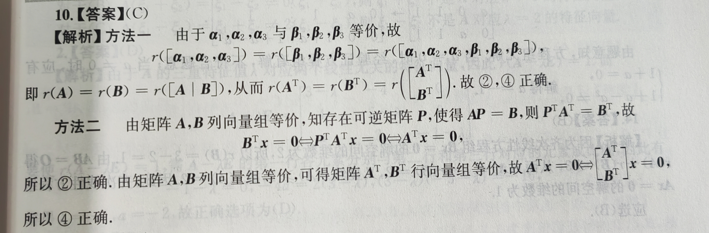

# **数学基础错题本**

## 高等数学

### 第 13 章 多元函数微分学

#### P29T2

$f$ 是一元函数，这里不能分路径求导

#### P29T14

常规题，算错了

#### P29T17

最后一步可以继续化简

## 线性代数

### 第 2 章 矩阵

#### P43T8

等式两边右乘 $B^{-1}$，然后两边左乘大矩阵的逆即得互换矩阵 $A$ 的第 1,2 行得矩阵 $B^{-1}$

>矩阵 A 的初等变换：**左乘** 初等矩阵表示 **行** 变换，**右乘** 初等矩阵表示 **列** 变换

#### P44T15

由于 $AE = EA$，$(A - E)^5$ 可使用二项式定理展开，二项式系数可以通过杨辉三角快速获得，即
$$
\begin{align}
(A - E)^5 &= O \\
A^5 - 5A^4 + 10A^3 - 10A^2 + 5A - E &= O \\
(A^4 - 5A^3 + 10A^2 - 10A + 5E)A &= E \\ 
A^4 - 5A^3 + 10A^2 - 10A + 5E &= EA^{-1} \\
A^4 - 5A^3 + 10A^2 - 10A + 5E &= A^{-1}
\end{align}
$$

### 第 3 章 向量组

#### P45T5

向量组可拆成向量和矩阵的乘积，要使向量组线性无关，矩阵行列式 $k^2 - 1$ 必不为 0，于是 $k \ne 1$ 且 $k \ne -1$

故线性无关能推出 $k \ne 1$，但 $k \ne 1$ 无法推出线性无关

设 $a_1,a_2,a_3$ 是三个向量，将它们作为列向量拼成一个矩阵 $A = [a_1,a_2,a_3]$。那么：

- 向量组线性无关 $\Leftrightarrow A$ 满秩  $\Leftrightarrow$ 齐次方程组只有零解 $\Leftrightarrow$ 如果 $A$ 是方阵，则 $|A| = 0$
- 向量组线性相关 $\Leftrightarrow A$ 不满秩 $\Leftrightarrow$ 齐次方程组有非零解 $\Leftrightarrow$ 如果 $\Leftrightarrow$ 是方阵，则 $|A| = 0$

#### P46T10

因为 $(\beta_1, \beta_2, \beta_3)$ 是正交向量组，故考虑使用施密特正交化来确定 $k_1,k_2,k_3$ 的值

### 第 4 章 线性方程组

#### P47T6

向量组 A 经过初等行变换变成向量组 B，说明方程 $Ax = 0$ 与 $Bx = 0$ 是同解方程组，且对应的任何部分列向量组构成的线性方程组也是同解方程组，故对应的任何部分列向量组具有相同的线性相关性

初等变换

* 初等 **行** 变换：左乘可逆矩阵 $P$，保持 **列** 向量的线性相关性，但改变 **行** 关系
* 初等 **列** 变换：右乘可逆矩阵 $Q$，保持 **行** 向量的线性相关性，但改变 **列** 关系

#### P48T10

分块矩阵的转置：每个块要转置，整体也要转置

#### P48T14

因为齐次线性方程组 $Bx = 0$ 的解空间的维数为 2，所以 $r(B) = 3 - 2 = 1$，由 $AB = O$ 得 $r(A) + r(B) \le 3$，从而 $r(A) \le 3 - r(B) = 2$，又显然 $r(A) \ge 2$，因此齐次线性方程组 $Ax = 0$ 的解空间的维数为 1

### 第 5 章 特征值与特征向量

#### P49T1

由题意 $A\xi_1 = \xi_1$，$A\xi_2 = -\xi_2$

均左乘 $A$ 得，$A^2\xi_1 = A\xi_1 = \xi_1$，$A^2\xi_2 = -A\xi_2 = \xi_2$

于是 $A^2(\xi_1 + \xi_2) = \xi_1 + \xi_2$，即 $\xi_1 + \xi_2$ 是 $A^2$ 对应 $\lambda = 1$ 的特征向量

#### P49T5

$$
\begin{align}
A\xi &= \lambda \xi \\ 
A^*A\xi &= \lambda A^* \xi \\
|A|\xi &= \lambda A^*\xi \\
A^* \xi &= \cfrac{|A|}{\lambda} \xi \\
P^{-1}A^* \xi &= \cfrac{|A|}{\lambda} P^{-1} \xi \\
P^{-1}A^* P(P^{-1} \xi) &= \cfrac{|A|}{\lambda} (P^{-1} \xi) \\
\end{align}
$$

于是特征值为 $\cfrac{|A|}{\lambda}$，特征向量为 $P^{-1} \xi$

#### P50T16

本题错在将行向量拆成向量和矩阵的乘积时不能惯性思维地拆出 $(\xi_2, \xi_1, \xi_3)$，要看清题目需要求的是 A 的相似矩阵

# **数学强化错题本**

## 高等数学

### 第 13 章 多元函数微分学

#### P97T1

偏导数定义式
$$
\dfrac{\partial f}{\partial x} = \lim_{\Delta x \to 0} \dfrac{f(x+\Delta x, y) - f(x, y)}{\Delta x} \\
\dfrac{\partial f}{\partial y} = \lim_{\Delta y \to 0} \dfrac{f(x, y+\Delta y) - f(x, y)}{\Delta y} \\
$$

#### P97T3

同理，使用偏导数定义直接算

#### P98T21

在求多元函数无条件极值时，不能忘记先要令两个一阶偏导为 0 确定可疑点

#### P98T22

特例 $f(x, y) = -(x^2 + y^2)$，$a \lt 0,c \lt 0$

特例 $f(x, y) = -(x^4 + y^4)$，$a = 0,c = 0$

#### P99T26

对隐函数求二阶偏导时，不必带入 $\cfrac{\partial z}{\partial x}$ 和 $\cfrac{\partial z}{\partial y}$ 的表达式，因为二阶偏导化简到后面这些项可以直接代题目给的特值，这会大大减轻计算压力

#### P99 T32

对偏导数求积分时，积分常数是一个对另一个字母的函数

若有两个偏导数分别对两个字母积分，积完后需要仔细观察两个式子的区别，在后面的函数中补足各自式子中缺少的项

#### P100T36

遗漏了另外两个边界 $x \ge 0,y \ge 0$，讨论最值时需讨论 $f(x, 0)$ 和 $f(0, y)$

#### P100T41

**无论何时，只要积分微元 $d$ 后面的变量发生改变，就必须对应地改变积分上下限，以确保积分值的正确性**

#### P100T42

看到这样的参数方程，要找出 $z$ 与 $x, y$ 的关系

#### P100T45

理清对应关系，求 5 个量，带入题设等式，解出未知数

#### P101T47

题目给 $f(x, \int_1^t \ln{x} dx) = 0$ 实际是给了一个关于 $x$ 和 $t$ 的隐函数，令成多元函数 $F(x, t)$，使用隐函数求导法则可求出 $t'(x)$

这道题容易往导数定义方向想，但其实看到题干和选项并未涉及极限基本也可判断不是导数定义

#### P101T48

本题乍一看很简单，但是算出 $\Delta$ 后发现其等于 0，判别法失效

**关于 $\Delta = 0$ 时，否定极值性**
a. 沿坐标轴，如沿 $x$ 轴，极小值；沿 $y$ 轴，极大值
b. 沿 $y = kx$，如沿不同路径既有极大值也有极小值
c. 看区域，邻域内不同区域，有极大值有极小值均可否定极值性

#### P101T50

原点距离公式可看做二元函数，题目即可转化为二元函数条件最值，使用拉格朗日乘数法

### 第 14 章 二重积分

#### P102T1

公式记错了，这两个公式要分清楚
$$
\int \cfrac{1}{\sqrt{a^2 + x^2}} dx = \ln{|x + \sqrt{a^2 + x^2}|} + C \\
\int \cfrac{1}{a^2 + x^2} dx = \cfrac{1}{a}\arctan{\cfrac{x}{a}} + C
$$

#### P102T6

本题 **不能** 认为 $f(x, y)$ 关于 $x$ 轴对称，因为 $f(-x, y) \ne f(x, y)$

一个技巧
$$
\int_a^b dx \int_c^d [f(y) \pm g(y)] dy = \int_a^b dx \int_c^d f(y) dy \pm \int_a^b dx \int_c^d g(y) dy
$$
本题无需使用极坐标换元

#### P102T8

极坐标换元原则：往小了换，而不是往大了换，例如这道题应该这样换元
$$
\begin{cases}
x = \cfrac{1}{2} r\cos{\theta} \\
y = r\sin{\theta}
\end{cases}
$$
不要忘了计算雅可比行列式，计算结果为 $\cfrac{1}{2}r$

#### P102T9

算错了

#### P103T11

慎用对称性，一定要检查 $f(x, y)$ 是否具有对称性，尤其在极坐标换元时要注意

#### P103T12

椭圆面积公式 $S = \pi a b$

慎用对称性

被积函数能拆分就拆分，降低后续计算的复杂度

合理利用奇函数在对称区域上的积分性质

#### P103T14

如果分数指数的分母为偶数，化简后要加 **绝对值**，如 $(x^2)^{\frac{3}{2}} = |x|^3$

#### P103T16

算错了

#### P103T17

很综合，涉及积分区域的可拆性，对称区域上的积分性质
$$
\sin^2{\theta} = \cfrac{1}{2} - \cfrac{1}{2}\cos{2\theta} \\
\cos^2{\theta} = \cfrac{1}{2} + \cfrac{1}{2}\cos{2\theta} \\
\sin^4{\theta} = \cfrac{3}{8} - \cfrac{1}{2}\cos{2\theta} + \cfrac{1}{8}\cos{4\theta} \\
\cos^4{\theta} = \cfrac{3}{8} + \cfrac{1}{2}\cos{2\theta} + \cfrac{1}{8}\cos{4\theta} \\
a\sin{\theta} + b\cos{\theta} = \sqrt{a^2 + b^2} \sin{\theta + \psi}, 其中\tan{\psi} = \cfrac{b}{a} \\
$$

#### P103T18

遇到绝对值，想到拆区域

#### P103T19

#### P103T22

#### P103T24

#### P103T25

#### P103T28

#### P103T29

## 线性代数

### 第 3 章 矩阵运算

// TODO

### 第 4 章 矩阵的秩

#### 4

尽可能化到最简

**注：对于这种 2 * 2 的分块阵，不能使用横拼左同多化零，竖拼右同多化零的结论**

# **附录：说明**

1. `W`：错误

   `A`：模棱两可或看答案才恍然大悟

   `N`：课本上没有或新考法

2. `F`：一级错题，做错过或模棱两可或看答案才恍然大悟的题

   `S`：二级错题，**不看答案重做** 一级错题做错或不会的题

