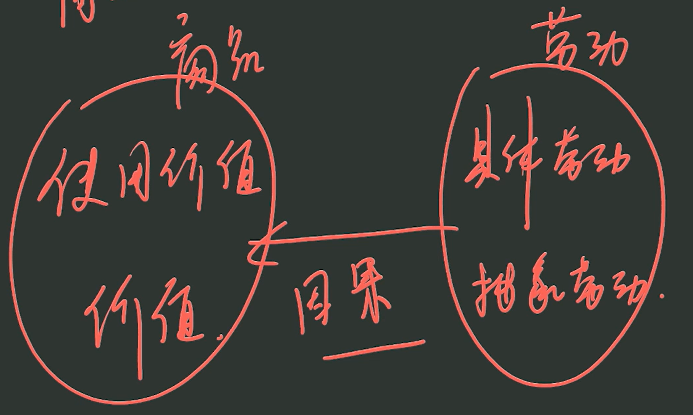
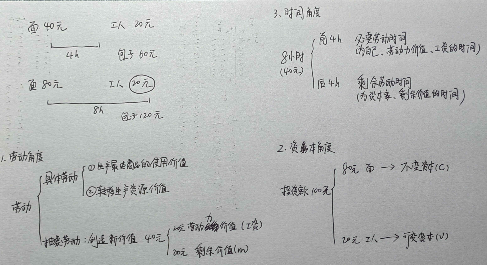

# **马原**

## 导论

### 基本概念

| 马克思主义的三个基本组成部分 | 角色       | 诞生的标志         | 理论来源           |
| ---------------------------- | ---------- | ------------------ | ------------------ |
| 马克思主义哲学               | 基础、方法 | 《德意志意识形态》 | 德国古典哲学       |
| 马克思主义政治经济学         | 主体理论   | 《资本论》         | 英国古典政治经济学 |
| 科学社会主义                 | 目的、归宿 | 《共产党宣言》     | 英法空想社会主义   |

> * 总结这三个基本组成部分：恩格斯《反杜林论》
> * 马克思主义诞生的标志：《共产党宣言》

1. 马克思主义发展的途径：本土化、时代化
2. 马克思主义的基本特征：科学性与革命性的统一
   * 革命性（内在品质） = 人民性 + 实践性 + 发展性
3. 哲学基本问题及不同哲学流派 

## 马克思主义哲学

### 第一章 辩证唯物论

#### 哲学基本问题

#### 世界多样性与物质统一性

##### 考点 8 物质范畴及其理论意义

物质：不依赖于人类的意识而存在，是 **客观实在**

**例题**：物的定义与具体的物的关系（）

A. 抽象与具体		B. 共性与个性		C. 普遍与特殊		D. 一般与个别		E. 整体与部分		F. 包含与被包含

**解答**：ABCD

##### 考点 9 物质与运动

1. 运动 = 变化

2. 物质的 **根本属性**：运动

   物质的 **共同特征**：客观实在性

3. 过分强调运动：唯心主义

   过分强调物质：形而上学

>考研哲学两个概念的关系：
>
>1. 不可分割：$A$ 是 $B$ 的 $A$，$B$ 是 $A$ 的 $B$
>2. 对立统一（辩证统一、斗争同一、矛盾关系）：区别、联系

##### 考点 10 运动与静止

1. 过分强调运动：诡辩论

   过分强调静止：形而上学

##### 考点 11 物质运动和时空

1. 存在形式（方式）
   * 物质的 **存在形式** 是运动
   * 运动着的物质的 **存在形式** 是时空

##### 考点 12 物质世界的二重化

1. **相对独立性**：某事物 A 具有相对独立性，是指 A 虽然由 B 所决定和派生（A 依赖于 B），但 A 并非简单地复制 B，而是能主动地对 B 的内容进行理解、改造，并可能反作用于 B，从而表现出一定的自主性

   * 意识具有相对独立性：意识是物质世界的反映，但人脑中的意识能对反映的内容进行能动地加工、抽象和改造，并通过社会实践反作用于物质世界，实现从感性认识到理性认识的飞跃

   

2. 感性认识是理性认识的基础，是还没有深入到事物本质的认识

##### 考点 13 物质与意识的辩证关系

1. 意识是人独有的

>哲学概念有高低之分：
>
>1. 高级概念：决定性，可以说的很绝对
>2. 低级概念：促进、推动、**重要**，需要说的很温和

##### 考点 16 世界的物质统一性原理

1. 人类的实践活动
   * 能改变自然事物的：形态、外貌、结构
   * 不能改变自然事物的：物质性、客观实在性

### 第二章 唯物辩证法

#### 事物的普遍联系和变化发展

##### 考点 18 对立统一规律（唯物辩证法第一规律）

###### 矛盾的同一性和斗争性及其辩证关系

1. 对立统一、斗争同一，二者等价但搭配不能反

2. 矛盾的同一性和斗争性不是时而时而的关系，而是既又的关系

   同一性与斗争性相互依存，水涨船高

   斗争性 **寓于** 同一性之中

3. 方法论：一分为二、福祸相依、物极必反、求同存异

###### 矛盾的同一性和斗争性在事务发展中的作用

1. 同一性：相辅相成

   斗争性：相反相成

###### 矛盾的普遍性和特殊性及其辩证关系

1. 矛盾的基本属性：对立、统一

   矛盾的精髓：共性和个性

###### 矛盾的不平衡发展原理

1. 主要矛盾、次要矛盾
2. 矛盾内的主要方面、次要方面

// TODO P22 总结 & 扩展 8

##### 考点 19 量变质变规律（唯物辩证法第二规律）

##### 量变和质变的辩证关系

1. 只看到质变：激变论

   只看到量变：庸俗进化论

##### 考点 20 否定之否定规律（唯物辩证法第三规律）

// TODO

##### 考点 21 内容和形式（唯物辩证法第一对基本范畴）

// TODO

##### 考点 22 现象和本质（唯物辩证法第二对基本范畴）

1. 现象有真象和假象之分，假象与错觉不是一回事
   * 假象：客观存在，虚假的现象，不能以对错评价
   * 错觉：主观意识，错误的感觉

##### 考点 23 原因和结果（唯物辩证法第三对基本范畴）

// TODO

##### 考点 24 必然和偶然（唯物辩证法第四对基本范畴）

// TODO

##### 考点 25 可能和现实（唯物辩证法第五对基本范畴）

1. **可能** 与 **不可能** 的区别：在现实中是否有依据
2. **现实的可能** 与 **抽象的（潜在的）可能** 的区别：在现实中的依据是否充分

#### 唯物辩证法是认识世界和改造世界的根本方法

// TODO

### 第三章 认识论

#### 实践与认识

##### 考点 29 实践的本质和基本特征

1. 实践的基本特征 
   * 客观实在性
     * 直接现实性：把人脑中的观念的存在变为现实的存在
     * 直接现实性属于客观实在性
   * 自觉能动性：先画图纸，再建房子
   * 社会历史性：随着一定社会历史条件的变化而变化

##### 考点 30 实践的基本结构和形式

1. 实践 -> 物质

   认识 -> 意识

2. 实践和认识都具有主体、中介、客体，故实践和认识具有同构性

3. 实践的主体和客体相互作用的关系

   * 实践关系：我改造他
   * 认识关系：我认识他
   * 价值关系：他对我有什么用

4. 实践的主体、客体、中介不断变化

   * 主体客体化：客体发生了变化（可形成世界上本来不存在的对象物）
   * 客体主体化：主体发生了变化

5. 实践的形式

   * 物质生产实践：劳动
   * 社会政治实践：人与人的关系
   * 科学文化实践：探索
   * 虚拟实践：借助信息技术的实践，是实践活动的派生，具有 [相对独立性](#性质：相对独立性)

##### 考点 31 实践对认识的决定作用

1. 认识具有 **此岸** 性，需要到实践这个 **彼岸** 去检验认识的真理性
1. 实践可以决定人识，认识不能决定实践

##### 考点 32/33/34/35/36

// TODO

#### 真理与价值

##### 考点 37 真理及其特性

1. 真理是客观的，但是其内在存在主观部分
   * 内容：客观
   * 检验标准（实践）：客观
   * 形式：主观

2. 真理的客观性 **决定** 了真理的一元性：决定说明这两个东西具有内在一致性

3. 任何真理的相对性之中都包含着真理绝对性的颗粒：相对真理之中存在绝对真理

4. 为什么真理既有绝对性又有相对性？
   * 人的思维的至上性 $\rightarrow$ 真理的绝对性（我的认识至高无上，故真理一定是正确的）
   * 人的思维的非至上性 $\rightarrow$ 真理的相对性（目前的认识还不够深刻，故真理具有相对性）

5. 过分强调真理的绝对性（绝对主义）：教条主义，思想僵化

   过分强调真理的相对性（相对主义）：怀疑论，诡辩论

   >诡辩论过分强调运动，连暂时的静止也不承认
   >
   >诡辩论过分强调真理的相对性，连暂时的正确也不承认

6. 唯物主义认识论与唯心主义认识论的根本区别
   * 唯物主义认识论：坚持从物到感觉和思想的认识路线，称为反映论
   * 唯心主义认识论：坚持从思想和感觉到物的认识路线，称为先验论

7. 只要是反映论，无论是直观反映论还是能动反映论，都是唯物主义的认识论

##### 考点 38 真理和谬误

1. 相对真理和谬误
   * 相对真理：真理 **以后** 有可能不对的特点
   * 谬误：**现在** 就是错误的认识
2. 真理和谬误在同一范围内有严格的界限，不能相互转化。超出这个范围，就可能相互转化

##### 考点 39 真理的检验标准

1. 实践是检验真理的唯一标准（[参见考点 29](#实践的基本特征)）
   * **真理的本性** 是主客观的一致，**实践具有直接现实性**，是沟通主客观的桥梁，于是有且仅有实践是检验真理的标准
2. 实践是检验真理的唯一标准，并不排斥逻辑证明的作用
   * 首先承认逻辑证明具有重要作用，但是逻辑证明依赖前提条件，这个前提条件不一定是正确的

##### 考点 40 真理与价值的辩证统一

1. 价值的基本特性

   * 主体性：价值因人而异，但不会因人的想法而异

     >主体性 $\ne$ 主观性
     >
     >主体性：人不一样，价值不一样
     >
     >主观性：人的想法的不一样，价值不一样

   * 客观性：不以人的意志为转移

   * 多维性

   * 社会历史性

2. 认识论

   * 知识性（认识性）认识：以客体本身为认识对象
   * 价值评价性认识：以主客体的价值关系为认识对象

3. 真理与价值在实践中的辩证统一关系

   * 实践（该怎么做 | 想怎么做）
     * **规律** 和 **能动** 的统一
     * **真理尺度** 和 **价值尺度** 的统一
     * **合规律性** 和 **合目的性** 的统一

#### 认识世界和改造世界

##### 考点 41/42 非重点

##### 考点 43 从必然走向自由

1. 必然：该怎么做

   自由：想怎么做

   [概念关系：该怎么样和想怎么样](#概念关系：该怎么样和想怎么样)

2. 可以认识、尊重、利用规律

   不能消灭、改造规律

   >但是可以改变规律起作用的方式

3. 自由的条件

   * 认识条件：对必然（规律）更了解，则自由就会更多
   * 实践条件
     * 尊重规律
     * 尊重别人的自由

### 第四章 唯物史观

#### 人类社会及其发展规律

##### 考点 44 唯物史观和唯心史观的对立

1. 唯心史观忽略了物质动因和经济根源，也即 **生产力**

   唯心史观忽略了人民群众创造历史的决定作用

##### 考点 45 社会存在和社会意识及其辩证关系

1. 社会存在
   * **生产方式（决定因素） = 生产力（决定因素） + 生产关系**
   * 地理环境（影响因素）
   * 人口因素（影响因素）
2. 社会意识
   * 社会心理（低层次）：自发形成的风俗、习惯等
   * 社会意识形式（高层次）：与阶级有关
     * 社会意识形态（社会意识形式中与经济、阶级、利益有关的内容）：政治法律思想、道德、**艺术**、宗教、哲学等
     * 非社会意识形态（社会意识形式中与经济、阶级、利益无关的内容）：语言学、形式逻辑及自然科学等
3. 社会意识对社会存在具有能动的反作用，这是社会意识 [相对独立性](#性质：相对独立性) 的 **突出表现**
   * 相对独立性（老师教学生，学生领悟了老师没教的额外的知识）
     * 不同步性（学生自己看会了）
     * 历史继承性（学生从长辈那里学会的）
     * 内部相互影响（学生之间交流学会的）
     * **能动的反作用**（突出表现）：老师还不会，学生把老师教会了，学生反作用于老师（社会意识反作用于社会存在）

##### 考点 46 生产力和生产关系矛盾运动的规律（第一对社会基本矛盾）

1. 生产力表示 **人与自然** 的关系
2. 生产力的基本要素
   * 劳动资料：最重要的是生产工具，是区分 **社会经济时代** 的客观依据（**石器** 时代、**青铜** 时代、**铁器** 时代、**电气** 时代...）
   * 劳动对象：**生产资料 = 劳动资料 + 劳动对象**
   * 劳动者：**生产力 = 生产资料 + 劳动者**
     * 对象是人：只有人才会劳动
3. 生产力包含科技，但科技不是生产力中的独立要素，科技的进步会引起劳动资料、劳动对象和劳动者的巨大进步
   * 在生产劳动发展中是 **决定因素**
   * 在社会历史进程中是 **重要动力**
4. 生产关系是 **人与人** 的关系
5. 生产关系：是社会存在（物质）
   * 生产资料所有制关心（决定）：区分不同生产方式、判定 **社会经济结构** 性质的客观依据（奴隶社会、封建社会、资本主义社会、社会主义社会）
   * 生产之中人与人的关系
   * 产品分配关系
6. 人类社会发展的基本规律：生产关系一定要适合生产力状况的规律 

##### 考点 47 经济基础和上层建筑矛盾运动的规律（第二对社会基本矛盾）

1. 经济基础是生产关系

   

2. 社会意识与上层建筑的交集是意识形态

   

3. 上层建筑 

   * 观念上层建筑：**核心** 为政治法律思想
   * 政治上层建筑（主导）：**核心** 为国家政权
   * 判断方式：带有阶级性，如宗教

4. 如何判断上层建筑是否先进

   

5. [人类社会发展的第一规律：生产关系一定要适合生产力状况的规律](#人类社会发展的基本规律)

   人类社会发展的第二规律：上层建筑一定要适合经济基础状况的规律

##### 考点 48 人类普遍交往与世界历史的形成发展

1. 资本主义生产方式的出现和向世界扩张使人类历史向世界历史转变

##### 考点 49 社会进步与社会形态更替

1. 生产力 + 生产关系 = 生产方式

   经济基础 + 上层建筑 = 社会形态

   * 社会形态：经济、[政治、文化](#上层建筑包含观念和政治)

2. 社会形态更替的特点

   * 统一性和多样性
   * [必然性和选择性](#概念关系：该怎么样和想怎么样)：必然类比规律，选择类比能动
   * 前进性与曲折性：类比 [否定之否定](#否定之否定规律) 的螺旋式发展

#### 社会历史发展的动力

##### 考点 50-54 社会基本矛盾是历史发展的根本动力

1. 社会基本矛盾（最基本的动力因素（生产力）和生产关系）、经济基础和上层建筑的矛盾是社会 **基本** 矛盾
2. 阶级斗争、改革、科学技术革命、文化是社会动力体系中的（推动社会发展的）重要动力

#### 人民群众在历史发展中的作用

##### 考点 55 关于历史创造者问题

1. 唯物史观和唯心史观的分水岭：究竟谁是历史的创造者？是人民群众创造历史还是英雄创造历史？

   唯物史观和唯心史观的根本分野：社会意识决定社会存在，还是社会存在决定社会意识？

##### 考点 56 人民群众创造历史

1. 从质上说：人民群众是指一切对社会历史发展起推动作用的人

   从量上说：人民群众是指社会人口中的绝大多数

2. 人民群众创造历史的活动受到一定社会历史条件的制约，包括：经济条件（首要）、政治条件、精神文化条件

3. 无产阶级政党的群众路线（方法论）：一切为了群众，一切依靠群众，从群众中来，到群众中去

   * 因果关系：因为人民群众创造历史，所以一切为了群众

##### 考点 57 个人在社会历史中的作用

1. **杰出人物可以决定历史事件的结局，但不能决定和改变历史发展的总进程和总方向**
2. 杰出人物对历史的作用 **取决于他们的思想、行为是否符合社会发展规律，是否符合人民群众的意愿**
3. 评价杰出人物：一方面肯定杰出人物的功绩，另一方面不回避他们的失误和错误
4. 群众是划分阶级的，阶级通常是由政党领导的，政党是由领袖来主持的

### 杂项

1. 马克思主义理论 **独有的** 特征（区别于其他理论的 **根本特征**）：科学性、实践性
2. 社会历史性：历史阶段不同，xx 不同，就可以说 xx 具有社会历史性

## 马克思主义政治经济学

### 第五章 资本主义的本质及规律

#### 第一节 商品经济和价值规律

##### 考点 58 价值是什么

1. 考研范畴内，社会财富 = **使用价值**（注意：不等于价值）

2. 交换价值 **表现为** 使用价值的比例，但实际上只有价值才能决定交换价值的比例

3. 一个东西要有价值，必须满足

   1. 劳动：不经过劳动，必定没有价值
   2. 交换：没有交换，就不是商品，就没有价值，因为价值是商品特有的社会属性

4. 生产商品的劳动二重性（注意这里的因果关系）

   * 具体劳动决定商品的使用价值

     抽象劳动决定商品的价值

   * 在选择题中，具体劳动和使用价值同选同不选，抽象劳动和价值同选同不选

   

##### 考点 59 价值如何衡量

1. 决定商品价值量的，不是生产上屏的个别劳动时间，而是社会必要劳动时间

2. 商品价值量与劳动生产率的关系

   * 商品价值总量 = 单位商品的价值量 $\times$ 相同时间生产商品的数量
   * 单个商品的使用价值与生产率无关
   * 相同时间生产商品使用价值总量增加是因为相同时间生产商品的数量增加
   * 社会财富就是相同时间生产商品使用价值总量

   | 条件                           | 单位商品的价值量 | 相同时间生产商品的数量 | 商品价值总量 | 单个商品的使用价值 | 相同时间生产商品使用价值总量 | 社会财富总量 |
   | ------------------------------ | ---------------- | ---------------------- | ------------ | -------------------------- | ------------ | ------------ |
   | **社会**（部门）劳动生产率增加 | 减少 | 增多 | 不变 | 不变 | 增多 | 增多 |
   | **个别** 劳动生产率增加         | 不变 | 增多 | 增多 | 不变 | 增多 | 增多 |

3. 复杂劳动等于自乘或多倍的简单劳动

##### 考点 60 价值如何表现

1. 货币仅指金银等贵金属，货币也是商品

2. 货币的五种基本职能

   1. **价值尺度**：衡量其他商品的价值

      * 原因：本身也是商品，本身也有价值
      * 观念的货币（头脑、意识、想象）

   2. **流通手段**：充当商品交易的媒介

      * 现实的货币
      * 可以不足值 -> 干脆把价值降为 0 -> 纸币

      >纸币没有价值，没有价值尺度的职能
      >
      >纸币可以代替货币执行流通手段的职能（因为揣着金银来交易很不方便）

   3. 贮藏手段

   4. 支付手段：货币具有清偿、偿付、结算等功能

      * 现实的货币
      * 给钱与拿货可能不同步

   5. 世界货币

3. 货币产生后整个商品世界的变化：商品内在的使用价值和价值的宝盾转化为商品与货币的外在矛盾，货币的出现扩大和加深了商品经济的矛盾

   * 货币出现前，生产者生产只是为了需求换取东西

     货币出现后，生产者生产是为了赚取更多的货币，若生产的东西越来越多以至于卖不出去，摔坏的不是商品，而是商品占有者

##### 考点 61 价值有何规律

1. 价值规律的 **内容**：商品的价值量由生产商品的社会必要劳动时间决定，商品交换以价值量为基础，按照等价交换的原则进行
2. 价值规律的 **表现形式**：价格围绕价值上下波动，影响价格的因素有
   * 价值（决定性因素）
   * 供求
   * 币值

##### 考点 62 以私有制为基础的商品经济的基本矛盾

1. 私人劳动和社会劳动的矛盾构成私有制基础上商品经济的基本矛盾
2. 资本主义基本矛盾：生产资料资本主义私人占有和生产社会化之间的矛盾
   * 正是这一矛盾的不断运动，是资本主义制度最终被社会主义制度所代替具有了客观必然性

##### 考点 63 马克思劳动价值论的意义

1. 马克思 **继承** 了英国古典政治经济学劳动创造价值理论

   **创立** 了劳动二重性理论

   1. 只有劳动创造价值，故科技、知识、信息不直接创造价值，但在价值创造中很有用

#### 第二节 资本主义经济制度

##### 考点 64 资本主义经济制度的产生

1. 资本主义生产关系产生的途径
   * 从小商品经济中分化出来
   * 从商人和高利贷者转化而来
2. 资本原始积累的途径
   * 用暴力手段剥夺农民的土地
   * 用暴力手段掠夺货币财富

##### 考点 65 劳动力成为商品与货币转化为资本

1. 劳动力：是 **商品**，是可再生资源

   劳动者：出卖劳动力的人

   劳动：劳动力的使用过程

2. 劳动力成为商品的基本条件

   * 劳动者有人身自由
   * 劳动者没有任何生产资料，一无所有

3. 劳动力商品的价值

   * 本人生活
   * 家属生活
   * 教育培训

4. 劳动力商品的使用价值

   * 货币变成资本的条件（原因）：劳动力成为商品

##### 考点 66 非重点

##### 考点 67 剩余价值的生产

1. 加班延长工作时间 -> 绝对剩余价值

   技术进步缩短必要劳动时间 -> 相对剩余价值

2. 个别企业提高劳动生产率使商品的个别价值低于社会价值的差额 -> 超额剩余价值

   超额剩余价值是因，相对剩余价值是果（技术进步被其他企业学去了）

3. 生产自动化下，雇佣工人的剩余劳动仍然是这种剩余价值的唯一源泉

##### 考点 68 资本积累

// TODO 

## 科学社会主义

// TODO

# **思修**

// TODO

# **史纲**

// TODO

# **毛中特**

// TODO

# **习思想**

// TODO

# **分析论述题**

## 马原

### [P15] 主观能动性和客观规律性的辩证统一

### [P20] 对立统一规律

### [P33] 实践对认识的决定作用

# **听课寄存器**

> 存放要听的下一节课

"F:\Develop\others\MyPGEE\main\politics\courses\04.强化提升【核心考案】\01.考点串讲-马原\15.社会形态更替、人民群众.mp4"

第二节 社会历史发展的动力
