# **马克思主义基本原理**

## 导论

### 基本概念

| 马克思主义的三个基本组成部分 | 角色       | 诞生的标志         | 理论来源           |
| ---------------------------- | ---------- | ------------------ | ------------------ |
| 马克思主义哲学               | 基础、方法 | 《德意志意识形态》 | 德国古典哲学       |
| 马克思主义政治经济学         | 主体理论   | 《资本论》         | 英国古典政治经济学 |
| 科学社会主义                 | 目的、归宿 | 《共产党宣言》     | 英法空想社会主义   |

> * 总结这三个基本组成部分：恩格斯《反杜林论》
> * 马克思主义诞生的 **标志**：《共产党宣言》

1. 马克思主义发展的途径：本土化、时代化
2. 马克思主义的基本特征：科学性与革命性的统一
   * 革命性（内在品质） = 人民性 + 实践性 + 发展性
3. 哲学基本问题及不同哲学流派 

## 马克思主义哲学

### 第一章 辩证唯物论

#### 哲学基本问题

#### 世界多样性与物质统一性

##### 考点 8 物质范畴及其理论意义

物质：不依赖于人类的意识而存在，是 **客观实在**

**例题**：物的定义与具体的物的关系（）

A. 抽象与具体		B. 共性与个性		C. 普遍与特殊		D. 一般与个别		E. 整体与部分		F. 包含与被包含

**解答**：ABCD

##### 考点 9 物质与运动

1. 运动 = 变化

2. 物质的 **根本属性**：运动

   物质的 **共同特征**：客观实在性

3. 过分强调运动：唯心主义

   过分强调物质：形而上学

>考研哲学两个概念的关系：
>
>1. 不可分割：$A$ 是 $B$ 的 $A$，$B$ 是 $A$ 的 $B$
>2. 对立统一（辩证统一、斗争同一、矛盾关系）：区别、联系

##### 考点 10 运动与静止

1. 过分强调运动：诡辩论

   过分强调静止：形而上学

##### 考点 11 物质运动和时空

1. 存在形式（方式）
   * 物质的 **存在形式** 是运动
   * 运动着的物质的 **存在形式** 是时空

##### 考点 12 物质世界的二重化

1. **相对独立性**：某事物 A 具有相对独立性，是指 A 虽然由 B 所决定和派生（A 依赖于 B），但 A 并非简单地复制 B，而是能主动地对 B 的内容进行理解、改造，并可能反作用于 B，从而表现出一定的自主性

   * 意识具有相对独立性：意识是物质世界的反映，但人脑中的意识能对反映的内容进行能动地加工、抽象和改造，并通过社会实践反作用于物质世界，实现从感性认识到理性认识的飞跃

   

2. 感性认识是理性认识的基础，是还没有深入到事物本质的认识

##### 考点 13 物质与意识的辩证关系

1. 意识是人独有的

>哲学概念有高低之分：
>
>1. 高级概念：决定性，可以说的很绝对
>2. 低级概念：促进、推动、**重要**，需要说的很温和

##### 考点 16 世界的物质统一性原理

1. 人类的实践活动
   * 能改变自然事物的：形态、外貌、结构
   * 不能改变自然事物的：物质性、客观实在性

### 第二章 唯物辩证法

#### 事物的普遍联系和变化发展

##### 考点 18 对立统一规律（唯物辩证法第一规律）

###### 矛盾的同一性和斗争性及其辩证关系

1. 对立统一、斗争同一，二者等价但搭配不能反

2. 矛盾的同一性和斗争性不是时而时而的关系，而是既又的关系

   同一性与斗争性相互依存，水涨船高

   斗争性 **寓于** 同一性之中

3. 方法论：一分为二、福祸相依、物极必反、求同存异

###### 矛盾的同一性和斗争性在事务发展中的作用

1. 同一性：相辅相成

   斗争性：相反相成

###### 矛盾的普遍性和特殊性及其辩证关系

1. 矛盾的基本属性：对立、统一

   矛盾的精髓：共性和个性

###### 矛盾的不平衡发展原理

1. 主要矛盾、次要矛盾
2. 矛盾内的主要方面、次要方面

// TODO P22 总结 & 扩展 8

##### 考点 19 量变质变规律（唯物辩证法第二规律）

##### 量变和质变的辩证关系

1. 只看到质变：激变论

   只看到量变：庸俗进化论

##### 考点 20 否定之否定规律（唯物辩证法第三规律）

// TODO

##### 考点 21 内容和形式（唯物辩证法第一对基本范畴）

// TODO

##### 考点 22 现象和本质（唯物辩证法第二对基本范畴）

1. 现象有真象和假象之分，假象与错觉不是一回事
   * 假象：客观存在，虚假的现象，不能以对错评价
   * 错觉：主观意识，错误的感觉

##### 考点 23 原因和结果（唯物辩证法第三对基本范畴）

// TODO

##### 考点 24 必然和偶然（唯物辩证法第四对基本范畴）

// TODO

##### 考点 25 可能和现实（唯物辩证法第五对基本范畴）

1. **可能** 与 **不可能** 的区别：在现实中是否有依据
2. **现实的可能** 与 **抽象的（潜在的）可能** 的区别：在现实中的依据是否充分

#### 唯物辩证法是认识世界和改造世界的根本方法

// TODO

### 第三章 认识论

#### 实践与认识

##### 考点 29 实践的本质和基本特征

1. 实践的基本特征 
   * 客观实在性
     * 直接现实性：把人脑中的观念的存在变为现实的存在
     * 直接现实性属于客观实在性
   * 自觉能动性：先画图纸，再建房子
   * 社会历史性：随着一定社会历史条件的变化而变化

##### 考点 30 实践的基本结构和形式

1. 实践 -> 物质

   认识 -> 意识

2. 实践和认识都具有主体、中介、客体，故实践和认识具有同构性

3. 实践的主体和客体相互作用的关系

   * 实践关系：我改造他
   * 认识关系：我认识他
   * 价值关系：他对我有什么用

4. 实践的主体、客体、中介不断变化

   * 主体客体化：客体发生了变化（可形成世界上本来不存在的对象物）
   * 客体主体化：主体发生了变化

5. 实践的形式

   * 物质生产实践：劳动
   * 社会政治实践：人与人的关系
   * 科学文化实践：探索
   * 虚拟实践：借助信息技术的实践，是实践活动的派生，具有 [相对独立性](#性质：相对独立性)

##### 考点 31 实践对认识的决定作用

1. 认识具有 **此岸** 性，需要到实践这个 **彼岸** 去检验认识的真理性
1. 实践可以决定人识，认识不能决定实践

##### 考点 32/33/34/35/36

// TODO

#### 真理与价值

##### 考点 37 真理及其特性

1. 真理是客观的，但是其内在存在主观部分
   * 内容：客观
   * 检验标准（实践）：客观
   * 形式：主观

2. 真理的客观性 **决定** 了真理的一元性：决定说明这两个东西具有内在一致性

3. 任何真理的相对性之中都包含着真理绝对性的颗粒：相对真理之中存在绝对真理

4. 为什么真理既有绝对性又有相对性？
   * 人的思维的至上性 $\rightarrow$ 真理的绝对性（我的认识至高无上，故真理一定是正确的）
   * 人的思维的非至上性 $\rightarrow$ 真理的相对性（目前的认识还不够深刻，故真理具有相对性）

5. 过分强调真理的绝对性（绝对主义）：教条主义，思想僵化

   过分强调真理的相对性（相对主义）：怀疑论，诡辩论

   >诡辩论过分强调运动，连暂时的静止也不承认
   >
   >诡辩论过分强调真理的相对性，连暂时的正确也不承认

6. 唯物主义认识论与唯心主义认识论的根本区别
   * 唯物主义认识论：坚持从物到感觉和思想的认识路线，称为反映论
   * 唯心主义认识论：坚持从思想和感觉到物的认识路线，称为先验论

7. 只要是反映论，无论是直观反映论还是能动反映论，都是唯物主义的认识论

##### 考点 38 真理和谬误

1. 相对真理和谬误
   * 相对真理：真理 **以后** 有可能不对的特点
   * 谬误：**现在** 就是错误的认识
2. 真理和谬误在同一范围内有严格的界限，不能相互转化。超出这个范围，就可能相互转化

##### 考点 39 真理的检验标准

1. 实践是检验真理的唯一标准（[参见考点 29](#实践的基本特征)）
   * **真理的本性** 是主客观的一致，**实践具有直接现实性**，是沟通主客观的桥梁，于是有且仅有实践是检验真理的标准
2. 实践是检验真理的唯一标准，并不排斥逻辑证明的作用
   * 首先承认逻辑证明具有重要作用，但是逻辑证明依赖前提条件，这个前提条件不一定是正确的

##### 考点 40 真理与价值的辩证统一

1. 价值的基本特性

   * 主体性：价值因人而异，但不会因人的想法而异

     >主体性 $\ne$ 主观性
     >
     >主体性：人不一样，价值不一样
     >
     >主观性：人的想法的不一样，价值不一样

   * 客观性：不以人的意志为转移

   * 多维性

   * 社会历史性

2. 认识论

   * 知识性（认识性）认识：以客体本身为认识对象
   * 价值评价性认识：以主客体的价值关系为认识对象

3. 真理与价值在实践中的辩证统一关系

   * 实践（该怎么做 | 想怎么做）
     1. **规律** 和 **能动** 的统一
     2. **真理尺度** 和 **价值尺度** 的统一
     3. **合规律性** 和 **合目的性** 的统一

#### 认识世界和改造世界

##### 考点 41/42 非重点

##### 考点 43 从必然走向自由

1. 必然：该怎么做

   自由：想怎么做

   [概念关系：该怎么样和想怎么样](#概念关系：该怎么样和想怎么样)

2. 可以认识、尊重、利用规律

   不能消灭、改造规律

   >但是可以改变规律起作用的方式

3. 自由的条件

   * 认识条件：对必然（规律）更了解，则自由就会更多
   * 实践条件
     * 尊重规律
     * 尊重别人的自由

### 第四章 唯物史观

#### 人类社会及其发展规律

##### 考点 44 唯物史观和唯心史观的对立

1. 唯心史观忽略了物质动因和经济根源，也即 **生产力**

   唯心史观忽略了人民群众创造历史的决定作用

##### 考点 45 社会存在和社会意识及其辩证关系

1. 社会存在
   * **生产方式（决定因素） = 生产力（决定因素） + 生产关系**
   * 地理环境（影响因素）
   * 人口因素（影响因素）
2. 社会意识
   * 社会心理（低层次）：自发形成的风俗、习惯等
   * 社会意识形式（高层次）：与阶级有关 
     * 社会意识形态（社会意识形式中与经济、阶级、利益有关的内容）：政治法律思想、道德、**艺术**、宗教、哲学等
     * 非社会意识形态（社会意识形式中与经济、阶级、利益无关的内容）：语言学、形式逻辑及自然科学等
3. 社会意识对社会存在具有能动的反作用，这是社会意识 [相对独立性](#性质：相对独立性) 的 **突出表现**
   * 相对独立性（老师教学生，学生领悟了老师没教的额外的知识）
     * 不同步性（学生自己看会了）
     * 历史继承性（学生从长辈那里学会的）
     * 内部相互影响（学生之间交流学会的）
     * **能动的反作用**（突出表现）：老师还不会，学生把老师教会了，学生反作用于老师（社会意识反作用于社会存在）

##### 考点 46 生产力和生产关系矛盾运动的规律（第一对社会基本矛盾）

1. 生产力表示 **人与自然** 的关系
2. 生产力的基本要素
   * 劳动资料：最重要的是生产工具，是区分 **社会经济时代** 的客观依据（**石器** 时代、**青铜** 时代、**铁器** 时代、**电气** 时代...）
   * 劳动对象：**生产资料 = 劳动资料 + 劳动对象**
   * 劳动者：**生产力 = 生产资料 + 劳动者**
     * 对象是人：只有人才会劳动
3. 生产力包含科技，但科技不是生产力中的独立要素，科技的进步会引起劳动资料、劳动对象和劳动者的巨大进步
   * 在生产劳动发展中是 **决定因素**
   * 在社会历史进程中是 **重要动力**
4. 生产关系是 **人与人** 的关系
5. 生产关系：是社会存在（物质）
   * 生产资料所有制关心（决定）：区分不同生产方式、判定 **社会经济结构** 性质的客观依据（奴隶社会、封建社会、资本主义社会、社会主义社会）
   * 生产之中人与人的关系
   * 产品分配关系
6. 人类社会发展的基本规律：生产关系一定要适合生产力状况的规律 

##### 考点 47 经济基础和上层建筑矛盾运动的规律（第二对社会基本矛盾）

1. 经济基础是生产关系

   

2. 社会意识与上层建筑的交集是意识形态

   

3. 上层建筑 

   * 观念上层建筑：**核心** 为政治法律思想 
   * 政治上层建筑（主导）：**核心** 为国家政权
   * 判断方式：带有阶级性，如宗教

4. 如何判断上层建筑是否先进

   

5. [人类社会发展的第一规律：生产关系一定要适合生产力状况的规律](#人类社会发展的基本规律)

   人类社会发展的第二规律：上层建筑一定要适合经济基础状况的规律

##### 考点 48 人类普遍交往与世界历史的形成发展

1. 资本主义生产方式的出现和向世界扩张使人类历史向世界历史转变

##### 考点 49 社会进步与社会形态更替

1. 生产力 + 生产关系 = 生产方式

   经济基础 + 上层建筑 = 社会形态

   * 社会形态：经济、[政治、文化](#上层建筑包含观念和政治)

2. 社会形态更替的特点

   * 统一性和多样性
   * [必然性和选择性](#概念关系：该怎么样和想怎么样)：必然类比规律，选择类比能动
   * 前进性与曲折性：类比 [否定之否定](#否定之否定规律) 的螺旋式发展

#### 社会历史发展的动力

##### 考点 50-54 社会基本矛盾是历史发展的根本动力

1. 社会基本矛盾（最基本的动力因素（生产力）和生产关系）、经济基础和上层建筑的矛盾是社会 **基本** 矛盾
2. 阶级斗争、改革、科学技术革命、文化是社会动力体系中的（推动社会发展的）重要动力

#### 人民群众在历史发展中的作用

##### 考点 55 关于历史创造者问题

1. 唯物史观和唯心史观的分水岭：究竟谁是历史的创造者？是人民群众创造历史还是英雄创造历史？

   唯物史观和唯心史观的根本分野：社会意识决定社会存在，还是社会存在决定社会意识？

##### 考点 56 人民群众创造历史

1. 从质上说：人民群众是指一切对社会历史发展起推动作用的人

   从量上说：人民群众是指社会人口中的绝大多数

2. 人民群众创造历史的活动受到一定社会历史条件的制约，包括：经济条件（首要）、政治条件、精神文化条件

3. 无产阶级政党的群众路线（方法论）：一切为了群众，一切依靠群众，从群众中来，到群众中去

   * 因果关系：因为人民群众创造历史，所以一切为了群众

##### 考点 57 个人在社会历史中的作用

1. **杰出人物可以决定历史事件的结局，但不能决定和改变历史发展的总进程和总方向**
2. 杰出人物对历史的作用 **取决于他们的思想、行为是否符合社会发展规律，是否符合人民群众的意愿**
3. 评价杰出人物：一方面肯定杰出人物的功绩，另一方面不回避他们的失误和错误
4. 群众是划分阶级的，阶级通常是由政党领导的，政党是由领袖来主持的

### 杂项

1. 马克思主义理论 **独有的** 特征（区别于其他理论的 **根本特征**）：科学性、实践性
2. 社会历史性：历史阶段不同，xx 不同，就可以说 xx 具有社会历史性

## 马克思主义政治经济学

### 第五章 资本主义的本质及规律

#### 第一节 商品经济和价值规律

##### 考点 58 价值是什么

1. **使用价值**：指物品能够满足人们某种需要的 **有用性**

   **价值**：凝结在商品中的 **无差别的一般人类劳动**

2. 考研范畴内，社会财富 = **使用价值**（注意：不等于价值）

3. 交换价值 **表现为** 使用价值的比例，但实际上只有价值才能决定交换价值的比例

4. 一个东西要有价值，必须满足

   1. 劳动：不经过劳动，必定没有价值
   2. 交换：没有交换，就不是商品，就没有价值，因为价值是商品特有的社会属性

5. 生产商品的劳动二重性（注意这里的因果关系）

   * **具体劳动** 决定商品的 **使用价值**

     **抽象劳动** 决定商品的 **价值**

   * | 方面         | **具体劳动**             | **抽象劳动**                     |
     | :----------- | :----------------------- | :------------------------------- |
     | **定义**     | 在具体形式下进行的劳动   | 无差别的一般人类劳动             |
     | **性质**     | **质的区别**（不同劳动） | **只有量的区别**（劳动时间长短） |
     | **创造什么** | **使用价值**             | **价值**                         |
     | **反映关系** | 人与自然的关系           | 商品生产者之间的社会关系         |
     | **举例**     | 裁缝劳动、农夫劳动       | 抛开具体形式，都是“辛苦和耗费”   |
   
   * 在选择题中，具体劳动和使用价值同选同不选，抽象劳动和价值同选同不选
   
   

##### 考点 59 价值如何衡量

1. 决定商品价值量的，不是生产商品的个别劳动时间，而是社会必要劳动时间

2. 商品价值量与劳动生产率的关系

   * 商品价值总量 = 单位商品的价值量 $\times$ 相同时间生产商品的数量
   * 单个商品的使用价值与生产率无关
   * 相同时间生产商品使用价值总量增加是因为相同时间生产商品的数量增加
   * 社会财富就是相同时间生产商品使用价值总量

   | 条件                           | 单位商品的价值量 | 相同时间生产商品的数量 | 商品价值总量 | 单个商品的使用价值 | 相同时间生产商品使用价值总量 | 社会财富总量 |
   | ------------------------------ | ---------------- | ---------------------- | ------------ | -------------------------- | ------------ | ------------ |
   | **社会**（部门）劳动生产率增加 | 减少 | 增多 | 不变 | 不变 | 增多 | 增多 |
   | **个别** 劳动生产率增加         | 不变 | 增多 | 增多 | 不变 | 增多 | 增多 |

3. 复杂劳动等于自乘或多倍的简单劳动

##### 考点 60 价值如何表现

1. 货币仅指金银等贵金属，货币也是商品

2. 货币的五种基本职能

   1. **价值尺度**：衡量其他商品的价值

      * 原因：本身也是商品，本身也有价值
      * 观念的货币（头脑、意识、想象）

   2. **流通手段**：充当商品交易的媒介

      * 现实的货币
      * 可以不足值 -> 干脆把价值降为 0 -> 纸币

      >纸币没有价值，没有价值尺度的职能
      >
      >纸币可以代替货币执行流通手段的职能（因为揣着金银来交易很不方便）

   3. 贮藏手段

   4. 支付手段：货币具有清偿、偿付、结算等功能

      * 现实的货币
      * 给钱与拿货可能不同步

   5. 世界货币

3. 货币产生后整个商品世界的变化：商品内在的使用价值和价值的宝盾转化为商品与货币的外在矛盾，货币的出现扩大和加深了商品经济的矛盾

   * 货币出现前，生产者生产只是为了需求换取东西

     货币出现后，生产者生产是为了赚取更多的货币，若生产的东西越来越多以至于卖不出去，摔坏的不是商品，而是商品占有者

##### 考点 61 价值有何规律

1. 价值规律的 **内容**：商品的价值量由生产商品的社会必要劳动时间决定，商品交换以价值量为基础，按照等价交换的原则进行
2. 价值规律的 **表现形式**：价格围绕价值上下波动，影响价格的因素有
   * 价值（决定性因素）
   * 供求
   * 币值

##### 考点 62 以私有制为基础的商品经济的基本矛盾

1. 私人劳动和社会劳动的矛盾构成私有制基础上商品经济的基本矛盾

2. 资本主义基本矛盾：生产资料资本主义私人占有和生产社会化之间的矛盾（资本主义必将灭亡的根本原因）
   * 正是这一矛盾的不断运动，是资本主义制度最终被社会主义制度所代替具有了客观必然性 

##### 考点 63 马克思劳动价值论的意义

1. 马克思 **继承** 了英国古典政治经济学劳动创造价值理论

   **创立** 了劳动二重性理论

   * 只有劳动创造价值，故科技、知识、信息不直接创造价值，但在价值创造中很有用
   * 在以私有制为基础的商品经济中，商品生产者的 **劳动的社会性质** 是由 **社会分工** 决定的

     * 没有社会分工，就没有交换的必要：不具有社会性质
     * 有了社会分工，每个人的劳动都变得片面：社会分工使得每个生产者的劳动，**天生就成为了社会总劳动体系中一个不可或缺的环节**。这就是其“社会性质”的根本来源

2. 抽象劳动形成商品的价值，是价值的唯一源泉

   具体劳动结合自然物质创造了商品的使用价值

#### 第二节 资本主义经济制度

##### 考点 64 资本主义经济制度的产生

1. 资本主义生产关系产生的途径
   * 从小商品经济中分化出来
   * 从商人和高利贷者转化而来
2. 资本原始积累的途径
   * 用暴力手段剥夺农民的土地
   * 用暴力手段掠夺货币财富

##### 考点 65 劳动力成为商品与货币转化为资本

1. 劳动力：是 **商品**，是可再生资源

   劳动者：出卖劳动力的人

   劳动：劳动力的使用过程

2. 劳动力成为商品的基本条件

   * 劳动者有人身自由
   * 劳动者没有任何生产资料，一无所有

3. 劳动力商品的价值

   * 本人生活
   * 家属生活
   * 教育培训

4. 劳动力商品的使用价值

   * 货币变成资本的条件（原因）：劳动力成为商品

5. 劳动力的使用价值即劳动

##### 考点 66 非重点

##### 考点 67 剩余价值的生产

1. 加班延长工作时间 $\rightarrow$ 绝对剩余价值

   技术进步缩短必要劳动时间 $\rightarrow$ 相对剩余价值

2. 个别企业提高劳动生产率使商品的个别价值低于社会价值的差额 $\rightarrow$ 超额剩余价值

   超额剩余价值是因，相对剩余价值是果（技术进步被其他企业学去了）

3. 生产自动化下，雇佣工人的剩余劳动仍然是这种剩余价值的唯一源泉

4. 剩余价值率 ($m'$) = 剩余价值 (m) / 可变资本 (v) = 剩余劳动时间 / 必要劳动时间

   * 剩余价值 (m) = 商品总价值 (W) - 不变资本 (c) - 可变资本 (v)
   * 必要劳动时间 + 剩余劳动时间 = 总劳动时间

5. 生产价格 = 成本价格 (预付成本) + 平均利润

##### 考点 68 资本积累

1. 资本积累是资本主义扩大再生产的 **源泉**

   剩余价值是资本积累的 **源泉**

2. 技术变，价值变，有机也变

   >80 元的面，20 元的工人，变成
   >
   >40 元的面，20 元的工人，这时称作有机构成，技术构成变了，价值构成也变了，有机构成也变为了 $40:20$

   技术不变，价值变，有机不变

   >80 元的面，20 元的工人，面涨价了
   >
   >100 元的面，20 元的工人，此时不能称作有机构成，技术构成不变，价值构成变了，有机构成仍旧是 $80:20$

   资本的有机构成：$c/v$

3. 随着资本主义发展，$c/v$ 中 $c$ 不断提高（买机器），$v$ 不断减小（淘汰工人），有机构成不断增加

   * 造成失业，造成两级分化，推出 [资本主义必将灭亡](#资本主义必将灭亡)

4. 马克思对资本家全部预付资本的三次划分

   | 划分次别   | 内容                         | 依据                           |
   | ---------- | ---------------------------- | ------------------------------ |
   | 第一次划分 | 不变资本与可变资本           | 是否增殖（是否能带来剩余价值） |
   | 第二次划分 | 货币资本、生产资本和商品资本 | 在资本循环中执行的不同职能     |
   | 第三次划分 | 固定资本和流动资本           | 资本的周转方式                 |

5. 社会再生产的四个环节：生产、分配、交换和消费（循环）

6. 社会再生产的核心问题及实现条件

   * 核心问题：社会总产品的实现问题，包括价值补偿和实物补偿
   
     >$I(v + m)$ 作为一个整体，通过与 $II(c)$ 的交换，**同时完成** 了价值补偿和实物补偿

   * 马克思的经济危机理论：等式中一端远远大于另一端时，即两端严重失衡时，就会爆发经济危机
   
   * 此时以社会经济生活的严重混乱甚至瘫痪以及社会资源和财富的极大浪费为代价才能使二者平衡
   
   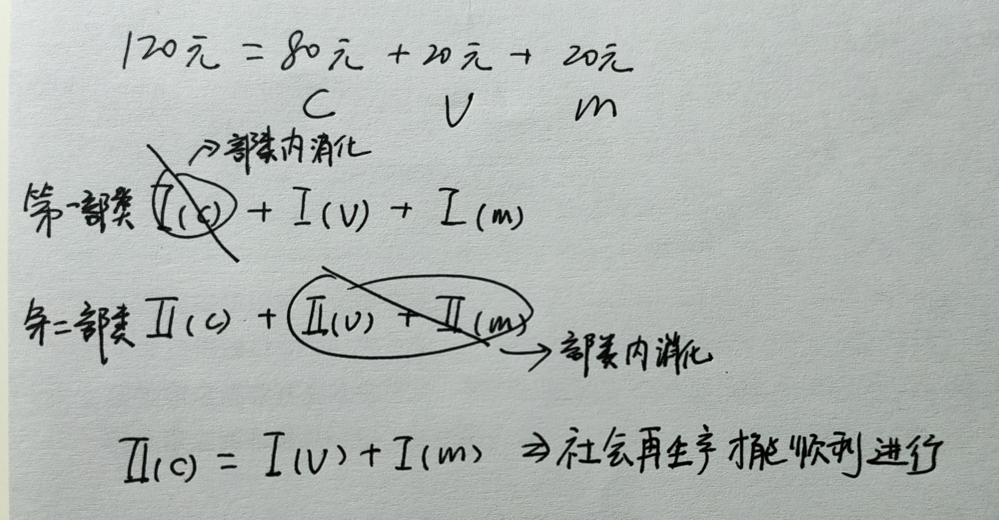

##### 考点 70 工资与剩余价值的分配

1. 剩余价值是利润的本质，二者数值相同，但前者为了揭露剥削，后者为了掩盖剥削

2. 生产价格 = 成本价格 + 平均利润

   生产价格形成后，市场价格的变动不再以价值为中心，而是以生产价格为中心（价格在自由竞争的资本主义时期的表现形式）

3. 借贷资本一般会小于平均利润（因为我不可能把全部的利润都拿去还钱）

4. 资本家的矛盾：瓜分剩余价值

   资本家的共识：加强对工人阶级的剥削以榨取更大量的剩余价值

##### 考点 71 马克思剩余价值理论的意义

1. 马克思主义的基石：世界物质统一性原理

   马克思主义经济学说的基石：剩余价值理论

2. 马克思 **创立** 了唯物史观和剩余价值理论：社会主义由空想变为科学

##### 考点 72 资本主义的基本矛盾与经济危机

1. [资本主义的基本矛盾](#资本主义基本矛盾)：生产资料资本主义私人占有和生产社会化的矛盾
2. 资本主义经济危机的本质特征：生产相对过剩
3. 资本主义经济危机爆发的 **根本原因**：资本主义的基本矛盾
4. 社会资本再生产周期性：危机、萧条、复苏、高涨

#### 第三节 资本主义上层建筑

##### 考点 73 资本主义的国家、民主制度及其本质

1. 资本主义民主制度
   * 资本主义法律制度
   * 政权组织形式
   * 选举制度
   * 政党制度

##### 考点 74 资本主义意识形态及其本质

1. 资本主义意识形态的本质
   1. 资本主义意识形态是资本主义社会的 [观念上层建筑](#观念上层建筑)，是为资本主义的经济基础服务的
   1. 资本主义意识形态是资产阶级的阶级意识的集中体现

### 第六章 资本主义的发展及其趋势

#### 第一节 垄断资本主义的形成与发展

##### 考点 75 资本主义从自由竞争到垄断

1. 商品经济
   1. 简单商品经济：资本主义以前 [5.1](#第一节 商品经济和价值规律)
   2. 发达商品经济：资本主义
      1. 自由竞争资本主义 [5.2](#第二节 资本主义经济制度)
      2. 垄断资本主义 [6]
         1. 私人垄断
         2. 国家垄断
         3. 国际垄断

2. 垄断价格与生产价格的组成

   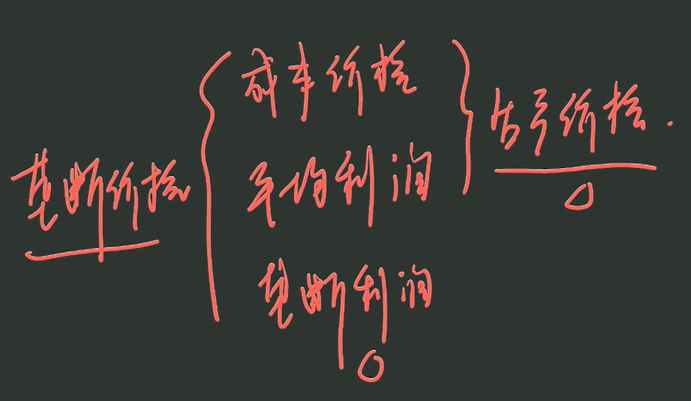

##### 考点 76 垄断资本主义的发展

1. [P83] 经济全球化对发展中国家的积极作用与垄断资本向发展中国家输出的积极作用约等于一致

#### 第二节 正确认识当代资本主义的新变化

##### 考点 78-81 见书 P83-P85

##### 考点 81-84 非重点

### 杂项

1. **价值规律** 的三次 **表现形式**：
   * 简单商品经济时期，价格围绕价值上下波动
   * 自由竞争资本主义时期，价格围绕生产价格上下波动
   * 垄断资本主义时期，价格围绕垄断价格上下波动

## 科学社会主义

### 第七章 社会主义的发展及其规律

#### 第一节 社会主义五百年的历史进程

##### 考点 85 社会主义从空想到科学

1. 《共产党宣言》的发表
   * **标志** 着科学社会主义的产生
   * **标志** 着马克思主义的诞生

##### 考点 86 第一国际和巴黎公社

1. 第一国际有马克思、恩格斯的亲自参与和指导
2. 各国无产阶级政党关系原则
   1. 联合
   2. 平等

##### 考点 87 十月革命胜利与第一个社会主义国家的建立

##### 考点 88 社会主义在苏联的实践

1. 苏维埃俄国对社会主义道路的探索的三个时期 **像** 我国的哪些时期
   * 战时共产主义：共产主义
   * 新经济政策：改革开放后
   * 苏联模式：建国初期

##### 考点 89-90 非重点

#### 第二节 科学社会主义基本原则

##### 考点 91-92 见书 P92-93

### 第八章 共产主义崇高理想及其最终实现 见书 P95-96

# **思想道德与法治**

## 绪论

### 担当复兴大任 成就时代新人

#### 考点 1-3 非重点

#### 考点 4 思想道德与法治的关系

1. 区别：在调节领域、调节方式、调节目标等方面存在很大不同

   联系：都是上层建筑的重要组成部分，共同服务于一定的经济基础

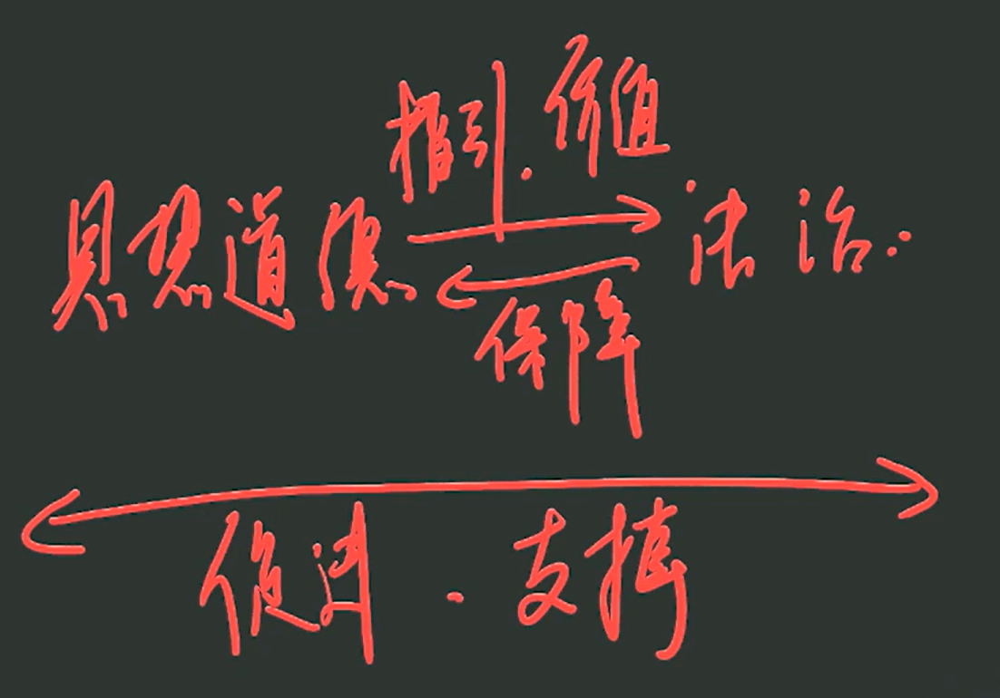

## 思想篇

### 第一章 领悟人生真谛 把握人生方向

#### 第一节 人生观是对人生的总看法

##### 考点 5 正确认识人的本质

1. 人的本质：一切社会关系的总和
2. 人的属性
   * 自然属性：索取
   * 社会属性（本质）：付出（主要）

##### 考点 6 个人与社会的辩证关系

1. 个人与社会的关系（重要，论述题框架，可套）
   1. 相互依存，相互促进
   2. 根本一致，个人服从社会
   3. 集中体现，有机统一
   4. 社会 $\underset{\text{保障}}{\overset{\text{前提、基础}}{\longrightarrow}}$ 个人
   5. 推动社会，实现自我

##### 考点 7 人生观的主要内容

1. 人生价值

   * 人生价值的层次：自我价值（索取/获得）、社会价值（付出/奉献）（主要）

2. 人生的自我价值与社会价值的关系

   | 人生价值 | 概念                                         | 关系                     | 概括 |
   | -------- | -------------------------------------------- | ------------------------ | ---- |
   | 自我价值 | 个体的人生活动对自己的生存和发展所具有的价值 | 自我价值是社会价值的前提 | 索取 |
   | 社会价值 | 个体的实践活动对社会、他人所具有的价值       | 社会价值是自我价值的保障 | 奉献 |

##### 考点 8 人生观与世界观

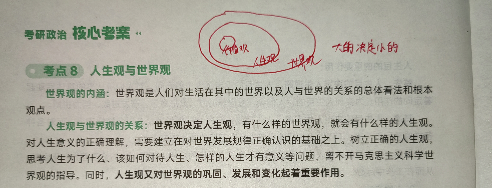

#### 第二节 正确的人生观

##### 考点 9 高尚的人生追求

1. 服务人民、奉献社会的思想及其科学而高尚的品质

##### 考点 10 非重点

##### 考点 11 人生价值的评价与实现

1. 评价人生价值的基本尺度（历史标准）：看一个人的实践活动
   * 是否符合社会发展的客观规律
   * 是否促进了历史的进步
2. 评价人生价值的方法
   1. 既要看奉献的大小，也要看尽力的程度
   2. 既要尊重物质奉献，也要尊重精神奉献
   3. 既要注重社会贡献，也要注重自身完善
3. 人生价值的实现条件
   1. 实现人生价值要从社会客观条件出发
   2. 实现人生价值要从个体自身条件触发
   3. 不断增强实现人生价值的能力和本领

#### 第三节 创造有意义的人生

##### 考点 12 辩证对待人生矛盾

1. 树立正确的幸福观、得失观、苦乐观、顺逆观、生死观、荣辱观
   * 苦不一定是逆境，梅花香自苦寒来，苦寒对梅花是顺境

##### 考点 13-14 非重点

### 第二章 追求远大理想 鉴定崇高信念

#### 第一节 理想信念的内涵及重要性

##### 考点 15 理想信念

1. 理想的分类

   * 按主体分：个人理想和社会理想
   * 按阶段分：近期理想和远期理想
   * 按内容分：生活理想、职业理想、道德理想和政治理想
   * 按层次分：崇高理想和一般理想

2. 理想的特征：超越性、实践性、时代性

3. 信念的特征：执着性、支撑性、多样性

4. 理想、信念、信仰的关系

   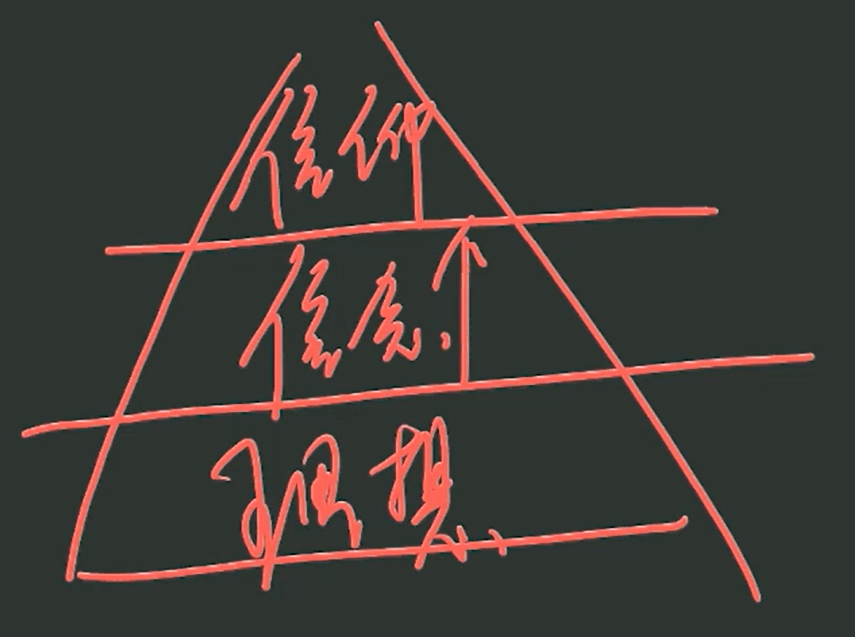

##### 考点 16 理想信念是精神之“钙”（理想信念的作用）

1. 理想指引方向，信念决定成败：信念决定成败是对的！这点尤为重要，没有逻辑
2. 理想信念昭示奋斗目标
3. 理想信念催生前进动力
4. 理想信念提供精神支柱
5. 理想信念提高精神境界

#### 第二节 坚定信仰信念信心 （非重点，记标题即可）

##### 考点 17 马克思主义信仰

##### 考点 18 中国特色社会主义是我们的共同理想

注意是共同理想

##### 考点 19 胸怀共产主义远大理想

注意是远大理想

##### 考点 20 增强对实现中华民族伟大复兴的信心

#### 第三节 在实现中国梦的实践中放飞青春梦想

##### 考点 21 理想与现实的辩证关系

1. 理想和现实是对立的，二者的矛盾与冲突，属于“应然”和“实然”的矛盾
2. 理想和现实是统一的

>“应然”和“实然”的矛盾：实际上也是政治书本和现实反差的解释
>
>* 应然-应该做某事
>* 实然-实际上是怎样的

##### 考点 22 坚持个人理想与社会理想的统一

可套 [个人与社会的关系](#个人与社会的关系) 论述题模板

##### 考点 23 为实现中国梦注入青春能量

1. 立鸿鹄志，做奋斗者
2. 心怀“国之大者”，敢于担当
3. 自觉躬身实践，知行合一

### 第三章 继承优良传统 弘扬中国精神

#### 考点 24-31 见书 P418-426

## 道德篇

### 第四章 明确价值要求 践行价值准则

#### 第一节 全体人民共同的价值追求

##### 考点 32 价值观与社会主义核心价值观

1. [社会意识形式](#社会意识形式)
   * 与阶级、利益有关：意识形态
   * 与阶级、利益无关：非意识形态
2. 社会主义核心价值观和社会主义核心价值体系的关系
   * “观”比“体系”更凝练
   * 二者内在一致

##### 考点 33 当代中国发展进步的精神指引

1. 坚持和发展 **中国** 特色社会主义的核心价值观（不能扩大到全人类）
2. 提高国家文化 **软实力** 的迫切要求
3. 推进社会团结奋进的 **“最大公约数”**（共识）

#### 第二节 社会主义核心价值观的显著特征

##### 考点 34-36 P431-433

1. 社会主义核心价值观的显著特征
   * 先进性
     * “社会主义”是社会主义核心价值观的“底色”
     * 中华优秀传统文化的涵养
     * 吸收借鉴了人类一切文明成果
   * 人民性：根本特性
   * 真实性：原则与实践的一致性
2. 选项中看到普世和普适这样的字眼，只要不是批判，这个选项一定是错的

#### 第三节 积极践行社会主义核心价值观

##### 考点 37-38 非重点

### 第五章 遵守道德规范 锤炼道德品格

#### 第一节 社会主义道德的核心与原则

##### 考点 39 什么是道德

1. 道德的起源
   * 劳动是道德起源的 **首要前提**
   * 社会关系是道德赖以产生的 **客观条件**
   * 人的自我意识是道德产生的 **主观条件**
2. 道德的本质
   * 道德是反映社会经济关系的特殊 **意识形态**（说明道德是上层建筑）
   * 道德是社会利益关系的特殊调节方式
   * 道德是一种实践精神

##### 考点 40 道德的功能和作用

1. 行为前：认识功能

   行为中：规范功能

   行为后：调节功能

2. 道德的基本功能：认识功能、规范功能、调节功能

   此外还有导向功能、激励功能

3. 夸大道德的作用：道德万能论

   贬低道德的作用：道德无用论

##### 考点 41 社会主义道德是崭新类型的道德

1. 社会主义道德具有显著的先进性特征

   * 社会主义道德是社会主义经济基础的 **反映**
   * 社会主义道德是对人类优秀道德资源的批判继承和创新发展
   * 社会主义道德克服了以往阶级社会道德的片面性和局限性，**坚持以为人民服务为核心**，**坚持以集体主义为原则**，展现出真实而强大的道义力量

2. 为什么要以为人民服务为核心？

   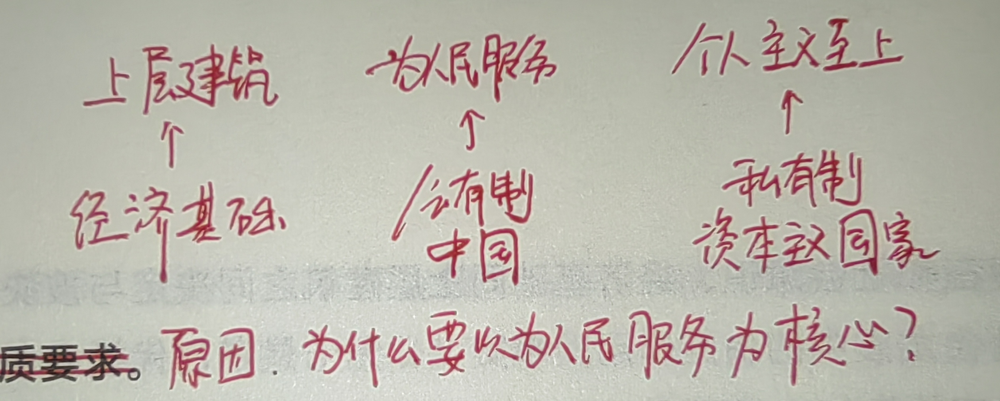

3. 如何理解为人民服务？

   * 先进性与广泛性的统一

4. 如何理解“集体主义”的原则？

   * 集体主义强调国家利益、社会整体利益和个人利益的辩证统一
   * 集体主义强调国家利益、社会整体利益高于个人利益
   * 集体主义重视和保障个人的正当利益

#### 第二节 吸收借鉴优秀道德成果

##### 考点 42 传承中国传统美德

1. 传统道德：批判地继承

   传统美德：创造性转换，创新性发展

2. 主张全盘恢复传统道德：复古论

   主张全盘否定传统道德：虚无论

##### 考点 43 发扬中国革命道德

1. 看到题目中有红色基因、红色血脉：反应出在考中国革命道德
2. 中国革命道德的主要内容
   * 为实现社会主义和共产主义的理想信念而奋斗
   * 全心全意为人民服务
   * 始终把革命利益放在首位
   * 树立社会新风，建立新型人际关系
   * 修身自律，保持节操
3. 中国革命道德的当代价值（意义）
   * 有利于加强和巩固社会主义和共产主义的理想信念
   * 有利于培育和践行社会主义核心价值观
   * 有利于引导人们树立正确的价值观
   * 有利于培育良好的社会道德风尚

##### 考点 44 非重点

#### 第三节 投身崇德向善的道德实践

##### 考点 45 遵守社会公德

1. 遵纪守法：**社会公德** 的最低要求

   爱国守法：**公民道德** 的最低要求

2. 网络生活中的道德要求（论述题，开放性，可以编，字写多点）

   * 正确使用网络工具
   * 健康进行网络交往
   * 自觉避免沉迷网络
   * 加强网络文明自律
   * 营造良好的网络道德环境

##### 考点 46 恪守职业道德 非重点

1. 最低要求：爱岗敬业

   最高要求：奉献社会

2. 社会主义道德建设

   * 核心：为人民服务
   * 原则：集体主义
   * 重点：诚实守信

##### 考点 47 弘扬家庭美德 非重点

1. 男女平等是
   * 道德要求
   * 法律规范
   * 基本国策

##### 考点 48 锤炼个人品德

1. 个人品德的特征
   * 稳定性
   * 综合性
   * 实践性
2. 掌握道德修养的正确办法（论述题）
   * 学思并重
   * 省察克治
   * 慎独自律
   * **知行合一**
   * 积善成德

#### 第四节 向上向善 知行合一

##### 考点 49-51 非重点

## 法治篇

### 第六章 学习法治思想 提升法治素养

#### 第一节 社会主义法律的特征和运行

##### 考点 52 法律的含义

1. 国家创制法律规范的方式
   1. 制定：国家机关在法定的职权范围内依照法定程序，制定、修改、废止规范性文件（三者统称广义上的制定）
   2. 认可：国家机关赋予某些既存社会规范法律效力，或者赋予先前的判例法律效力
2. 法律是统治阶级意志的体现
   * 统治阶级意志具有整体性，不是统治阶级内部个别人的意志，也不是统治者个人意志的简单相加
   * 统治阶级的成员也遵守法律
   * 法律所体现的统治阶级意志，并不是统治阶级意志的全部，仅仅是上升为国家意志的那部分意志
3. 法律的定义：法律是由国家制定或认可并由国家强制力保证实施的，反映由特定社会物质生活条件所决定的统治阶级意志的规范体系
4. 法律至上具体表现为法律的普遍适用性、优先适用性和不可违抗性
   * **普遍适用性**：法律在本国主权范围内对所有人具有普遍的约束力
   * **优先适用性**：当同一项社会关系同时受到多种社会规范的调整而多种社会规范又相互矛盾时，要优先考虑法律规范的适用
   * **不可违抗性**：法律必须遵守，违反法律要受到惩罚。任何人不论权力大小、职位高低，**只要有违法犯罪行为，就要依法追究和承担法律责任**

##### 考点 53 我国社会主义法律的本质特征

1. 我国的统治阶级：党领导下的人民群众
2. 我国社会主义法律的本质特征
   * 我国社会主义法律体现了党的主张和人民意志的统一
   * 我国的社会主义法律具有科学性和先进性
   * 我国社会主义法律是中国特色社会主义建设的重要保障

##### 考点 54 我国社会主义法律的运行

法律制定（立法）、法律执行（执法）、法律适用（司法）、法律遵守（守法）

* **法律制定** 是法律实施和实现的 **起始性和关键性环节**
* **法律执行** 是法律实施和实现的 **重要环节**
* **法律适用** 是国家司法机关及其公职人员依照法定职权和程序适用法律处理案件的专门活动
* **法律遵守** 是法律实施和实现的 **基本途径**

| 法律的运行       | 重点         | 说明                                                         |
| ---------------- | ------------ | ------------------------------------------------------------ |
| 法律制定（立法） | **属性**     | 法律运行的起始性和关键性环节                                 |
| 法律制定（立法） | 环节         | 1. 法律案的提出 2. 法律案的审议 3. 法律案的表决 4. 法律的公布 |
| 法律制定（立法） | **原则**     | 贯彻公正、公平、公开原则，坚持科学立法、民主立法、依法立法   |
| 法律执行（执法） | **属性**     | 法律实施和实现的重要环节                                     |
| 法律执行（执法） | **原则**     | 1. 合法性 2. 合理性 3. 信赖保护 4. 效率             |
| 法律执行（执法） | **执法主体** | 1. 中央和地方各级政府 2. 各级政府中享有执法权的下属机构 3. 法律授权的社会组织、行政机关依法委托的社会组织 |
| 法律适用（司法） | **司法机关** | 国家审判机关和检察机关                                       |
| 法律适用（司法） | 基本要求     | 正确、合法、合理、及时                                       |
| 法律适用（司法） | **原则**     | 1. 司法公正 2. 公民在法律面前一律平等 3. 以事实为根据，以法律为准绳 4. 司法机关依法独立公正行使司法权 |
| 法律遵守（守法） | **属性**     | 法律实施和实现的基本途径                                     |
| 法律遵守（守法） | 含义         | 1. 依法享有并行使权利 2. 依法承担并履行义务               |
| 法律遵守（守法） | 守法主体     | 一切组织和个人                                               |

#### 第二节 坚持全面依法治国

##### 考点 55 全面依法治国的根本遵循

1. 习近平法治思想的意义（对习近平新时代中国特色社会主义的评价，可当做框架来套在经济思想、外交思想、生态思想等）

   * 习近平法治思想 **凝聚着** 中国共产党人在法治建设长期探索中形成的经验积累和智慧结晶
   * **标志着** 我们党对共产党执政规律、社会主义建设规律、人类社会发展规律的认识达到了新高度
   * **开辟了** 21 世纪马克思主义法治理论和实践的新境界
   * 习近平法治思想是习近平新时代中国特色社会主义思想的 **重要组成部分**，是全面依法治国的 **根本遵循和行动指南**

2. 习近平法治思想的主要内容（十一个坚持）

   1. **坚持党对全面依法治国的领导**（谁来领导，政治方向）

   2. **坚持以人民为中心**（依靠谁/主体，政治方向）

   3. **坚持中国特色社会主义法治道路**（走什么道路，政治方向）

   4. **坚持依宪治国、依宪执政**：宪法，根本大法、总章程

   5. **坚持在法治轨道上推进国家治理体系和治理能力现代化**
      $$
      \begin{align}
      国家治理体系和&治理能力现代化 \\
      &\uparrow 轨道、依托 \\
      法&治 \\
      &\uparrow 依托 \\
      法治保&障体系
      \end{align}
      $$

   6. **坚持建设中国特色社会主义法治体系** $\rightarrow$ 总抓手（为了实现口号，需要做的最重要的事）

      * 法治体系包含法律体系

   7. **坚持依法治国、依法执政、依法行政共同推进、法治国家、法治政府、法治社会一体建设**

      * 依法治国 $\rightarrow$ 人民
      * 依法执政 $\rightarrow$ 党
      * 依法行政 $\rightarrow$ 政府 
      * 目标：法治国家
      * 重点：法治政府
      * 基础：法治社会

   8. **坚持全面推进科学立法、严格执法、公正司法、全民守法**

      * 全面依法治国的 **格局** 
        * 科学立法 $\rightarrow$ 前提
        * 严格执法 $\rightarrow$ 关键
        * 公正司法 $\rightarrow$ 重点
        * 全民守法 $\rightarrow$ 基础

   9. **坚持统筹推进国内法治与涉外法治**（重大关系）

   10. **坚持建设德才兼备的高素质法治工作队伍**
       $$
       \begin{align}
       人&才 \\
       \downarrow &保障 \\
       依法&治国 \\
       \downarrow &保障 \\
       中国特色社&会主义建设
       \end{align}
       $$

   11. **坚持抓住领导干部这个“关键少数”**

3. 中国特色社会主义法治体系的 **前提**：完备的法律规范体系

   建设社会主义法治国家的 **前提**：尊重社会主义法律权威

##### 考点 56-57 解释上面的十一个坚持 P457-459

#### 第三节 维护宪法权威

##### 考点 58 非重点 除非修改宪法考时事政治

##### 考点 59 我国宪法的地位和基本原则

1. 根本纽带：宪法

   精神纽带：社会主义核心价值观

2. 加强宪法实施

   * 坚持依宪执政：党
   * 坚持依法立法：人大
   * 坚持严格执法：执法机关

#### 第四节 自觉尊法学法守法用法

##### 考点 60 培养社会主义法治思维

1. 权力 power：法无授权即禁止

   权利 right：法无禁止即自由

##### 考点 61-63 见 P467-470

#####  考点 64 依法履行法律义务

1. 我国公民的最高法律义务：维护国家统一个民族团结

##### 考点 65 不断提升法治素养

1. 尊重法律权威
   * 内在强制力
   * 外在说服力

# **中国近现代史纲要**

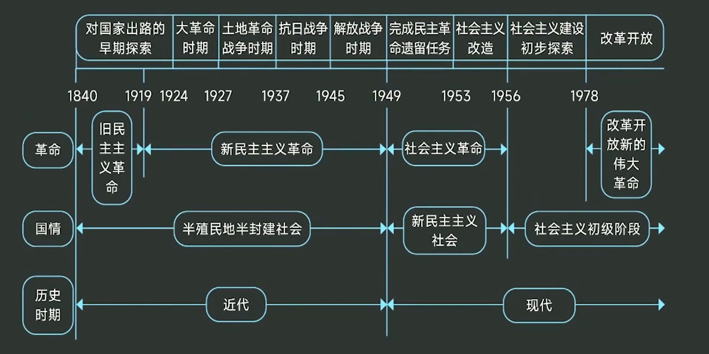

## 旧民主主义革命时期

### 第一章 进入近代后中华民族的的磨难与抗争

#### 第一节 鸦片战争前后的中国与世界

##### 考点 1 中国封建社会的衰落 非重点

1. 中国封建社会是礼制社会——费孝通《乡土中国》

##### 考点 2 世界资本主义的发展与殖民扩张 非重点

1. 通过资产阶级革命、工业革命进入资本主义社会

##### 考点 3 鸦片战争的爆发

1. 林则徐虎门销烟是维护国家利益和民族尊严的 **正义行动**

2. 鸦片战争的结果

   1. 不平等条约

      | 不平等条约   | 签约对象 |
      | ------------ | -------- |
      | 《南京条约》 | 中英     |
      | 《虎门条约》 | 中英     |
      | 《望厦条约》 | 中美     |
      | 《黄埔条约》 | 中法     |

   2. 这一系列不平等条约，列强在中国攫取了大量侵略特权

      * 主权和领土完整
      * 领海主权
      * 司法主权
      * 关税主权

   3. 侵略及不平等条约给中国带来的后果（为什么鸦片战争是中国近代史的起点？）

      1. 国情（社会性质）变了：**逐步** 沦为半殖民地半封建社会
      2. 社会主要矛盾变了
      3. 革命任务变了

##### 考点 4 近代中国的半殖民地半封建性质

1. 中国半殖民地半封建社会的基本特征

   | 方面     | 基本特征                                                     |
   | -------- | ------------------------------------------------------------ |
   | 政治方面 | 1. 资本-帝国主义日益成为支配中国的 **决定性力量** 2. 中国的封建势力日益成为资本-帝国主义压迫、奴役中国人民的社会基础和统治支柱 |
   | 经济方面 | 1. 封建剥削制度的根基即封建地主的土地所有制依然在广大地区保持着 2. 民族资本主义经济虽然已经产生，但发展很缓慢，力量很软弱 |
   | 社会方面 | 1. 近代中国各地区经济、政治和文化的发展极不平衡（综合性说法） 2. 中国的广大人民尤其是农民日益贫困化以至大批的破产，过着饥寒交迫和毫无政治权利的生活 |

2. 近代中国社会阶级关系的变动

   * 传统阶级
     * 地主阶级
     * 旧的被统治阶级即农民阶级
   * 新兴阶级
     * 工人阶级 = 无产阶级
     * 资产阶级
       * 官僚买办资本家
       * 民族资本家

   >官僚：与封建势力勾结
   >
   >买办：与帝国主义勾结
   >
   >注：小资产阶级不是资产阶级，是劳动人民，但可能转化为民族资本家和官僚买办资本家
   >
   >先进阶级：工人阶级、农民阶级、小资产阶级

##### 考点 5 近代中国的主要矛盾和历史任务

1. 关于主要矛盾和主要任务可以推导

   国情 $\rightarrow$ 矛盾 $\rightarrow$ 任务 $\rightarrow$ 道路、路线、...

   半殖半封 $\rightarrow$ 帝-中 封-人 $\rightarrow$ 反帝反封

   社初 $\rightarrow$ 需要-发展 $\rightarrow$ 解放、发展生产力

2. **近代以来**（近代 + 现代）中华民族面临的两大历史任务

   * 争取民族独立、人民解放（反帝反封）
   * 实现国家富强、人民幸福

#### 第二节 西方列强对中国的侵略

##### 考点 6 军事侵略

1. 主要表现
   * 发动侵略战争，屠杀中国人民
   * 请战中国领土，划分势力范围
   * **勒索赔款，抢掠财富**（抢，属于军事）

##### 考点 7 政治控制

1. 主要表现
   * 控制中国的内政、外交（**把持中国海关**，是外国侵略者控制中国政治的重要手段之一）
   * 镇压中国人民的反抗
   * 扶植、收买代理人

##### 考点 8 经济掠夺

1. 主要表现
   * 控制中国的通商口岸
   * 剥夺中国的 **关税自主权**
   * 实行商品倾销和资本输出
   * 操控中国的经济命脉
     * 外国资本在中国设立的银行，是它们对中国进行资本输出的枢纽
     * 资本-帝国主义列强还控制了中国现代交通运输业

##### 考点 9 文化渗透

1. 主要表现
   * 披着宗教外衣，进行侵略活动
   * 为侵略中国制造舆论
     * “庚款兴学”
     * “种族优劣论”
     * 19 世纪末“黄祸论”，即中国“威胁”论

#### 第三节 反抗外国武装侵略的斗争

##### 考点 10 抵御外来侵略的斗争历程

1. 人民群众的反侵略斗争：广州三元里人民抗英，第一次
2. 爱国官兵的反侵略斗争：一般带姓名和官职

##### 考点 11 义和团运动

1. 义和团在粉碎帝国主义列强瓜分中国的斗争中，发挥了 **重大的历史作用**（不能夸大，也不能贬低）

##### 考点 12 列强瓜分中国图谋的破产

1. 琉球：冲绳地区

2. 帝国主义列强瓜分中国达到高潮：中日甲午战争

   帝国主义瓜分中国的狂潮的 **标志**：竞相租借港湾和划分势力范围

#### 第四节 反侵略战争的失败及其原因

##### 考点 13 反侵略战争的失败及其原因

1. 根本原因：社会制度的腐败

   重要原因：经济技术的落后

   >当时的人民认为技术才是根本原因：洋务运动、中体西用

##### 考点 14 民族意识的觉醒

1. 民族意识普遍觉醒：中日甲午战争

   民族意识全面觉醒：五四运动

### 第二章 不同社会力量对国家出路的早期探索

#### 第一节 太平天国运动的起落

##### 考点 15 太平天国农民战争

1. **农民阶级** 的探索
2. 是一次反对清政府腐朽统治和地主阶级压迫、剥削的 **正义战争**
3. 《天朝田亩制度》
   * 最重要的纲领
   * **有纲领**
4. 《资政新编》
   * 具有资本主义色彩的方案

##### 考点 16 太平天国农民战争的意义和局限

1. 太平天国农民战争的历史意义

   * 沉重打击了封建统治阶级

   * 中国旧式农民战争的最高峰

   * 冲击了孔子和儒家经典的正统权威

   * 有力地打击了外国侵略势力

     | 矛盾点                   | 太平天国                                    |
     | ------------------------ | ------------------------------------------- |
     | 纲领（我主张怎么样）     | 不反帝                                      |
     | 任务（我应该怎么样）     | 半殖民地半封建的国情 $\rightarrow$ 反帝反封 |
     | 结果（我实际干了什么事） | 有力地打击了外国侵略势力                    |

   * 时间最久、规模最大、影响最深

2. 太平天国农民战争失败的原因和教训

   * 根本原因：无法克服阶级局限性
   * 无法制止和克服领导集团自身腐败问题的滋生
   * 军事战略上出现了重大失误
   * 以宗教来发动、组织群众的，没有科学理论的指导
   * 未能正确地对待儒学
   * 对于西方资本主义侵略者还缺乏理性的认知

3. 太平天国农民战争及其失败表明：在半殖民地半封建的中国，农民具有伟大的革命潜力；但它自身不能担负起领导反帝反封建斗争取得胜利的重任。单纯的农民战争不可能完成争取民族独立和人民解放的历史任务

#### 第二节 洋务运动的兴衰

##### 考点 17 洋务事业的兴办

1. **封建地主阶级** 的探索

2. 洋务派兴办洋务事业的原因

   * 根本原因：为了购买和制造洋枪洋炮以镇压农民起义
   * 借此加强海防、边防，并乘机发展本集团的政治、经济、军事实力的意图

3. 洋务运动的指导思想（纲领）：中体西用

4. 洋务派举办的洋务事业：先办军用工业，但是资金奇缺、原料和燃料供应不足，以及交通运输落后，**因此** 兴办了一些民用企业

   * 军用工业

     | 名称             | 主办人                 | 说明                 |
     | ---------------- | ---------------------- | -------------------- |
     | 上海江南制造总局 | 曾国藩支持、李鸿章筹办 | 当时国内最大的兵工厂 |
     | 金陵机器局       | 李鸿章                 |                      |
     | 福州船政局       | 左宗棠                 | 当时国内最大的造船厂 |
     | 天津机器局       | 崇厚                   |                      |
     | 湖北枪炮厂       | 张之洞                 | 在汉阳               |

   * 民营企业：官督商办，具有资本主义性质（但洋务派是封建地主阶级，这不是洋务运动的初衷）

     | 名称           | 主办人 |
     | -------------- | ------ |
     | 轮船招商局     | 李鸿章 |
     | 开平矿务局     | 李鸿章 |
     | 天津电报局     | 李鸿章 |
     | 上海机器织布局 | 李鸿章 |

   * 建立新式海陆军：以北洋水师为代表

   * 创办新式学堂，派遣留学生

     * 翻译学堂
     * 工艺学堂
     * 军事学堂

##### 考点 18 洋务运动的历史作用及其失败标志

1. 给中国带来了新的知识：自然科学
2. 洋务运动的目标：“自强”、“求富”
3. 洋务运动失败的 **标志**：中日甲午战争
4. 失败的原因
   * 根本原因：具有封建性（阶级局限性）
   * 对列强具有依赖性
   * 管理具有腐朽性

#### 第三节 戊戌维新运动的兴起和夭折

##### 考点 19 戊戌维新运动的开展

1. **资产阶级维新派** 的探索

2. 维新派宣传维新的活动

   * 向皇帝上书
   * 著书立说
     * 康有为《新学伪经考》《孔子改制考》（托古改制）
     * 梁启超《变法通议》
     * 谭翤同《仁学》
     * 严复翻译《天演论》
   * 介绍外国变法的经验教训
   * 办学会
   * 设学堂
   * 办报纸

   >维新派：自上而下地实行变法主张
   >
   >改革开放：上下联动

3. 维新派与守旧派的论战：守旧派指洋务派

   * 带来了社会科学的知识

4. “百日维新”的性质

   * 是一场资产阶级性质的改良运动
   * 未触及封建制度的根本
   * 温和而不彻底的改革方案

##### 考点 20 戊戌维新运动的历史意义、失败原因和教训

1. 戊戌维新运动失败的原因和教训
   * 根本原因：维新派自身的局限（阶级局限性）
     * 不敢否定封建主义
     * 对帝国主义抱有幻想
     * 惧怕人民群众（走 **精英路线**）
   * 以慈禧太后为首的强大的守旧势力的反对
     * 民族资产阶级力量弱小（客观原因，不属于阶级局限性）

### 第三章 辛亥革命与君主专制制度的终结

#### 第一节 举起近代民族民主革命的旗帜

##### 考点 21 辛亥革命爆发的历史条件

1. **资产阶级革命派** 的革命
2. 《辛丑条约》的后果
   * 清政府彻底沦为了洋人的工具
   * 国情：中国完全沦为半殖民地半封建社会
   * 国人对待革命的态度发生根本变化
3. 资产阶级革命派的骨干是一批资产阶级、小资产阶级知识分子：走精英路线

##### 考点 22 资产阶级革命派的活动

1. 孙中山：兴中会
2. 华兴会、科学补习所、光复会、岳王会
3. 中国同盟会：中国国民党的前身
4. 资产阶级革命
   * 鸦片战争：开始
   * 同盟会：进入了一个新的阶段

##### 考点 23 三民主义学说和资产阶级共和国方案

1. 民族主义：“驱除鞑虏，恢复中华”
   * 没有明确的反帝纲领，放松了对汉族封建势力的警惕
   * 反封不彻底
2. 民权主义：“创立民国”
   * 人民的民主权利很难得到真正的保证
3. 民生主义：“平均地权”（征收地价税和土地增价归公）
   * 没有正面触及封建土地所有制
   * 不能满足广大农民的土地要求

##### 考点 24 关于革命与改良的辩论

1. 资产阶级

   * 维新改良派：君主立宪制（保留皇帝）
   * 革命派：民主共和制（推翻皇帝）

2. 资产阶级革命派的弱电（根源：软弱、妥协）

   * 不反帝
   * 走精英路线
   * 不分地

3. 中国近代史上两次著名论战的比较

   | 论战派别       | 论战内容                                                     |
   | -------------- | ------------------------------------------------------------ |
   | 维新派与守旧派 | 1. 要不要变法 2. 要不要兴民权、设议院、实行君主立宪 3. 要不要废八股、改科举和兴西学 |
   | 革命派与改良派 | 1. 要不要以革命手段推翻清王朝（论战焦点） 2. 要不要推翻帝制、实行共和 3. 要不要进行社会革命 |

#### 第二节 辛亥革命与中华民国的建立

##### 考点 25 辛亥革命的爆发与清王朝的覆灭

1. 第一次起义：萍浏醴起义

2. 影响最大：广州起义（烈士葬在黄花岗，史称“黄花岗起义”）

3. 保路运动

4. 1912 年 2 月 12 日，清帝退位

   1912 年 1 月 1 日，中华民国临时政府成立

   时间差：南北和谈

##### 考点 26 中华民国的建立

1. 考试对孙中山只褒不贬，这些局限性是南京临时政府的
2. 封建制度
   * 政治：封建君主专制（辛亥革命结束了这个）
   * 经济：封建土地剥削
   * 文化：封建伦理纲常
3. 《中华民国临时约法》：中国历史上第一部具有资产阶级共和国宪法性质的法典

#### 第三节 北洋军阀统治与旧民主主义革命的失败

##### 考点 28 封建军阀专制统治的形成

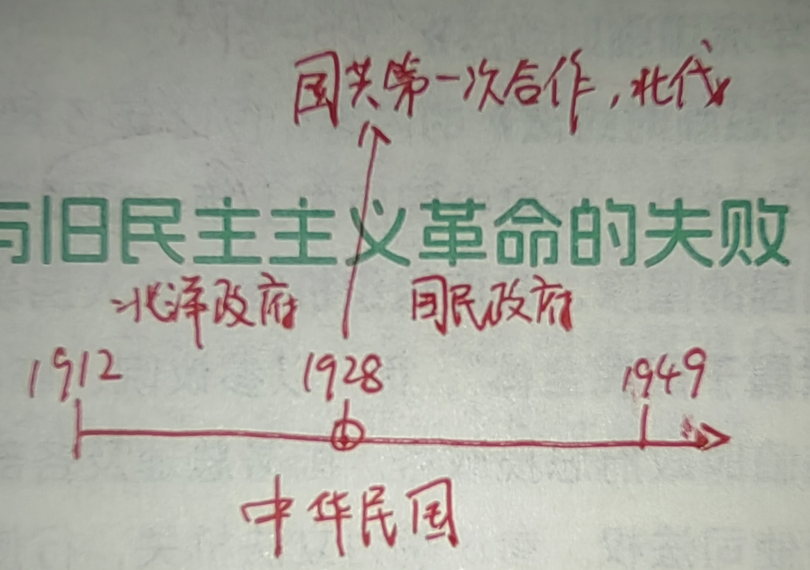

##### 考点 29 旧民主主义革命的失败

1. 孙中山挽救共和的努力

   | -        | 二次革命                       | 护国运动                                                     | 护法运动                                                     |
   | -------- | ------------------------------ | ------------------------------------------------------------ | ------------------------------------------------------------ |
   | 历史背景 | 袁世凯暗杀国民党领袖宋教仁     | 袁世凯复辟帝制                                               | 段祺瑞拒绝恢复国会和《临时约法》                             |
   | 结果     | 失败。孙中山等革命党人流亡海外 | 部分成功。袁世凯帝制覆灭，民国形式得以恢复。但中国陷入了 **军阀割据** 的局面，中央政府名存实亡 | 失败。使孙中山认识到“南与北如一丘之貉”，必须建立自己的革命武装 |

2. **旧民主主义革命终结的标志：护法运动的失败**

#### 杂项

1. 半殖民地半封建社会 $\rightarrow$ 反帝反封建

2. 决定革命性质的不是领导者，而是革命的任务和对象

   | -          | 旧民主主义革命 | 新民主主义革命   |
   | ---------- | -------------- | ---------------- |
   | 领导者     | 资产阶级       | 无产阶级         |
   | 性质       | 资产阶级革命   | **资产阶级革命** |
   | 任务、对象 | 反帝反封建     | 反帝反封建       |

3. **在新中国成立前，中国没有无产阶级社会主义革命！** 因为无产阶级革命是反资的

4. 推翻、剥削和压迫的关系

   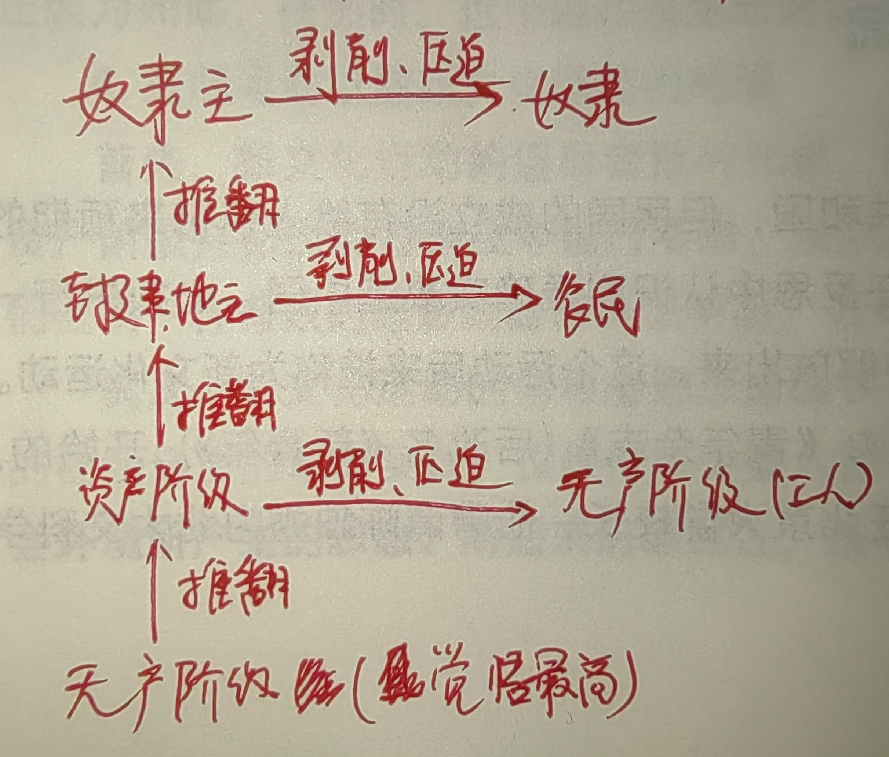

## 新民主主义革命时期

### 第四章 中国共产党成立和中国革命新局面

#### 第一节 新文化运动与五四运动

##### 考点 30 新文化运动与思想解放的潮流

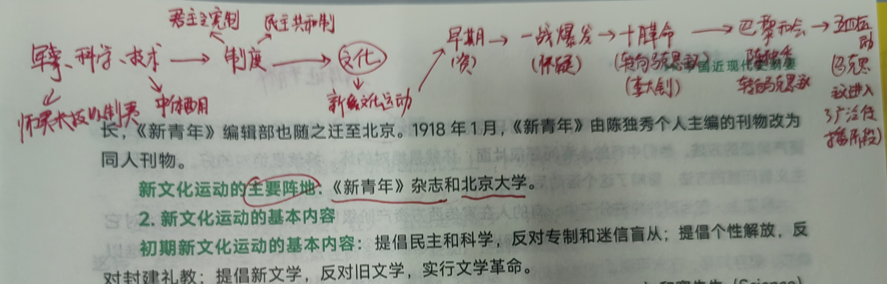

1. 新文化运动的主要阵地：《新青年》杂志和北京大学
2. 新文化运动的领导人还没有马克思主义的批判精神，他们使用的方法，一般还是资产阶级的方法
3. 依靠有限的宣传手段：新文化运动早期是精英运动

##### 考点 31 十月革命对中国先进分子的影响

1. 马克思主义在中国
   * 进入：十九世纪末二十世纪初
   * 十月革命：信仰（少数、李大钊）
   * 《我的马克思主义观》：系统传播
   * 五四运动：广泛传播

##### 考点 32 五四运动的产生和发展

1. 五四运动爆发的社会历史条件
   1. 新的社会力量的成长、壮大（无产阶级 = 工人阶级）
   2. 新文化运动掀起的思想解放的潮流
   3. 俄国十月革命对中国的影响
2. 运动由学生转向工人

##### 考点 33 五四运动的历史特点及其意义

1. 主要特点

   * 彻底反帝反封建
   * 拯救民族危亡、捍卫民族尊严、凝聚民族力量
   * 传播新思想新文化新知识

2. 旧民主主义革命结束的 **标志**：护法运动的失败

   新民主主义革命开始的 **标志**：五四运动

3. 中国人民觉醒的历程

   * 鸦片战争：睁眼看世界
   * 中日甲午战争：普遍觉醒
   * 五四运动：全面觉醒

4. 五四运动（因果关系）

   * 促进了马克思主义在中国的传播
   * 促进了马克思主义同中国工人运动的结合
   * 为中国共产党的成立作了思想上干部上的准备
   * 为新的革命力量、革命文化、革命斗争登上历史舞台创造了条件
   * **因此**，五四运动成为中国新民主主义革命的开点

#### 第二节 马克思主义广泛传播与中国共产党诞生

##### 考点 34 中国早期马克思主义思想运动

1. 重要过程：队伍 $\rightarrow$ 党小组 $\rightarrow$ 中国共产党（必须区分每个阶段做了什么事）

2. 早期马克思主义者的 **[队伍](#队伍党小组中国共产党)** 的特点
   * 重视对马克思主义基本理论的学习，从一开始就坚持了马克思主义的革命原则和正确方向，明确地同第二国际的社会民主主义划清界限
   * 注意从中国的实际出发，学习、运用马克思主义，**初步形成了马克思主义应当与中国具体实际相结合的思想**
   * 开始提出知识分子应当同劳动群众相结合的思想，主张知识分子“向农村去”，到民间去

   >马克思主义中国化 // TODO 留待后续笔记补充
   >
   >1. 早期队伍思想运动：初步形成马克思主义与中国具体实际相结合的思想
   >2. 大革命：开始探索马克思主义中国化
   >3. 提出命题：马克思主义中国化

##### 考点 35 马克思主义与中国工人运动的结合

1. **[党小组](#队伍党小组中国共产党)**：上海《新青年》编辑部
2. 中国共产党早期组织的活动
   * 研究和宣传马克思主义，研究中国实际问题
   * 到工人中去进行宣传和组织工作
   * 进行关于建党问题的讨论和实际组织工作
3. 1920 年 8 月，上海社会主义青年团成立：共青团的前身（早于中国共产党的成立）

##### 考点 36 中国共产党的成立及其意义

1. **伟大建党精神**（中国共产党的精神之源）：坚持真理、坚守理想、践行初心、担当使命、不怕牺牲、英勇斗争、对党忠诚、不负人民
1. 中国共产党成立的伟大意义
   * 新领导力量
   * 新的征程
   * 新的精神
   * 新命运、新格局

#### 第三节 中国革命的新局面

##### 考点 37 制定革命纲领，发动工农运动

1. 中国革命的首要问题：分清敌友

2. **[中国共产党](#队伍党小组中国共产党)** 领导的工人运动：香港海员罢工、京汉铁路工人罢工（第一个工人运动高潮的顶点）、安源路矿工人罢工（胜利）、开滦五矿工人罢工

   **[中国共产党](#队伍党小组中国共产党)** 领导的农民运动：浙江萧山县衙前村成立了中国第一个农民协会，开展反抗地主压迫的斗争

##### 考点 38 实行国共合作和掀起大革命高潮

1. 国民党一大：新三民主义
   * 民族主义：突出了反帝
   * 民权主义：强调“为一般平民所共有”
   * 民生主义：“平均地权”和“节制资本”（后来又提出“耕者有其田”）
2. 从五卅运动开始，中国的革命被分为四个时期
   1. 大革命时期：1925-1927
   2. 土地革命时期：1927-1937
   3. 全面抗战时期：1937-1945
   4. 解放战争时期：1945-1949
3. 第一次国共合作的 **标志**：国民党一大

##### 考点 39 大革命的失败及其原因

1. 大革命失败的 **标志**：四一二反革命政变和七一五反革命政变
2. 评价中国共产党的成功与失败的 **根本原因**（模板）
   * 遵义会议以前：共产国际瞎指挥
   * 无论何时
     * 做成功了：善于 **马 + 中**
     * 做失败了：**马 + 中** 没有做好

##### 考点 40 大革命失败的经验教训和意义

见 P336

### 第五章 中国革命的新道路

#### 第一节 中国共产党对革命新道路的探索

##### 考点 41 国民党在全国统治的建立

1. 东北易帜：北洋军阀不再作为独立的政治力量继续存在。国民党在全国范围内建立了自己的统治
2. 国民党变成一个由代表地主阶级、买办性的大资产阶级利益的反动集团所控制的政党。跟北洋政府的统治没有本质的区别
3. 中国的国情仍然是半殖民地半封建社会

##### 考点 42 土地革命战争的兴起

1. 南昌起义的番号：国民革命军

   秋收起义的番号：工农革命军

2. 党指挥枪（党对军队的领导） $\rightarrow$ 南昌起义（开始）

   新型人民军队 $\rightarrow$ 三湾改编（开始）

   新型人民军队 $\rightarrow$ 古田会议（定型）

##### 考点 43 农村包围城市、武装夺取政权的道路

1. 第一个红色政权：茶陵县工农兵政府
2. **中国革命新道路思想**：党把工作重心由城市转移到农村，在农村开展游击战争，深入进行土地革命，建立和发展红色政权，待时机成熟时夺取全国政权 
3. 革命新道路理论的提出（初步形成） $\xrightarrow{\text{标志着}}$ 毛泽东思想初步形成
4. 古田会议决议是中国共产党和红军建设的纲领性文献
5. **依靠** 贫农、联合中农、**限制** 富农、保护中小工商业者、**消灭** 地主阶级

#### 第二节 中国革命在曲折中前进

##### 考点 44 土地革命战争的发展及其挫折

1. 《中华苏维埃共和国宪法大纲》：实行工农兵代表大会制度
2. 三次 **“左”倾错误** 的主要表现
   * 在革命性质和统一战线问题上，混淆民主革命与社会主义革命的界限，将 **反帝反封** 与 **反资产阶级** 并列
   * 在革命道路问题上，继续坚持以城市为中心
   * 在土地革命问题上，提出坚决打击富农和“地主不分田，富农分坏田”的主张
   * 在军事斗争问题上，实行进攻中的冒险主义、防守中的保守主义、退却中的逃跑主义
   * 在党内斗争和组织问题上，推行宗派主义和“残酷斗争，无情打击”的方针
3. 出现“左”倾错误的原因
   * 根本原因：不善于把马克思列宁主义与中国实际全面地、正确地结合起来
   * 八七会议以后党内一直存在着浓厚的“左”倾情绪始终没有得到认真清理
   * 共产国际瞎指挥

##### 考点 45 遵义会议与中国革命的历史性转折

1. 关于 **政治** 的理解：把朋友搞得多多的，把敌人搞得少少的（团结大多数，孤立一小撮）
2. 何时解决政治问题（统一战线问题）
   * 瓦窑堡会议
   * 《论反对日本帝国主义的策略》
3. 何时解决思想问题：延安整风运动
4. 遵义会议是党的历史上一个 **生死攸关** 的转折点

##### 考点 46 非重点

##### 考点 47 总结历史经验，迎接全民族抗战

见杂项-毛泽东的文章

### 第六章 中华民族的抗日战争

#### 第一节 日本发动企图灭亡中国的侵略战争

##### 考点 48-49 非重点

#### 第二节 中国人民奋起抗击日本侵略者

##### 考点 50 中国共产党举起武装抗日的旗帜

1. 九一八事变和卢沟桥事变
   * 九一八事变 $\rightarrow$ 揭开了世界反法西斯战争的序幕
   * 卢沟桥事变 $\rightarrow$ 开辟世界反法西斯战争东方主战场

##### 考点 51 非重点 

##### 考点 52 一二 · 九运动

1. 中国人民抗日救亡运动新高潮的到来的 **标志**：一二 · 九运动

##### 考点 53 抗日民族统一战线政策的形成

1. 地主买办阶级内部分化
   * 亲日派（敌人）
   * 亲英、美派（顽固派）（抗日战争时期是朋友）

##### 考点 54 西安事变

1. 西安事变：时局转换的枢纽，十年内战的结束

##### 考点 55 全民族抗战开始

1. 第一次国共合作的标志：国民党一大（联俄、联共、扶助农工）
2. 第二次国共合作的标志：《中共中央为公布国共合作 **宣言**》和蒋介石发表实际上承认共产党合法地位的 **谈话**

#### 第三节 抗日战争的正面战场

##### 考点 56 战略防御阶段和战略相持阶段的正面战场

1. 抗日战争的三个阶段

   | 阶段         | 开始       | 结束           |
   | ------------ | ---------- | -------------- |
   | 战略防御阶段 | 卢沟桥事变 | 广州、武汉失守 |
   | 战略相持阶段 |            |                |
   | 战略进攻阶段 |            |                |

2. 国民党在正面战场取得的胜利：台儿庄大捷

#### 第四节 抗日战争的中流砥柱

##### 考点 57 全面抗战的路线的持久战的战略总方针

见杂项-中国共产党开的会议-洛川会议

见杂项-毛泽东的文章-《论持久战》

##### 考点 58 敌后战场的开辟与游击战争的发展

1. 打破了日军不可战胜的神话：平型关大捷

   打破了美军不可战胜的神话：抗美援朝

2. 忻口会战：国共两党军队合作抗日、配合最好的一次战役

3. 在全民抗战中，游击战被提到战略地位，具有全局性意义

##### 考点 59 坚持抗战、团结、进步的方针

1. 抗战中中国共产党对待各阶级的态度
   * 民族资产阶级：又团结又斗争
     * 革命
     * 软弱、妥协
   * 国民党抗日派（大地主大资产阶级）（顽固派）：**又团结又斗争**
2. 见杂项-中国共产党开的会议-瓦窑堡会议
3. 在同顽固派作斗争时，坚持有理、有利、有节的原则

##### 考点 60 抗日民主根据地的建设

1. 根据地政权建设，工作人员分配上实行“三三制”原则：共产党员、党外进步人士和中间派各占 1/3
2. 注意区分两个概念（二者其实是两码事，但是容易混淆，注意二者没有对应关系）
   * 抗日民族统一战线：先进阶级、中间派、顽固派
   * 根据地政权建设：党员、党外进步势力、中间派
3. 减租减息，见杂项-土地政策-中国共产党抗日战争时期“减租减息”

##### 考点 61 非重点

##### 考点 62 “马克思主义的中国化”命题的提出

1. 马克思主义的中国化的脉络

   * 李大钊、小组：初步形成马克思主义的中国化的思想
   * 大革命（国民革命时期）：初步探索马克思主义的中国化途径
   * 六届六中全会：提出马克思主义的中国化命题

2. 遵义会议：确立了毛泽东在全党的领导地位

   六届六中全会：巩固了毛泽东在全党的领导地位

3. 新民主主义理论：系统阐明 $\xrightarrow{\text{标志着}}$ 毛泽东思想的成熟

   * 总路线：无产阶级领导的、人民大众的、反对帝国主义、封建主义和官僚资本主义的革命
   * 总纲领：包括政治、经济和文化纲领
     * 政治纲领：建立无产阶级领导下的一切反帝反封建的人们联合专政的民主共和国
     * 经济纲领：没收封建阶级的土地归农民所有，没收官僚资本归新民主主义国家所有，保护民族工商业
     * 文化纲领：发展民族的、科学的、大众的文化
   * 革命道路：农村包围城市、武装夺取政权的道路。初步形成（井冈山）$\xrightarrow{\text{标志着}}$ 毛泽东思想初步形成
   * **三大法宝：统一战线、武装斗争、党的建设**

##### 考点 64 延安整风运动与中共七大

1. 整风运动最主要的任务：反对主观主义

2. 主观主义：中国共产党内反复出现“左”、“右”倾错误的思想认识根源
   * 实质：理论脱离实际
   * 主要表现形式：教条主义和经验主义
3. 延安整风运动结束的 **标志**：六届七中全会《关于若干历史问题的决议》

#### 第五节 抗日战争的胜利及其意义

##### 考点 65 抗日战争的胜利

1. 胜利时间：1945 年 9 月 3 日

##### 考点 66 中国人民抗日战争在世界反法西斯战争中的地位

1. 中国的抗日战争是世界反法西斯战争的重要组成部分，中国战场是世界反法西斯战争的东方主战场
2. 世界反法西斯力量对中国的援助。中国的抗日战争得到了世界上所有爱好和平与正义的国家和人民、国际组织及各种反法西斯力量的同情和支持

##### 考点 67 抗日战争胜利的原因和意义

1. 原因

   * 决定因素：以爱国主义为核心的民族精神
   * 关键：中国共产党的中流砥柱作用
   * 重要法宝：全民族抗战（洛川会议）
   * 中国人民抗日战争的胜利，同世界上所有爱好和平与正义的国家和人民、国际组织及各种反法西斯力量的同情和支持也是分不开的

2. 建党的意义：改变了中华民族和中国人民的前途和命运

   长征的意义：党和革命事业从挫折走向胜利的伟大转折

   抗战胜利的意义：中华民族由近代以来陷入深重危机走向伟大复兴的历史转折点

### 第七章 为建立新中国而奋斗

#### 第一节 从争取和平民主到击退国民党的军事进攻

##### 考点 68 非重点

##### 考点 69 中国共产党争取和平民主的斗争

1. 重庆谈判：“双十协定”
2. 重庆政治协商会议（老政协）：不是新民主主义性质的
   * 新民主主义 $\rightarrow$ 反帝反封
   * 但老政协有共产党、民主党派和 **国民党** 参与，也即有大地主大资产阶级参与，不是新民主主义性质的

##### 考点 70 非重点

#### 第二节 全国解放战争的发展和第二条战线的形成

##### 考点 71 全国解放战争的胜利发展

1. 解放战争的三个阶段：抗日战争急不得，解放战争拖不得
   1. 战略防御
   2. 战略反攻（进攻）
   3. 战略决战
2. 战略进攻：刘邓大军千里跃进大别山、陈毅、粟裕挺进苏鲁豫皖地区、陈庚、谢富治挺进豫西

##### 考点 72 解放区的土地改革运动与农民的广泛发动

见杂项-土地政策-土改：解放战争（五四指示）

##### 考点 73 第二条战线的形成和发展

1. 第二条战线：在国民党统治区，以学生运动为先导的人民民主运动
2. 形成的原因
   * 国民党政府由于其专制独裁统治和官员们的贪污腐败、大发国难财
   * 国民党政府执行反人民的内战政策
   * 国民党政府对人民征收苛重的捐税，更无限制地发行纸币
   * 这种恶性通货膨胀引起了物价飞涨
   * 民族工商业走向破产
   * 工农业生产严重萎缩、农村经济急剧衰退
3. 学生运动：一二一运动、一二三 〇 运动、五二 〇 运动
4. 马叙伦为首的请愿团：下关惨案

#### 第三节 中国共产党与民主党派的团结合作

##### 考点 74 中国共产党与民主党派的合作

1. 民主党派都：主张爱国、反对卖国，主张民主、反对独裁
2. 民主党派领导人联合发表《对时局的意见》：中国各民主党派和无党派人士公开 **自愿接受** 中国共产党的领导，决心走人民革命的道路，拥护建立人民民主的新中国
3. 共产党：执政党；民主党派：参政党

##### 考点 75 第三条道路的幻灭

1. 三派的主张
   1. 共产党 $\rightarrow$ 新民主主义 $\rightarrow$ 社会主义
   2. 中间派 $\rightarrow$ 第三条道路（资本主义）（走不通）
      * 民族资产阶级没有能力
      * 帝国主义不允许
      * 国民党反动派不允许
   3. 国民党 $\rightarrow$ 半殖民地半封建社会

#### 第四节 建立人民民主专政的新中国

##### 考点 76 南京国民政权的覆灭

1. 战略决战：辽参、淮海、平津三大战役
2. 人民解放军占领南京：宣告延续了 22 年之久的国民党反动统治覆灭

##### 考点 77 中国人民政治协商会议与《共同纲领》

1. 中共七届二中全会：见附录-中国共产党开的会议-七届二中全会
2. 中国革命重心从农村转向城市的 **标志**：毛泽东等中央领导人与中央机关、人民解放军总部进驻北平香山
3. 《论人民民主专政》：见附录-毛泽东的文章《论人民民主专政》
4. 《共同纲领》在一个时期内起着临时宪法的作用
5. **政治制度**：中国共产党领导的多党合作和政治协商制度

##### 考点 78 中国革命胜利的原因、意义和基本经验

见 P367

## 新中国时期

### 第八章 中华人民共和国的成立与中国社会主义建设道路的探索

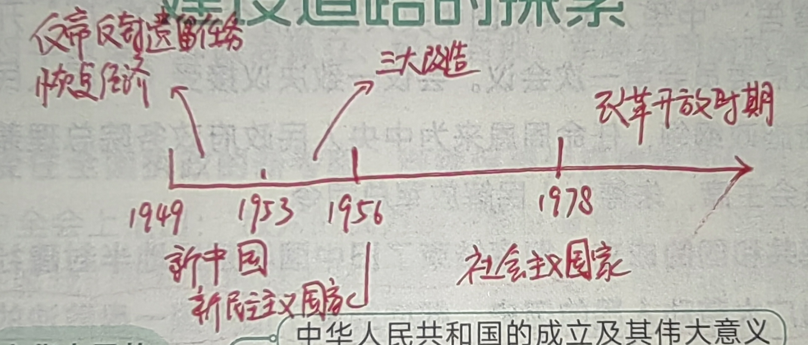

#### 第一节 中华人民共和国的成立与新生人民政权的巩固

##### 考点 79 中华人民共和国的成立及其伟大意义

1. 中华人民共和国的成立，**标志** 着中国的新民主主义革命取得了 **基本胜利**

##### 考点 80 巩固新政权的伟大斗争 1949-1953

1. 遗漏任务：反帝反封建
2. 中华人民共和国成立后的土地改革：见杂项-土地政策-土改：建国后土改《中华人民共和国土地改革法》
3. 第一部法：《中华人民共和国婚姻法》
4. 抗美援朝：打破了美军不可战胜的神话
5. 中共七届三中全会：见杂项-中国共产党开的会议-中共七届三中全会
6. 加强党的自身建设
   * “三反”运动：反贪污腐败分子
   * “五反”运动：打击不法资本家

#### 第二节 党在过渡时期的总路线及其实施

##### 考点 81 过渡时期总路线的提出

1. 社会主义工业化：最初设想先化后改，后来改成边化边改

   * 原因
     * 随着民主革命遗留任务的彻底完成和国内阶级关系、主要矛盾的变化，中共中央对社会主义过渡步骤的认识也发生了变化
     * 随着国民经济的恢复和初步发展，中国社会的经济成分（即生产关系）发生了重要变化

2. 一化三改，一体两翼 

   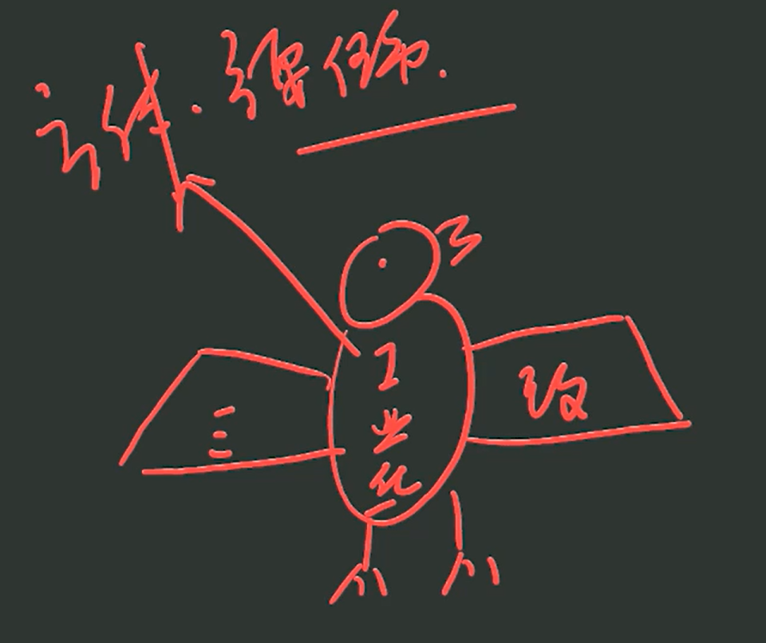

##### 考点 82 实行社会主义改造的必要性和条件

1. 农业为工业提供原材料，农业为工业产品提供市场

##### 考点 83 “一五”计划的制定与实施

1. “一五”计划走的是苏联模式，集中主要力量发展重工业
2. 成就
   * 钢铁基地：鞍山、包头、武汉
   * 武汉长江大桥
   * 公路：青藏、康藏、新藏

##### 考点 84 农业、手工业合作化运动的发展（三大改造具体怎么改）

| 名称               | 主要政策                                                     | 阶段：萌芽         | 阶段：半社会主义性质 | 阶段：完全社会主义性质 |
| ------------------ | ------------------------------------------------------------ | ------------------ | -------------------- | ---------------------- |
| 农业社会主义改造   | 1. 先合作化、后机械化 2. 自愿互利、典型示范、国家帮助（原则） | 互助组             | 初级农业生产合作社   | 高级农业生产合作社     |
| 手工业社会主义改造 | 手工业合作化（组织形式）                                     | 手工业生产合作小组 | 手工业供销合作社     | 手工业生产合作社       |

##### 考点 85 资本主义工商业的改造

1. 资本主义工商业改造：国家资本主义（形式）
   * 初级形式的国家资本主义：委托加工、计划订货、统购包销、经销代销。资本家拿利润的 $25\%$（四马分肥）**（萌芽）**
   * 高级形式的国家资本主义：公私合营
     * 个别企业：资本家拿利润的 $25\%$（四马分肥）**（半社会主义性质）**
     * 全行业：：资本家拿利润的 $5\%$（定股定息）**（完全社会主义性质）**
2. 对资本家进行改造
   * 和平赎买（方法）
   * 给予必要的工作安排
   * 不剥夺资产阶级的选举权，对代表人物给予恰当的政治安排

##### 考点 86 社会主义基本制度在中国的全面确立及其意义 1953-1956

1. 中国进入社会主义的最主要的标志：1956 年社会主义改造基本完成

#### 第三节 社会主义建设的良好开端

##### 考点 87 全面建设社会主义的开始

1. 两次马克思主义基本原理同中国具体实际相结合 
   * 第一次：寻找一条正确的革命道路
     * 提出命题：六届六中全会，《论新阶段》
     * 完成飞跃：中共七大 $\rightarrow$ 毛泽东思想
   * 第二次：1956 年，寻找一条适合中国情况的社会主义建设道路
     * 开始：1956 年，《论十大关系》
       * 完成飞跃：改革开放后 $\rightarrow$ 中特理论体系

##### 考点 88 非重点

##### 考点 89 中共八大路线的制定

见杂项-中国共产党开的会议-中共八大

##### 考点 90 非重点

##### 考点 91 整风运动与反右派斗争

1. 延安整风：党内整风
   * 反主观主义：整学风
   * 反宗派主义：整党风
   * 反党八股：整文风
2. 五七整风：开门整风
   * 反官僚主义
   * 反宗派主义
   * 反主观主义

#### 第四节 社会主义道路的艰辛探索和曲折发展

##### 考点 92-94 非重点

##### 考点 95 全面建设社会主义的成就 1956-1978

1. 独立的、比较完整的工业体系和国民经济体系的建立
2. 人民生活水平提高
3. 文化教育医疗体育事业的发展
4. 取得一批重要的科技成果
   * 第一颗原子弹
   * 第一颗氢弹
   * 第一枚中远程导弹
   * 第一颗人造地球卫星“东方红一号”
   * 第一课返回式遥感人造地球卫星
5. 国际地位提高与国际环境改善

### 第九章 改革开放与中国特色社会主义的开创和发展

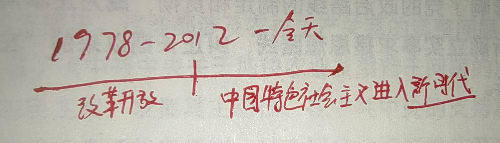

#### 第一节 历史性的伟大转折和改革开放的起步

#### 考点 96 关于真理标准问题的讨论

1. **先有** 真理标准问题的讨论，**后有** 改革开放

##### 考点 97-111 非重点 P384-389

### 第十章 非重点 P391

## 杂项

### 土地政策

| 名称                                               | 是否主张耕者有其田 | 是否主张否定封建土地剥削 | 是否废除封建土地剥削      | 是否有土地国有思想 |
| -------------------------------------------------- | ------------------ | ------------------------ | ------------------------- | ------------------ |
| 太平天国《天朝田亩制度》                           | ✅                  | ✅                        | ❌                         |                    |
| 孙中山三民主义“平均地权”                           | ❌                  | ❌                        |                           | ✅                  |
| 国民党一大新三民主义                               | ✅                  | ✅                        |                           |                    |
| 中国共产党土地革命战争时期的土地政策（兴国土地法） | ✅                  | ✅（局部废除）            |                           |                    |
| 中国共产党抗日战争时期“减租减息”                   | ❌                  | ❌（削弱）                |                           |                    |
| 土改：解放战争（五四指示/《中国土地法大纲》）      | ✅                  | ✅                        | ✅（废除，但还未统一全国） |                    |
| 土改：建国后土改《中华人民共和国土地改革法》       | ✅                  | ✅                        | ✅（全国性废除）           |                    |

1. 中国共产党对待富农的态度
   1. 土地革命：限制
   2. 抗日战争：允许富农收租
   3. 解放战争
      * 一般不变动富农土地
      * 征收富农多余土地
   4. 建国初期：保存富农经济

### 学习西方的哪些方面

| 名称         | 是否学习西方的军事、科学技术 | 是否学习西方的政治制度、文化 |
| ------------ | ---------------------------- | ---------------------------- |
| 林则徐、魏源 | ✅                            | ❌                            |
| 洋务派       | ✅                            | ❌                            |
| 维新派       | ✅                            | ✅                            |

### 中国共产党开的会议

| 名称     | 时间          | 地点               | 主要内容                                                     |
| -------- | ------------- | ------------------ | ------------------------------------------------------------ |
| 中共一大 | 1921 年 7 月 23 日 | 浙江嘉兴南湖“红船” | 1. 确定党的名称为“中国共产党” 2. 实际工作计划：决定首先集中精力组织工人 |
| 中共二大 | 1922 年 7 月 | 上海南成都路辅德里 625 号 | 1. 提出反帝反封建的民主革命纲领 2. 组成“民主主义的联合战线” 3. 走群众路线 |
| 中共三大 | 1923 年 6 月 | 广州 | 1. 国共合作 |
| 中共四大 | 1925 年 1 月 | 上海 | 1. 提出了无产阶级在民主革命中的领导权问题 2. 提出了工农联盟问题，对民主革命的内容作了更加完整的规定 |
| 中共中央政治局临时常委会 | 1927 年 7 月中旬 |  | 1. 将党所掌握和影响的部队向南昌集中，准备起义 2. 组织发动秋收起义 3. 召集中央会议，讨论和决定大革命失败后的新方针 |
| **八七会议** | 1927 年 8 月 7 日 | 汉口 | 1. 彻底清算了大革命后期陈独秀右倾机会主义错误 2. 确定总方针：土地革命和武装反抗国民党反动统治 3. 提出中心问题：土地革命 4. 会议选出了以瞿秋白为首的中央临时政治局 |
| 古田会议 | 1929 年 12 月 | 福建上杭县古田村 | 1. 确立了思想建党、政治建军原则 2. 阐述了加强党的思想建设的极端重要性 3. 规定红军是一个执行革命的政治任务的武装集团 4. 从组织上确立了党对军队的领导 |
| 遵义会议 | 1035 年 1 月 15 日至 17 日 | 贵州遵义 | 1. 集中解决了当时具有决定意义的军事和组织问题 2. 结束了“左”倾教条主义错误在中央的 **统治**（影响还在） 3. 开始确立毛泽东在中共中央和红军的领导地位 |
| 瓦窑堡会议 | 1935 年 12 月 | 陕北瓦窑堡 | 1. 提出党的基本策略任务是建立广泛的 **抗日民族统一战线** 2. 批评了党内长期存在的“左”倾冒险主义、[关门主义](#关门主义) 错误倾向 3. 决定以“人民共和国”口号代替“工农共和国” |
| 洛川会议 | 1937 年 8 月 | 陕北洛川 | 1. 制定了 **抗日救国十大纲领** 2. 强调要打倒日本帝国主义，关键在于使已经发动的抗战成为全面的 **全民族抗战** |
| 中共六届六中全会 | 1938 年 9 月至 11 月 | 延安桥儿沟 | 1. **标志着**：明确提出“马克思主义的中国化”这个命题 2. 毛泽东《论新阶段》 3. 基本纠正了王明的右倾错误 4. 进一步 **巩固** 了毛泽东在全党的领导地位 5. 统一了全党的思想和步调，推动了各项工作迅速发展 |
| 中共六届七中全会 | 1944 年 5 月 21 日至 1945 年 4 月 20 日 | 延安 | 1. 通过了《关于若干历史问题的决议》 |
| 中共七大 | 1945 年 4 月 23 日至 6 月 11 日 | 延安 | 1. 制定了党的政治路线 2. 总结党的建设的历史经验，把党在长期奋斗中形成的优良作风概括为三大作风 3. 正式命名毛泽东思想，**将毛泽东思想写入党章**，并将毛泽东思想规定为党的一切工作的指针 4. 标志着党在政治上思想上组织上走向成熟 |
| 中共七届二中全会 | 1949 年 3 月 | 河北平山县西柏坡 | 1. 解放全国的方式：天津式、北平式、绥远式 2. 党的工作重心必须由乡村转移到城市 3. 指出了中国由农业国转变为工业国、由新民主主义社会转变为社会主义社会的发展方向 4. 毛泽东提出“两个务必”思想：      - 务必使同志们继续地保持谦虚、谨慎、不骄、不躁的作风      - 务必使同志们继续地保持艰苦奋斗的作风 |
| 中共七届三中全会 | 1950 年 6 月 |  | 1. 中心任务是要在三年左右的时间内，争取国家财政经济状况的基本好转 2. 不要四面出击。四面出击，树敌太多，造成全国紧张，而应该集中力量向国民党残余势力、封建地主阶级和帝国主义进攻 |
| 中共八大 | 1056 年 9 月 15 日至 27 日 | 北京 | 1. 国内主要矛盾     - 已经是人民对于建立先进的工业国的要求同落后的农业国的现实之间的矛盾     - 已经是人民对于经济文化迅速发展的需要同当前经济文化不能满足人民需要的状况之间的矛盾 2. 全国人民的主要任务是集中力量发展社会生产力，实现国家工业化，逐步满足人民日益增长的物质和文化需要 3. 还有阶级斗争，还要加强人民民主专政，但根本任务已经是在新的生产关系下保护和发展生产力（在毛中特中讲的更细） |

1. 考《古田会议》，就必考 **新型人民军队**，选项必须涉及新型和人民军队，缺一不可

1. 关门主义：把门关上我自己抗日，不联合其他力量 

1. 洛川会议：开启了全民族抗战的新阶段

   抗日救国十大纲领：全面概括了中国共产党在抗日战争时期的基本 **政治主张**

1. 六届七中全会的意义
   * 对中国革命基本问题的认识达到了一致，增强了全党团结
   * 整风运动结束的 **标志**

1. 中共七大
   * 党的政治路线：放手发动群众，壮大人民力量，在我党的领导下，打败日本侵略者，解放全国人民，建立一个新民主主义的中国
   * 三大作风
     1. 理论和实践相结合的作风
     2. 和人民群众紧密联系在一起的作风
     3. 自我批评的作风
   * 毛泽东思想：以毛泽东同志为主要代表的中国共产党人把马克思列宁主义基本原理同中国具体实际相结合所改造的理论成果
     * 实现了马克思主义中国化时代化的 **第一次历史性飞跃**

### 毛泽东的文章

| 名称                                                 | 写作时期         | 主要内容                                                     |
| ---------------------------------------------------- | ---------------- | ------------------------------------------------------------ |
| 《国民革命与农民运动》                               | 大革命时期       | 1. “农民问题乃国民革命的中心问题” 2. “所谓国民革命运动，其大部分即是农民运动” |
| 《中国的红色政权为什么能够存在？》和《井冈山的斗争》 | 土地革命时期     | 1. 提出了 **工农武装割据的思想**                             |
| 《星星之火，可以燎原》                               | 土地革命时期     | 1. 阐明了中国革命只能走与资本主义国家不同的道路 2. **[中国革命新道路思想](#中国革命新道路思想)**：党把工作重心由城市转移到农村，在农村开展游击战争，深入进行土地革命，建立和发展红色政权，待时机成熟时夺取全国政权 |
| 《反对本本主义》                                     | 土地革命时期     | 1. **思想路线**：坚持辩证唯物主义，即坚持理论与实际相结合的原则 2. “没有调查，没有发言权”和“中国革命斗争的胜利要靠中国同志了解中国情况” |
| 《论反对日本帝国主义的策略》                         | 土地革命时期     | 1. 阐明党的 **抗日民族统一战线的新政策** 2. 批判党内的关门主义和对于革命的急性病 3. 系统说明了党的 **政治策略上的诸问题** |
| 《实践论》和《矛盾论》                               | 土地革命时期     | 1. 从马克思主义认识论的高度，总结中国共产党的历史经验 2. 揭露和批评党内的主观主义尤其是教条主义错误 3. 深入论证马克思列宁主义基本原理同中国具体实际相结合的原则 4. 科学阐明了党的马克思主义 **思想路线** |
| 《战争和战略问题》                                   | 抗日战争时期时期 | **六届六中全会**，确立革命道路：经过长期武装斗争，先占乡村，后取城市，最后夺取全国胜利 |
| 《论新阶段》                                         | 抗日战争时期     | **六届六中全会** 报告：首次提出了“马克思主义中国化”的命题    |
| 《中国革命与中国共产党》                             | 抗日战争时期时期 | 第一次提出了新民主主义革命的科学概念和总路线的内容           |
| 《论持久战》                                         | 抗日战争时期时期 | 1. 一方面，日本是强国，中国是弱国，强国弱国的对比，决定了抗日战争只能是持久战 2. 另一方面，日本是小国，发动的是退步的、野蛮的侵略战争，在国际上失道寡助；而中国是大国，进行的是进步的、正义的反侵略战争，在国际上得道多助 3. 是中国共产党领导抗日战争的纲领性文件 |
| 《改造我们的学习》                                   | 抗日战争时期时期 | 延安整风：整顿学风                                           |
| 《整顿党的作风》                                     | 抗日战争时期时期 | 延安整风：反对宗派主义                                       |
| 《反对党八股》                                       | 抗日战争时期时期 | 延安整风：整顿党风、反对党八股以整顿文风                     |
| 《〈共产党人〉发刊词》                               | 抗日战争时期时期 | 提出党的建设是“伟大的工程”                                   |
| 《新民主主义论》                                     | 抗日战争时期时期 | 1. 深入论述了中国新民主主义革命的基本特点 2. 阐述了中国革命必须分两步走 3. 第一次完整地提出了新民主主义的经济纲领 4. 制定了中国新民主主义的 **政治、经济、文化纲领** 5. 提出了建立新民主主义共和国的方案，强调以共产主义思想为指导 |
| 《论联合政府》                                       | 抗日战争时期时期 | 毛泽东在 1945 年抗日战争胜利前夕召开的中共七大上作的报告     |
| 《论人民民主专政》                                   | 解放战争时期     | 1. 历史的经验表明，**资产阶级共和国的方案在中国是行不通的**，这就是我们的主要经验，这就是我们的主要纲领 2. 人民民主专政需要工人阶级的领导 3. 人民民主专政的基础是工人阶级、农民阶级和城市小资产阶级的联盟，而主要是工人和农民的联盟 4. 我们还必须利用一切与国计民生有力而不是有害的成像资本主义因素、团结民族资产阶级，但民族资产阶级不能充当革命的领导者，也不应当在国家政权中占主要的地位 5. 工人阶级（经过共产党）领导的以工农联盟为基础的人民民主专政 |
| 《在晋绥干部会议上的讲话》                           | 解放战争时期     | 新民主主义革命总路线：无产阶级领导的，人民大众的，反对帝国主义、封建主义和官僚资本主义的革命 |
| 《论十大关系》                                       | 新中国成立后     | 1. 一个原则：独立自主地探索适合中国情况的社会主义建设道路 2. 一个方针：调动一切积极因素为社会主义事业服务 3. 两个标志：     - 开始探索中国社会主义建设道路     - 马克思主义同中国具体实际第二次相结合的开始 |
| 《关于正确处理人民内部矛盾的问题》                   | 新中国成立后     | 1. 矛盾是普遍存在的，社会主义社会同样 **充满着** 矛盾，正是这些矛盾推动着社会主义社会不断地向前发展 2. 社会主义社会的矛盾不是对抗性的矛盾，**因此**“它可以经过社会主义制度本身，不断地得到解决” 3. 中国工业化道路的问题：重工业、轻工业和农业的发展关系问题 4. 总方针：以农业为基础，以工业为主导，以农轻重为序发展国民经济 |

1. 关于中国革命新道路思想出自哪些文章
   * 若题目是单选题，则选《星星之火，可以燎原》
   * 若题目是多选题，则《星星之火，可以燎原》、《中国的红色政权为什么能够存在？》和《井冈山的斗争》均可选
2. **思想路线** 的脉络
   * 提出、萌芽 $\rightarrow$《反对本本主义》
   * 系统、科学阐明 $\rightarrow$《实践论》和《矛盾论》
   * 全党共识 $\rightarrow$ 延安整风
   * 重新确立 $\rightarrow$ 十一届三中全会
3. 《论人民民主专政》构成了《中国人民政治协商会议共同纲领》的基础

### 中国共产党参与革命后中国革命的四个时期

| 时期                               | 年份      | 时期转换的节点（枢纽）                         |
| ---------------------------------- | --------- | ---------------------------------------------- |
| 大革命时期（国民革命时期）         | 1925-1927 | 五卅运动                                       |
| 土地革命时期（十年内战时期）       | 1927-1937 | 八七会议                                       |
| 全面抗战时期（第二次国共合作时期） | 1937-1945 | 西安事变                                       |
| 解放战争时期                       | 1945-1949 | 国民党进攻中原解放区，挑起全国性内战（非重点） |

### 两次国共合作的比较

| 国共合作 | 阶级构成                                                     | 合作方式           | 共同纲领       | 领导权           |
| -------- | ------------------------------------------------------------ | ------------------ | -------------- | ---------------- |
| 第一次   | 工人阶级、农民阶级、小资产阶级、民族资产阶级                 | 没有               | 有：新三民主义 | 国民党           |
| 第二次   | 工人阶级、农民阶级、小资产阶级、民族资产阶级、**大地主大资产阶级抗日派** | 有政权有军队的合作 | 没有：临时协商 | 分别领导两个战场 |

# **毛泽东思想和中国特色社会主义理论体系概论**

## 导论

### 马克思主义中国化时代化的历史进程与理论成果

#### 考点 1 马克思主义中国化时代化的内涵

1. 什么是马克思主义中国化时代化？（**内涵**） 
   * 用他的理论解决我的问题
   * 用我的问题丰富他的理论
   * 用我的民族语言重新表述他的理论
2. [两次马克思主义同中国具体实际相结合的飞跃](#两次马+中的飞跃)
   * 习思想属于中特理论体系，仍旧在第二次飞跃的范畴内，是新的飞跃
3. 为什么要推进马克思主义中国化时代化？（**必要性**）
   * 理论需要实际
   * 实际需要理论
4. 推进马克思主义中国化时代化的可能性？
   * 理论需要实际
   * 实际需要理论
   * 马克思主义与中国的相融性
5. 怎样推进马克思主义中国化时代化？（**途径**）
   * 必须同中国具体实际相结合
   * 同中华优秀传统文化相结合

#### 考点 2 马克思主义中国化时代化的历史进程与理论成果

1. 毛与中特的异同

   * 相同点

     * 都是马克思主义中国化时代化的理论成果
     * 都是以马克思主义为理论基础
     * 都是以实事求是为理论精髓

   * 不同点

     | 名称                     | 时代背景   | 实践基础         |
     | ------------------------ | ---------- | ---------------- |
     | 毛泽东思想               | 革命与战争 | 革命、建设       |
     | 中国特色社会主义理论体系 | 和平与发展 | 建设、改革、发展 |

## 毛泽东思想

### 第一章 毛泽东思想及其历史地位

#### 第一节 毛泽东思想的形成和发展

##### 考点 3 毛泽东思想形成和发展的历史条件

1. 时代主题：战争与革命

   实践基础：革命和建设

##### 考点 4 毛泽东思想形成和发展的过程（步骤）

| 时期                               | 形成过程         | 相关文献                                                     |
| ---------------------------------- | ---------------- | ------------------------------------------------------------ |
| 大革命时期                         | 提出思想（萌芽） | 《中国社会各阶级的分析》《湖南农民运动考察报告》             |
| 土地革命战争时期                   | 初步形成         | 《中国的红色政权为什么能够存在？》《井冈山的斗争》《星星之火，可以燎原》《反对本本主义》 |
| 遵义会议至抗日战争时期             | 趋于成熟         | 《实践论》《矛盾论》《论持久战》《〈共产党人〉发刊词》《中国革命和中国共产党》《新民主主义论》《论联合政府》 |
| 党的七大                           | 正式确立         | 党的七大通过的《中国共产党党章》将毛泽东思想作为中国共产党一切工作的指针，这标志着把毛泽东思想确立为党必须长期坚持的指导思想 |
| 解放战争时期和中华人民共和国成立后 | 继续发展         | 《在晋绥干部会议上的讲话》《论人民民主专政》《论十大关系》《关于正确处理人民内部矛盾的问题》 |

#### 第二节 毛泽东思想的主要内容和活的灵魂

##### 考点 5 非重点

##### 考点 6 毛泽东思想的活的灵魂

1. 党的十一届六中全会通过的《关于建国以来党的若干历史问题的决议》中提出毛泽东思想的活的灵魂
   1. 实事求是：**根本思想路线**
   2. 群众路线：**根本工作路线**
   3. 独立自主：**根本政治原则**

#### 第三节 毛泽东思想的历史地位

##### 考点 7 毛泽东思想的重要意义

1. 对毛泽东思想的评价
   * 马克思主义中国化时代化的第一个重大理论成果
   * 中国革命和建设的科学指南
   * 中国共产党和中国人民宝贵的精神财富
2. 科学评价毛泽东和毛泽东思想：总的来说，毛泽东的功绩是第一位的，错误是第二位的
   * 毛泽东思想一定是正确的。说法正确
   * 毛泽东的思想有正确，也有错误

### 第二章 新民主主义革命理论

#### 第一节 新民主主义革命理论形成的依据

##### 考点 8 近代中国国情和中国革命的时代特征

1. 根本任务：推翻帝国主义、封建主义和官僚资本主义的统治，从根本上推翻反动腐朽的政治上层建筑，变革阻碍生产力发展的生产关系，为建设富强民主的国家、确立人民当家做主的政治制度、改善人民生活扫清障碍，创造必要的前提

2. 新民主主义革命理论的逻辑线索

   | 逻辑线索     | 内容                                                         |
   | ------------ | ------------------------------------------------------------ |
   | **社会性质** | 半殖民地半封建社会                                           |
   | **主要矛盾** | 帝国主义和中华民族的矛盾、封建主义和人民大众的矛盾           |
   | **根本任务** | 推翻“三座大山”（帝国主义、封建主义和官僚资本主义的统治）     |
   | **革命性质** | 资产阶级民主革命                                             |
   | **总路线**   | 无产阶级领导的，人民大众的，反帝、反封建、反官僚资本主义的革命 |
   | **基本纲领** | 新民主主义的政治、经济、文化纲领                             |

##### 考点 9 新民主主义革命理论的实践基础

1. 新民主主义革命理论是认识，实践是认识的基础

#### 第二节 新民主主义革命的总路线和基本纲领

##### 考点 10 新民主主义革命的总路线

1. 中国革命的 XX 问题总结

   | 名称                                                   | 内容             |
   | ------------------------------------------------------ | ---------------- |
   | **中国革命的首要问题**                                 | 分清敌友         |
   | **中国革命的基本问题**                                 | 农民问题         |
   | **中国革命的中心问题**（新民主主义革命理论的核心问题） | 无产阶级的领导权 |

2. 无产阶级领导权的实现

   | 名称         | 内容                                                         |
   | ------------ | ------------------------------------------------------------ |
   | **条件**     | 率领被领导者斗争并取得胜利；给被领导者以物质福利，并进行政治教育 |
   | **关键**     | 建立以工农联盟为基础的广泛的统一战线                         |
   | **基本策略** | 保持党在思想上、政治上和组织上的独立性，实行又联合又斗争的方针 |
   | **坚强支柱** | 建立一支无产阶级领导的以农民为主体的强大的革命武装           |
   | **根本保证** | 党的建设                                                     |

3. 新民主主义革命的性质和前途

   | 名称           | 旧民主主义革命   | 新民主主义革命       | 社会主义革命（三大改造） |
   | -------------- | ---------------- | -------------------- | ------------------------ |
   | **领导者**     | 资产阶级         | 无产阶级             | 无产阶级                 |
   | **任务、对象** | 反帝反封         | 反帝反封             | 反资反私                 |
   | **性质**       | 资产阶级革命     | **资产阶级革命**     | 无产阶级革命             |
   | **指导思想**   | 三民主义         | 马克思主义           | 马克思主义               |
   | **前途**       | 资本主义         | 社会主义             | 社会主义                 |
   | **所属范围**   | 世界资产阶级革命 | **世界无产阶级革命** | 世界无产阶级革命         |

   >**例题：** 新民主主义革命之所以属于世界无产阶级社会主义革命的一部分，是因为（）
   >A. 是无产阶级领导的	B. 是马克思主义指导的	C. 是以社会主义为前途的	D. 发生在十月革命之后
   >
   >**解答**：选 D。ABC 均是新民主主义革命的特征。只有 D 跟本题题干构成因果关系

4. 中国革命分“两步走”：反帝反封反资（先不反资，与资本家一起反帝反封；然后再社会主义革命中反资）

   * 一次革命论（“左”倾）：夸大联系，否定区别
   * 二次革命论（“右”倾）：夸大区别，否定联系

#### 第三节 新民主主义革命的道路和基本经验

##### 考点 12 新民主主义革命的道路

1. 新民主主义革命的道路：农村包围城市，武装夺取政权

2. 道路初步形成，**标志** 着：毛泽东思想初步形成

   新民主主义理论的系统阐明，**标志** 着：毛泽东思想成熟

3. 道路的最终确立：党的六届六中全会《战争与战略问题》

4. 新民主主义革命道路形成的

   * 必然性
     * 国情：总依据
     * 两个方面，一个方面对应武装夺取政权，另一方面对应农村包围城市
   * 可能性
     * 军阀统治薄弱环节，缝隙和可能
     * 群众基础好
     * 全国革命形势客观条件
     * 相当力量正式红军提供坚强后盾
     * 党的领导的有力量及其政策的不错误提供主观条件

5. 新民主主义革命道路的内容及意义

   * 怎样走这条道路？
     * 基本内容：土地革命
     * 主要形式：武装斗争
     * 依托：农村革命根据地

##### 考点 13 新民主主义革命的三大法宝

1. 统一战线

   * 必要性

     * 中国社会的两头下中间大：无产阶级和地主大资产阶级占少数，农民、城市小资产阶级以及其他的中间阶级最广大
     * 建立最广泛的统一战线，也是中国革命的长期性、残酷性及其发展的不平衡性所决定的

   * 可能性

     * 国情：半殖民地半封建社会

   * 两个联盟（注意区分哪个联盟是主要的，主要联盟中哪些是主要的，次要联盟中哪个是主要的）

     * 劳动者（主要）
       * 工人阶级（主要）
       * 农民阶级（主要）
       * 城市小资产阶级
     * 非劳动者
       * 民族资产阶级（主要）
       * 中间派

   * 实践经验

     1. 建立巩固的工农联盟
     2. 正确对待资产阶级，尤其是民族资产阶级
     3. 采取区别对待的方针，在革命进程中，要坚持发展进步势力、争取中间势力、孤立顽固势力的策略方针
     4. 坚持独立自主的原则

   * 党在不同历史时期的统一战线

     | 战线                                       | 历史时期         | 主要策略                                                     |
     | ------------------------------------------ | ---------------- | ------------------------------------------------------------ |
     | 第一次国共合作统一战线（国民革命统一战线） | 大革命时期       | 推翻帝国主义支持下的北洋军阀统治，共产党员以个人身份加入国民党 |
     | 工农民主统一战线                           | 土地革命战争时期 | 打土豪，分田地，壮大工农武装力量                             |
     | 抗日民族统一战线                           | 抗日战争时期     | 发展进步势力、争取中间势力、孤立顽固势力，团结中华民族的力量抗击日本帝国主义 |
     | 人民民主统一战线                           | 解放战争时期     | 团结一切可以团结的力量推翻国民党反动统治                     |

2. 武装斗争

   * 根本原则：坚持党对军队的绝对领导
   * 根本前提：保持人民军队无产阶级性质和建军宗旨
   * 核心：毛泽东建军思想

3. 党的建设

   * 注意区分，如果明确指出是谁的就选谁的，如果没有，选习近平的
     * 毛泽东，三大建设：**思想**、组织、作风（思想在首位）（**三大法宝**）
     * 习近平，六大建设：思想、组织、作风、**政治**、纪律、制度（政治在首位）

4. 中国共产党区别于其他党的显著标志 

   * 三大优良作风
   * 人民立场
   * 勇于自我革命（最重要，最新）

##### 考点 14 新民主主义革命理论的意义

见 P118

### 第三章 社会主义改造理论

#### 第一节 从新民主主义到社会主义的转变

##### 考点 15 新民主主义社会的性质和特点

1. 经济方面 TODO 社会主义集体经济
   * 农民和手工业者的个体经济（非社会主义性质） $\rightarrow$ 半社会主义的合作社经济（过渡） $\rightarrow$ 社会主义集体经济（社会主义性质）

   * 私人资本主义经济（非社会主义性质） $\rightarrow$ 国家资本主义经济（过渡） $\rightarrow$ 国营经济（社会主义性质）

   * 当年：国营经济是领导地位，非社会主义性质的经济占主体地位（数量多）

     今天：以公有制为 **主体**，多种所有制并存

     主体地位代表数量多，领导地位可以数量少

   * 社会主义经济：工人（无产阶级） $\rightarrow$ 社会主义

     个体经济：农民和小资产阶级（谁强就依靠谁，不是第三条道路）

     私资经济：民族资产阶级 $\rightarrow$ 资本主义

   * 主要矛盾：

     1. 工人阶级和资产阶级之间的矛盾
     2. 社会主义与资本主义之间的矛盾

   * 推导出任务：反资反私

##### 考点 16 党在过渡时期的总路线及其理论依据

1. 新民主主义革命总路线：无产阶级领导的，人民大众的，反对帝国主义、封建主义和官僚资本主义的革命

   过渡时期的总路线：[一化三改](#一化三改)。社会主义工业化、对个体农业、手工业和资本主义工商业的社会主义改造

   今天的总路线：一个中心，两个基本点

#### 第二节 社会主义改造道路和历史经验

##### 考点 17 适合中国特点的社会主义改造道路

1. 农业的社会主义改造
   * 道路：互助合作
   * 方针：积极领导、稳步推进
   * 步骤：循序渐进
2. 手工业的社会主义改造
   * 道路：生产合作
   * 方针：积极领导、稳步推进
3. 资本主义工商业的社会主义改造
   * 方法：和平赎买
   * 过渡形式：国家资本主义

>细节见史纲考点 84-85

##### 考点 18 社会主义改造的历史经验

1. 坚持社会主义工业化建设与社会主义改造同时并举
2. 采取积极引导、逐步过渡的方式
3. 用和平方法进行改造

#### 第三节 社会主义基本制度在中国的确立

##### 考点 19 社会主义基本制度的确立及其理论依据

1. 1956 年社会主义改造基本完成，中国的国情变为社会主义初级阶段，一直到今天
2. 预计 2050 年进入社会主义高级阶段

##### 考点 20 确立社会主义基本制度的重大意义

1. 社会主义基本制度的确立是中国历史上 **最深刻最伟大** 的社会变革（因为与每一个人息息相关）

2. 社会主义基本制度的确立，使 **广大劳动人民** 真正成为国家的主人

   >1949 年新中国成立，中国人民成为国家的主人

### 第四章 社会主义建设道路初步探索的理论成果

#### 第一节 初步探索的重要理论成果

##### 考点 21 调用一切积极因素为社会主义事业服务

见史纲-杂项-毛泽东的文章-《论十大关系》

##### 考点 22 正确认识和处理社会主义社会矛盾的思想

见史纲-杂项-毛泽东的文章-《关于正确处理人民内部矛盾的问题》

见史纲-杂项-中国共产党开的会议-中共八大

1. 两类社会矛盾：敌我矛盾和人民内部矛盾

   二者可以互相转化

2. 关于正确处理人民内部矛盾的方针

   * 总方针：用民主的方法解决人民内部矛盾
   * 思想政治领域：团结-批评-团结，坚持说服教育、讨论的方法
   * 物质利益、分配方面：统筹兼顾、适当安排
   * 人民群众和政府机关：民主集中制
   * 科学文化领域：百花齐放、百家争鸣
   * 共产党和民主党派：长期共存、互相监督
   * 民族之间：民族平等、团结互助

##### 考点 23 走中国工业化道路的思想

1. 走中国工业化道路的要求
   * 必须采取正确的经济建设方针
   * 必须调整和完善所有制结构
   * 必须积极探索适合我国情况的经济体制和运行机制

##### 考点 24 初步探索的其他理论成果

1. 毛泽东：不发达的社会主义、比较发达的社会主义

   今天的提法：社会主义初级阶段、社会主义高级阶段

   意思相近，但是不能混为一谈

2. 四个现代化：现代农业、现代工业、现代国防、现代科学技术

3. 毛泽东“三个世界划分”（革命统一战线思想的体现）

   * 第一世界：苏美两个超级大国
   * 第二世界：苏美以外的西方发达国家和东欧国家
   * 第三世界：亚洲、非洲、拉丁美洲的广大发展中国家

#### 第二节 初步探索的意义和经验教训

##### 考点 25 初步探索的意义和经验教训

1. 初步探索的意义
   * 巩固和发展了我国的社会主义制度
   * 为开创中国特色社会主义提供了宝贵经验、理论准备、物质基础
   * 丰富了科学社会主义的理论和实践
2. 改革开放前和改革开放后是两个相互联系又有重大区别的时期，但本质上都是我们党领导人民进行社会主义建设的实践探索

## 中国特色社会主义理论体系

### 第九章 中国特色社会主义理论体系的形成发展

#### 第一节 非重点

#### 第二节 中国特色社会主义理论体系形成发展过程

##### 考点 29 邓小平理论：中国特色社会主义理论体系的形成

[中国共产党开的会议](#中国共产党开的会议) 续表

| 重要会议           | 关键点                                                       | 考点内容                                                     |
| ------------------ | ------------------------------------------------------------ | ------------------------------------------------------------ |
| 党的十一届三中全会 | 重新确立解放思想、实事求是的思想路线                         | 1. 彻底否定“两个凡是”的错误方针，果断结束“以阶级斗争为纲”的口号 2. 高度评价关于真理标准问题的讨论（先有讨论），重新确立了党的思想路线、政治路线、组织路线 3. 实现党和国家工作重心战略转移，开启了改革开放和社会主义现代化建设新时期，实现了新中国成立以来党的历史上具有深远意义的伟大转折 4. 形成了以邓小平同志为核心的党中央领导集体 5. 开始了拨乱反正（十一届三中全会开始，十一届六中全会完成） |
| 党的十一届六中全会 |                                                              | 1. 科学评价了毛泽东和毛泽东思想 2. 提出了毛泽东思想的活的灵魂是“实事求是、群众路线、独立自主” 3. 第一次使用“社会主义初级阶段”的提法 |
| 党的十二大         | “中国特色社会主义”成为党的全部理论和实践创新的主题           |                                                              |
| 党的十三大         | 第一次对中国特色社会主义理论进行系统概括，邓小平理论轮廓形成 | 1. 第一次对社会主义初级阶段理论做了系统阐述 2. 提出了社会主义初级阶段“一个中心，两个基本点”的基本路线 3. 第一次对中国特色社会主义理论的主要内容作了系统概括 4. 邓小平理论轮廓形成 |
| 南方谈话           | 邓小平理论走向成熟的 **标志**                                |                                                              |
| 党的十四大         |                                     | 确立社会主义市场经济体制的改革目标                           |
| 党的十五大         | 正是命名“邓小平理论”并写入党章                               | 1. 把邓小平理论写入党章（七大将毛泽东思想写入党章） 2. 指出“以公有制为主体、多种所有制经济共同发展”是我国社会主义初级阶段的一项基本经济制度 |

* 邓小平理论轮廓形成
  * 时期：十三大
  * 标志：第一次对中国特色社会主义理论作系统概括

##### 考点 30-32 非重点 P140 

### 第六章 邓小平理论

#### 第一节 邓小平理论首要的基本的理论问题和精髓

##### 考点 33 邓小平理论首要的基本的理论问题：什么是社会主义、怎样建设社会主义

1. 搞清楚“什么是社会主义、怎样建设社会主义”，关键是要在坚持社会主义基本制度的基础上进一步认清社会主义的本质
2. 社会主义的本质：
   * 生产力：解放生产力，发展生产力
   * 生产关系：消灭剥削，消除两极分化
   * 目标：最终达到共同富裕
3. 改革中始终坚持的两条根本原则
   * 以社会主义公有制经济为主体
   * 共同富裕

##### 考点 34 邓小平理论的精髓：解放思想、实事求是

1. 中国共产党的理论 **精髓** 几乎都是实事求是：实事求是也是思想路线的核心
   * 马克思主义中国化
   * 毛泽东思想
   * 邓小平理论
   * 中国特色社会主义理论体系
2. 实事求是思想路线

   * 前提和基础：一切从实际出发
   * 根本途径和方法：理论联系实际
   * 验证条件和目的：在实践中检验真理和发展真理

#### 第二节 邓小平理论的主要内容

##### 考点 35 社会主义初级阶段理论和党的基本路线

1. “社会主义初级阶段”理论的发展脉络

   1. 毛泽东：不发达的社会主义、比较发达的社会主义
   2. 十一届三中全会：第一次使用“社会主义初级阶段”的提法
   3. 十三大 **前夕**：第一次将“社会主义初级阶段”作为事关全局的 **国情** 加以把握
   4. 十三大：第一次对“社会主义初级阶段”理论作系统论述

2. 定性：社会主义社会

   定量：社会主义社会还处在初级阶段

3. 十三大报告提出，党在社会主义初级阶段的基本路线：领导和团结全国各族人民。以经济建设为中心，坚持四项基本原则，坚持改革开放，自力更生，艰苦创业，为把我国建设成为富强、民主、文明的社会主义现代化国家而奋斗

   现在的提法：领导和团结全国各族人民。以经济建设为中心，坚持四项基本原则，坚持改革开放，自力更生，艰苦创业，为把我国建设成为富强民主文明 **和谐美丽** 的社会主义现代化 **强国** 而奋斗

##### 考点 36 社会主义根本任务和发展战略理论

1. 社会主义根本任务：解放、发展生产力

   中国特色社会主义进入新时代的总任务：社会主义现代化、中华民族伟大复兴

   新时代党和政府的历史任务：社会主义现代化、实现祖国统一、维护世界和平
   
   

##### 考点 37 社会主义改革开放和社会主义市场经济理论

**社会主义改革开放理论**

1. 改革的性质

   * 对社会主义制度：完善和发展
   * 对经济体制：根本性变革

2. 改革是社会主义社会发展的 **直接动力**（或 **重要动力**）

   人类历史、社会主义的 **根本动力**：生产关系和生产力、上层建筑和经济接触之间的矛盾（社会基本矛盾）

   新时代坚持和发展中国特色社会主义的 **根本动力**：全面深化改革开放

3. 判断改革是非得失的标准：

   * 是否有利于发展社会主义社会的生产力
   * 是否有利于增强社会主义国家的综合国力
   * 是否有利于提高人民的生活水平

4. 对外开放的必要性：对外开放是建设中国特色社会主义的一项基本国策

5. 对外开放的要求：

   * 对外开放的格局（新提法：陆海内外联动、东西双向互济）
     * 全方位的开放：对世界所有国家的开放，包括对发达国家的开放，也包括对发展中国家的开放
     * 宽领域：不仅是经济领域的开放，还包括科技、教育、文化等领域的开放
     * 多层次

6. 重要意义：改革开放是当代中国的鲜明标志和活力源泉，是决定中国命运的关键一招

**社会主义市场经济理论**

1. 我国经济体制改革的核心问题：如何正确认识和处理计划与市场的关系（老提法）

   新提法：政府和市场的关系 

2. 确立社会主义市场经济体制的改革目标（[党的十四大](#党的十四大)）

3. 社会主义市场经济理论的要点

   * 制度：社会主义、资本主义
   * 体制、手段：市场经济、计划经济
   * 社会主义市场经济：市场、计划

4. 社会主义市场经济的特色所在、优势所在

   * 社会主义市场经济与一般市场经济的相同点：市场在资源配置中起决定性作用
   * 社会主义市场经济与一般市场经济的不同点：（特色所在、优势所在）
     * 所有制方面：社会主义市场经济以公有制为主体，多种所有制经济共同发展，其他的不是
     * 分配制方面：社会主义市场经济以按劳分配为主体，多种分配方式并存，其他的不是
     * 宏观调控方面：社会主义市场经济宏观调控以实现最广大劳动人民的根本利益为出发点，其他的不是

##### 考点 38-39 非重点 P148

##### 考点 40 中国特色社会主义外交和国际战略

1. 概念：南、北

   * 南：泛指发展中或欠发达国家
   * 北：泛指发达国家

2. 中美合作：南北合作

   中俄合作、金砖五国：南南合作

##### 考点 41 非重点

#### 第三节 邓小平理论的历史地位

见 P150-151

### 第七章 非重点 P152

### 第八章 非重点 P154

# **习近平新时代中国特色社会主义思想概论**

## 导论

### 考点 1 习近平新时代中国特色社会主义思想创立的时代背景

1. 世界：百年未有之大变局
2. 民族：中华民族伟大复兴
3. 中国：中国式现代化
4. 理论：科学社会主义
5. 党：中国共产党自我革命

### 考点 2 习近平新时代中国特色社会主义思想是“两个结合”的重大成果

1. 两个结合是对坚持和发展马克思主义作出的重大理论贡献（意义，论述题）

   * “两个结合”让中国特色社会主义道路有了更加宏阔深远的历史纵深（中国化时代化的马克思主义的“魂脉”：马克思主义；“根脉”：中华优秀传统文化）

   * 拓展了中国特色社会主义道路的文化根基

   * 开辟了广阔的理论和实践创新空间

   * 表明我们党对中国道路、理论、制度的认识达到了新高度

   * 表明我们党的历史自信、文化自信达到了新高度

   * 表明我们党在传承中华优秀传统文化中推进理论创新的 **自觉性** 达到了新高度

2. 必须同中国具体实际相结合

3. 必须同中华优秀传统文化相结合

### 考点 3 习近平新时代中国特色社会主义思想是完整的科学体系

1. 习思想要回答的重大时代课题

   * 新时代坚持和发展什么样的中国特色社会主义、怎样坚持和发展中国特色社会主义？
   * 建设什么样的社会主义现代化强国、怎样建设社会主义现代化强国？
   * 建设什么样的长期执政的马克思主义政党、怎样建设长期执政的马克思主义政党？

   >邓小平回答的重大时代课题
   >
   >* 什么是社会主义？
   >* 怎样建设社会主义？

2. “十个明确”：习近平新时代中国特色社会主义思想的 **主体内容**，集中体现了这一思想体系的主要观点和基本精神，构成了这一思想体系的 **四梁八柱**，发挥着 **统摄作用**

   1. 明确中国特色社会主义 **最本质的特征**：中国共产党领导

      中国特色社会主义制度的 **最大优势**：中国共产党领导

      >* “四个意识”：政治意识、大局意识、核心意识、看齐意识
      >* “四个自信”：理论自信、道路自信、制度自信、文化自信
      >* “两个维护”：
      >   * 坚决维护习近平总书记 **党中央** 的核心、全党的核心地位
      >   * 坚决维护以 **习近平** 同志为核心的党中央权威和集中统一领导

   2. 明确坚持和发展中国特色社会主义，**总任务**：

      * 实现社会主义现代化
      * 中华民族伟大复兴

        >* [这是三个容易混淆的任务](#三个容易混淆的任务)
        > * 社会主义的根本任务
        > * 新时代党和政府的三大历史任务

   3. 明确新时代我国 **社会主要矛盾**：人民日益增长的美好生活需要和不平衡不充分的发展之间的矛盾

   4. 明确中国特色社会主义事业 **总体布局**：经济建设、政治建设、文化建设、社会建设、生态文明建设（五位一体）

      **战略布局**：全面建设社会主义现代化国家、全面深化改革、全面依法治国、全面从严治党（四个全面）

   5. 明确全面深化改革 **总目标**：

      1. 完善和发展中国特色社会主义制度
      1. 推进国家治理体系和治理能力现代化

   6. 明确全面推进依法治国 **总目标**：

      1. 建设中国特色社会主义法治体系
      2. 建设社会主义法治国家

   7. 明确必须坚持和完善社会主义基本经济制度

   8. 明确党在新时代的 **强军目标**：

      1. 听党指挥、能打胜仗、作风优良
      2. 把人民军队建设成为世界一流军队
   9. 明确中国特色 **大国外交**：

      1. 服务民族复兴、促进人类进步
      2. 推动建设新型国际关系，推动构建人类命运共同体
   10. 明确全面从严治党的 **战略方针**：全面推进党的（把制度建设贯穿其中）

       * 政治建设
       * 思想建设
       * 组织建设
       * 作风建设
       * 纪律建设

3. “十四个坚持”：构成了新时代坚持和发展中国特色社会主义的 **基本方略**

4. “十三个方面成就”：全景式地展示了习近平新时代中国特色社会主义思想的 **理论与实践成果**，对新时代伟大实践进行了 **科学总结**

5. “六个必须坚持”：习近平新时代中国特色社会主义思想的 **世界观和方法论**，彰显了习近平新时代中国特色社会主义思想的 **理论品格和鲜明特征**（论述题）

   1. 坚持 **人民至上** 的根本价值立场，体现了 **历史唯物主义群众史观**（考过了，选择题）
   2. 坚持 **自信自立** 是内在精神特质，体现了 **客观规律性和主观能动性的有机结合**
   3. 坚持 **守正创新** 是鲜明理论品格，体现了 **变与不变、继承与发展的内在联系**
   4. 坚持 **问题导向** 是重要实践要求，体现了 **矛盾的普遍性和客观性**
   5. 坚持 **系统观念** 是基本思想和工作方法，体现了 **辩证唯物主义普遍联系的原理**（考过了，论述题）
   6. 坚持 **胸怀天下** 是中国共产党人的境界格局，体现了 **马克思主义追求人类进步和解放的崇高理想**（一般不单独考）

### 考点 4 习近平新时代中国特色社会主义思想的历史地位

1. 马克思主义中国化时代化 **新的飞跃**（没有第三次飞跃）

2. 习近平新时代中国特色社会主义思想
   1. 开辟了 **马克思主义中国化时代化新境界**
   2. 是 **中华文化和中国精神的时代精华**
   3. 是全党各族人民为实现中华民族伟大复兴而奋斗的 **行动指南**，是新时代党和国家事业发展的 **根本遵循**

   >评价习思想：不止书上的，只要是思想有关的、**精神** 方面的好的说法都可以

### 考点 5 深刻领悟“两个确立”的决定性意义

1. 确立习近平通知党中央的核心、全党的核心地位
2. 确立习近平新时代中国特色社会主义思想的指导地位
3. “两个确立”是新时代党和国家事业取得历史性成就、发生历史性变革的 **决定性因素**

## 基本问题

### 第一章 新时代坚持和发展中国特色社会主义

#### 第一节 方向决定道路，道路决定命运

##### 考点 6 中国特色社会主义是历史和人民的选择

1. 中国特色社会主义具有深厚的历史渊源（解决了中国的历史性问题）
2. 中国特色社会主义具有广泛的现实基础（取得了很多历史性成就）
3. 中国特色社会主义是历史的结论、人民的选择（论述题）
   * 人民的选择：马克思主义传入中国后，科学社会主义的主张受到中国人民热烈欢迎，并最终扎根中国大地、开花结果，绝不是偶然的，而是因为它回答了近代以来中华民族面临的历史性课题、指明了实现伟大复兴的正确道路，是因为它同我国传成了几千年的优秀历史文化和广大人民日用而不觉的价值观念具有高度的契合性。
   * 历史的结论：中国特色社会主义不是从天上掉下来的，而是在改革开放 40 多年的伟大实践中得来的，是在新中国成立 70 多年的持续探索中得来的，是在中国共产党领导人民进行伟大社会革命的 100 多年的实践中得来的，是在近代以来中华民族由衰到盛 180 多年的文明进程中得来的，是在世界社会主义 500 多年波澜壮阔的发展历程中得来的，是在对中华文明 5000 多年的传承发展中得来的。

##### 考点 7 非重点

##### 考点 8 坚定道路自信、理论自信、制度自信、文化自信

* 改革开放以来我们取得一切成绩和进步的根本原因，归结起来就是（有了中特）
  * 开辟了中国特色社会主义道路（实现途径）
  * 形成了中国特色社会主义理论体系（行动指南）
  * 确立了中国特色社会主义制度（根本保障）
  * 发展了中国特色社会主义文化（精神力量）
* “四个自信”的来源：人民、马克思主义
* “四个自信”的根基和底气
  * 最大优势：中国共产党的坚强领导
  * 发展优势：成就
  * 突出优势：文化

#### 第二节 中国特色社会主义进入新时代

##### 考点 9 非重点

##### 考点 10 社会主要矛盾是关系全局的历史性变化

1. 中特进入新时代，哪些变了，哪些没变

   | 名称                         | 是否改变 |
   | ---------------------------- | -------- |
   | 历史方位                     | ✅        |
   | 发展阶段                     | ✅        |
   | 主要矛盾                     | ✅        |
   | 基本国情                     | ❌        |
   | 世界最大发展中国家的国际地位 | ❌        |

2. 社会主义初级阶段的 100 年中社会主要矛盾的变化

   | 名字   | 时间               | 主要矛盾                                                     |
   | ------ | ------------------ | ------------------------------------------------------------ |
   | 毛泽东 | 中共八大           | 1. 人民对于建立先进的工业国的要求同落后的农业国的现实之间的矛盾  2. 人民对于经济文化迅速发展的需要同当前经济文化不能满足人民需要的状况之间的矛盾 |
   | 邓小平 | 党的十一届六中全会 | 人民日益增长的物质文化需要同落后的社会生产之间的矛盾         |
   | 习近平 | 党的十九大         | 人民日益增长的美好生活需要和不平衡不充分的发展之间的矛盾     |

3. 社会矛盾变化的依据：

   * 社会生产力水平总体上显著提高
   * 人民的需求更加综合性
   * 发展的不平衡不充分

##### 考点 11 非重点

#### 第三节 新时代坚持和发展中国特色社会主义要一以贯之

##### 考点 12 全面贯彻党的基本理论、基本路线、基本方略

1. 坚持和发展中国特色社会主义的 **行动指南**：党的基本理论
2. 党的基本路线：一个中心、两个基本点
   * 一个中心：以经济建设为中心
   * 两个基本点：坚持思想基本原则、坚持改革开放
3. 党的基本方略：十四个坚持

##### 考点 13-14 非重点 P171

### 第二章 以中国式现代化全面推进中华民族伟大复兴

#### 第一节 中华民族近代以来最伟大的梦想

##### 考点 15 实现中华民族伟大复兴

1. 中国梦：国家富强、民族振兴、人民幸福
   * 国家富强、民族振兴是人民幸福的前提、保障
   * 人民幸福是国家富强、民族振兴的出发点、落脚点、根本目的、归宿（为了人）

##### 考点 16 非重点 2021 年 7 月 1 日全面建成小康社会

##### 考点 17 全面建成社会主义现代化强国

1. 21 世纪中叶全面建成社会主义现代化强国

2. 全面建成社会主义现代化强国总的战略安排是分两步走

   * 从 2020 年到 2035 年基本实现社会主义现代化（含糊）
   * 从 2035 年到 21 世纪中叶把我国简称富强民主文明和谐美丽的社会主义现代化强国（确切）

   | 时间       | 确切说法                                                     | 不确切说法 |
   | ---------- | ------------------------------------------------------------ | ---------- |
   | 2035 年     | 1. 达到中等发达国家水平；实现高水平科技自立自强，进入创新型国家前列；建成现代化经济体系，形成新发展格局 2. 建成教育强国、科技强国、人才强国、文化强国、体育强国、健康中国，国家软实力显著增强 3. 人的全面发展、全体人民共同富裕取得更为明显的实质性进展 4. 广泛形成绿色生产生活方式，碳排放达峰后稳中有降，生态环境根本好转 5. 全面建成高水平社会主义经济体制（新加进去的） | 其他 |
   | 21 世纪中叶 | 其他 | 全体人民共同富裕基本实现 |

#### 第二节 中国式现代化是强国建设、民族复兴的唯一正确道路

##### 考点 18 中国式现代化是中国共产党领导人民长期探索和实践的重大成果

1. 极大概率考论述题，四段论，将中国共产党团结带领中国人民追求民族复兴的历史分为四个历史时期，可以作为框架套到
   * 为什么说中国式现代化是党领导人民长期探索的重大成果？（原句）
   * 为什么说当党领导人民长期探索的历史就是一部中华民族伟大复兴史？（只需要改每一段的落脚词）
   * 为什么说是历史选择了党？为什么说中国共产党的成立是历史的必然？（把段尾句去掉，把党带领我们干的这一堆捋一遍）
2. 内容见 P175

##### 考点 19 中国式现代化的中国特色

1. 中国式现代化是
   * 人口规模巨大的现代化
   * 全体人民共同富裕的现代化
   * 物质文明和精神文明相协调的现代化
   * 人与自然和谐共生的现代化
   * 走和平发展道路的现代化

##### 考点 20 中国式现代化的本质要求

1. 中国式现代化的本质要求（重要特征）
   * 领导：坚持中国共产党领导
   * 方向：坚持中国特色社会主义
   * 经济：实现高质量发展
   * 政治：发展全过程人民民主
   * 文化：丰富人民精神世界
   * 社会：实现全体人民共同富裕
   * 生态：促进人与自然和谐共生
   * 外交：推动构建人类命运共同体
   * 贡献：创造人类文明新形态
2. 为什么要强调党在中国式现代化建设中的领导地位？（原因）
   * 首先，党的领导决定中国式现代化的 **根本性质**
   * 齐次，党的领导确保中国式现代化锚定奋斗目标行稳致远
   * 再次，党的领导激发建设中国式现代化的 **强劲动力**（改革创新）
   * 最后，党的领导凝聚建设中国式现代化的 **磅礴力量**（人民）

##### 考点 21 中国式现代化创造了人类文明新形态

论述题，见 P177

#### 第三节 推进中国式现代化行稳致远

##### 考点 22 推进中国式现代化需要牢牢把握的重大原则

1. 领导力量：坚持和加强党的全面领导
2. 旗帜方向：坚持中国特色社会主义道路
3. 价值立场：坚持以人民为中心的发展思想
4. 根本动力：坚持深化改革开放
5. 精神状态：坚持发扬斗争精神

##### 考点 23 推进中国式现代化需要正确处理的重大关系

1. 顶层设计与实践探索
2. 战略与策略
3. 守正与创新
4. 效率与公平
5. 活力与秩序
6. 自立自强与对外开放

### 第三章 坚持党的全面领导

#### 第一节 中国共产党领导是中国特色社会主义最本质的特征

##### 考点 24 中国最大的国情就是中国共产党的领导

1. 国情：社会主义初级阶段（二者都是对的）

##### 考点 25 中国共产党领导是中国特色社会主义制度的最大优势

1. 我国国家制度和国家治理体系具有多方面的显著优势，其中最大优势是中国共产党领导。这一优势是带有统领性的根本优势
2. 为什么说中国共产党领导是中国特色社会主义制度的最大优势？（原因）
   * 中国共产党以马克思主义作为行动指南，在实践中不断推进马克思主义中国化时代化，为坚持和完善中国特色社会主义制度提供强大理论优势
   * 中国共产党的 **自身优势** 是中国特色社会主义制度优势的主要来源（党的领导属于中特制度体系中的政治部分）
   * 中国共产党能够集中全党全国力量、凝聚全民族共同意志，在各项事业中发挥总揽全局、协调各方的作用，确保中国特色社会主义制度的显著优势充分彰显

#### 第二节 坚持党对一切工作的领导

##### 考点 26 中国共产党是最高政治领导力量

1. 为什么说中国共产党是最高政治领导力量？（原因）
   * 中国共产党得到了最广大人民群众的支持和拥护，得到了各民主党派、各团体、各民族、各阶层、各界人士的支持和拥护
   * 中国共产党作为最高政治领导力量是由我国 **国家性质** 和 **政治制度** 体系决定的。党的领导制度在我国国家政治制度体系中居于统领地位（国家性质：社会主义；政治制度：党的领导，...）
   * 中国共产党作为最高政治领导力量是由中华民族伟大复兴事业决定的

##### 考点 27 非重点

##### 考点 28 维护党中央权威和集中统一领导

1. 党中央集中统一领导是党的领导的最高原则
2. 怎样维护党中央权威和集中统一领导？（怎么做）
   * 必须坚决贯彻党的理论、路线方针政策和党中央决策部署
   * 最关键的是坚决维护习近平同志党中央的核心、全党的核心地位
   * 维护党中央权威和集中统一领导，同坚持党的民主集中制是完全一致的

#### 第三节 健全和完善党的领导制度体系

##### 考点 29 党的领导制度是我国的根本领导制度

1. 中国共产党领导是国家治理体系的核心，党的领导制度是中国特色社会主义制度建设的关键

   党的领导制度是中国特色社会主义制度体系的核心，是国家治理体系和治理能力现代化的关键

2. 规律：党的领导（制度）

   * +名词（东西）$\rightarrow$ 核心
   * +动词（过程）$\rightarrow$ 关键

##### 考点 30 健全党中央对重大工作的领导体制

1. 推动建立健全 **全党全军向中央报告工作的制度**，加强了党中央对重大工作的领导
2. 加强党中央对重大工作的领导，必须完善党中央重大决策部署落实机制

##### 考点 31 非重点

### 第四章 坚持以人民为中心

#### 第一节 江山就是人民，人民就是江山

##### 考点 32 人民是历史的创造者，是真正的英雄

1. 党和国家事业取得历史性成就的根本原因

   | 时间          | 根本原因                     |
   | ------------- | ---------------------------- |
   | 100 多年来    | 坚守初心                     |
   | **40 多年来** | 开辟了中国特色社会主义       |
   | **40 多年来** | 坚持改革  |

##### 考点 33 人民立场是中国共产党的根本政治立场

1. 立场：是非问题
2. 中国共产党的根本政治立场：人民立场
3. [我党区别于其他政党的显著标志](#中国共产党区别于其他党的显著标志)
   * 三大优良作风
   * 人民立场
   * 勇于自我革命（如果是单选就选这个，最新说法）

#### 第二节 坚持人民至上

##### 考点 34 人民对美好生活的向往就是党的奋斗目标

1. 新时代党治国理政的 **根本价值取向**：坚持人民至上
2. 把人民作为党的工作的 **最高裁决者和最终评判者**

##### 考点 35 依靠人民创造历史伟业

1. 必须尊重人民主体地位（人民的重要性）（**怎么看？** 的问题）
   * 中国共产党之所以能够发展壮大，中国特色社会主义之所以能够不断前进，正是因为依靠了人民
2. 必须尊重人民首创精神（如何调动、激发人民的创造力和积极性）（**怎么做？** 的问题）

#### 第三节 全面落实以人民为中心的发展思想

##### 考点 36 坚持和贯彻党的群众路线

1. 实事求是 $\rightarrow$ 根本思想路线

   群众路线 $\rightarrow$ 根本工作路线（方法）

   独立自主 $\rightarrow$ 根本政治原则

2. 贯彻群众路线的有效途径：调查研究（不调查研究就是主观主义）

##### 考点 37 推动全体人民共同富裕取得更为明显的实质性进展

1. 目标：2035 年实现
2. 实现共同富裕是关系党的执政基础的重大政治问题（政治问题：涉及执政根基的问题）
   * 做大蛋糕，分好蛋糕，效率与公平
   * 从全局角度来把握共同富裕
   * 要处理好先富和后富的关系
3. 必须坚持正确的原则和科学的思路
   * 坚持循序渐进的原则
   * 构建初次分配（市场）、再分配（政府）、三次分配（社会）协调配套的 **基础性制度** 安排
4. 推动全体人民 **共同富裕** 与促进 **人的全面发展** 是高度统一的

### 第五章 全面深化改革开放

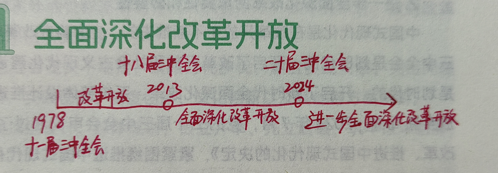

#### 第一节 改革开放是决定当代中国命运的关键一招

##### 考点 38 非重点

##### 考点 39 新时代全面深化改革开放是一场深刻革命

1. 全面深化改革开放是涉险滩、闯难关的变革
   * 领导人原话：经过多年的改革开放，容易的、皆大欢喜的改革已经完成了，好吃的肉都吃掉了，剩下的都是难啃的硬骨头
2. 进一步全面深化改革的原则（“六个坚持”）：非重点，可以编，但是坚持以制度建设为主线不能编
   * 坚持党的全面领导
   * 坚持以人民为中心
   * 坚持守正创新
   * 坚持以制度建设为主线
   * 坚持全面依法治国
   * 坚持系统观念
3. 到 2035 年，全面建成高水平社会主义市场经济体制

##### 考点 40 坚持全面深化改革开放的正确方向

1. 必须坚持和改善党的全面领导、坚持和完善中国特色社会主义制度

2. 必须坚持以人民为中心，促进社会公平正义、增进人民福祉（**根本目的**、出发点、落脚点、归宿）（为了人）（必须区分根本目的与总目标）

3. 必须以 **经济体制改革** 为牵引

4. 必须有利于

   * 进一步解放思想（前提条件）
   * 进一步解放和发展社会生产力（任务）
   * 进一步解放和增强社会活力（目的）

5. 《中共中央关于进一步全面深化改革、推进中国式现代化的决定》相关考点总结

   | 键                 | 值                                                           |
   | ------------------ | ------------------------------------------------------------ |
   | 主题               | 推进中国式现代化                                             |
   | 总目标             | 继续完善和发展中国特色社会主义，推进国家治理体系和治理能力现代化 |
   | 时间表             | 到 2029 年中国人民共和国成立八十周年时，完成本决定提出的改革任务 |
   | 重大原则“六个坚持” | 坚持党的全面领导、坚持以人民为中心、坚持守正创新、坚持以制度建设为主线、坚持全面依法治国、坚持系统观念 |
   | 重大举措“七个聚焦” | 1. 经济建设：聚焦构建高水平社会主义市场经济体制 2. 政治建设：聚焦发展全过程人民民主 3. 文化建设：聚焦建设社会主义文化强国 4. 社会建设：聚焦提高人民生活品质 5. 生态建设：聚焦建设美丽中国 6. 国家安全：聚焦建设更高水平平安中国 7. 党的建设：聚焦提高党的领导水平和长期执政能力 |
   | 根本保证           | 党的领导                                                     |

#### 第二节 统筹推进各领域各方面改革开放

##### 考点 41 坚持全面深化改革总目标

1. 进一步全面深化改革的 **总目标**

   * 继续完善和发展中国特色社会主义制度
   * 推进国家治理体系和治理能力现代化

   >[全面深化改革的根本目的](#全面深化改革开放的根本目的)

2. 改革的根本方向：“完善和发展中国特色社会主义制度”

   改革的鲜明指向和时代要求：“推进国家治理体系和治理能力现代化”

3. 统筹推进各领域各方面改革开放

   * 以全面深化改革总目标为 **引领**
   * 以制度建设为 **主线**
   * 以经济体制改革为 **重点**
   * 以重要领域和关键环节改革为 **突破口**

##### 考点 42 推进国家治理体系和治理能力现代化

1. 国家治理体系：在党领导下管理国家的制度体系
2. 国家治理能力：运用国家制度管理社会各方面事务的能力
3. 二者的关系：体系与能力可以相互促进，**但没有必然关系**

##### 考点 43 全面深化改革开放要坚持正确方法论

1. 增强全面深化改革的系统性、整体性、协同性

2. 加强顶层设计和摸着石头过河相结合

3. 统筹改革发展稳定（动态平衡）
   * **改革** 是经济社会发展的 **强大动力**
   * **发展** 是解决一切经济社会问题的 **关键**
   * **稳定** 是改革发展的 **前提**

4. 胆子要大，步子要稳

5. 坚持重大改革于法有据

   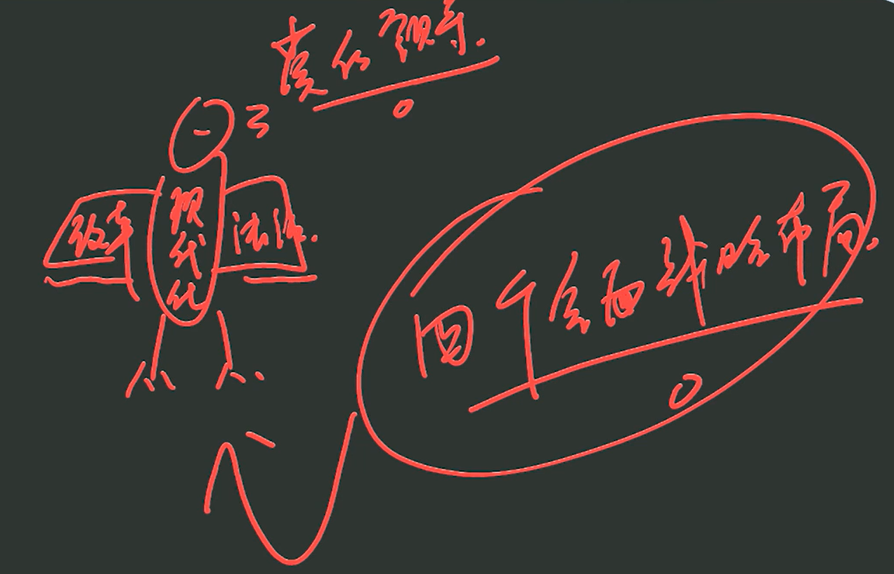

#### 第三节 将改革开放进行到底

##### 考点 44 改革开放永无止境

1. 全面深化改革开放，是新时代坚持和发展中国特色社会主义的根本动力（从微观角度理解）
   * 宏观上，马克思认为：社会基本矛盾是根本动力
2. [改革开放 40 多年来，成就的根本原因](#P196)

##### 考点 45 坚定不移扩大高水平对外开放

1. 开放带来进步，封闭必然落后

2. 构建更高水平开放型经济新体制

   * 2024 年党的二十届三中全会最新论断 P197
   * 概括起来 6 点
     1. 搞市场吸引别人来
     2. 要有制度不能说变就变
     3. 贸易升级，不能那么低端
     4. 搞“一带一路”作为抓手
     5. 方方面面都要开放，形成新格局
     6. 我们要为全球做出贡献

   >“一带一路”：中国践行新外交理念的重要抓手

### 杂项

#### 基本问题总结

1. 方向：中国特色社会主义
2. 任务：中国式现代化
3. 领导：党
4. 宗旨：人民
5. 动力：改革开放

## 布局安排

### 第六章 推动高质量发展

五位一体总体布局之第一位：**经济发展**（第六章）及其 **战略支撑**（第七章）

#### 第一节 完整、准确、全面贯彻新发展理念

##### 考点 46 我国进入新发展阶段 非重点

##### 考点 47 贯彻新发展理念是关系我国发展全局的一场深刻变革

1. 发展理念是发展行动的 **先导**：理念是思想的东西，先导也可以说成指南、指引、遵循

2. 新发展理念：创新、协调、绿色、开放、共享

3. 新发展理念的科学内涵与实践要求

   * 第一动力：创新

     > 总结：动力
     >
     > * 创新
     > * 改革开放
     > * 社会基本矛盾（根本动力）

   * 内在要求：协调

   * 必要条件、重要体现：绿色

   * 必由之路：开放

   * 本质要求：共享

     >匹配：全民共享、全面共享、共建共享、渐进共享

##### 考点 48 以新发展理念引领高质量发展

| 键                                   | 值         |
| ------------------------------------ | ---------- |
| 全面建设社会主义现代化国家的首要任务 | 高质量发展 |
| 新时代我国经济社会发展的鲜明 **主题** | 高质量发展 |
| 经济发展 **主线**  | 供给侧改革 |

1. 高质量发展提出的新要求（匹配）

   * 供给：产业体系、生产
   * 需求：满足、需求
   * 投入产出：效率、率
   * 分配：回报、利润、收入、税收
   * 宏观经济循环：消费循环通畅、布局比较合理、经济发展比较平稳

   > 高质量发展，就是从“有没有”转向“好不好”

2. 高质量发展的重大战略 **意义**

   * 物质基础

   * $$
     社会主义基本经济制度 \\
     \Downarrow 保证（保障） \\
     高质量发展 \\
     \Downarrow 保证（保障） \\
     满足人民美好生活需要
     $$

   * 维护国家长治久安的必然要求

##### 考点 49 以新质生产力强劲推动高质量发展

去年刚提（可能论述题）

1. 什么是新质生产力？（7 个圈 P201）

   | 键       | 值                                             |
   | -------- | ---------------------------------------------- |
   | 主导     | 创新                                           |
   | 特征     | 高科技、高效能、高质量                         |
   | 基本内涵 | 以劳动者、劳动资料、劳动对象及其优化组合的跃升 |
   | 核心标志 | 全要素生产率大幅提升                           |
   | 特点     | 创新                                           |
   | 关键     | 质优                                           |
   | 本质     | 先进生产力                                     |

2. 怎样培育和发展新质生产力？（怎么做）

   * **核心要素：大力推进科技创新**
   * 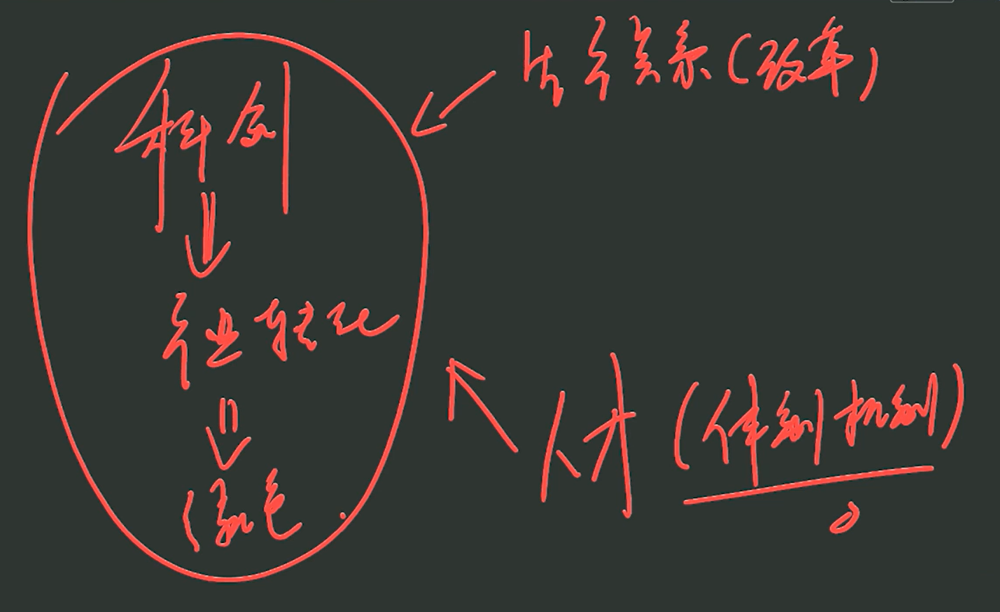

   > 生产力决定生产关系，生产关系反作用于生产力：发展新质 **生产力**，必须进一步全面深化改革，形成与之相适应的新型 **生产关系**

#### 第二节 坚持和完善社会主义基本经济制度

##### 考点 50 坚持和完善社会主义基本经济制度是实现高质量发展的保障

1. 所有制：以公有制为主体、多种所有制经济共同发展
2. 分配制：按劳分配为主体、多种分配方式并存
3. 资源配置方式：社会主义市场经济体制

以上三点共同作为社会主义基本经济制度

>所有制 决定 分配制、资源配置方式
>分配制、资源配置方式 影响 所有制

##### 考点 51 所有制：坚持“两个毫不动摇”

1. 社会主义：公有制

   中特社会主义：公有 + 私有（公有是主体、主导）

   资本主义：私有制

2. 为什么允许非公有制经济在中国发展？

   A. 是社会主义经济的重要组成部分（错）

   B. 是社会主义市场经济的重要组成部分（对）

3. 所有制：公有、私有

   所有制实现形式：单一制、混合制

4. 公有制经济：国有经济 + 集体经济

   * 国有企业是中国特色社会主义的重要物质基础和 **政治基础**（如果没做好，人民群众就不答应，涉及执政根基）

5. 非公有制经济

   * 是社会主义市场经济的重要组成部分
   * 是稳定经济的重要基础
   * 是国家税收的重要来源
   * 是就业创业的重要领域
   * 是技术创新的重要主体
   * 是金融发展的重要依托
   * 是经济持续健康发展的重要力量
   * 是现代化经济体系的重要主体

6. 民营经济

   * 是非公有制经济的主要经济组织形式
   * 是推进中国式现代化的生力军
   * 是高质量发展的重要基础
   * 是推动我国全面建成社会主义现代化强国、实现第二个百年奋斗目标的重要力量

7. 党的二十届三中全会提出了许多方针政策来为非公有制经济发展营造良好环境和提供更多机会

   * 促进法
   * 破壁垒
   * 担任务
   * 融资易
   * 减负担
   * 增信用
   * 优治理
   * 要监督

##### 考点 52 分配制：坚持按劳分配为主体、多种分配方式并存

1. 所有制 决定 分配制

   分配制：按劳分配、按要素分配

   * 社会主义性质 决定 按劳分配
   * 基本国情 决定 按要素分配

2. 劳动是财富创造的活的源泉

3. 坚持和完善基本分配制度的政策导向（怎么做）

   * 经济增长了、GDP 增长率、科技进步了，我的工资要涨
   * 虽然各种要素都能参与分配，但劳动是最主要的要素
   * 要健全生产要素由市场评价贡献、按贡献决定报酬的机制

##### 考点 53 资源配置体制机制：构建高水平社会主义市场经济体制

1. 党的二十届三中全会提出，高水平社会主义市场经济体制是中国式现代化的重要保障
   * 中国式现代化的重要保障比较模糊，制度、体制、法治都可以说成是重要保障
2. 构建高水平社会主义市场经济体制，关键是要处理好政府和市场的关系
   * 毛中特-邓小平理论-[我国经济体制改革的核心问题](#我国经济体制改革的核心问题)：处理好政府和市场的关系
3. 要用好“看不见的手”（市场）和“看得见的手”（政府），推动有效市场和有为政府的更好结合
4. 构建全国统一大市场
   * 规则
   * 流通联动
   * 政府带动
5. 完善市场经济基础制度
   * 完善产权制度
   * 完善市场准入制度（缩减负面清单）
6. 依法规范和引导资本健康发展：要用，但是要管

#### 第三节 加快构建新发展格局

##### 考点 54 把握未来发展主动权的战略部署

1. 早期改革开放：“两头在外”

   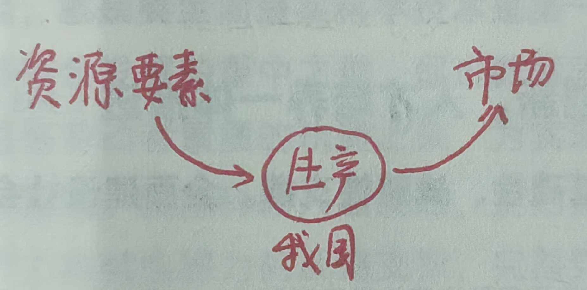

   2008 年国际金融危机：我国发展格局演变的一个重要分水岭

   国内大循环：不是闭关锁国，是把经济发展立足点由国外转到国内，立足于本国，利用本国自身的市场来发展本国经济，从而实现更好的、高水平的开放

2. 新发展格局

   * 国内大循环
   * 国内国际双循环

##### 考点 55 以国内大循环为主体、国内国际双循环相互促进

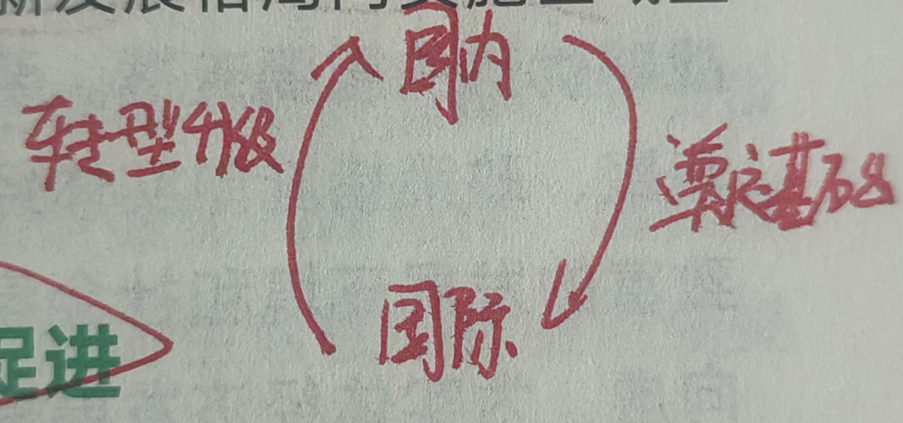

必须保证经济循环的畅通无阻，还需要打通堵点

##### 考点 56 大力推动构建新发展格局（怎么做）

1. **扩大** 内需：解决老百姓的后顾之忧

   **深化** 供给侧结构性改革：结构优化、长期效益

   >需求侧：消费、投资、出口（短期效益、总量调控）
   >
   >[经济发展的主题](#新时代我国经济社会发展)：高质量发展
   >
   >[经济发展的主线](#新时代我国经济社会发展)：供给侧结构性改革

2. 着力发展 **实体经济**

3. 着力加快科技自立自强：最本质的特征

4. 着力推动产业链供应链优化升级

   * 产业链：产业
   * 供应链：企业

#### 第四节 建设现代化经济体系

##### 考点 57 建设现代化产业体系

1. 巩固 **优势产业** 领先地位：已经领先世界的产业
2. 大力发展 **战略性新兴产业**：在全世界刚起步的产业
3. 构建优质高效的 **服务业** 新体系：除了工业、农业，其他都叫服务业（第三产业）
4. 发展 **现代流通产业**
5. 加快发展 **数字经济**
6. 构建 **现代化基础设施体系**：重要支撑

##### 考点 58 全面推进乡村振兴

1. 目标和要求

   | 键       | 值                                               |
   | -------- | ------------------------------------------------ |
   | 总目标   | 农业农村现代化                                   |
   | 总方针   | 坚持农业农村优先发展                             |
   | 总要求   | 产业兴旺、生态宜居、乡风文明、治理有效、生活富裕 |
   | 制度保障 | 建立健全城乡融合发展体制机制和政策体系           |

2. 具体举措：要把饭碗端在自己手里

3. 完善城乡融合发展体制机制：打破城乡二元结构

   * 健全推进新型城镇化体制机制

   * 巩固和完善农村基本经营制度

     >三权分置：土地
     >
     >* 所有：集体
     >* 承包权
     >* 经营权

   * 完善农惠农富农支持制度

   * 深化土地改革制度

##### 考点 59 促进区域协调发展

1. 总思路：按照客观经济规律调整完善区域政策体系，发挥各地区比较优势
2. 完善实施区域协调发展战略机制（各区域）
3. 推进以人为核心的新型程占华，加快农业转移人口市民化（各层次）

### 第七章 社会主义现代化建设的教育、科技、人才战略

#### 第一节 全面建设社会主义现代化国家的基础性、战略性支撑

##### 考点 60 坚持教育发展、科技创新、人才培养一体推进

1. 教育是根本

   科技是关键

   人才是基础

2. 建设教育强国、科技强国、人才强国具有内在一致性和相互支撑性（三者环环相扣，缺一不可）
3. 历史性成就
   * 我国已建成世界上规模最大的教育体系
   * 我国进入创新型国家行列（2035 年进入前列）
   * 我国已经发展成为全球规模最宏大、门类最齐全的人才资源大国

##### 考点 61 深入实施科教兴国战略、人才强国战略、创新驱动发展战略

1. 我国的基本国策

   * 一国两制
   * 对外开放
   * 解决资源
   * 保护环境
   * 男女平等
   * **科教兴国**

2. 科教兴国：科学技术是第一生产力

   人才强国：人才资源是第一资源

   创新驱动发展战略：创新是第一动力

##### 考点 62 非重点

#### 第二节 加快建设教育强国

##### 考点 63 教育是民族振兴、社会进步的基石

1. 坚持党对教育工作的全面领导是办好教育的根本保证
   * 根本保证：党的领导（可用于其他题）
2. 教育的根本任务：立德树人
3. 建设教育强国
   * 是全面建成社会主义现代化强国的战略先导
   * 是实现高水平科技自立自强的重要支撑
   * **是促进全体人民共同富裕的有效途径**
   * 是以中国式现代化全面推进中华民族伟大复兴的基础工程

##### 考点 64 落实立德树人根本任务

1. 教育的根本问题、建设教育强国的核心课题：落实立德树人根本任务，必须着力解决好培养什么人、怎样培养人、为谁培养人的问题
2. 培养什么人？（教育的首要问题）：社会主义建设者和接班人

##### 考点 65 非重点

#### 第三节 加快建设科技强国

##### 考点 66 科技强则国家强

1. 实现高水平科技自立自强的必要性
   * 实现高水平科技自立自强
     * 是国家强盛和民族复兴的 **战略基石**
     * 是应对风险挑战和维护国家利益的必然选择
     * 是构建新发展格局、推动高质量发展、满足人民美好生活需要的内在要求

##### 考点 67 打赢关键核心技术攻坚战

1. 关键核心技术必须掌握在自己手中
2. 深入推进科技体制改革
3. 发挥新型 **举国体制** 优势：集中力量办大事

##### 考点 68 增强自主创新能力

1. 原始创新：从无到有创造一个东西

   集成创新：几个东西集成在一起

   开放创新：引入别人的东西创新

2. 重要性

   * 自出创新：战略基点、中心环节、关键

3. 基础理论：理科（数理化）

4. 国家战略科技力量：科研队伍

#### 第四节 加快建设人才强国 非重点

#### 杂项

1. 国家战略科技力量是世界科技强国竞争的着力点

### 第八章 发展全过程人民民主

五位一体总体布局之第二位：民主政治（第八章）与法治（第九章）

#### 第一节 鉴定中国特色社会主义政治制度自信

##### 考点 72 非重点

##### 考点 73 中国特色社会主义政治制度行得通、有生命力、有效率

1. 中国特色社会主义政治制度的构成
   * 根本政治制度：人民代表大会制度
   * 基本政治制度
     1. 中国共产党领导的多党合作和政治协商制度
     2. 民族区域自治
     3. 基层群众自治
   * 重要政治制度：除了根本和基本，其他都是重要

##### 考点 74 坚定不移走中国特色社会主义政治发展道路

1. 必须坚持党的领导、人民当家做主、依法治国有机统一
   * 根本保证：党的领导
   * 本质特征：人民当家做主
   * 基本方式：依法治国
2. 必须积极稳妥推进政治体制改革
3. 必须始终坚持政治定力：坚守自己的基础上丰富发展

#### 第二节 全过程人民民主是社会主义民主政治的本质属性

##### 考点 75 全过程人民民主是社会主义民主政治的伟大创造

1. 实现了过程民主和成果民主、程序民主和实质民主、直接民主和间接民主、人民民主和国家意志相统一

##### 考点 76 非重点

#### 第三节 健全人民当家做主的制度体系

##### 考点 77 加强人民当家作主制度保障

###### 根本政治制度

1. 人大的性质、意义、政治优势：见 P223

2. 人大制度

   * 1949 第一届全国政协会议（宣告）
   * 1954 第一届人大会议（标志、建立）

3. 人大会议：单位、组织、机关

   人大制度：根本政治制度、政体

###### 基本政治制度

1. 政协制度：基本政治制度、政党制度

   政协会议：机构（协商）

   * 是机构
   * 是具有中国特色的制度安排
   * 并不是国家机关
   * 是党领导下的爱国统一战线组织

2. 省的四个领导班子

   * 党委：书记
   * 政府：省长
   * 人大：主任
   * 政协：主席

3. 中国共产党与各民主党派关系

   * 长期共存
   * 互相监督
   * 肝胆相照
   * 荣辱与共

4. **人大民主：间接民主、分层次**

   **基层民主：直接民主、管理基层事务**

5. 处理民族事务的原则

   1. 维护祖国统一、反对民族分裂（前提）
   2. 民族团结、民族平等
   3. 各民族共同繁荣（出发点、落脚点、目的、归宿）

##### 考点 78 全面发展协商民主

1. 决策后不协商：民主集中制

2. 西方民主：竞争式民主（对抗性）

   中国民主：协商民主（非对抗性）

3. 政党协商、人大协商、政府协商、政协协商、人民团体协商、基层协商、社会组织协商（没有海外协商）

##### 考点 79 积极发展基层民主

1. 基层自治组织：村委会、居委会、职工代表大会

#### 第四节 巩固和发展新时代爱国统一战线

##### 考点 80 统一战线是凝聚人心、汇聚力量的强大法宝

1. 统战工作：大团结大联合（党委）

   政协工作：团结和民主（政协）

2. 统战工作的

   * 关键：坚持求同存异
   * 目的：壮大共同奋斗的力量

3. 坚持党的领导是统一战线最核心最根本的问题

##### 考点 81 铸牢中华民族共同体意识

1. 对中华民族形成起决定作用的是对中华民族共同体的认同

2. 历史根基：各民族血脉相容

   内生动力：各民族信念相同

   文化基因：各民族文化相同

   强大力量：各民族经济相依

   坚强纽带：各民族情感相亲

3. 宗教工作原则
   * 独立自主自办：不受海外干涉
   * 政教分离

4. 宗教工作本质上是群众工作

### 第九章 全面依法治国

#### 第一节 坚持中国特色社会主义法治道路

##### 考点 83 全面依法治国是国家治理的一场深刻革命

1. 法治是中国式现代化的重要保障
2. [全面依法治国总体格局](#全面依法治国的格局) 基本形成

##### 考点 84 全面依法治国的唯一正确道路

1. 法与德的关系

   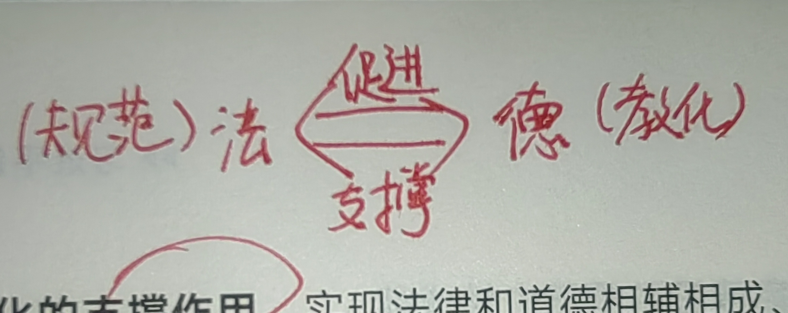

##### 考点 85 统筹处理全面依法治国的重大关系

1. 正确处理以下关系
   1. 政治与法治
   2. 改革与法治
   3. 依法治国（基本方式）和以德治国（重要方式）
   4. 依法治国和依规治党

#### 第二节 建设中国特色社会主义法治体系

##### 考点 86 全面推进依法治国的总抓手

1. 总抓手：中国特色社会主义法治体系

##### 考点 87 非重点

##### 考点 88 更好推进中国特色社会主义法治体系建设

| 具体方面           | 有关说法                                                     |
| ------------------ | ------------------------------------------------------------ |
| 完备的法律规范体系 | 是中国特色社会主义法治体系的 **前提**，是法治国家、法治政府、法治社会的制度 **基础** |
| 高效的法治实施体系 | 是建设中国特色社会主义法治体系的 **重点**                    |
| 严密的法治监督体系 | 是宪法法律有效实施的重要 **保障**                            |
| 有力的法治保障体系 | 是全面依法治国的重要 **依托**                                |
| 完善的党内法规体系 | 是中国特色社会主义法治体系的 **本质要求** 和 **重要内容**       |

* 把党内法规体系纳入中国特色社会主义法治体系，是我国法治区别于其他国家法治的鲜明特征

#### 第三节 加快建设法治中国

##### 考点 89 法治中国建设的总体目标

1. 2025 年：中国特色法治体系初步形成

   2035 年：中国特色法治体系基本形成

##### 考点 90 法治中国建设的工作布局

1. [坚持依法治国、依法执政、依法行政共同推进](#坚持依法治国、依法执政、依法行政共同推进)

2. 坚持法治国家、法治政府、法治社会一体建设

   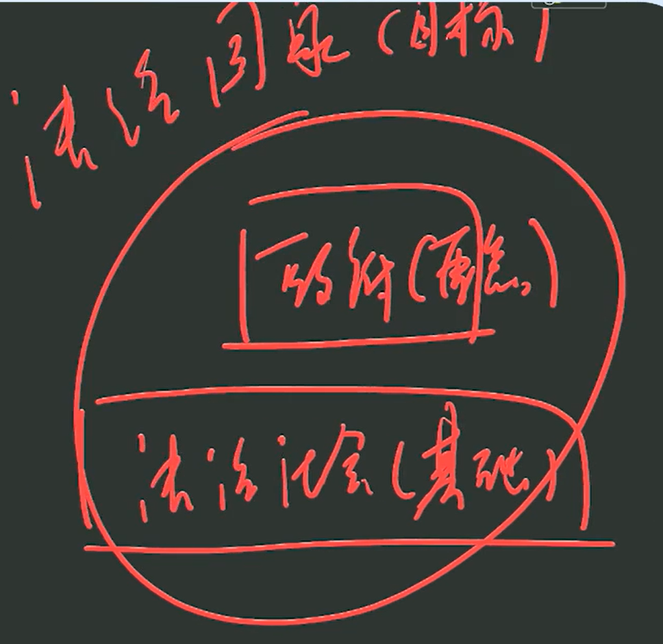

3. 坚持统筹推进国内法治和涉外法治

##### 考点 91 非重点

### 第十章 建设社会主义文化强国

五位一体总体布局之第三位：文化建设

#### 第一节 文化是民族生存和发展的重要力量

##### 考点 92 文化繁荣兴盛是实现中国民族伟大复兴的必然要求

1. 文化繁荣兴盛的重要性
   * 是实现中华民族伟大复兴的精神支撑
   * 是建设社会主义现代化强国的应有之义
   * 是满足人民日益增长的美好生活需要的内在要求
   * 是世界文化激荡中站稳脚跟的前提基础

##### 考点 93 坚定中国特色社会主义文化自信

1. 理论、制度、道路 $\rightarrow$ 我怎么做

   文化 $\rightarrow$ 我是谁

2. 文化自信的依据和来源

   * 中华优秀传统文化是我们坚定文化自信的深厚基础
   * 党带领人民在伟大斗争中孕育的革命文化和社会主义先进文化是我们坚定文化自信的坚强基石
   * 中国特色社会主义伟大实践是我们坚定文化自信的现实基础

##### 考点 94 坚持中国特色社会主义文化发展道路

1. “二为”方向：为人民服务、为社会主义服务

   “双百”方针：百花齐放、百家争鸣

#### 第二节 坚持党的文化领导权

##### 考点 95-96 非重点 P238

##### 考点 97 积极塑造主流舆论新格局

1. 做好新闻舆论工作的 **第一位要求**：坚持正确的政治方向
2. 新形势下做好新闻舆论工作的 **关键**：管好用好互联网

#### 第三节 以社会主义核心价值观引领文化建设

##### 考点 98 广泛践行社会主义核心价值观

1. 贯彻到方方面面

##### 考点 99-100 非重点 P240

#### 第四节 铸就社会主义文化新辉煌

##### 考点 101 “两个结合”是我们取得成功的最大法宝

1. 对待优秀传统文化的态度：创造性转化、创新性发展
2. “两个结合”的重大意义和深远影响
   * “结合”的前提是彼此契合。马克思主义和中华优秀传统文化来源不同，但彼此存在高度的契合性
   * “结合”的结果是互相成就，造就了一个有机统一的新的文化生命体
   * “结合”筑牢了道路根基。“第二个结合”让中国特色社会主义道路有了更加宏阔深远的历史纵深，扩展了中国特色社会主义道路的文化根基
   * “结合”打开了创新空间
   * “结合”巩固了文化主体性。“第二个结合”是我们党对马克思主义中国化时代化历史经验的深刻总结，是对中华文明发展规律的深刻把握，表明我们党对中国道路、理论、制度的认识达到了新高度，表明我们党的历史自信、文化自信达到了新高度，表明我们党在传承中华优秀传统文化中推进文化创新的自觉性达到了新高度

##### 考点 102 传承发展中华优秀传统文化

1. 中华文明的突出特性

   | 突出特性 | 决定了                                                       |
   | -------- | ------------------------------------------------------------ |
   | 连续性   | 1. 中华民族必然走自己的路（根本）                            |
   | 创新性   | 1. 中华民族守正不守旧、尊古不复古的进取精神（根本） 2. 中华进组不惧新挑战、勇于接受新事物的无畏品格 |
   | 统一性   | 1. 中华民族各民族文化融为一体、即使遭遇重大挫折也牢固凝聚（根本） 2. 国土不可分、国家不可乱、民族不可散、文明不可断的共同信念 3. 国家统一永远是中国核心利益的核心 4. 一个坚强统一的国家是各族人民的命运所系 |
   | 包容性   | 1. 中华民族交往交流交融的离市区想（根本） 2. 中国各宗教信仰多元共存的和谐格局 3. 中华文化对世界文明兼收并蓄的开放胸怀 |
   | 和平性   | 1. 中国始终是世界和平的建设者、全球发展的贡献者、国际秩序的维护者（根本） 2. 中国不断追求文明交流互鉴而不搞文化霸权 3. 中国不会把自己的价值观念与政治体制强加于人 4. 中国坚持合作、不搞对抗、绝不搞“党同伐异”的小圈子 |
   

##### 考点 103 繁荣发展文化事业和文化产业

1. 繁荣发展文化事业和文化产业，是满足人民精神文化需求、保障人民文化权益的基本途径

2. 文化事业与文化产业的比较

   | 项目     | 主导         | 功能               | 导向                         | 要求                           | 例子   |
   | -------- | ------------ | ------------------ | ---------------------------- | ------------------------------ | ------ |
   | 文化事业 | 政府         | 满足基本文化需求   | 社会效益                     | 公益性、基本型、均等性、便利性 | 博物馆 |
   | 文化产业 | 市场（企业） | 满足多样化文化需求 | 经济效益与 **社会效益** 相结合 | 全面协调可持续                 | 学钢琴 |

##### 考点 104 不断提升国家文化软实力和中华文化影响力

1. 一个国家的文化软实力，从根本上说，取决于其核心价值观的生命力、凝聚力、感召力
1. 加强国际传播能力建设，全面提升国际传播效能，**根本途径**：讲好中国故事、传播好中国声音

#### 杂项

1. 决定社会主义文化事业前途命运的关键：坚持为人民服务、为社会主义服务的根本方向
2. 党的领导是实现中华民族伟大复兴的根本保证，也是中国特色社会主义制度的最大优势

### 第十一章 以保障和改善民生为重点加强社会建设

五位一体总体布局之第四位：社会建设

见 P245-P251

### 第十二章 建设社会主义生态文明

五位一体总体布局之第五位：生态文明建设

见 P252-P259

## 内外条件

### 第十三~十七章

见 P260-291

#### 杂项

##### 外交工作

| 键             | 值                           |
| -------------- | ---------------------------- |
| 主线           | 服务民族复兴、促进人类进步   |
| 出发点和落脚点 | 维护国家主权、安全、发展利益 |
| 宗旨           | 外交为民                     |
| 总目标         | 构建人类命运共同体           |

## 杂项

### 改革开放以来我们取得一切成绩和进步的根本原因，归结起来就是：

1. [有了中国特色社会主义理论体系](#40多年来成就原因-有了中特)

### 全面建设社会主义现代化强国

| 键                             | 值                           |
| ------------------------------ | ---------------------------- |
| 首要任务                       | 高质量发展                   |
| 根基                           | 农业强国                     |
| 基础性、战略性支持             | 教育、科技、人才             |
| 战略先导                       | 教育强国                     |
| 出发点、落脚点、根本目的、归宿 | 增进人民福祉                 |
| 内在要求                       | 尊重自然、顺应自然、保护自然 |

* 应有之义是模糊说法，只要看到就必选

### 全过程人民民主

| 键       | 值               |
| -------- | ---------------- |
| 制度载体 | 人民代表大会制度 |
| 重要形式 | 协商民主         |
| 重要体现 | 基层民主         |

### 主线

| 键       | 值                                           |
| -------- | -------------------------------------------- |
| 经济发展 | 供给侧结构性改革                             |
| 改革     | 制度建设                                     |
| 民族工作 | 筑牢中华民族共同体意识                       |
| 外交工作 | 服务民族复兴、促进人类进步                   |
| 一带一路 | 互联互通                                     |
| 党建     | 加强党的长期执政能力建设、先进性和纯洁性建设 |

### 我们与别人区别

| 键                                     | 值                                                           |
| -------------------------------------- | ------------------------------------------------------------ |
| 中国共产党与其他党                     | 1. 三大优良作风 2. 人民至上 3. 勇于自我革命（最显著的区别） |
| 中国式现代化与西方现代化               | 共同富裕                                                     |
| 中国法治与其他法治                     | 1. 党的领导 2. 党内法规纳入中国特色社会主义法治体系       |
| 当代中国哲学社会科学与其他哲学社会科学 | 坚持以马克思主义为指导                                       |

### 政治问题

1. 共同富裕
2. 国有企业
3. 生态文明建设

>政治问题：涉及执政根基的问题，如果做不好人民不答应

# **附录：论述题考点**

## 马原

### [P15] 主观能动性和客观规律性的辩证统一

### [P20] 对立统一规律

### [P33] 实践对认识的决定作用

## 思修

### [P404] 个人与社会的辩证关系

### [P405] 人生价值

### [P407] 人生价值的评价与实现

### [P408] 树立正确的幸福观

### [P416] 坚持个人理想与社会理想的统一

### [P443] 发扬中国革命道德

### [P447] 网络生活中的道德要求

### [P450] 掌握道德修养的正确方法

## 史纲

### [P130] 中国共产党的成立及其意义（Optional）

## 习思想

### [P159] “两个结合”是对坚持和发展马克思主义作出的重大理论贡献 （Optional）

### [P162] 六个必须坚持（结合哲学原理）

### [P166] 中国特色社会主义市历史的结论、人民的选择

### [P175] 中国式现代化是中国共产党领导人民长期探索和实践的重大成果（重点，四段论）

### [P177] 中国式现代化创造了人类文明新形态

### [P190] 全面深化改革开放是涉险滩、闯难关的变革

### [P201] 以新质生产力强劲推动高质量发展（Optional）

# **附录：分析题考点**

## 马原

## 思修

### [P415] 理想与现实的辩证关系

## 习思想

### [P165] 中国特色社会主义是历史和人民的选择

### [P206] 把握未来发展主动权的战略部署（新发展格局）

### [P240] “两个结合”是我们取得成功的最大法宝

# **附录：听课寄存器**

> 存放要听的下一节课

"F:\Develop\others\MyPGEE\main\politics\courses\04.强化提升【核心考案】\05.考点串讲-习思想\05.坚持以人民为中心.mp4"
