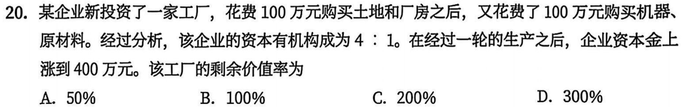
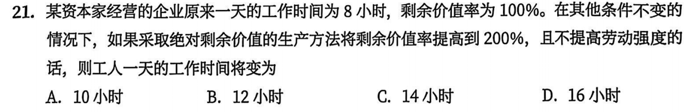
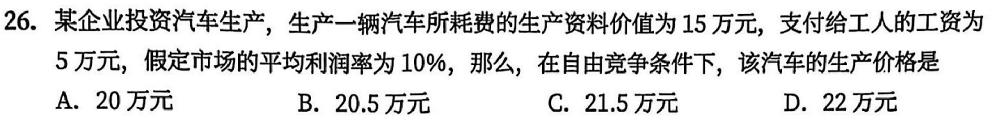

# **优题库错题本**

## 马原

### 导论

#### 13

马克思主义认为，规律分为 **自然规律** 和 **社会历史规律**，二者都是客观的，各自具有其自身的特点

### 第一章 辩证唯物论

#### 6

列宁对物质的定义方式：通过物质与意识之间的关系进行界定

#### 13

#### 15

#### 23

#### 25

物质和意识之间还有 `统一` 的一面，选表达二者相互统一的选项

#### 29

人们在改造世界时，意识具有创造性，但这个本身与劳动没有直接的关系

#### 31

物质世界的运动是绝对的

#### 32

#### 35

人们可以改变规律作用的条件和形式

#### 36

### 第二章 唯物辩证法

// TODO

### 第三章 认识论

// TODO

### 第四章 唯物史观

#### 11

生产关系随着生产力的变化而变化是一个不以人的意志为转移的客观过程

D 选项：题干涉及生产关系对生产力的反作用

#### 18

改革的实质在于社会制度的自我完善与发展

#### 20

社会历史发展受人的主体选择性的影响

D 选项：人民群众的意志就是历史的发展方向，属于唯心主义的观点，夸大了主体的目的和意志在历史发展中的作用

#### 23

B：唯物史观认为人类社会发展是由物质力量决定的，同时还受精神力量的影响。不能说人类社会的发展是由精神力量和物质力量共同决定的

#### 24

看错了

#### 26

本题考察的是社会存在对社会意识的决定方面，D 与题意不符

#### 32

无论人类社会如何发展，都无法突破生产力水平的制约，这是社会规律的客观性所在

#### 41

社会发展是由多种力量共同作用的结果，但是在这些力量中起决定性作用的只有一个，即“物质资料生产方式”，因此不能说是有多重力量最终决定的

#### 45

有些历史人物起阻碍历史前进的反动作用

#### 46

杰出人物历史作用的形成和发挥与其顺应人民群众的意愿密不可分

#### 47

历史人物会因其智慧、性格等因素对社会进程发生 **影响**

### 第五章 资本主义的本质和规律

#### 1

资本主义生产关系产生的方式

1. 从小商品经济分化出来
2. 从商人和高利贷者转化而成

#### 2

商品经济产生的历史条件

1. 社会分工的出现
2. 生产资料和劳动产品属于不同的所有者

#### 5

在资本主义的生产过程中，土地、设备和原材料等生产资料原有的价值借助工人的具体劳动转移到新的劳动产品中

#### 6

理解政治经济学的枢纽：劳动二重性理论

#### 8

不同商品的使用价值在质上是不同的，不同质的东西在量上无法进行比较。不同的商品之所以能够互相交换，是因为它们在生产中都耗费了 **无差别的一般人类劳动**，都包含价值

#### 11

价值形式的发展

1. 简单的或偶然的价值形式：原始社会，无等价物
2. 总和的或扩大的价值形式：第一次社会大分工后，有系列的特殊等价物
3. 一般价值形式：交换范围进一步扩大，物物交换困难凸显，有统一的一般等价物
4. 货币形式：手工业与农业分离（第二次社会大分工），有固定、独占的一般等价物（贵金属）

#### 12

货币执行 **流通手段职能** 时，消费者只有付出真金白银（现实的货币），才能将想要的货物买走

#### 13

商品生产者的命运其实主要是由商品是否能顺利卖出决定的，只有当商品顺利出售时，私人劳动才能转化为社会劳动

#### 14

以私有制为基础的商品经济的基本矛盾：私人劳动和社会劳动的矛盾

#### 16

劳动力商品的使用价值就是其价值的源泉，它在消费过程中能够创造新的价值，而且 **这个新的价值比劳动力本身的价值更大**

#### 17

劳动力商品具有使用价值与价值，其使用价值（劳动）是一般商品价值的源泉，它在使用过程中能够创造出新的价值，而且这个新的价值比劳动力本身的价值更大

#### 18

资本的本质不是物，而是物的外壳掩盖下的资本主义生产体系

#### 20

$c = 100 + 100 = 200万元$

$\cfrac{c}{v} = \cfrac{4}{1}$，于是 $v = 50万元$

$m = 400 - 200 - 50 = 150万元$

$m' = \cfrac{m}{v} = \cfrac{150}{50} = 300\%$

#### 21

$剩余价值率 = 剩余劳动时间 / 必要劳动时间 = 100\%$，$必要劳动时间 + 剩余劳动时间 = 一天的工作时间$，于是必要劳动时间为 $4$ 小时，剩余劳动时间为 $4$ 小时

采用 **绝对剩余价值** 的生产方法时，必要劳动时间不变，绝对延长剩余劳动时间，于是 $新的剩余价值率 = 剩余劳动时间/4 = 200\%$

故剩余劳动时间为 $8$ 小时，加上必要劳动时间结果为 $12$ 小时

#### 25

资本主义工资的本质是劳动力的价值或价格，但表现为劳动的价值或价格，看上去好像没有剥削一样，工资掩盖了资本主义社会剥削的本质

#### 26

$生产价格 = 成本价格(预付成本) + 平均利润$

由题意，不变成本 $c = 15万元$，可变成本 $v = 5万元$，故成本价格（预付成本）为 $15 + 5 = 20万元$

均利润率为 $10\%$，故投入 20 万元利润为 $2万元$

故生产价格为 $20 + 2 = 22万元$

#### 27

剩余价值和利润在质上是相同的，剩余价值是利润的本质，利润是剩余价值的表现形式，并且二者在量上也是相等的

剩余价值和利润不同的是，剩余价值是针对可变资本而言的，利润是针对全部预付资本而言的

#### 29

资本主义劳动过程是生产使用价值的过程

价值增殖过程，是超过 **劳动力价值的补偿** 这个 **一定点** 而延长了的价值形成过程

#### 30

同 27 题

在揭示资本主义工资的问题上，首先要区分劳动和劳动力

#### 31

生产过剩是 **资本主义经济危机** 的本质特征，但是这种过剩是相对过剩，即 **相对于劳动人民有支付能力的需求来说，社会生产的商品显得过剩**

#### 32

劳动的二重性 // TODO

* 抽象劳动形成商品的价值，是价值的唯一源泉
* 具体劳动结合自然物质创造了商品的使用价值

#### 35

对于某一个劳动者来说，他生产的单位商品的价值量降低了，但是由于社会劳动生产率提高，生产的商品数量也增加了。“产品数量增加的倍数”与“单位商品价值量降低的倍数”正好可以抵消，因此，商品的总价值量是不变的

#### 39

劳动力成为商品，要具备两个基本条件：

1. 劳动者在法律上是自由人，能够把自己的劳动力当作自己的商品来支配
2. 劳动者没有任何生产资料，没有别的商品可以出卖，“自由”得一无所有，没有任何实现自已的劳动力价值所必需的物质条件

#### 41

提高剩余价值率的方法：（与题干无关）

1. 绝对剩余价值生产
2. 相对剩余价值生产

社会再生产的核心问题是社会总产品的实现问题，即社会总产品的价值补偿和实物补偿问题（与题干无关）

#### 45

随着资本的积累，资本家会用越来越多的机器设备代替活劳动，也就是购买机器设备的不变资本越来越多，而购买活劳动的可变资本越越少

资本有机构成从量上来看就是不变资本与可变资本的比例，根据上文分析，这个比例应该是提高的。由于越来越多的活劳动被机器设备替代，相对过剩人口就会产生，也就是失业

在预付资本中，能够带来利润的部分是可变资本，可变资本的比例越来越小，就决定了利润率乃至平均利润率将会越来越低，而不是越来越高

#### 47

相对过剩人口即失业人口

#### 48

本题考查资本积累，具体考查资本主义生产与资本积累、相对过剩人口的关系。资本积累会导致本有机构成提高，产生相对过剩人口，即失业人口。相对过剩人口，即劳动力供给超过了资本对的需求而形成的过剩人口

由于资本主义自身无法克服的盲目性，资本主义生必然呈现周期性特征，而相对过剩人口的存在，发挥了劳动力蓄水池的作用，有效调节了劳动力供求关系

由于资本主义经济呈现周期性的波动，那么失业规模也应当随着经济的波动出现 **周期性波动**，因此“失业规模越来越大”是错误的

#### 49

资本积累是资本主义扩大再生产的源泉。而资本主义扩大再生产的实质就是资本主义生产关系的再生产，资本家购买更多的生产资料和劳动力生产更多的剩余价值

#### 50

资本循环的三个阶段：

1. **购买阶段**：资本执行货币的职能
2. **生产阶段**：资本执行生产准备的职能，发挥生产剩余价值的的职能
3. **售卖阶段**：资本执行商品资本的职能，发挥实现价值和剩余价值的职能

产业资本循环要保证连续性，必须具备：

1. 产业资本的三种职能形式必须在空间上并存
2. 产业资本的三种职能形式必须在时间上继起

#### 51

社会再生产的顺利进行，要求

1. 生产中所耗费的资本在价值上得到补偿，同时要求实际生产过程中所耗费的生产资料和消费资料得到实物的替换
2. 两大部类内部各个产业部门之间和两大部类之间保持一定的比例关系
3. 生产资料的生产和消费资料的生产既要保证简单再生产的实现，又要保证扩大再生产的实现

#### 52

社会总产品在价值形态上又叫社会总价值，划分为

1. 包括在产品中的生产资料的转移价值 c
2. 凝结在产品中的由工人在必要劳动时间里创造的价值 v
3. 凝结在产品中的由工人在剩余劳动时间里创造的价值 m

劳动力的价值包括三个部分

1. 维持劳动者本人生存所必需的生活资料的价值
2. 维持劳动者家属的生存所必需的生活资料的价值
3. 劳动者接受教育和训练所支出的费用

#### 54

资本 **有机构成** 提高即 **技术** 提高

#### 56

商品经济产生的历史条件有两个

1. 一是社会分工的存在
2. 二是生产资料和劳动产品属于不同的所有者

资本主义生产过程的本质特征：价值增殖过程

价值增殖过程以价值形成过程为前提和基础

资本主义生产过程和一般商品生产过程的区别：// TODO

#### 59

资本主义政治制度包括

1. 资本主义法律制度
2. 政权组织形式
3. 选举制度
4. 政党制度

#### 61

资本主义国家意识形态的本质，可以概括为两个方面

1. 资本主义意识形态是资本主义社会条件下的观念上层建筑，是为资本主义社会形态的经济基础服务的
2. 资本主义意识形态是资产阶级的阶级意识的集中体现

资本主义制度走向灭亡的自我否定因素是资本积累，资本积累导致两极分化，使得无产阶级的力量逐渐壮大。当无产阶级意识到自己处在被剥削的地位时，无产阶级就从“自在阶级”转变为“自为阶级”，成为资本主义制度的“掘墓人”。而资本主义的意识形态是维护资本主义统治的因素，并不是自我否定的因素

### 第六章 资本主义的发展及其趋势

#### 1 A

垄断资本向世界范围扩展的经济动因：

1. 一是将国内过剩的资本输出，以便在国外谋求高额利润
2. 二是将部分非要害的技术转移到国外，以取得在别国的垄断优势，攫取高额垄断利润
3. 三是争夺商品销售市场
4. 四是确保原材料和能源的可靠来源

自由竞争阶段也存在少量的资本输出

#### 7 W A

* 金融垄断资本产生的根源：生产规模扩大，企业内部积累赶不上再生产的资金需求
* 垄断资本产生的根源：生产集中与资本集中

#### 9 W

当代资本主义最突出、最鲜明、最主要的特征：国际金融资本的垄断

#### 11 W

即使竞争不存在，垄断企业仍然会有动力来壮大自已的实力，因为获取更多的剩余价值是它们永恒的目的

#### 13 W A

选项 A，说法错误，在简单商品经济时期，价值规律的表现形式是价格围绕价值自发波动；在垄断资本主义时期，价值规律表现为价格围绕垄断价格上下波动。所以，**垄断价格的出现改变了价值规律作用的表现形式**

#### 14 A

规制通常是政府管理经济社会有序发展的手段，一般不涉及人们的生活

#### 19 A

第二次世界大战以来，从事国际经济协调、维护国际经济秩序的国际性协调组织主要有三个：

1. 国际货币基金组织
2. 世界银行
3. 世界贸易组织

#### 20 A

选项 C，逻辑颠倒，企业为了适应经济全球化，需要不断进行技术创新与管理创新，而不是企业进行技术创新与管理创新就可以促进经济全球化

#### 21 A

职工持股和参与决策是劳资关系的变化不是社会阶层、阶级结构的变化，并且这并不意味着工人就变成了资本家，工人并不会成为资本家集团的重要力量，二者有本质区别

#### 24 W

第二次世界大战后，资本主义的变化在政治制度方面的表现有：

1. 第一，政治制度出现多元化的趋势，公民权利有所扩大
2. 第二，法治建设得到重视和加强，以协调社会各阶级、阶层之间的利益
3. 第三，改良主义政党在政治舞台上的影响日益扩大

选项 C，社会阶层和阶级结构的变化是第二次世界大战后资本主义的新变化之一，但不属于政治制度方面的变化，故不选。

#### 25 W

国际金融垄断资本主义影响日益显现。国际金融资本的垄断成为当代资本主义最突出、最鲜明、最主要的特征。主要表现在：

1. 一是金融垄断寡头化
2. 二是金融垄断国际化
3. 三是经济虚拟化、产业空心化

选项 C，不属于国际金融资本的垄断的表现，而是社会阶级层级结构的变化

#### 28 W

资本主义的内在矛盾决定了资本主义必然被社会主义所代替

1. 首先，资本主义基本矛盾“包含着现代的一切冲突的萌芽”
2. 其次，资本积累推动资本主义基本矛盾不断激化并最终否定资本主义自身
3. 再次，国家垄断资本主义是资本社会化的更高形式，将成为社会主义的前奏
4. 最后，资本主义社会存在着资产阶级和无产阶级两大阶级之间的矛盾和斗争

### 第七章 社会主义的发展及其规律

#### 1 W

社会主义从空想走向科学：马恩提出唯物史观和剩余价值学说

科学社会主义的诞生：《共产党宣言》

#### 4 A

帝国主义是无产阶级社会革命的前夜：列宁《帝国主义是资本主义的最高阶段》

#### 7 W A

社会主义 **改革** 根源于社会主义社会的基本矛盾，是社会主义基本矛盾运动发展的内在要求

#### 8 A

根据题干中的“公有制经济”“共同富裕”等关键词，可以判断其与生产资料公有制有关

#### 9 W

选项 B，把科学社会主义基本原则与本国实际相结合，创造性地回答和解决社会主义革命、建设、改革中的重大问题，与题意不符，故不选

#### 12 W

新经济政策

1. 首先，把建设社会主义作为一个长期探索、不断实践的过程
2. 其次，把大力发展生产力、提高劳动生产率放在首要地位
3. 再次，在多种经济成分并存的条件下，利用商品、货币和市场发展经济
4. 最后，利用资本主义，建设社会主义

#### 16 W

科学社会主义是人类优秀文化传统的历史延续

#### 17 W

选项 C，表述错误，民族因素和地理环境是社会历史发展的重要影响因素，而不是决定性因素

#### 19 W

社会规律与自然规律一样都是客观的、不以人的意志为转移的。

* 但是，自然规律是作为一种盲目的、无意识的力量起作用；
* 而社会规律是通过有目的、有意识的人的活动来实现的。
* 自然规律只要具备了同样的客观物质条件就可以以完全相同的形式反复出现

社会发展过程的曲折性：社会前进过程中所出现的反复、停滞和 **倒退** 的现象

### 第八章 共产主义崇高理想及其最终实现

#### 1 A

马克思提出共产主义的问题，在揭示人类社会发展的一般规律的基础上指明社会发现的方向

#### 6 W

“两个必然”：资本主义必然灭亡，社会主义必然胜利

* 科学论断深刻揭示了人类社会从资本主义向社会主义转变的历史必然性
* 在科学社会主义理论与实践中具有首要和基础的地位
* 是共产主义理想信念的核心要义

马克思主义追求的根本价值目标（共产主义的基本特征）：实现人的自由而全面的发展

## 思修

### 绪论 担当复兴大任 成就时代新人

#### 1 W

D. 法治建设为中国特色社会主义思想道德建设提供制度支撑和法律保障：属于法治建设对社会主义思想道德的作用，故不选

### 第一章 领悟人生真谛 把握人生方向

#### 1 W

人生目的是人生观的核心

#### 11 A

自我价值 = 索取

社会价值 = 奉献

#### 12 W

实现人生价值的根本途径：进行有意识、有目的的创造性实践活动

选项 A、C，具备正确的人生态度和正确认识自我价值和社会价值的关系或许能实现人生的自我价值和社会价值，但没有实践根本无法实现人生价值，故不选

#### 15 W

社会对于个人的价值评判主要是以个人对国家和社会所作的奉献为衡量标准

#### 17 A

历史标准：评价人生价值的根本尺度，是看一个人的实践活动

* 是否符合社会发展的客观规律
* 是否促进了历史的进步

#### 20 W

当代青年担当着新时代赋予的历史责任，应当与历史同向、与祖国同行、与人民同在，在服务人民、**奉献社会的实践** 中创造有意义的人生

### 第二章 追求远大理想 坚定崇高信念

#### 1 W

理想的分类

* 按主体分：个人理想和社会理想
* 按阶段分：近期理想和远期理想
* 按内容分：生活理想、职业理想、道德理想和政治理想
* 按层次分：崇高理想和一般理想

#### 3 A

高层次的信念决定低层次的信念，低层次的信念服从于高层次的信念

最高层次的信念是信仰

#### 9 W

理想信念不能决定社会的发展方向

#### 10 W

人类最崇高的理想是实现共产主义，不是实现中华民族伟大复兴

#### 14 W

1. 理想的特征：超越性、实践性、时代性

2. 信念的特征：执着性、支撑性、多样性

#### 16 W

选项 A，阐述了科学知识的来源，符合认识来源于实践，但与题干无关，故不选

### 第三章 继承优良传统 弘扬中国精神

#### 2 W

B. 道德当身，故不以物惑——对物质生活与精神生活相互关系的独到理解

C. 自天子以至于庶人，壹是皆以修身为本——“教化”的目的是明人伦，是培养有道德的人

#### 8 W A

新时代爱国主义的鲜明主题：实现中华民族伟大复兴的中国梦

#### 14 W

**马克思主义中国化时代化的理论创新成果** 是毛泽东思想、中国特色社会主义理论体系和习近平新时代中国特色社会主义思想，而不是精神谱系

#### 15 W

新时代爱国主义的基本要求

1. 本质：坚持爱国爱党爱社会主义相统一
2. 着力点和落脚点：维护祖国统一和民族团结
3. 重要条件：尊重和传承中华民族历史文化
4. 要求：坚持立足中国又面向世界

#### 20 W

爱国主义是历史的、具体的

**爱国主义不是永恒的**：爱国主义随国家的产生而产生，随着国家的消亡而消亡

在阶级社会，**爱国具有阶级性**：不同的阶级对待祖国的感情，既有一致的方面，也有差异的方面，甚至有对立的方面

#### 21 W

深入了解中华民族“多元一体”的发展历史，属于促进民族团结的举措

#### 22 W

国防教育是建设和巩固国防的基础，是增强民族凝聚力、提高全民素质的重要途径

中华人民共和国公民都有接受国防教育的权利和义务，普及和加强国防教育是全社会的共同责任。

学校国防教育是全民国防教育的基础，是实施素质教育的重要内容

#### 25 W

改革创新是构建社会主义和谐社会的重要条件

#### 26 W

中华民族的 **精神独立性** 得以保持的重要保证是 **民族精神**，而不是时代精神

### 第四章 明确价值要求 践行价值准则

无错题

### 第五章 遵守道德规范 锤炼道德品格

#### 2 A

在道德的功能系统

* 反映社会关系特别是反映社会经济关系的功效与能力：认识功能

#### 6 W

中华传统美德的根本要求：“公义胜私欲”

#### 8 W

坚持社会主义、共产主义理想信念的不屈不挠的精神，是中国革命道德的灵魂

#### 11 W

题干强调从古到今，体现继承性

#### 24 W

进行道德修养的 **根本途径**：勤于实践，加强道德行为训练

#### 30 W

* 首先，社会经济关系的性质决定着各种道德体系的性质
* 其次，社会经济关系所表现出来的利益决定着各种道德的基本原则和主要规范
* 再次，在阶级社会中，社会经济关系主要表现为阶级关系，因此，**道德也必然带有阶级属性**
* 最后，**社会经济关系的变化必然引起道德的变化**

#### 32 W

选项 D，说法正确，但题干讲的是“中国革命道德”与“中华传统美德”一脉相承的关系，而选项 D 讲的是“中国革命道德”的实践基础，与“中华传统美德”无关，故不选。

#### 39 W

个人品德的特点：实践性、稳定性、综合性

#### 41 W

选项 A，在资本主义国家，是为资产阶级服务，不存在为人民服务，故不选。

#### 43 W A

选项 A，公共生活中的道德规范即社会公德，是指人们在社会交往和公共生活中应该遵守的行为准则，是维护社会成员之间最基本的社会关系秩序、保证社会和谐稳定的最起码的道德要求，**涵盖了人与人、人与社会、人与自然之间的关系**。表述有误，故不选。

个人品德的作用

* 个人品德对道德和法律作用的发挥具有重要的推动作用
* 个人道德是个人实现自我完善的内在根据
* 个人品德是经济社会发展进程中重要的主体精神力量

#### 45 W

诚实守信的作用

* 诚实守信是市场经济条件下经济活动的一项基本道德准则
* 诚实守信是职业道德的一项基本要求
* 诚实守信是做人的一项基本道德准则

#### 46 W

公共生活的特征

* 活动范围的广泛性
* 活动内容的开放性
* 交往对象的复杂性
* 活动方式的多样性

### 第六章 学习法治思想 提升法治素养

#### 4 W

法律实施和实现的基本途径：守法

#### 7 W

全国人民代表大会及其常务委员会行使国家立法权

国务院有权根据宪法和法律，制定行政法规

中央军委有权根据宪法和法律制定军事法规

#### 8 A

司法基本要求：正确、合法、合理、及时

#### 10 A

我国法治与西方资本主义法治最大的区别：党的领导

#### 11 W

全面推进依法治国的根本目的：保障人民权益

#### 13 W

公正司法是维护社会公平正义的最后一道防线

#### 16 W

选项 C，法治思维主要包括法律至上、权力制约、公平正义、权利保障、程序正当等内容。公平正义是指社会的政治利益、经济利益和其他利益在全体社会成员之间合理、平等分配和占有。一般来讲，公平正义主要包括权利公平、机会公平、规则公平和救济公平。故不选。

#### 18 W

我国宪法确定的基本原则：党的领导

社会主义法治的根本保证：党的领导

#### 19 A

完备的法律规范体系，是中国特色社会主义法治体系的 **前提**，是法治国家、法治政府、法治社会的制度基础

#### 20 A

建设中国特色社会主义法治体系的 **重点**：建设高效的法治实施体系

#### 22 W

违法必究就是对一切违法犯罪行为都要按照“以事实为依据，以法律为准绳”的原则，给予惩处

选项 B，有法必依就是要保证法律效力的普遍性和有效性，即尽量排除和杜绝立法、执法、司法、守法和法律监督中的随意性、偶然性和腐败现象；坚持法律面前人人平等，任何组织和个人都不能有超越宪法和法律的特权。与题意不符，故不选。

#### 25 A

**法律至上** 是指在国家或社会的所有规范中，法律是地位最高、效力最广、强制力最大的规范

#### 26 A

我国宪法规定我国公民的基本权利

1. 平等权
2. 选举权与被选举权
3. 言论、出版、集会、结社、游行、示威的自由
4. 宗教信仰自由
5. 人身自由、人格尊严、住宅不受侵犯和通信自由
6. **劳动权**
7. 受教育权

我国宪法规定我国公民的基本义务

1. 维护国家统一和各民族团结
2. 遵守宪法和法律、保守国家秘密、爱护公共财产、遵守劳动纪律、遵守公共秩序、尊重社会公德
3. 维护祖国安全、荣誉和利益
4. **劳动的义务**
5. 受教育的义务
6. 保卫祖国、抵抗侵略、依法服兵役和参加民兵组织
7. 依法纳税

#### 30 W

法律适用，属于法律运行的环节之一，但题干中并没有提及司法部门或司法环节，故不选。

#### 32 W

守法的正确理解

1. 守法的主体是一切组织和个人
2. 守法是行使法定的权利，履行法定的义务
3. 守法意味着一切组织和个人严格依法办事的活动和状态
4. 守法是遵守宪法和法律

#### 33 W

法律至高无上是当今的思想，我国封建社会中还没有这种思想

#### 34 A

法律是统治阶级意志的体现，在阶级社会中，体现的是统治阶级的 **整体意志**

#### 38 W

行政执法的主体（主要是前两点）

1. 中央和地方各级政府，包括国务院和地方各级人民政府
2. 各级政府中享有执法权的下属行政机构
3. 法律授权的社会组织、行政机关依法委托的社会组织也可以在一定范围内执行法律

#### 39 W

坚持党的领导必须体现在党领导立法、保证执法、支持司法、带头守法上

选项 B，表述错误，执法机关主要指国家的行政机关，而党组织只是保证执法机关正常履行职能，本身不能执法，故不选。

#### 40 W

平等、自愿、公平原则是民法的原则而不是宪法的基本原则

#### 42 W

有力的法治保障体系是全面依法治国的重要依托

#### 44 W

走中国特色社会主义法治道路，必须

1. 坚持中国共产党的领导，坚持人民主体地位
2. 坚持法律面前人人平等
3. 坚持依法治国和以德治国相结合
4. 坚持从中国实际出发，就是要突出法治道路的 **中国特色、实践特色、时代特色**

#### 48 W

公正司法是维护社会公平正义的最后一道防线

#### 49 A

法治与德治在本质上是不一致的

推动 **法治和德治** 的相互促进：

1. 强化道德对法治的支撑作用
2. 把道德要求贯彻到法治建设中
3. 运用法治手段解决道德领域突出问题

#### 50 A

法治和德治

1. 所处地位不同
2. 发挥作用的方式不同
3. 实现途径不同
4. 调整范围不同

#### 53 W

现在，人们参与法治实践的方式和途径越来越多。具体包括：

1. 参与立法讨论
2. 依法行使监督权
3. 旁听司法审判
4. 参与模拟法庭等实践活动

#### 54 A

尊重社会主义法律权威的重要意义

1. 是社会主义法治观念的核心要求和建设社会主义法治国家的前提条件
2. 对于推进国家治理体系和治理能力现代化、实现国家的长治久安极为重要。法律权威是国家治理的坚实基础和关键
3. 是实现人民意志、维护人民利益、保障人民权利的基本途径
4. 是维护个人合法权益的根本保障

#### 58 W

法律权利具有以下四个方面的特征：

1. 法律权利的内容、种类和实现程度受社会物质生活条件的制约
2. 法律权利的内容、分配和实现方式因社会制度和国家法律的不同而存在差异
3. 法律权利不仅由法律规定或认可，而且受法律维护或保障，具有不可侵犯性
4. 法律权利必须依法行使，不能不择手段地行使法律权利

#### 61 W

法律权利与法律义务的关系

1. 法律权利与法律义务是相互依存的关系
2. 法律权利与法律义务是目的与手段的关系
3. 法律权利与法律义务还具有二重性的关系

## 史纲

### 第一章 进入近代后中华民族的磨难与抗争

#### 2 A

近代中国最早产生的新兴阶级：工人阶级

#### 4 A

允许外国人在华开办工厂是《马关条约》的内容，不是鸦片战争的后果

#### 6 W

帝国主义侵略中国的最终目的，是瓜分中国、灭亡中国

#### 10 W

为了统治中国，资本-帝国主义列强在政治上采取的主要方式是 **控制中国政府，操纵中国的内政和外交**，把中国当权者变成自已的代理人和驯服工具

选项 B，属于资本-帝国主义列强控制中国政治的重要手段之一，但不是最主要的方式。

#### 16 W

近代以来中华民族面临的两大历史任务，就是 **争取民族独立、人民解放** 和 **实现国家富强、人民幸福**

* 前一个任务为后一个任务扫除障碍，创造必要的前提
* 后一个任务是前一个任务的最终目的和必然要求

选项 B、C，说的是中国的客观情况，当时的人们也意识到了中国的情况，只不过这 **并不是失败的根源**。故不选。

#### 17 W A

王韬曾参与洋务运动，正是这一人生经历及其对洋务运动的认识，使他深刻体会到洋务运动的不足，从而萌发出学习西方政治制度的思想主张

#### 20 W

帝国主义列强不能灭亡和瓜分中国，其根本原因在于中华民族进行的不屈不挠的反侵略斗争

#### 21 W

近代以来中华民族面临的两大历史任务，就是 **争取民族独立、人民解放** 和 **实现国家富强、人民幸福**

* 前一个任务为后一个任务扫除障碍，创造必要的前提
* 后一个任务是前一个任务的最终目的和必然要求

#### 22 W

中国逐步沦为半殖民地社会的原因

* 中国已经丧失了完全独立的地位
* 中国仍然维持着独立国家和政府的名义

#### 25 W

选项 A，表述错误，义和团运动由贫苦农民、手工业者、城市贫民、小商贩等群众组成，故不选。

#### 27 W

粗心错误

#### 28 W

记忆题

干涉还辽：俄、德、法三国

### 第二章 不同社会力量对国家出路的早期探索

#### 17 W

中日甲午战争的失败对中国的影响有

1. 台湾被日本侵占
2. 帝国主义列强掀起了瓜分中国的狂潮
3. 中国人开始有了 **普遍** 的民族意识觉醒

#### 18 A

维新派创办的学会：强学会、南学会、保国会

#### 19 W

戊戌变法与洋务运动的不同点

1. 学习西方的政治制度，主张设议院、国会、采取君主立宪制取代君主专制制度
2. 批判封建君权和封建纲常伦理

### 第三章 辛亥革命与君主专制制度的终结

#### 7 W

1911 年 10 月 10 日，武昌城头枪声一响，**拉开了中国完全意义上的近代民族民主革命的序幕**

#### 17 W

辛亥革命对中国共产党的影响

* 辛亥革命促进了民族资本的发展，为中国共产党的成立提供了 **阶级基础**
* 促进了新思想的传播，为中国共产党的成立准备了 **理论基础**
* 也为中国共产党的成立准备了 **干部条件**

#### 18 W

辛亥革命的爆发有一定的历史条件

* 第一，民族危机加深，社会矛盾激化
* 第二，清末“新政”的破产
* 第三，资产阶级革命派具备了阶级基础且形成了骨干力量

#### 21 W

辛亥革命的历史意义

* 辛亥革命推翻了清王朝，结束了中国 2000 多年的封建君主专制制度
* **沉重打击了帝国主义侵略势力**（虽然纲领上不反帝）
* 建立起资产阶级共和国，使民主共和的观念开始深入人心
* 是一次比较完全意义上的资产阶级民主革命

### 第四章 中国共产党成立和中国革命新局面

#### 4 W

从 1925 年 6 月到 1926 年 10 月，**省港大罢工** 坚持了 16 个月之久，这在中国工人运动史上是空前的，在世界工人运动史上也属罕见

#### 11 W

中共二大从中国半殖民地半封建社会的国情出发，制定了反帝反封建的 **主革命纲领**

选项 A，党的最高纲领是实现共产主义，与题干中的“脚踏实地”不符，故不选。

#### 14 W

国共第一次合作的 **政治基础**：新三民主义

#### 16 A

孙中山 **联俄政策** 的确立的 **标志**：1923 年 1 月，孙中山和苏俄代表越飞联名发表《孙文越飞联合宣言》

#### 22 W A

掀起国民大革命高潮的事件：五卅运动

#### 29 W A

本题考查旧民主主义革命向新民主主义革命转折的历史因素，不要参杂题干中胡适的个人观点，就选 ABCD

#### 37 A

记忆题

**伟大建党精神**（中国共产党的精神之源）：坚持真理、坚守理想、践行初心、担当使命、不怕牺牲、英勇斗争、对党忠诚、不负人民

#### 38 W

选项 D，农村包围城市、武装夺取政权是正确的革命道路，这条道路是在 **土地革命战争时期** 找到的，而不是在中国共产党成立之时，故不选。

#### 41 W

国民大革命与近代前期的资产阶级民主革命相比，不同点为

* 以国共合作为基础
* 以推翻北洋军阀的反动独裁统治为目标
* 群众基础扩大
* 彻底的反帝反封建

#### 42 A

大革命失败的原因，从客观方面讲

* 是反革命力量的强大，大大超过了革命的力量
* 是资产阶级发生严重动摇、统一战线出现剧烈分化，蒋介石集团、汪精卫集团先后被帝国主义势力和地主阶级、买办资产阶级拉进反革命营垒里去了

选项 B，中国共产党领导人的右倾机会主义错误，是大革命失败的主观原因之一，故不选。

#### 44 A

选项 C，“平均地权”是三民主义中原本就有的内容，不属于新三民主义的进步性，故不选。

#### 46 A

选项 C，1926 年 7 月北伐战争爆发，此时孙中山先生已经逝世，与题意不符。

### 第五章 中国革命的新道路

#### 1 A

区分新、旧民主主义革命的根本标志：看革命的领导权是掌握在资产阶级手中还是无产阶级手中

#### 4 W

红色政权能够存在和发展的根本原因：中国政治经济发展的不平衡性

#### 5 W

毛泽东屡次修改根据地土地政策的基本出发点：调动农民对生产和革命的积极性

选项 A、C，表述正确，但只是修改根据地土地政策的出发点之一，而不是基本出发点，故不选。

#### 14 A

将井冈山确立为根据地的原因

1. 井冈山地区受过革命的影响，群众基础好
2. 山区地势险要，易守难攻
3. 农业物产丰富易于筹款筹粮
4. 国民党的统治主要集中在城市，山区统治比较薄弱

#### 17 A

国民党实行独裁统治的表现

* 第一，为了镇压人民和消灭异己力量，国民党建立了庞大的军队
* 第二，为了镇压人民和消灭异已力量，国民党建立了庞大的全国性特务系统
* 第三，为了控制人民，禁止革命活动，国民党大力推行保甲制度
* 第四，为了控制舆论，剥夺人民的言论和出版自由，国民党还厉行文化专制主义

#### 24 W

选项 A，是秋收起义与南昌起义的相同点，是与北伐战争的区别，故不选。

#### 25 W

本题题干限定“从大革命失败到抗日战争前夕这十年”，即 1927 年到 1937 年这段时期。

* 农村包围城市、武装夺取政权的理论，是对 1927 年大革命失败后中国共产党领导的红军和根据地斗争经验的科学概括，指明了中国革命胜利的唯一正确道路
* 1935 年 1 月，遵义会议确立了毛泽东在全党的实际领导地位，开始形成了独立自主地解决本国革命实际问题的领导核心
* 1935 年 12 月 25 日，中共中央在陕北瓦窑堡召开政治局扩大会议，根据国内社会主要矛盾的变化，提出了建立抗日民族统一战线的方针，使国共两党达成一致抗日的共识

选项 A，1922 年，中国共产党第二次全国代表大会第一次提出了彻底的民主革命纲领。与题意不符，故不选。

#### 26 W A

八七会议和遵义会议的共同之处

* 坚持了武装斗争的方针
* 在危急关头挽救了党和革命

#### 28 W

红军长征的意义

* 红军的长征宣告了国民党反动派消灭中国共产党和红军的图谋彻底失败
* **宣告了中国共产党和红军肩负着民族希望，胜利实现了北上抗日的战略转移**
* 实现了中国共产党和中国革命事业从挫折走向胜利的伟大转折

### 第六章 中华民族的抗日战争

#### 4 A

抗日战争时期，中国共产党领导下的政权名称为“中华民国陕甘宁边区政府”

开创中国共产党民主建设先河的是井冈山时期的苏维埃政权

#### 5 A

百团大战：1940 年 8 月至 12 月初，八路军总部调集 100 多个团共 20 万人，对华北日军发动了一场 **大规模** 的以 **破袭敌人交通线** 为重要目标的 **进攻战役**

#### 10 W

选项 D，减租减息政策，一方面改善了农民的生活，团结了农民；另一方面照顾了地主的利益，团结了地主。**与中间势力无关**，故不选。

#### 12 W

进步阶级：工、农、小资

#### 21 W

* 根本原则：全民族抗战伊始，中共中央就提出必须在统一战线中坚持 **独立自主原则**
* 态度：实行全面抗战路线，反对片面抗战路线
* 手段：开展抗日游击战争，建立敌后根据地
* 方法：放手发动群众，争取抗日民主

#### 26 W

选项 B，表述错误。1937 年 8 月，中国共产党在陕北 **洛川** 召开政治局扩大会议，制定了抗日救国十大纲领，强调要打倒日本帝国主义，关键在于使已经发动的抗战成为全面的全民族抗战，由此 **开启了全民族抗战的新阶段**。故不选。

#### 27 A

注意题目问的是主观原因，敌我实力差距悬殊是客观原因

#### 28 W

抗日民族统一战线与国民革命统一战线的比较（第一次国共合作与第二次国共合作的比较）

| 国共合作 | 阶级构成                                                     | 合作方式           | 共同纲领       | 领导权           |
| -------- | ------------------------------------------------------------ | ------------------ | -------------- | ---------------- |
| 第一次   | 工人阶级、农民阶级、小资产阶级、民族资产阶级                 | 没有               | 有：新三民主义 | 国民党           |
| 第二次   | 工人阶级、农民阶级、小资产阶级、民族资产阶级、**大地主大资产阶级抗日派** | 有政权有军队的合作 | 没有：临时协商 | 分别领导两个战场 |

#### 30 A

《星星之火，可以燎原》《反对本本主义》是毛泽东在 **土地革命战争前期** 撰写的著作

#### 31 W

选项 A，与题意不符，1937 年 8 月，中国共产党在陕北洛川召开政治局扩大会议，制定了抗日救国十大纲领，这个纲领全面概括了中国共产党在抗日战争时期的基本政治主张，故不选。

#### 34 A

针对顽固势力：坚持有理、有利、有节的原则

#### 36 W

无产阶级及其政党要实现自已对同盟者的领导必须具备两个条件：

1. 率领被领导者（同盟者）向着共同的敌人作坚决的斗争并取得胜利
2. 对同盟者给以物质福利，至少不损害其利益，同时给予政治教育

对与工人阶级争夺领导权的资产阶级采取又联合又斗争、以斗争求团结的政策

#### 37 W

中共六届六中全会

* 基本纠正了王明的右倾错误
* 进一步巩固了毛泽东在全党的领导地位
* 统一了全党的思想和步调
* 推动了各项工作迅速发展

#### 38 W

选项 B，《实践论》和《矛盾论》对实事求是的思想路线进行了科学阐明，故不选。

#### 41 A

选项 C，“实行工农兵代表大会制度”是土地革命战争时期，在江西赣南地区成立的中华苏维埃共和国采取的制度，与本题抗日战争时期的时间点不符，故排除。

#### 42 A

选项 A，1939 年，毛泽东在《《共产党人》发刊词》中提出，党的建设是“伟大的工程”，与题意不符，故不选。

#### 43 W

教条主义是整风运动的重点

选项 A，延安整风运动的内容是反对主观主义、反对宗派主义和反对党八股，而当时主观主义的表现形式是教条主义和经验主义，故不选。

### 第七章 为建立新中国而奋斗

#### 3 W

中国共产党与民主党派的合作之所以能够走到一起，是因为 **民主党派的政治纲领同中国共产党的民主革命纲领基本上是一致的**

#### 8 W

选项 A，说的是民族资产阶级，而题干考查民主党派，二者并不完全等同，故不选。

#### 9 W A

解放战争时期，标志着中国革命已经发展到了一个历史的转折点，是蒋介石 20 年反革命统治由发展到消灭的转折点，也是 100 多年来帝国主义在中国的统治由发展到消灭的转折点的事件是：人民解放军的战略进攻

#### 12 A

* 《论人民民主专政》：为新中国的建立莫定了理论基础和政策基础
* 《中华人民共和国宪法》的颁布：**标志** 着我国第一部正式宪法的诞生
* 中国人民政治协商会议第一届全体会议的召开：**标志** 着中国共产党领导的多党合作和政治协商制度正式确立
* 中华人民共和国的成立：**标志** 着中国新民主主义革命的基本胜利

#### 14 W

宪法草案的一些规定对于 **解放区民主政权的存在和发展也有一定的保障作用**

#### 17 W

选项 D，表述错误，保存富农经济是在《中华人民共和国土地改革法》中提出的土地政策，故不选

#### 18 W

选项 A，与题意不符，“第一次采取了消灭封建剥削关系的政策”是在 1927 年至 1937 年的 **土地革命战争时期**，故不选。

#### 19 W

中共七届二中全会

* 指出了党的工作重心必须由乡村转移到城市
* 指出了中国由农业国转变为工业国、由新民主主义社会转变为社会主义社会的发展方向
* 提出了“两个务必”的思想

#### 20 W

选项 A，说法错误，孙中山将同盟会的纲领概括为三民主义，即民族主义、民权主义、民生主义，故不选。

#### 22 W

《对时局的意见》与中国共产党领导的多党合作、政治协商格局的形成

* 《对时局的意见》的发表表明了中国各民主党派和无党派民主人士自愿接受中国共产党的领导，决心走人民革命的道路，拥护建立人民民主的新中国
* 民主党派参加新政协并将在新中国参政，**标志着民主党派地位的根本变化**
* 它们不再是旧中国反动政权下的在野党，而成为中国人民民主专政的参加者，在中国共产党的领导下，民主党派将和共产党一道担负起管理国家和建设国家的历史重任

选项 B，表述正确，但与题意不符，本题问的是民主党派和共产党“共同建设新中国”表明了什么，并不是问为什么在革命年代能合作，故不选。

#### 23 W

选项 C，容纳多党派参加是两次会议的共同点，故不选。

### 第八章 中华人民共和国的成立与中国社会主义建设道路的探索

#### 1 W

**新民主主义的经济纲领**：没收官僚资本归新民主主义国家所有，是新民主主义革命的应有之义

反对官僚资本主义并非因为它是资本主义，而是因为这种资本主义同外国帝国主义、本国地主阶级和旧式富农密切地结合着，是一种买办的封建的国家垄断资本主义

没收官僚资本，包含着新民主主义革命和社会主义革命的双重性质

#### 9 A

1954 年 9 月 15 日至 28 日，第一届全国人民代表大会第一次会议在北京召开，审议通过了《中华人民共和国宪法》，**标志** 着：人民代表大会制度正式建立

#### 10 W A

《论十大关系》标志着：以毛泽东为主要代表的中国共产党人开始探索中国社会主义建设道路

#### 13 A

在《关于正确处理人民内部矛盾的问题》中，毛泽东指出：“在社会主义制度下，人民的根本利益是一致的，但还存在着敌我矛盾和人民内部矛盾。”

工人阶级与民族资产阶级之间存在着剥削和被剥削的矛盾，这本来是对抗性的矛盾

但是在我国，如果这两个阶级的对抗性的矛盾处理得当，可以转变为非对抗性的矛盾，可以用和平的方法解决这个矛盾

如果处理不当，工人阶级同民族资产阶级的矛盾就会变成敌我矛盾

#### 19 A S

新民主主义社会存在着五种经济成分：

* 社会主义性质的国营经济
* 半社会主义性质的合作社经济
* 农民和手工业者的个体经济
* 私人资本主义经济
* 国家资本主义经济

其中 **半社会主义性质的合作社经济** 是个体经济向社会主义集体经济过渡的形式

**国家资本主义经济** 是私人资本主义经济向社会主义国营经济过渡的形式

#### 22 A

中共七届二中全会提出中国从农业国转变为工业国并解决了土地问题后，中国还存在着两种基本矛盾：

* 国际上是新中国同帝国主义的矛盾
* 国内是工人阶级和资产阶级的矛盾

#### 24 W

能够着力进行社会主义改造，是因为

* 社会主义性质的国营经济力量相对来说比较强大，它是实现国家工业化的主要基础
* 资本主义经济力量弱小，发展困难，不可能成为中国工业起飞的基础
* 对个体农业进行社会主义改造，是保证工业发展、实现国家工业化的一个必要条件
* **时的国际环境也促使中国选择社会主义**

#### 27 W

社会主义改造：

* 在土地改革基本完成后，及时将“组织起来”作为农村工作的一件大事来抓
* 充分利用和发挥土改后农民的两种生产积极性，通过互助组、初级农业生产合作社、高级农业生产合作社这种由低到高的互助合作的 **组织形式**
* 农业互助合作的发展，要坚持自愿和互利的 **原则**，采取典型示范、逐步推广的方法
* **要始终把是否增产作为衡量合作社是否办好的标准**
* 要把社会改造同技术改造相结合

#### 28 A

中共八大正确分析了社会主义改造基本完成后，中国社会的主要矛盾和主要任务，指出：

* “我们国内的主要矛盾，已经是人民对于建立先进的工业国的要求同落后的农业国的现实之间的矛盾，已经是人民对于经济文化迅速发展的需要同当前经济文化不能满足人民需要的状况之间的矛盾。

#### 29 W

1956 年 9 月 20 日，陈云在中国共产党第八次全国代表大会上作了题为《关于资本主义工商业改造高潮以后的新问题》的报告，在这个报告中，他提出了著名的 **“三个主体、三个补充”** 的经济思想，即

* 在工商业经营方面，国家经营和集体经营是工商业的主体，一定数量的个体经营是国家经营和集体经营的补充
* 在生产计划方面，计划生产是工农业生产的主体，按照市场变化在国家计划许可范围内的自由生产是计划生产的补充
* 在社会主义的统一市场里，国家市场是它的主体，一定范围内的国家领导的自由市场是国家市场的补充

## 毛中特

### 导论 马克思主义中国化时代化的历史进程与理论成果

#### 3 W

实践告诉我们，中国共产党为什么能，中国特色社会主义为什么好，归根到底是马克思主义行，中国化时代化的马克思主义行

### 第一章 毛泽东思想及其历史地位

#### 2 A

《战争和战略问题》确立革命道路：经过长期武装斗争，先占乡村，后取城市，最后夺取全国胜利

#### 3 W

《在晋绥干部会议上的讲话》新民主主义革命总路线：无产阶级领导的，人民大众的，反对帝国主义、封建主义和官僚资本主义的革命

#### 12 W

实事求是是中国共产党带领人民推动中国革命、建设和改革事业不断取得胜利的重要法宝

### 第二章 新民主主义革命理论

#### 2 W

新民主主义革命的根本目的：扫除阻碍中国生产力发展的落后的生产关系，以解放和发展生产力

#### 5 A

人民大众是革命的依靠，即革命的动力

#### 6 A

| 名称                                                   | 内容             |
| ------------------------------------------------------ | ---------------- |
| **中国革命的首要问题**                                 | 分清敌友         |
| **中国革命的基本问题**                                 | 农民问题         |
| **中国革命的中心问题**（新民主主义革命理论的核心问题） | 无产阶级的领导权 |

#### 15 W

新民主主义革命时期，中国共产党领导的统一战线，先后经过了第一次国共合作的统一战线、工农民主统一战线、抗日民族统一战线、人民民主统一战线等几个时期，积累了丰富的经验。其中，最根本的经验就是：**正确处理好与资产阶级的关系**

#### 18 A

新民主主义革命的伟大成就：为实现中华民族伟大复兴创造了根本社会条件

#### 24 W

近代中国革命的性质不是无产阶级社会主义革命，而是资产阶级民主主义革命。这是因为

* 中国革命是为了终结半殖民地半封建的社会形态
* 中国革命是反帝反封建的民族革命和民主革命
* 中国革命不是一般地废除私有财产，而是一般地保护私有财产

#### 25 W

新旧民主主义革命的区别

| 名称           | 旧民主主义革命   | 新民主主义革命       | 社会主义革命（三大改造） |
| -------------- | ---------------- | -------------------- | ------------------------ |
| **领导者**     | 资产阶级         | 无产阶级             | 无产阶级                 |
| **任务、对象** | 反帝反封         | 反帝反封             | 反资反私                 |
| **性质**       | 资产阶级革命     | **资产阶级革命**     | 无产阶级革命             |
| **指导思想**   | 三民主义         | 马克思主义           | 马克思主义               |
| **前途**       | 资本主义         | 社会主义             | 社会主义                 |
| **所属范围**   | 世界资产阶级革命 | **世界无产阶级革命** | 世界无产阶级革命         |

#### 27 W

注意题目问的是成立后

选项 A、B，是中华人民共和国成立前民族资产阶级的两面性及其表现，故不选。

#### 28 W

党的三大优良作风：

* 理论联系实际
* 密切联系群众
* 批评与自我批评相结合

这是中国共产党区别于其他任何政党的显著标志

#### 29 W

《中国的红色政权为什么能够存在？》《井冈山的斗争》中提出的“工农武装割据”的思想

* 土地革命
* 武装斗争
* 农村革命根据地建设

#### 31 A

中国革命走农村包围城市、武装夺取政权道路的原因：

* 第一，在半殖民地半封建的中国社会，内无民主制度而受封建主义的压迫，外无民族独立而受帝国主义的压迫。中国的无产阶级根本不可能像在资本主义国家那样，先在城市经过长期的、公开的合法斗争，然后再组织武装起义，夺取政权。中国革命的主要斗争形式只能是武装斗争，以革命的武装消灭反革命的武装，相应的主要组织形式必然是军队
* 第二，近代中国是一个农业大国，农民占全国人口的绝大多数，是无产阶级可靠的同盟军和革命的主力军。在中国开展革命斗争，必须充分地发动农民，凝聚农民阶级的革命力量，否则就无法摧毁帝国主义和封建地主阶级反动统治的基础
* 第三，近代中国是众多帝国主义间接统治的经济落后的半殖民地国家，社会政治经济发展极端不平衡，四分五裂，军阀割据，存在不少的统治薄弱环节，为党在农村开展革命斗争，建设革命根据地提供了缝隙和可能
* 第四，近代中国的广大农村深受反动统治阶级的多重压迫和剥削，人民革命愿望强烈，加之经历过民主革命的洗礼，革命的群众基础好

#### 32 W

党的建设面临着严峻的形势和艰巨的任务

#### 34 A

统一战线

* 必要性

  * 中国社会的两头下中间大：无产阶级和地主大资产阶级占少数，农民、城市小资产阶级以及其他的中间阶级最广大
  * 建立最广泛的统一战线，也是中国革命的长期性、残酷性及其发展的不平衡性所决定的

* 可能性

  * 国情：半殖民地半封建社会

#### 35 W

在同顽固派进行斗争时，坚持有理、有利、有节的原则

#### 36 A

选项 D，属于“新民主主义文化是民族的文化”的内涵，故不选。

## 附录：感悟

1. 有些送分题不能简单的扫一眼选项就选 ABCD，每个选项要看清楚，可能在某个选项挖坑

## 附录：说明

1. `W`：错误

   `A`：模棱两可或看答案才恍然大悟

   `N`：课本上没有或新考法

2. `F`：一级错题，做错过或模棱两可或看答案才恍然大悟的题

   `S`：二级错题，**不看答案重做** 一级错题做错或不会的题
